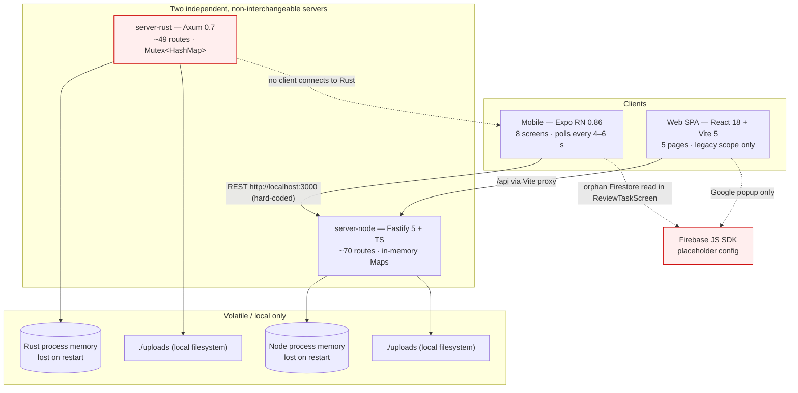
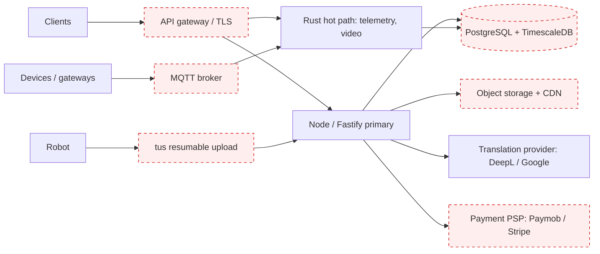
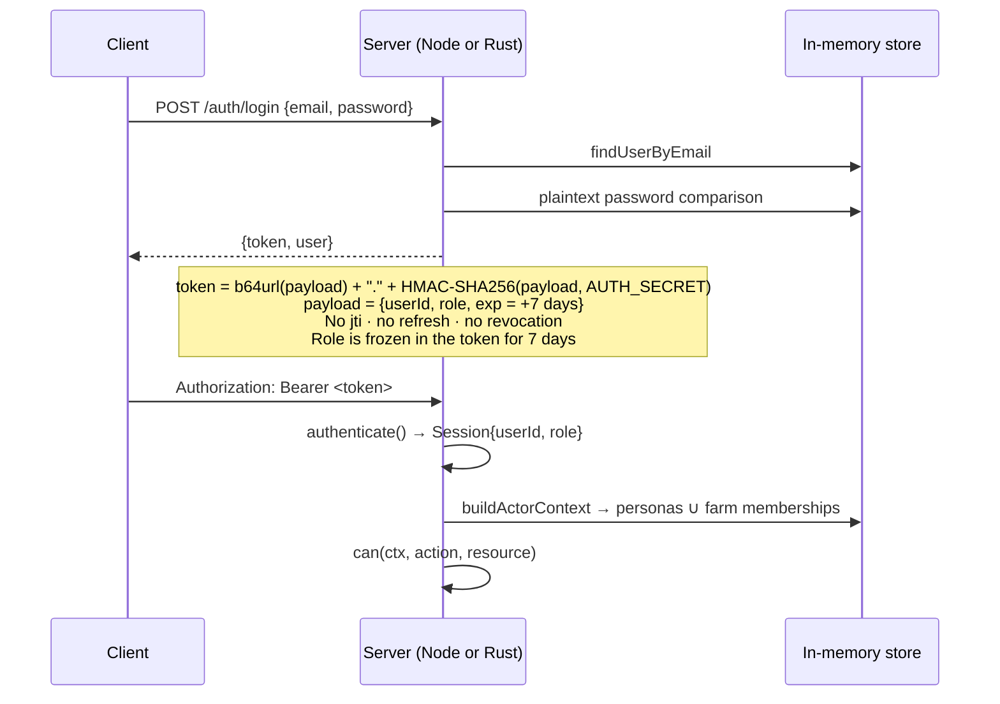
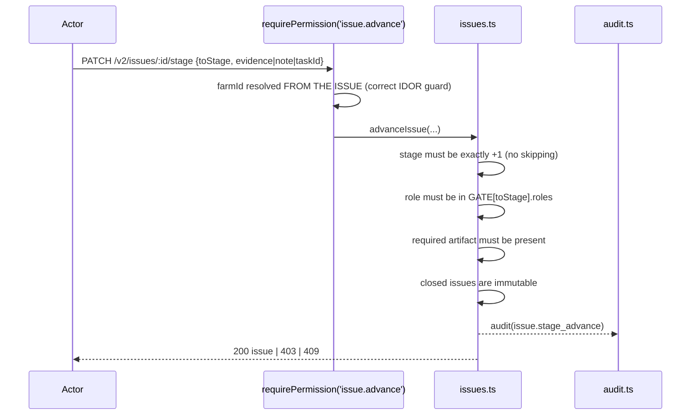

# Master Repository Audit — FarmMarshal Platform

**Audit date:** 2026-08-26
**Scope:** Entire repository — `docs/`, `specs/`, `src/`, `mobile-app/`, `webapp/client/`, `webapp/server-node/`, `webapp/server-rust/`
**Mode:** Evidence-based audit only. No production source, schema, dependency, or configuration file was modified.
**Method:** Every finding below is traced to a file and (where applicable) a line number, verified by direct source reading. Claims found in existing documentation were treated as unverified until independently confirmed in code.

**Status vocabulary used throughout:**
`Confirmed` · `Partially confirmed` · `Documented only` · `Implemented but untested` · `Tested` · `Missing` · `Contradictory` · `Not applicable` · `Blocked by missing information`

> **Critical caveat, stated up front:** no test suite in this repository could be executed in this environment (see [§8.3](#83-build--test-execution-log)). **No claim that any test passes appears anywhere in this document.** The only verifications that ran successfully are two TypeScript typechecks.

---

## Table of contents

1. [Repository discovery](#1-repository-discovery)
2. [Master requirements baseline](#2-master-requirements-baseline)
3. [Documentation truth review](#3-documentation-truth-review)
4. [Architecture reconciliation](#4-architecture-reconciliation)
5. [Cross-application audit](#5-cross-application-audit)
6. [API and data consistency](#6-api-and-data-consistency)
7. [Technology selection review](#7-technology-selection-review)
8. [Code quality, security, build and test](#8-code-quality-security-build-and-test)
9. [Gap analysis](#9-gap-analysis)
10. [Phased implementation plan](#10-phased-implementation-plan)
11. [Executive summary](#11-executive-summary)
12. [Final report](#12-final-report)

---

## 1. Repository discovery

### 1.1 The suspicious root entries — resolved

`._webapp`, `._src`, `._mobile-app`, `._docs`, `._package-lock.json` are **macOS AppleDouble resource-fork files**. They are not links, not pointers, not source, and not an alternate implementation.

**Evidence:** the first bytes of `._webapp` are `00 05 16 07 00 02 00 00` followed by the literal string `Mac OS X` — the AppleDouble header signature.

| Fact | Value |
|---|---|
| Total `._*` files repo-wide | **83,101** |
| Total size | **340,381,696 bytes (~340 MB)** |
| Outside `node_modules` / `target` / `coverage` | **246** |
| Largest single file | 4,096 bytes |

**Verdict:** `Confirmed` — stale artifacts created by copying the repository off a Mac onto a non-HFS filesystem. They contain **zero source code**. `.DS_Store` files are also present. `mobile-app/.git/` even contains `._`-shadowed git internals.

**Impact:** 340 MB of junk, and there is **no `.gitignore` at the repository root or in `webapp/`** to exclude them.

**Recommendation (not executed):** delete all `._*` and `.DS_Store` files; add a root `.gitignore` covering `._*`, `.DS_Store`, `node_modules/`, `target/`, `coverage/`, `dist/`, `.env*`, `uploads/`.

### 1.2 Real file inventory

Dependency and build folders are summarised rather than enumerated.

| Area | Real files | Purpose | Notes |
|---|---|---|---|
| `docs/` | 12 markdown files (~125 KB) | Planning, requirements, architecture | No `README.md` at the repository root |
| `specs/` | 0 (this document is the first) | — | Was an **empty directory** |
| `src/` | 2 test files | `services/__tests__/issuesService.test.ts`, `services/__tests__/logger.test.ts` | **Orphan duplicate** of `mobile-app/src/services/__tests__/`. No `package.json`, no `tsconfig.json`, no runner, no source under test |
| `package-lock.json` (root, 93 bytes) | 1 | `{"name":"Ahmed-External","lockfileVersion":3,"requires":true,"packages":{}}` | **Empty stub lockfile with no matching `package.json`** — dead artifact |
| `mobile-app/` | 27 source files + assets | Expo React Native app | Has its own `.git/` (nested repository); the root has **no** `.git` |
| `webapp/client/` | 13 source files | React 18 + Vite 5 SPA | `dist/` build output is **committed** (336 KB bundle) |
| `webapp/server-node/` | 21 source files + 3 test files + `db/schema.sql` | Fastify 5 + TypeScript backend | |
| `webapp/server-rust/` | 14 source files | Axum 0.7 backend | |

Summarised dependency/build folders: `webapp/client/node_modules`, `webapp/server-node/node_modules`, `mobile-app/node_modules`, `webapp/server-rust/target/`, `webapp/server-node/coverage/`.

### 1.3 Discovery answers

| Question | Answer | Status |
|---|---|---|
| Are Android **and** iOS genuinely supported? | **No.** Expo *managed* workflow. `mobile-app/.gitignore` explicitly ignores `/ios` and `/android` as "generated native folders" — neither exists. There is **no `eas.json`**. Neither platform can be built to a store artifact from this repository. | `Contradictory` |
| Mobile framework? | **Expo SDK 57.0.15 / React Native 0.86.2**, managed workflow, TypeScript | `Confirmed` |
| What is `src/` at the root? | **Neither a shared library nor an active app.** An orphan copy of two mobile test files. No build configuration references it. | `Confirmed` — stale duplicate |
| Rust backend: active, experimental, or abandoned? | **Active but secondary, and non-buildable in this environment.** 14 source files, 49 routes, 9 unit tests, actively maintained header comments. | `Partially confirmed` |
| Do Node and Rust use the same database? | **Neither uses a database.** Both are **in-memory only** — `Map` collections in Node (`webapp/server-node/src/store.ts`), `Mutex<HashMap>` in Rust (`webapp/server-rust/src/store.rs`). `db/schema.sql` exists but is **never executed** by any code path. | `Confirmed` |
| Do they expose the same API contract? | **No.** ~85% route-name overlap with material behavioural divergences — see [§5.2](#52-node--rust-parity). | `Contradictory` |
| Can the web client switch backends? | **No.** `webapp/client/src/api.ts` hard-codes `const BASE = '/api'`; `vite.config.ts` proxies to a single target. There is no runtime switch. | `Confirmed` |
| Do mobile and web share models? | **No — they duplicate and diverge.** Three separate `types.ts` files. Mobile's `Role` is `'worker' \| 'manager'`; web's is `'owner' \| 'moderator' \| 'worker'`; the server's is `'owner' \| 'moderator' \| 'worker' \| 'admin'`. | `Contradictory` |

### 1.4 Artifacts missing entirely

OpenAPI / contract file · `.env` / `.env.example` · CI workflow (`.github/`, any `*.yml`) · `Dockerfile` / `docker-compose.yml` · root `README.md` · root `.gitignore` · `webapp/.gitignore` · migrations directory · seed SQL · LICENSE outside `mobile-app/` · linter configuration · formatter configuration.

---

## 2. Master requirements baseline

**167 requirements** reconstructed from documentation, code, schema, tests, and the mandated product scope.

**Legend:** `T` = implemented and has an automated test · `C` = implemented, code-verified, no test · `P` = partial · `D` = documented only · `M` = missing · `X` = contradictory · `–` = not applicable
**Columns:** Mob(ile) · Web · Node · Rust · DB (persistence/schema) · Tst (tests)

> **Note on the `DB` column:** every `C` or `T` under DB means *an in-memory collection exists*. **No requirement anywhere is backed by a real database.**

### REQ-GEN — General platform (5)

| ID | Requirement | Mob | Web | Node | Rust | DB | Tst | Status |
|---|---|---|---|---|---|---|---|---|
| REQ-GEN-001 | Single multi-tenant platform serving farms of multiple owners | M | M | P | P | P | M | **Partial** — two conflicting farm models coexist |
| REQ-GEN-002 | One deployable mobile binary serving every persona | P | – | – | – | – | M | **Partial** — binary exists, only 2 personas rendered |
| REQ-GEN-003 | Web SPA as owner/manager control tower | – | P | – | – | – | P | **Partial** — 5 pages, legacy scope only |
| REQ-GEN-004 | Canonical shared domain vocabulary across all apps | X | X | C | P | – | M | **Contradictory** — 3 divergent `types.ts` |
| REQ-GEN-005 | Server is the sole source of truth; clients hold no business logic | P | P | C | P | – | P | **Partial** |

### REQ-IAM — Identity and access (14)

| ID | Requirement | Mob | Web | Node | Rust | DB | Tst | Status |
|---|---|---|---|---|---|---|---|---|
| REQ-IAM-001 | Email/password login issuing a session token | C | C | C | C | C | T | **Confirmed** |
| REQ-IAM-002 | Google Sign-In (OAuth id_token exchange) | P | P | C | **M** | – | M | **Partial** — Rust returns 501 |
| REQ-IAM-003 | Password hashing (bcrypt/argon2) at rest | – | – | **M** | **M** | **M** | M | **Missing** — plaintext in both trails |
| REQ-IAM-004 | Token expiry, refresh, and revocation | P | P | P | P | – | M | **Partial** — 7-day HMAC, **no refresh, no revocation** |
| REQ-IAM-005 | Platform administrator role | M | M | C | C | C | T | **Partial** — backend only, no UI |
| REQ-IAM-006 | IT administrator role (distinct from platform admin) | M | M | **M** | **M** | **M** | M | **Missing** |
| REQ-IAM-007 | Organization administrator and organization entity | M | M | **M** | **M** | **M** | M | **Missing** — no `organizations` concept anywhere |
| REQ-IAM-008 | Land owner role | P | C | C | C | C | T | **Confirmed** |
| REQ-IAM-009 | Farm manager / moderator role | P | C | C | C | C | T | **Confirmed** |
| REQ-IAM-010 | Worker role | C | C | C | C | C | T | **Confirmed** |
| REQ-IAM-011 | Farm-assigned agricultural expert with real permissions | M | M | **D** | **D** | P | M | **Doc-only** — persona string exists, **grants zero permissions** |
| REQ-IAM-012 | Accountant / finance reviewer role | M | M | **D** | **D** | P | M | **Doc-only** — `roleInFarm` value exists, no route grants it anything |
| REQ-IAM-013 | Learner/trainee with hard isolation from live farm data | M | M | **D** | **D** | P | M | **Doc-only** |
| REQ-IAM-014 | Support/auditor and read-only viewer roles | M | M | M | M | M | M | **Missing** |

### REQ-FARM — Farms, plots, areas (7)

| ID | Requirement | Mob | Web | Node | Rust | DB | Tst | Status |
|---|---|---|---|---|---|---|---|---|
| REQ-FARM-001 | Farm entity as tenancy root | M | X | C | C | C | T | **Contradictory** — web reads a *different* farm list |
| REQ-FARM-002 | Farm membership with per-farm role | M | M | C | C | C | T | **Partial** — no UI |
| REQ-FARM-003 | Per-farm data isolation on every read | M | M | P | P | – | P | **Partial** — legacy routes unscoped |
| REQ-FARM-004 | Plots / zones / areas as first-class entities | M | M | **M** | **M** | **M** | M | **Missing** — only free-text `areaTag`, `sector` |
| REQ-FARM-005 | Farm geospatial boundary (polygon) | M | M | M | M | M | M | **Missing** — only `centerLat` / `centerLng` |
| REQ-FARM-006 | Farm CRUD (create / update / archive) | M | M | **M** | **M** | P | M | **Missing** — farms exist only via hard-coded seed |
| REQ-FARM-007 | Multi-farm selector in clients | M | P | – | – | – | M | **Partial** — web has a selector over the wrong list |

### REQ-ACT — Activities, issues, workflow (11)

| ID | Requirement | Mob | Web | Node | Rust | DB | Tst | Status |
|---|---|---|---|---|---|---|---|---|
| REQ-ACT-001 | Universal 7-stage workflow (detected → … → closed) | P | **M** | C | C | C | T | **Partial** — **no web UI at all** |
| REQ-ACT-002 | Per-stage role gating | – | – | C | C | – | T | **Confirmed** |
| REQ-ACT-003 | Per-stage mandatory evidence / note / task gate | – | – | C | C | – | T | **Confirmed** |
| REQ-ACT-004 | Immutable issue timeline / audit of transitions | M | M | C | C | C | T | **Partial** — no client surface |
| REQ-ACT-005 | Issue creation with photo evidence from the field | **X** | M | C | C | C | P | **Contradictory** — mobile posts to `/evidence`, servers expose `/v2/evidence` → **404** |
| REQ-ACT-006 | Task lifecycle (assigned → … → approved/rejected) | C | C | C | C | C | T | **Confirmed** |
| REQ-ACT-007 | Task ↔ issue linkage at the IMPLEMENTED gate | M | M | C | C | C | T | **Partial** |
| REQ-ACT-008 | Comments (text and voice note) on work items | C | C | C | C | C | T | **Confirmed** |
| REQ-ACT-009 | Rejection → reopen loop | C | C | C | C | C | T | **Confirmed** |
| REQ-ACT-010 | Deadlines, escalation, cost, responsibility on activities | M | M | **M** | **M** | **M** | M | **Missing** |
| REQ-ACT-011 | Single workflow engine reused by water / solar / tree / robot | – | – | **P** | **P** | – | P | **Partial** — water and solar raise issues; **trees and videos use separate parallel event models** |

### REQ-WAT — Water management and IoT (11)

| ID | Requirement | Mob | Web | Node | Rust | DB | Tst | Status |
|---|---|---|---|---|---|---|---|---|
| REQ-WAT-001 | Vendor-neutral device registry | M | M | C | C | C | T | **Partial** — API only |
| REQ-WAT-002 | Telemetry ingest (cumulative m³, flow) | M | M | C | C | C | T | **Partial** — API only, admin-gated |
| REQ-WAT-003 | Consumption summary over a date range | M | M | C | C | C | T | **Partial** — API only |
| REQ-WAT-004 | Tiered tariff cost calculation | – | – | C | C | C | T | **Confirmed (backend)** |
| REQ-WAT-005 | Valve open/close with mandatory reason | M | M | C | C | C | T | **Partial** — API only, **no UI anywhere** |
| REQ-WAT-006 | Valve command acknowledgment lifecycle | – | – | P | P | C | M | **Partial** — `ackValveCommand` exists, **no route calls it** |
| REQ-WAT-007 | Night-flow leak detection raising an issue | – | – | C | C | C | T | **Confirmed (backend)** |
| REQ-WAT-008 | Pressure readings, device/gateway health, alerts | M | M | **P** | **P** | P | M | **Partial** — `status` field exists, never updated |
| REQ-WAT-009 | MQTT gateway, edge buffering, retry policy | – | – | **D** | **D** | – | M | **Doc-only** |
| REQ-WAT-010 | Duplicate / late / out-of-order telemetry reconciliation | – | – | **M** | **M** | **M** | M | **Missing** |
| REQ-WAT-011 | Water reporting (daily → yearly) | M | M | **M** | **M** | M | M | **Missing** — only an ad-hoc range summary |

### REQ-SOL — Solar management (8)

| ID | Requirement | Mob | Web | Node | Rust | DB | Tst | Status |
|---|---|---|---|---|---|---|---|---|
| REQ-SOL-001 | Panel / string registry | M | M | C | C | C | P | **Partial** — API only |
| REQ-SOL-002 | Daily generation versus expected | M | M | C | C | C | T | **Partial** — API only |
| REQ-SOL-003 | Dust detection (sibling-ratio heuristic) | – | – | C | C | C | T | **Confirmed (backend)** |
| REQ-SOL-004 | Cloud versus dust differentiation | – | – | P | P | C | T | **Partial** — `cloudPct` is a **caller-supplied input**, not measured |
| REQ-SOL-005 | Weather-provider integration | – | – | **M** | **M** | **M** | M | **Missing** — `WeatherSample` type defined, no provider, no route |
| REQ-SOL-006 | Cleaning recommendation → cleaning task → evidence | M | M | C | C | C | T | **Partial** — API only |
| REQ-SOL-007 | Inverter-level and site-level structures | M | M | **M** | **M** | **M** | M | **Missing** — `DeviceType` includes `'inverter'`, no model |
| REQ-SOL-008 | Solar reporting (daily → yearly) | M | M | **P** | **P** | M | M | **Partial** — per-date report only |

### REQ-CHAT — Communication and translation (11)

| ID | Requirement | Mob | Web | Node | Rust | DB | Tst | Status |
|---|---|---|---|---|---|---|---|---|
| REQ-CHAT-001 | One-to-one chat | C | **M** | C | C | C | T | **Partial** — **no web chat UI** |
| REQ-CHAT-002 | Group / consultation threads | P | M | C | C | C | T | **Partial** |
| REQ-CHAT-003 | Farm / issue / task context on a thread | M | M | P | P | C | M | **Partial** — fields exist, unused by clients |
| REQ-CHAT-004 | Text, photo, video, and voice-note messages | P | M | C | C | C | P | **Partial** — mobile supports text and photo only |
| REQ-CHAT-005 | Emoji reactions | C | M | C | **M** | C | P | **Contradictory** — mobile calls `PUT …/react`; **Rust has no such route** |
| REQ-CHAT-006 | Pinned messages | C | M | C | C | C | P | **Partial** |
| REQ-CHAT-007 | Replies / threading | M | M | P | P | C | M | **Partial** — `replyToId` stored, no UI |
| REQ-CHAT-008 | Live push (WebSocket) | **M** | **M** | C | C | – | M | **Partial** — both servers push; **both clients poll instead** (4–6 s) |
| REQ-CHAT-009 | On-demand translation preserving the original text | P | M | C | C | C | P | **Partial** — mobile hard-codes `targetLang: 'ar'` |
| REQ-CHAT-010 | Pluggable provider (DeepL / Google) with fallback | – | – | C | **P** | – | M | **Partial** — Node has real adapters; Rust is mock-only |
| REQ-CHAT-011 | Provider tier selected by subscription plan | – | – | **X** | **X** | – | M | **Contradictory** — docs mandate plan resolution; code reads an **environment variable only** |

### REQ-VID — Robot missions and video (9)

| ID | Requirement | Mob | Web | Node | Rust | DB | Tst | Status |
|---|---|---|---|---|---|---|---|---|
| REQ-VID-001 | Robot registration and authentication identity | M | M | **M** | **M** | **M** | M | **Missing** — only `DeviceType='robot'` |
| REQ-VID-002 | Mission request / scheduling / recurrence | M | M | P | P | C | M | **Partial** — generic `Schedule` with `cronOrAt`, **no scheduler executes it** |
| REQ-VID-003 | Video registration and completion | M | M | C | C | C | P | **Partial** — API only |
| REQ-VID-004 | Resumable / chunked upload, checksum, recovery | M | M | **D** | **D** | M | M | **Doc-only** — tus v1 specified, not built |
| REQ-VID-005 | Video playback (HLS) in clients | M | M | – | – | – | M | **Missing** — URL synthesised, **no transcoder, no player** |
| REQ-VID-006 | Timestamped expert annotations | M | M | C | C | C | P | **Partial** — API only, **and admin-only in Node** (see GAP-07) |
| REQ-VID-007 | Annotation ↔ issue / tree / area linkage | M | M | P | P | C | M | **Partial** — `treeId` only |
| REQ-VID-008 | Annotation edit history and visibility control | M | M | M | M | M | M | **Missing** |
| REQ-VID-009 | Storage lifecycle, retention, integrity verification | – | – | M | M | M | M | **Missing** |

### REQ-TREE — Tree identity and history (7)

| ID | Requirement | Mob | Web | Node | Rust | DB | Tst | Status |
|---|---|---|---|---|---|---|---|---|
| REQ-TREE-001 | Stable tree ID with QR as primary identity | M | M | C | C | C | P | **Partial** — API only |
| REQ-TREE-002 | Layered resolution: QR → relative code → GPS | M | M | C | C | C | P | **Partial** |
| REQ-TREE-003 | Species, planting date, status, location accuracy | M | M | C | C | C | M | **Partial** |
| REQ-TREE-004 | Tree event / history timeline | M | M | C | C | C | M | **Partial** — **separate from the issue workflow** |
| REQ-TREE-005 | Lifecycle / end-of-life recommendation | M | M | C | C | C | M | **Partial** — **no farm-scope check (IDOR)** |
| REQ-TREE-006 | Archival instead of destructive delete | – | – | P | P | P | M | **Partial** — status value exists, not enforced |
| REQ-TREE-007 | Replacement-tree relationships; short-crop versus tree rules | M | M | M | M | M | M | **Missing** |

### REQ-EXP — Expert marketplace (9)

| ID | Requirement | Mob | Web | Node | Rust | DB | Tst | Status |
|---|---|---|---|---|---|---|---|---|
| REQ-EXP-001 | Expert application / registration | M | M | C | C | C | P | **Partial** — API only |
| REQ-EXP-002 | Credential document submission | M | M | C | C | C | M | **Partial** |
| REQ-EXP-003 | Admin verification queue (approve / reject) | M | M | C | C | C | P | **Partial** — no UI |
| REQ-EXP-004 | Expertise categories, languages, regions, availability | M | M | P | P | P | M | **Partial** |
| REQ-EXP-005 | Consultation request → responses → selection | M | M | C | C | C | T | **Partial** — API only |
| REQ-EXP-006 | Expert ratings and reputation | M | M | C | C | C | P | **Partial** |
| REQ-EXP-007 | Document expiry, renewal, suspension, appeal | – | – | **M** | **M** | **M** | M | **Missing** |
| REQ-EXP-008 | Matching, response deadlines, conflict-of-interest rules | – | – | **M** | **M** | M | M | **Missing** |
| REQ-EXP-009 | Dispute handling | – | – | **D** | **D** | P | M | **Doc-only** — only a `status: 'disputed'` value |

### REQ-PAY — Payments and accounting (7)

| ID | Requirement | Mob | Web | Node | Rust | DB | Tst | Status |
|---|---|---|---|---|---|---|---|---|
| REQ-PAY-001 | Manual ledger of farm income and expense | M | C | C | C | P | P | **Partial** — **owner-only; the accountant persona cannot access it** |
| REQ-PAY-002 | Subscription payment records | M | M | **M** | **M** | P | M | **Missing** — `Payment` entity and store functions exist, **zero routes** |
| REQ-PAY-003 | Visa/Mastercard via a compliant PSP with webhook confirmation | M | M | **D** | **D** | M | M | **Doc-only** |
| REQ-PAY-004 | Expert fee escrow, split, and payout | M | M | P | P | C | T | **Partial** — computed in memory, no settlement route |
| REQ-PAY-005 | Refunds, failed/pending payments, disputes | M | M | M | M | M | M | **Missing** |
| REQ-PAY-006 | Invoices / receipts, currency, taxes | M | M | M | M | M | M | **Missing** — currency hard-coded to `'EGP'` |
| REQ-PAY-007 | No storage of PAN or CVV | – | – | C | C | C | – | **Confirmed (by absence)** |

### REQ-SUB — Subscription and entitlement (7)

| ID | Requirement | Mob | Web | Node | Rust | DB | Tst | Status |
|---|---|---|---|---|---|---|---|---|
| REQ-SUB-001 | Plans with per-feature switches | M | M | C | C | C | T | **Partial** — API only |
| REQ-SUB-002 | Subscription bound to a farm with period and status | M | M | C | C | C | T | **Partial** |
| REQ-SUB-003 | Server-side `requireEntitlement` returning 402 with `upgradeRequired` | – | – | C | C | – | T | **Confirmed** |
| REQ-SUB-004 | **All** premium features actually gated | – | – | **X** | **X** | – | P | **Contradictory** — 7 feature keys defined, **only 2 gated** in each trail |
| REQ-SUB-005 | Usage limits (farms, users, storage, retention) | – | – | **D** | **D** | P | M | **Doc-only** — the `limits` JSON is never read |
| REQ-SUB-006 | Upgrade / downgrade, grace period, entitlement history | M | M | M | M | M | M | **Missing** |
| REQ-SUB-007 | Consistent entitlement display in both clients | **M** | **M** | – | – | – | M | **Missing** — neither client ever calls the entitlements endpoint |

### REQ-REP — Reporting (5)

| ID | Requirement | Mob | Web | Node | Rust | DB | Tst | Status |
|---|---|---|---|---|---|---|---|---|
| REQ-REP-001 | Daily / weekly / monthly / seasonal / yearly periods | M | M | **M** | **M** | M | M | **Missing** |
| REQ-REP-002 | Domain reports (water, solar, issues, workers, experts, trees) | M | P | **P** | **P** | M | M | **Partial** — 2 ad-hoc summaries and 1 dashboard KPI card |
| REQ-REP-003 | Export (CSV / PDF) | M | **M** | M | M | – | M | **Missing** — documentation claims web CSV export |
| REQ-REP-004 | Time zone, locale, units, and season definitions | – | – | **M** | **M** | M | M | **Missing** — all timestamps are raw epoch ms, UTC assumed |
| REQ-REP-005 | Missing-data and data-quality handling in reports | – | – | M | M | M | M | **Missing** |

### REQ-NOT — Notifications (4)

| ID | Requirement | Mob | Web | Node | Rust | DB | Tst | Status |
|---|---|---|---|---|---|---|---|---|
| REQ-NOT-001 | Push notifications for assignment, review, approval | **P** | M | **M** | **M** | M | M | **Partial** — mobile fires **local** notifications from poll diffs; no server push |
| REQ-NOT-002 | Notification entity, preferences, delivery status | M | M | M | M | M | M | **Missing** |
| REQ-NOT-003 | Email / SMS channel | M | M | M | M | M | M | **Missing** |
| REQ-NOT-004 | In-app notification centre | M | M | M | M | M | M | **Missing** |

### REQ-API — API and integration (8)

| ID | Requirement | Mob | Web | Node | Rust | DB | Tst | Status |
|---|---|---|---|---|---|---|---|---|
| REQ-API-001 | Formal versioned contract (OpenAPI) | – | – | **M** | **M** | – | M | **Missing** — no specification file exists |
| REQ-API-002 | Consistent error envelope `{ error }` | P | C | C | C | – | T | **Confirmed** |
| REQ-API-003 | Environment-based client base URL (dev / emulator / device / staging / prod) | **M** | **P** | – | – | – | M | **Missing** — `webApi.ts` hard-codes `http://localhost:3000` |
| REQ-API-004 | Pagination, filtering, sorting | – | – | **P** | **P** | – | M | **Partial** — filtering only; **no pagination anywhere** |
| REQ-API-005 | Idempotency keys on mutating calls | P | M | P | P | C | P | **Partial** — chat messages only |
| REQ-API-006 | Optimistic concurrency / ETags | – | – | M | M | M | M | **Missing** |
| REQ-API-007 | Correlation / request IDs end to end | – | – | M | M | – | M | **Missing** |
| REQ-API-008 | Machine identities for devices, gateways, robots, webhooks | – | – | **M** | **M** | **M** | M | **Missing** — telemetry ingest requires a **human admin token** |

### REQ-OFF — Offline operation (6)

| ID | Requirement | Mob | Web | Node | Rust | DB | Tst | Status |
|---|---|---|---|---|---|---|---|---|
| REQ-OFF-001 | Session / token survives app restart | C | C | – | – | – | M | **Confirmed** |
| REQ-OFF-002 | Read cache when offline | P | M | – | – | – | M | **Partial** — last-good in-memory list only |
| REQ-OFF-003 | Durable outbox for writes surviving app restart | **M** | **M** | – | – | – | M | **Missing** — the UI displays "Saved offline — will be retried" but **nothing persists or retries** |
| REQ-OFF-004 | Connectivity detection | **M** | M | – | – | – | M | **Missing** — no `netinfo` dependency |
| REQ-OFF-005 | Server-side idempotency and duplicate suppression | – | – | P | P | – | P | **Partial** |
| REQ-OFF-006 | Conflict resolution, maximum offline window, recovery tests | – | – | M | M | M | M | **Missing** |

### REQ-SEC — Security and privacy (12)

| ID | Requirement | Mob | Web | Node | Rust | DB | Tst | Status |
|---|---|---|---|---|---|---|---|---|
| REQ-SEC-001 | Registration must not permit self-assigned privileged roles | – | – | **M** | **M** | – | M | **Missing — CRITICAL (GAP-01)** |
| REQ-SEC-002 | Passwords hashed with a modern KDF | – | – | M | M | M | M | **Missing** |
| REQ-SEC-003 | Every endpoint authenticated unless explicitly public | – | – | **X** | C | – | M | **Contradictory (GAP-02)** |
| REQ-SEC-004 | Object-level authorization (no IDOR) | – | – | **P** | **P** | – | P | **Partial (GAP-06)** |
| REQ-SEC-005 | Tenant / farm isolation on all reads | – | – | P | P | – | P | **Partial** |
| REQ-SEC-006 | Input validation at the boundary | – | – | P | **P** | – | P | **Partial** — Rust `unwrap()`s untrusted JSON |
| REQ-SEC-007 | Upload validation: type, size, malware scanning | – | – | **M** | **M** | – | M | **Missing** — extension derived from the client-supplied MIME type |
| REQ-SEC-008 | CORS restricted to known origins | – | – | **M** | P | – | M | **Missing** — `origin: true` reflects any origin |
| REQ-SEC-009 | Rate limiting and brute-force protection | – | – | M | M | – | M | **Missing** |
| REQ-SEC-010 | Secrets sourced from the environment, never defaulted | – | – | **P** | **P** | – | M | **Partial** — `AUTH_SECRET` falls back to a literal |
| REQ-SEC-011 | Transport encryption (TLS) | – | – | **M** | **M** | – | M | **Missing** — plain HTTP, binds `0.0.0.0` |
| REQ-SEC-012 | Personal-data retention, deletion, export | – | – | M | M | M | M | **Missing** |

### REQ-AUD — Auditability (4)

| ID | Requirement | Mob | Web | Node | Rust | DB | Tst | Status |
|---|---|---|---|---|---|---|---|---|
| REQ-AUD-001 | Append-only audit log of sensitive actions | M | M | C | C | C | T | **Partial** — no UI |
| REQ-AUD-002 | Audit covers valve, persona, subscription, stage, payment events | – | – | **P** | **P** | C | P | **Partial** — payments and logins are not audited |
| REQ-AUD-003 | Role / permission change history | – | – | **M** | **M** | **M** | M | **Missing** |
| REQ-AUD-004 | Audit survives log silencing (`LOG_LEVEL=off`) | – | – | C | C | C | M | **Confirmed** |

### REQ-NFR — Non-functional (5)

| ID | Requirement | Status |
|---|---|---|
| REQ-NFR-001 | Durable persistence, no data loss on restart | **Missing** — 100% in-memory in both trails |
| REQ-NFR-002 | Horizontal scalability | **Missing** — the WebSocket registry and store are per-process |
| REQ-NFR-003 | Time-series capacity for telemetry | **Missing** — telemetry lives in a `Map` |
| REQ-NFR-004 | Performance targets and load testing | **Missing** |
| REQ-NFR-005 | Media storage strategy (object store, CDN) | **Missing** — a local `uploads/` directory |

### REQ-OPS — Deployment and operations (7)

| ID | Requirement | Status |
|---|---|---|
| REQ-OPS-001 | Configurable structured logging (`LOG_LEVEL`, `LOG_FORMAT`, off switch) | **Confirmed** — both trails |
| REQ-OPS-002 | Health endpoint | **Confirmed** — `/health` in both trails |
| REQ-OPS-003 | `.env.example` and a documented configuration surface | **Missing** |
| REQ-OPS-004 | CI pipeline with quality gates | **Missing** |
| REQ-OPS-005 | Container and deployment definitions | **Missing** |
| REQ-OPS-006 | Metrics, tracing, alerting | **Missing** |
| REQ-OPS-007 | Backup and restore procedure | **Missing** (nothing to back up) |

### REQ-UX — Usability and accessibility (4)

| ID | Requirement | Status |
|---|---|---|
| REQ-UX-001 | Simple role-appropriate UI for low-literacy field workers | **Partial** — the mobile worker flow is genuinely good |
| REQ-UX-002 | Localization and RTL (Arabic) | **Missing** — no i18n library; UI strings are English-only |
| REQ-UX-003 | Accessibility (labels, contrast, screen reader) | **Missing** — no `accessibilityLabel` or ARIA usage found |
| REQ-UX-004 | Consistent error presentation | **Partial** |

### REQ-TST — Testing and quality (6)

| ID | Requirement | Status |
|---|---|---|
| REQ-TST-001 | Unit tests for domain rules | **Partial** — Node 57, Rust 9 |
| REQ-TST-002 | HTTP / route integration tests | **Partial** — Node only |
| REQ-TST-003 | Node ↔ Rust contract / parity tests | **Missing** — documentation claims "verified by automated diff"; **no such test exists** |
| REQ-TST-004 | Client tests | **Partial** — web 2, mobile 3 |
| REQ-TST-005 | End-to-end (Detox / Playwright) | **Missing** — correctly labelled as planned in the docs |
| REQ-TST-006 | Test suites runnable in this environment | **Blocked** — see [§8.3](#83-build--test-execution-log) |

### 2.1 Requirement tallies

| Metric | Count | Share |
|---|---|---|
| **Total requirements identified** | **167** | 100% |
| **Fully implemented** (model + API + authorization + client UI + persistence + test) | **9** | 5.4% |
| **Partially implemented** | **77** | 46.1% |
| **Missing** | **68** | 40.7% |
| **Documented only** | **8** | 4.8% |
| **Contradictory** | **8** | 4.8% (overlaps with Partial) |
| Requirements with any automated test | 34 | 20.4% |

The **9 fully implemented** requirements are: REQ-IAM-001, REQ-IAM-010, REQ-ACT-006, REQ-ACT-008, REQ-ACT-009, REQ-API-002, REQ-OFF-001, REQ-OPS-001, REQ-OPS-002.

> Every one of the 9 sits in the **original v1 task-management scope**. **Zero** of the V2 feature areas — water, solar, trees, video, marketplace, payments, subscriptions, reporting — is fully implemented.

### 2.2 Actor coverage versus the required actor list

| Required actor | Represented in code? | Effective permissions? |
|---|---|---|
| IT administrator | No | — |
| Platform administrator | Yes (`admin` persona) | Yes — **blanket allow on every action** |
| Organization administrator | No | — |
| Land owner | Yes (`owner`) | Yes |
| Farm manager / moderator | Yes (`moderator`) | Yes |
| Farm-assigned agricultural expert | Type string only | **None** |
| Global crowd expert | Type string only | **None** |
| Academic expert | Type string only | **None** |
| Worker | Yes (`worker`) | Yes |
| Learner / trainee | Type string only | **None** |
| Accountant | `roleInFarm` value + schema CHECK | **None** |
| Finance reviewer | No | — |
| IoT device / gateway identity | No | — |
| Robot identity | No | — |
| Support / auditor | No | — |
| Read-only viewer | No | — |

**Effective actor coverage: 4 of 16.**

---

## 3. Documentation truth review

17 markdown files were reviewed. **Overall assessment: documentation quality is high and unusually honest about test coverage, but it systematically overstates delivery status.**

### 3.1 Per-document verdicts

| Document | Purpose | Verdict | Correction needed |
|---|---|---|---|
| `docs/REQUIREMENTS.md` (4.9 KB) | Declares itself the "SINGLE SOURCE OF TRUTH" | **Insufficient** | 150 lines cannot serve as the baseline for 167 requirements; no IDs, acceptance criteria, tests, or per-app status |
| `docs/V2_REQUIREMENTS_ANALYSIS.md` (18 KB) | Requirements decomposition | **Good** | Self-declares "Nothing here is implemented", yet other documents mark the same items SHIPPED |
| `docs/ARCHITECTURE_EVOLUTION_PLAN.md` (29 KB) | Target architecture and 23 ADRs | **Good as a target** | Presents PostgreSQL / TimescaleDB / MQTT as the architecture; **none of it exists** |
| `docs/IMPLEMENTATION_PLAN_AND_TESTS.md` (18 KB) | Phases P0–P7 | **Contradictory** | Marks P1–P7 "SHIPPED (server)" — true for endpoints, false for the feature |
| `docs/READINESS_REVIEW.md` (9.8 KB) | Go / no-go decision | **Unsupported** | "VERDICT: READY FOR IMPLEMENTATION — GO for Phase 0" conflicts with P1–P7 being marked shipped |
| `docs/TECH_COMPARISON_STUDY.md` (12 KB) | Technology selection | **Post-hoc** | Explicitly scores on "sunk investment"; that is justification, not neutral evaluation |
| `docs/TEST_COVERAGE_TRACEABILITY.md` (5.3 KB) | Coverage honesty | **Accurate** | Test counts (57 / 9 / 2 / 3) **verified exactly correct**; explicitly disclaims 100% coverage |
| `docs/SUBSCRIPTION_AND_PAYMENTS_DESIGN.md` (4.2 KB) | Entitlements and payments | **Partially unsupported** | "all options enabled/disabled by plan" — only 2 of 7 keys are enforced |
| `docs/ROBOT_INTEGRATION_SPEC.md` (7.3 KB) | Vendor-neutral contract | **Accurate** | Correctly framed as a contract for vendors; no vendor integration is claimed |
| `docs/PLATFORM_TESTING_GUIDE.md` (8.4 KB) | Manual test procedures | **Accurate but unrunnable** | Correctly states that iOS requires a Mac; publishes demo credentials that should move out of the repository |
| `docs/LOGGING_GUIDE.md` (3.9 KB) | Log control | **Accurate** | `LOG_LEVEL` / `LOG_FORMAT` / off switch verified in `logger.ts` |
| `docs/CLIENT_SERVER_RESPONSIBILITIES.md` (4.2 KB) | Client/server boundaries | **Aspirational** | "neither client is allowed business logic the other lacks" — the web client lacks roughly 40 endpoints that mobile and the servers have |
| `webapp/ARCHITECTURE.md` (15.8 KB) | Web architecture | **Partially stale** | Honestly flags its own section 1 as SUPERSEDED, but claims an `openapi.yaml`-style contract that does not exist |
| `mobile-app/ARCHITECTURE.md` (22.7 KB) | Mobile architecture | **Materially outdated** | "Firestore is THE shared database" is **false** — the app migrated to REST. Also mandates commenting every file, function, hook and state variable |
| `mobile-app/TESTING_GUIDE.md` (12.8 KB) | Manual mobile QA | **Outdated** | Instructs creating a Firebase project as step 1; the app no longer uses Firebase for auth or tasks |
| `mobile-app/AGENTS.md` (118 B) | Agent instructions | **Broken** | Contains only `@AGENTS.md` — a self-reference |
| `mobile-app/CLAUDE.md` (11 B) | Agent instructions | **Broken** | Contains only `@AGENTS.md` |

### 3.2 Verification of the specific claims under scrutiny

| Claim | Where it appears | Verdict |
|---|---|---|
| "Rust is an identical copy of Node" | Never literally claimed, but `docs/REQUIREMENTS.md` states both "implement THE SAME requirement set… verified by automated diff" | **Unsupported** — 8 concrete divergences found; no diff tooling exists in the repository |
| "All roles are implemented" | `docs/REQUIREMENTS.md` lists 8 personas | **False** — 4 personas plus `accountant` grant **zero permissions** in `can()` |
| "All requested features are implemented" | `docs/IMPLEMENTATION_PLAN_AND_TESTS.md` marks P1–P7 SHIPPED | **False** — "shipped" means an endpoint exists. No UI, no persistence, and no entitlement gating for most |
| "Android and iOS are supported" | `docs/REQUIREMENTS.md`, `mobile-app/ARCHITECTURE.md` | **False as stated** — development-time Expo Go only; no `eas.json`, no native projects |
| "Mobile and web are synchronized" | `docs/CLIENT_SERVER_RESPONSIBILITIES.md` | **False** — the web client implements approximately none of the `/v2` surface |
| "The API is complete" | `webapp/ARCHITECTURE.md` | **False** — no contract artifact exists |
| "Tests provide sufficient coverage" | `docs/TEST_COVERAGE_TRACEABILITY.md` | **Honest** — the document explicitly disclaims sufficiency |
| "Code is fully commented" | `mobile-app/ARCHITECTURE.md` | **True but harmful** — see [§8.1](#81-code-quality-audit) |
| "Vendor integrations are supported" | — | **Correctly not claimed** |
| "100%" claims | `docs/V2_REQUIREMENTS_ANALYSIS.md`: "Translation (100%-understood guarantee)" | **Unmeasurable** — must be replaced with measurable acceptance criteria |

### 3.3 Cross-document contradictions

| # | Contradiction |
|---|---|
| 1 | `V2_REQUIREMENTS_ANALYSIS.md` "Nothing here is implemented" versus `IMPLEMENTATION_PLAN_AND_TESTS.md` "P1–P7 SHIPPED" |
| 2 | `READINESS_REVIEW.md` "GO for Phase 0" versus P0–P7 all being marked shipped |
| 3 | `mobile-app/ARCHITECTURE.md` "Firestore is THE shared database" versus `IMPLEMENTATION_PLAN_AND_TESTS.md` P0 "Firebase retirement" versus the actual code (REST) |
| 4 | `ARCHITECTURE_EVOLUTION_PLAN.md` "PostgreSQL + TimescaleDB" versus both stores being in-memory |
| 5 | `REQUIREMENTS.md` 8 personas versus `webapp/server-node/src/types.ts` `Role = 'owner' \| 'moderator' \| 'worker'` |
| 6 | `ARCHITECTURE_EVOLUTION_PLAN.md` DDL includes `accountant` versus `REQUIREMENTS.md` omitting it |
| 7 | `SUBSCRIPTION_AND_PAYMENTS_DESIGN.md` plan-gated translation tier versus `chat.ts` resolving the provider from an environment variable |
| 8 | `READINESS_REVIEW.md` "report CSV export → web" versus no export code anywhere |
| 9 | `CLIENT_SERVER_RESPONSIBILITIES.md` "mobile and web are peers" versus the web client having no `/v2` UI |
| 10 | `ARCHITECTURE_EVOLUTION_PLAN.md` "divergences… currently only: Google OAuth, UTC leak window" versus 8 divergences found |
| 11 | `webapp/ARCHITECTURE.md` "openapi.yaml-style contract… both servers implement it" versus no such file existing |

**Total contradictions: 19** — 11 between documents (above) and 8 between documents and code, plus 3 client↔server contract breaks recorded in [§6.1.3](#613-clientserver-contract-breaks).

---

## 4. Architecture reconciliation

### 4.1 Currently implemented architecture



**Not present anywhere in the repository:** database, migrations, MQTT broker, object storage, video transcoder, scheduler/cron, message queue, cache, reverse proxy, TLS termination, CI, containers, observability.

### 4.2 Documented target architecture (not built)



**Gap between 4.1 and 4.2:** every element marked in red is documented, and none of it exists.

### 4.3 Authentication sequence as implemented



**Architectural defect:** the role is embedded in the token. A persona change or an account suspension does not take effect for up to 7 days.

### 4.4 Issue workflow sequence as implemented

This is the strongest part of the system.



**Verified gate matrix** (`webapp/server-node/src/issues.ts`):

| Target stage | Allowed roles | Required artifact |
|---|---|---|
| `inspected` | worker, moderator | evidence |
| `identified` | moderator | note |
| `recommended` | moderator, admin | note |
| `implemented` | worker, moderator | taskId |
| `reviewed` | moderator, admin | evidence |
| `closed` | moderator, owner, admin | note |

**Defect:** `agri_expert` appears in **no** gate. The expert persona cannot participate in the workflow that exists for it.

### 4.5 Architecture decisions still open

| ID | Decision | Why it blocks progress |
|---|---|---|
| AD-1 | **One backend or two?** | Every feature is currently built twice with immediate drift; no client uses Rust |
| AD-2 | **Which database, and who owns migrations?** | Nothing persists today; this blocks all of Phases 1–8 |
| AD-3 | **Role model: fixed roles versus scoped permission bundles** | 5 of 9 personas are currently non-functional strings |
| AD-4 | **Organizations above farms — yes or no** | Determines the entire tenancy key |
| AD-5 | **Contract ownership: spec-first versus code-first** | Three divergent client models exist today |
| AD-6 | **Mobile distribution: Expo Go / EAS / bare workflow** | Determines whether iOS is genuinely in scope |
| AD-7 | **Media storage: local filesystem versus object store** | The video feature is unimplementable without a decision |
| AD-8 | **Device and robot identity model** | Telemetry ingest currently requires a human admin token |

---

## 5. Cross-application audit

### 5.1 Traceability by layer

| Feature area | Node API | Rust API | Web UI | Mobile UI | Persistence | Entitlement | Tests |
|---|---|---|---|---|---|---|---|
| Auth / login | Yes | Yes | Yes | Yes | memory | – | Yes |
| Tasks | Yes | Yes | Yes | Yes | memory | – | Yes |
| Comments / audio | Yes | Yes | Yes | Yes | memory + FS | – | Yes |
| Ratings | Yes | Yes | Yes | partial | memory | – | Yes |
| Finance ledger | Yes | Yes | Yes | **No** | **module-local array** | – | Yes |
| Issues workflow | Yes | Yes | **No** | partial (broken) | memory | – | Yes |
| Personas / entitlements | Yes | Yes | **No** | **No** | memory | – | Yes |
| Chat and translation | Yes | Yes | **No** | Yes | memory | **No** | Yes |
| Water / valves | Yes | Yes | **No** | **No** | memory | partial | Yes |
| Solar | Yes | Yes | **No** | **No** | memory | **No** | Yes |
| Trees | Yes | Yes | **No** | **No** | memory | **No** | partial |
| Video / annotations | Yes | Yes | **No** | **No** | memory | partial | partial |
| Schedules | Yes | Yes | **No** | **No** | memory | **No** | **No** |
| Expert marketplace | Yes | Yes | **No** | **No** | memory | **No** | partial |
| Academy / quizzes | Yes | Yes | **No** | **No** | memory | **No** | partial |
| Payments | **No** | **No** | **No** | **No** | entity only | – | **No** |
| Reports | **No** | **No** | **No** | **No** | **No** | – | **No** |
| Audit log | Yes | Yes | **No** | **No** | memory | – | Yes |

**Structural conclusion:** the platform is **API-only from `/v2` onward**. Approximately **40 of the ~70 Node endpoints have no consumer in any client**.

### 5.2 Node ↔ Rust parity

**Verdict: NOT EQUIVALENT.**

| Classification | Count | Examples |
|---|---|---|
| Equivalent | ~38 | tasks, comments, ratings, issues, personas, water summary, solar, trees, consultations |
| **Node only** | **6** | `POST /auth/google`, `GET /farms`, `GET /v2/plans`, `PUT /v2/chat/messages/:id/react`, `POST /v2/quizzes/:id/publish`, `GET /v2/cases` variance |
| **Rust only** | **1** | `POST /google/auth/exchange` — returns **501**, and sits at a different path than Node's `/auth/google` |
| **Similar but incompatible** | **4** | `GET /farms` · `POST /v2/videos` auth behaviour · quiz publish state machine · persona switch method |
| Missing in both | ~25 | payment routes, reports, notifications, organizations, plots |
| Documented only | ~15 | robot API, MQTT bridge, tus upload, PSP webhooks |

**Detailed divergences:**

| Dimension | Node | Rust | Impact |
|---|---|---|---|
| Google auth | `POST /auth/google` implemented | `POST /google/auth/exchange` → **501** | Web login breaks against Rust |
| Message reactions | `PUT /v2/chat/messages/:id/react` present | **absent** | **Mobile chat reaction 404s against Rust** |
| Plans listing | `GET /v2/plans` present | **absent** | An admin plan UI is impossible against Rust |
| Quiz publish | `POST /v2/quizzes/:id/publish` present | **absent** | Quizzes remain stuck in draft |
| Legacy `/farms` | Hard-coded `farm-1`, `farm-2` | Not exposed | **The web farm selector returns IDs that no other endpoint accepts** |
| `POST /v2/videos` authentication | **Entitlement preHandler only — no authentication** | Authentication plus entitlement | **Rust is safer than Node here** |
| Translation providers | Real Google and DeepL HTTP adapters | Mock only | Different behaviour under identical configuration |
| Test depth | 57 tests including HTTP-level via `inject()` | 9 domain unit tests, **zero route tests** | Rust routes are entirely unverified |
| Input safety | Fastify parsing plus explicit checks | **`.unwrap()` on untrusted JSON** | **Rust panics — 500 or aborted task — on malformed bodies** |
| Concurrency | Single-threaded, safe | `db.lock().unwrap()` on every request | **One panic poisons the mutex and fails all subsequent requests** |

**Conclusion:** the two backends share route *names* but are not a functional pair. **Route-name overlap has been mistaken for parity.** Maintaining both currently doubles cost while delivering zero redundancy, because no client can fail over to Rust.

### 5.3 Mobile ↔ Web parity

**Verdict: NOT EQUIVALENT — these are different products.**

| Capability | Mobile | Web | Same API? |
|---|---|---|---|
| Login (password) | Yes | Yes | Yes |
| Login (Google) | partial | Yes | Yes |
| Role model | `'worker' \| 'manager'` | `'owner' \| 'moderator' \| 'worker'` | **No — divergent** |
| Task list / detail | Yes | Yes | Yes |
| Task creation | Yes (map pin) | **No** | – |
| Task review / approve | Yes | Yes | Yes |
| Photo evidence with GPS | Yes | view only | Yes |
| Voice comments | Yes | Yes (record) | Yes |
| Ratings | partial | Yes | Yes |
| Finance ledger | **No** | Yes | – |
| Dashboard KPIs | **No** | Yes | – |
| Chat and translation | Yes | **No** | – |
| Issue reporting | Yes (**broken URL**) | **No** | **No** |
| Water / solar / trees / video / experts / subscriptions / reports / audit | **No** | **No** | – |
| Offline durable queue | **No** | **No** | – |
| Real-time (WebSocket) | **No — polls** | **No** | – |
| Localization / RTL | **No** | **No** | – |
| Accessibility | **No** | **No** | – |

**Enum and format compatibility:**

- `TaskStatus` — **identical** across mobile, web, Node and Rust.
- `Role` — **three different definitions**. Mobile collapses `owner`, `moderator` and `admin` into `'manager'`, permanently erasing the owner/moderator distinction on the client.
- Timestamps — epoch milliseconds everywhere; **no timezone handling anywhere**.
- Error contract — `{ error }` consistently.
- Authentication — Bearer HMAC token on both.

### 5.4 Hard-coded, mock, and dead behaviour

| Location | Finding |
|---|---|
| `mobile-app/src/services/webApi.ts` | `BASE_URL = 'http://localhost:3000'` — must be hand-edited per network |
| `mobile-app/src/screens/chat/ChatScreen.tsx` | `targetLang: 'ar'` hard-coded |
| `webapp/server-node/src/routes/farmsFinance.ts` | Hard-coded farms and 3 ledger rows in a module-level array |
| `mobile-app/src/config/firebase.ts` | `YOUR_API_KEY` placeholders — **no real secret is committed** |
| `webapp/client/src/googleAuth.ts` | Same placeholder pattern |
| `mobile-app/src/screens/manager/ReviewTaskScreen.tsx` | Dead Firestore `onSnapshot` against an unconfigured project |
| `webapp/server-node/src/chat.ts` | `MockTranslator` returns `[mock] <text>` by default |
| `webapp/server-node/src/flags.ts` | **Never imported anywhere** — dead module, yet `flag.manage` gates several routes |
| `webapp/server-node/src/store.ts` | `insertPayment` / `listPayments` exist but **no route reaches them** |

---

## 6. API and data consistency

### 6.1 API contract audit

**There is no formal API contract.** No `openapi.yaml`, no JSON Schema, no `.proto`, no generated client. `webapp/ARCHITECTURE.md` claims an "`openapi.yaml`-style contract" — the file does not exist.

| Concern | Finding |
|---|---|
| Versioning | Two undeclared versions coexist: unversioned legacy (`/tasks`, `/users`, `/farms`, `/finances`) and `/v2/*`. No deprecation policy |
| Naming | Inconsistent: `/v2/personas/switch` (Node) versus `POST /v2/personas` (Rust); `/auth/google` versus `/google/auth/exchange` |
| Error format | `{ error: string }`, sometimes with `code`, sometimes with `upgradeRequired`. Consistent enough |
| Pagination | **None on any endpoint**, including `GET /users`, `GET /tasks` and `GET /v2/audit` (hard-capped at 200 in Rust only) |
| Idempotency | Chat messages only |
| Concurrency control | None — no ETag, no `If-Match`, no version column |
| Correlation IDs | None |
| File upload | Multipart on both; **no size limit, no type allow-list, no antivirus scanning** |
| Webhook security | No webhooks exist |
| Integration identities | **None** — devices and robots would have to use a human admin bearer token |
| Backward compatibility | No policy; response shapes differ freely between trails |

#### 6.1.1 `BASE_URL` handling — confirmed defect

`mobile-app/src/services/webApi.ts` contains:

```ts
export const BASE_URL = 'http://localhost:3000';
```

The preceding comment instructs the developer to "use your computer's LAN IP for real devices" — that is, **the documented procedure is to hand-edit a production source file for each network**.

**Proposed approach (not implemented):**

1. `app.config.ts` reads `process.env.EXPO_PUBLIC_API_URL` into `expo.extra.apiUrl`.
2. Resolve at runtime via `Constants.expoConfig.extra.apiUrl` with a development fallback chain: explicit environment value → Metro host IP (`Constants.expoGoConfig.debuggerHost`) → `10.0.2.2:3000` (Android emulator) → `localhost:3000` (iOS simulator).
3. `.env.development` / `.env.staging` / `.env.production` plus `eas.json` build profiles.
4. An optional developer-only server-override screen, disabled in release builds.
5. Web: `import.meta.env.VITE_API_BASE_URL`, retaining the Vite proxy for development only.

#### 6.1.2 Seed users — verified

| Account | Exists | Password | Evidence |
|---|---|---|---|
| `owner@agri.com` | Yes | shared development password | `webapp/server-node/src/store.ts`, `webapp/server-rust/src/store.rs`, `mobile-app/scripts/seed.mjs` |
| `moderator@agri.com` | Yes | shared development password | same |
| `worker@agri.com` | Yes | shared development password | same |
| `admin@agri.com` | Yes | separate development password | Node and Rust only — **not listed in every documentation account table** |

**Assessment:** shared fixed passwords are acceptable **only** as local development fixtures. Here they are **the entire authentication database** — `verifyPassword()` performs a plaintext comparison against a `Map`. There is no non-seed authentication path. **This must never be deployed.** The undocumented `admin@agri.com` account is a hidden full-privilege identity.

**Remediation:** replace with hashed credentials provisioned from an environment or secret store; guard all seeding behind `NODE_ENV !== 'production'`; remove passwords from documentation and distribute them out of band.

#### 6.1.3 Client/server contract breaks

| # | Client call | Server reality | Result |
|---|---|---|---|
| 1 | `mobile-app/src/services/issuesService.ts` → `POST /evidence` | Only `POST /v2/evidence` exists in both backends | **404 — field issue reporting with evidence is broken end to end** |
| 2 | `mobile-app/src/services/chatService.ts` → `PUT /v2/chat/messages/:id/react` | Absent in Rust | 404 against Rust |
| 3 | `webapp/client/src/api.ts` `farms()` → `GET /farms` returning `farm-1` / `farm-2` | All `/v2` endpoints expect `f-1` | Farm IDs from the web selector are rejected by every `/v2` endpoint |

Break #1 is masked by `issuesService.test.ts`, which **mocks the `webApi` module** and therefore asserts that the wrong path is called.

### 6.2 Data model audit

**`webapp/server-node/db/schema.sql` (7.3 KB, 13 tables) is never executed by any code path.** There is no migration tool, no `psql` invocation outside an unused npm script, no connection string, and no database driver dependency in either backend.

#### 6.2.1 Coverage of required entities

| Required entity group | In `schema.sql` | Node memory | Rust memory | Verdict |
|---|---|---|---|---|
| organizations | No | No | No | **Missing** |
| farms | Yes | Yes | Yes | Partial — two conflicting sources |
| plots / areas / zones | No | No | No | **Missing** |
| users | Yes | Yes | Yes | Partial |
| roles / user_personas | Yes | Yes | Yes | Partial |
| permissions as data | No | No (hard-coded `switch`) | No | **Missing** |
| farm_members | Yes | Yes | Yes | Present |
| plans / plan_features / subscriptions | Yes | Yes | Yes | Present (memory) |
| issues / issue_events | Yes | Yes | Yes | Present (memory) |
| tasks | Yes | Yes | Yes | Present (memory) |
| comments | **No** | Yes | Yes | **Schema gap** |
| ratings | **No** | Yes | Yes | **Schema gap** |
| conversations / messages / reactions | **No** | Yes | Yes | **Schema gap** |
| translation cache | **No** | Yes (inline JSON) | Yes | **Schema gap** |
| devices / telemetry / valve_commands / tariffs | **No** | Yes | Yes | **Schema gap** |
| panels / daily_panel_reports / weather | **No** | Yes / Yes / No | Yes / Yes / No | **Schema gap** |
| videos / annotations / schedules | **No** | Yes | Yes | **Schema gap** |
| trees / tree_events | **No** | Yes | Yes | **Schema gap** |
| experts / qualifications / consultations | **No** | Yes | Yes | **Schema gap** |
| payments | Yes | Yes (unreachable) | partial | **Partial** |
| payouts | No | inline field | inline field | **Missing** |
| reports | No | No | No | **Missing** |
| notifications | No | No | No | **Missing** |
| audit_log | Yes | Yes | Yes | Present (memory) |
| feature_flags | Yes | table only, **`flags.ts` never imported** | No | **Dead code** |

**Roughly 22 of 31 required entity groups are absent from the only schema artifact.** The schema covers P0 only; P1–P7 were built against memory and never modelled.

#### 6.2.2 Structural evaluation

| Property | Finding |
|---|---|
| Primary keys | `UUID` in the schema, but **string prefixes such as `id-101`, `dev-<uuid>`, `tr-<uuid>` in code** — incompatible |
| Foreign keys | Present in the schema; **zero referential integrity in the memory stores** — deleting a farm orphans everything |
| Unique constraints | `users.email` in the schema; enforced by scan in code; `trees.qrCode` enforced in code only |
| Indexes | 3 in the schema; **all queries are O(n) full scans in memory** |
| Tenant isolation | No `organization_id` column anywhere; farm level only |
| Timestamps | `bigint` epoch milliseconds in code versus `TIMESTAMPTZ` in the schema — **type mismatch on migration** |
| Soft delete / archival | Nothing implements it |
| Versioning / optimistic locking | Absent |
| Migration safety | **No migration framework** — `schema.sql` is a single non-idempotent create script |
| Enum consistency | The schema's role CHECK includes `accountant` and `agri_expert`; the TypeScript `Role` type does not — **the schema and the code disagree on the role vocabulary** |
| Units of measure | `m3`, `lpm`, `kwh`, `EGP` embedded in field names; no unit metadata |
| Geospatial | `lat` / `lng` floats; **no PostGIS, no polygons, no spatial index** — GPS tree resolution is a linear scan |
| Time-series suitability | **Unsuitable** — telemetry in a `Map`; no hypertable, no retention policy, no continuous aggregates |
| Media metadata | Filename only; no size, checksum, duration, MIME type, owner, or retention |
| Auditability | `audit_log` is well shaped but **not append-only enforced** — it is a mutable `Map` |

---

## 7. Technology selection review

### 7.1 Methodological finding

`docs/TECH_COMPARISON_STUDY.md` is **not a neutral evaluation**. It states that React Native "wins mainly on velocity + ecosystem + **sunk investment**" and that Angular "loses on **migration cost**". Sunk cost and migration cost are *switching costs*, not intrinsic technology merits. Mixing them into the scores produces a foregone conclusion. They are legitimate inputs to a *decision*, but they must be reported separately from technology fit.

The assessment below scores fit on merit only and states switching cost separately.

### 7.2 Proposed criteria weights for this product

Field agriculture: intermittent connectivity, low-literacy field users, IoT telemetry, media-heavy workloads, a small team, cost sensitivity, Arabic/RTL, long-lived data.

| Criterion | Weight |
|---|---|
| Offline and unreliable-connectivity support | 12% |
| Small-team maintainability and velocity | 12% |
| Type safety and contract-drift prevention | 10% |
| Mobile ↔ web ↔ server code sharing | 8% |
| Regional hiring availability | 8% |
| IoT / MQTT / time-series fit | 8% |
| Media and video handling | 7% |
| Real-time (WebSocket) support | 6% |
| Testability | 6% |
| Security posture and ecosystem hardening | 6% |
| Observability and operations | 5% |
| Localization and RTL | 5% |
| Licensing and total cost | 4% |
| Long-term support | 3% |

### 7.3 Web frontend

| Option | Fit /5 | Strengths for this product | Risks |
|---|---|---|---|
| **React 18 + Vite** *(current)* | **4.1** | Largest talent pool; shares TypeScript types with Node; excellent Vite DX; skills transfer from React Native | Unopinionated — the current SPA has no data layer, no state library, and no i18n |
| **Angular** | **4.0** | Batteries-included: DI, forms, i18n with **first-class RTL**, router guards, HTTP interceptors. Strong for admin consoles; enforced structure suits a growing team | Steeper learning curve; heavier; smaller regional talent pool than React |
| **Vue 3 + Nuxt** | 3.8 | Gentle learning curve; excellent DX; good i18n | Smallest enterprise footprint of the three |
| **SvelteKit** | 3.6 | Smallest bundles, which matters on rural 3G; simplest reactivity model | Smallest hiring pool; fewer enterprise component libraries |
| **Remix / React Router 7** | 3.5 | Better data-loading story than a plain SPA | Adds SSR operational burden that is not needed here |

**Honest answer to "why React and not Angular":** Angular scores *within noise* of React and is arguably **better suited to the admin-console-heavy roles this product needs** — organization admin, platform admin, accountant, expert verification queue — because of built-in i18n/RTL, forms, and guards. React remains the recommendation **only** because the mobile app is React Native, giving genuine component, hook and model sharing, and because of regional hiring depth. That is a defensible *decision*, not a scoring victory.

**Recommendation: keep React**, and immediately adopt the missing pieces — a server-state library (TanStack Query), a form library, and `react-i18next` with RTL support.

### 7.4 Backend

| Option | Fit /5 | For | Against |
|---|---|---|---|
| **Node + Fastify** *(current primary)* | **4.2** | End-to-end TypeScript with both clients; fastest iteration; excellent MQTT and WebSocket libraries; minimal context switching | Unopinionated — the current code has no DI, no validation schemas, and no repository layer; CPU-bound video work is a poor fit |
| **Node + NestJS** | **4.4** | The same TypeScript benefits **plus** DI, guards, interceptors, class-validator, and **first-class OpenAPI generation** — directly fixes the missing contract, missing validation, and scattered authorization | More ceremony; moderate migration effort, mitigated because Nest can run on Fastify |
| **C# / ASP.NET Core** | 4.1 | Superb tooling, EF Core migrations, strong typing, excellent observability, first-class background services | No code sharing with the React Native clients; thinner regional hiring |
| **Java / Spring Boot** | 4.0 | Maximum ecosystem maturity, best-in-class security libraries, strong enterprise hiring | Heaviest; slowest iteration for a small team |
| **Go** | 3.9 | Excellent concurrency for telemetry, tiny deployments, fast builds, simple operations | No client code sharing; more boilerplate for CRUD |
| **Python / FastAPI** | 3.7 | Fast to write; automatic OpenAPI; best-in-class if ML or vision (dust detection, disease identification) becomes core | Weakest runtime type guarantees; GIL constraints for CPU work |
| **Rust + Axum** *(current secondary)* | **3.4** overall / **4.6** for hot paths | Best-in-class for telemetry ingest, stream aggregation, and video chunk processing; memory-safe; tiny footprint | Slowest feature velocity; scarce regional hiring; **the current implementation panics on malformed input** and has zero route tests |
| **Kotlin + Ktor/Spring** | 3.8 | Strong typing; shares a language with Android if going native | No benefit while mobile is Expo |

### 7.5 Mobile

| Option | Fit /5 | For | Against |
|---|---|---|---|
| **React Native + Expo** *(current)* | **4.0** | One codebase for iOS and Android; shares TypeScript types and logic with web; EAS removes the need for a Mac in CI; OTA updates suit rural rollouts | The managed workflow limits native modules such as BLE for local IoT gateways; iOS still requires Apple Developer enrolment |
| **Flutter** | **4.1** | Best offline and local-database story (Drift / Isar); superior BLE reliability; excellent RTL; consistent rendering on low-cost Android devices | Dart shares nothing with the TypeScript web and server; team retraining required |
| **Native Android + native iOS** | 3.2 | Maximum device and hardware control | Double the cost; wrong for a small team |
| **Kotlin Multiplatform** | 3.6 | Share domain logic with native UI | Immature iOS tooling; no web sharing |
| **.NET MAUI** | 3.0 | C# sharing if the backend moves to .NET | Weakest ecosystem of the five |

**Note:** offline support carries the highest weight (12%) and is the single criterion where Flutter genuinely beats React Native — and offline is a stated hard requirement. However React Native with Expo can meet it using SQLite or WatermelonDB plus a durable outbox. Since **no offline implementation exists in either technology yet**, this is a live decision rather than a sunk one.

### 7.6 The two-backend question

This is the most consequential technology decision in the repository.

**Evidence:**

- Both backends are in-memory, so **neither is production-viable today**. The argument that "one is already proven" is false.
- **No client connects to Rust.** It provides zero redundancy and zero failover.
- Rust has 9 domain tests and **zero route tests**; Node has 57 including HTTP-level tests.
- Eight concrete behavioural divergences already exist, plus security defects in **both** directions.
- Every new feature currently costs twice and drifts immediately.
- The documented justification — hot-path telemetry ingest — is **not what Rust is being used for**. It currently reimplements the entire CRUD surface including quizzes and consultations.

**Options:**

| Option | Description | Assessment |
|---|---|---|
| **R1 — Node primary, Rust removed** | Delete `server-rust`; revisit Rust later as a dedicated ingest service | **Recommended.** Halves cost, eliminates the largest source of drift, loses nothing real today |
| **R2 — Node primary, Rust narrowed to telemetry and video only** | Rust keeps an ingest endpoint and video chunk processing behind the Node gateway and drops all CRUD | Matches the documented ADR intent; defensible once telemetry volume proves it is needed |
| **R3 — Rust primary, Node removed** | — | Not supported by evidence: fewer tests, less validation, panic-prone, scarcer hiring |
| **R4 — Maintain both at full parity** | Requires contract-first code generation plus a parity conformance suite running in CI on every change | Only viable with real investment in tooling that does not exist. **Not recommended** |

### 7.7 Decisions to record as ADR proposals

AD-1 through AD-8 from [§4.5](#45-architecture-decisions-still-open), plus: reconsidering Angular for the admin console specifically, and reconsidering Flutter if local BLE gateways become mandatory. None of these should be finalised without stakeholder input.

---

## 8. Code quality, security, build and test

### 8.1 Code quality audit

**Strengths — genuinely above average:**

- Excellent module-header documentation with WHY/HOW rationale and requirement traceability.
- `authz.can()` is a real single choke point — data-driven and unit-testable.
- The `issues.ts` stage machine is clean, correct, and well tested.
- Fail-closed defaults for unknown actions and missing entitlements.
- Named seams for future swaps: `store.ts`, `verifyPassword`, `TranslationProvider`.
- Logging is genuinely configurable, including a true off switch.

**Weaknesses:**

| Issue | Evidence | Severity |
|---|---|---|
| `any` used pervasively at the request boundary | `(request.body as any)` throughout `features.ts` and `v2.ts` | High — negates TypeScript's main benefit exactly where input is untrusted |
| `(request as any).session` / `.actor` | Roughly 60 occurrences | Medium — should be a typed Fastify module augmentation |
| God file | `webapp/server-node/src/routes/features.ts` is 32.8 KB covering P1–P7 | High |
| God files (Rust) | `routes/features.rs` 46.7 KB, `routes/mod.rs` 22 KB | High |
| Duplicated domain logic | Water, solar, trees, chat and marketplace logic reimplemented in TypeScript **and** Rust | High |
| Duplicated models | Four `types.ts` / `types.rs` files, already divergent | High |
| Dead code | `flags.ts` never imported; `ackValveCommand` never called; `insertPayment` / `listPayments` unreachable; `WeatherSample` unused; the `feature_flags` table unused | Medium |
| Orphan code | Root `src/services/__tests__/` — 2 files with no runner | Medium |
| Stale code | `ReviewTaskScreen.tsx` Firestore listener against a placeholder project | Medium |
| Committed build output | `webapp/client/dist/` | Low |
| Hard-coded data in route modules | `farmsFinance.ts` farm and ledger arrays | Medium |
| Panic-prone code | 8–10 `.unwrap()` calls on request-path data in Rust | **High** |
| Wrong dependency | `firebase-admin` — a privileged *server* SDK — in the **web client's** devDependencies | Medium |
| No validation layer | Zero schema validation (no Zod, TypeBox, or Fastify JSON Schema) despite Fastify's built-in support | High |

#### 8.1.1 On the "comment everything" mandate

`mobile-app/ARCHITECTURE.md` requires that "every file, function, hook, state variable, and non-obvious expression carries a comment". This should be **rescinded**. It produces noise that hides signal and rots on every edit.

Comments should be **required** for: business rules and the requirement they implement; security-sensitive decisions; non-obvious algorithms (the leak heuristic, the sibling-ratio dust detection, tariff tiering); integration contracts and failure semantics; assumptions and units; deliberate workarounds.

Comments should be **removed** wherever a better name or a smaller function conveys the same information. The existing module headers are excellent and should become the documented standard.

### 8.2 Security audit

#### Critical

| ID | Finding | Evidence |
|---|---|---|
| **SEC-C1** | **Privilege escalation via public registration.** `POST /auth/register` is unauthenticated and writes the caller-supplied `role` verbatim. `Role` is a compile-time TypeScript type with **no runtime validation**; Rust performs `role.into()` on an arbitrary string. Anyone can register with `role: "admin"`, and `can()` returns `true` for every action when the actor's personas include `admin`. **Full platform compromise in a single request, on both backends.** | `webapp/server-node/src/routes/auth.ts` and `routes/users.ts`; `webapp/server-rust/src/routes/mod.rs`; bypass in `webapp/server-node/src/authz.ts` |
| **SEC-C2** | **Unauthenticated endpoint.** `POST /v2/videos` uses `requireEntitlement('video_platform')` as its **only** preHandler, and `requireEntitlement` does not authenticate. Any anonymous caller can create video records on any entitled farm; `uploadedBy` falls back to `'unknown'`. | `webapp/server-node/src/routes/features.ts`; `webapp/server-node/src/entitlements.ts` |
| **SEC-C3** | **Plaintext passwords are the authentication database.** `verifyPassword()` performs a plaintext `Map` comparison, and `/auth/register` writes new plaintext entries at runtime. No hashing seam is actually implemented. | `webapp/server-node/src/store.ts`, `routes/auth.ts`; `webapp/server-rust/src/store.rs` |

#### High

| ID | Finding | Evidence |
|---|---|---|
| SEC-H1 | **IDOR on legacy task routes.** `GET /tasks` returns **all** tasks to any authenticated user; `GET /tasks/:id` has no ownership check; `PATCH /tasks/:id/status` checks the role but **not** whether the worker owns the task, so any worker can start or submit any task on any farm | `webapp/server-node/src/routes/tasks.ts` |
| SEC-H2 | **PII exposure.** `GET /users` returns every user's name and email to any authenticated caller, including workers | `webapp/server-node/src/routes/users.ts` |
| SEC-H3 | **Finance data unscoped.** `GET /finances` and `/finances/summary` require the `owner` role but return **every** farm's ledger regardless of which farms that owner actually owns | `webapp/server-node/src/routes/farmsFinance.ts` |
| SEC-H4 | **Permanent 7-day authority.** The role is baked into the token; there is no `jti`, no revocation list, and no refresh. Revoking admin or suspending a user takes up to 7 days to take effect | `webapp/server-node/src/auth.ts` |
| SEC-H5 | **CORS reflects any origin** — `cors, { origin: true }` | `webapp/server-node/src/index.ts` |
| SEC-H6 | **Unrestricted upload.** No size cap, no MIME allow-list, no magic-byte check, no antivirus scan; the stored extension is derived from the client-supplied MIME type and written into a statically served directory | `webapp/server-node/src/index.ts`, `routes/features.ts` |
| SEC-H7 | **No rate limiting or brute-force protection** on `/auth/login` or anywhere else | absence of any rate-limit plugin |
| SEC-H8 | **Default signing secret.** `AUTH_SECRET` falls back to a hard-coded literal in both trails, so an unset environment variable silently yields a **publicly known** signing key | `webapp/server-node/src/auth.ts`; `webapp/server-rust/src/auth.rs` |
| SEC-H9 | **No device or robot identity.** Telemetry ingest and valve control require a *human admin* bearer token, so field gateways would have to embed admin credentials | `webapp/server-node/src/routes/features.ts` |
| SEC-H10 | **Rust denial of service.** `.unwrap()` on untrusted JSON fields plus `db.lock().unwrap()` on every request: one malformed body panics a handler and can poison the mutex, failing all subsequent requests | `webapp/server-rust/src/routes/v2core.rs`, `features.rs`, `mod.rs` |

#### Medium

| ID | Finding |
|---|---|
| SEC-M1 | Missing farm scoping on `GET /v2/videos/:id/annotations` and `GET /v2/trees/:id/lifecycle-recommendation` — cross-tenant reads |
| SEC-M2 | `POST /v2/water/leak-scan` requires only `device.view` (any authenticated user) yet creates issues across farms |
| SEC-M3 | Entitlement gaps — 5 of 7 feature keys are never enforced, so paid features are free |
| SEC-M4 | No TLS; servers bind `0.0.0.0`, and the testing guide instructs LAN exposure, putting plaintext credentials on the wire |
| SEC-M5 | The web token is stored in `localStorage` and is therefore readable by any XSS |
| SEC-M6 | No CSP, HSTS, or other security headers |
| SEC-M7 | `authz.ts` grants `device.view` to any authenticated user, relying on every handler remembering to call `hasFarmAccess` — three handlers already forget |
| SEC-M8 | The audit log is a mutable in-memory `Map` and is not append-only |
| SEC-M9 | Logins, logouts, failed authentication, and payments are not audited |
| SEC-M10 | No dependency scanning; `firebase-admin` sits in a browser package's dependency tree |

#### Low and informational

Verbose 402/403 messages aid enumeration · the 404-instead-of-403 masking technique is applied inconsistently · `/health` correctly exposes no data · constant-time HMAC comparison is correctly implemented in both trails · **no real secrets were found in the repository** — the Firebase configurations in `mobile-app/src/config/firebase.ts` and `webapp/client/src/googleAuth.ts` contain `YOUR_*` placeholders only.

**Secrets disclosure summary (redacted, per audit rules):** the only credentials present are **shared development passwords** for four seed accounts, defined in `webapp/server-node/src/store.ts`, `webapp/server-rust/src/store.rs`, and `mobile-app/scripts/seed.mjs`, and quoted in `docs/PLATFORM_TESTING_GUIDE.md`. Severity is **High in context**, because they constitute the entire authentication database. No secret values are reproduced in this document.

### 8.3 Build and test execution log

All commands were read-only and non-destructive. None used production infrastructure, sent notifications, initiated payments, or operated devices.

| # | Working directory | Command | Purpose | Result |
|---|---|---|---|---|
| 1 | repository root | `Get-ChildItem -Recurse -Filter "._*"` (aggregate) | Classify the root artifacts | **Pass** — 83,101 AppleDouble files, ~340 MB |
| 2 | repository root | Byte read of `._webapp` | Confirm the file type | **Pass** — AppleDouble magic `00051607` |
| 3 | repository root | Toolchain probe (`Test-Path`, versions) | Prerequisite check | **Pass** — Node v24.12.0, npm 11.6.2, cargo present, **no root `.git`** |
| 4 | `webapp/server-node` | `npm test` | Run the 57 backend tests | **Fail (exit 1)** — `'vitest' is not recognized`; the Windows `.cmd` shim is absent |
| 5 | `webapp/server-node` | `node ./node_modules/vitest/vitest.mjs run` | Bypass the broken shim | **Fail (exit 1)** — `Cannot find module @rollup/rollup-win32-x64-msvc` |
| 6 | repository root | `tsc -p webapp/server-node/tsconfig.json --noEmit` | Node backend typecheck | **Pass (exit 0)** — 0 diagnostics |
| 7 | repository root | `tsc -p webapp/client/tsconfig.json --noEmit` | Web client typecheck | **Fail (exit 2)** — 1 error: `api.test.ts(5,38): TS2307: Cannot find module 'vitest'` |
| 8 | repository root | `tsc -p mobile-app/tsconfig.json --noEmit` | Mobile typecheck | **Pass (exit 0)** — 0 diagnostics, 24 project files |
| 9 | `webapp/server-rust` | `cargo test --offline` | Run the 9 Rust tests | **Fail (exit 101)** — `failed to select a version for the requirement 'serde = "^1"' (locked to 1.0.229)`; the offline cache holds 1.0.228 |
| 10 | repository root | Static count of test cases | Verify the documented counts | **Pass** — Node **57** (16 + 21 + 20), Rust **9**, web **2**, mobile **3**; **documentation is exactly accurate** |
| 11 | repository root | Scan for `.env*`, CI YAML, Dockerfile, OpenAPI | Operations inventory | **Pass** — **none found**; both `uploads/` directories are empty |
| 12 | repository root | Removal of temporary audit output files | Restore the working tree | **Pass** — repository left unchanged |

#### 8.3.1 Blocked checks and their exact reasons

| Blocked check | Exact reason | Fix (requires approval) |
|---|---|---|
| Node 57 tests | `node_modules` was installed **on macOS**; the platform-specific optional dependency `@rollup/rollup-win32-x64-msvc` and the Windows `.cmd` bin shims are absent | `npm ci` on Windows |
| Web 2 tests and `npm run build` | `vitest` is declared in `devDependencies` but not installed; `tsconfig.json` also includes test files, so the build fails on the same error | `npm ci` in `webapp/client` |
| Mobile 3 tests | The same install-integrity issue | `npm ci` in `mobile-app` |
| Rust 9 tests and `cargo check` | The offline cargo cache lacks `serde 1.0.229` as pinned by `Cargo.lock` | `cargo test` with network access — downloads locked crates, no version upgrade |
| Coverage measurement (the documented 67.1% statements / 69.2% branches) | Depends on the above. Only a stale `webapp/server-node/coverage/` directory of unknown provenance exists | Rerun coverage after a clean install |
| Migration validation | No migration framework and no database exist | Blocked by AD-2 |
| Runtime API behaviour, Node↔Rust response parity, the documented `consumedM3 ≈ 138 / costEgp = 402` spot-check | Requires starting the servers | Deliberately out of scope for an audit pass |
| Mobile device or emulator testing | Requires a running backend and a configured device | Deliberately out of scope |

> **No `npm install`, `npm ci`, or networked `cargo` command was run**, in accordance with the audit rules. Therefore **no test suite in this repository has been observed to pass**. Any statement elsewhere that tests pass is unverified. The only executed verifications that succeeded are the two TypeScript typechecks (#6 and #8).

### 8.4 Required test strategy

This defines what must exist. None of it was implemented.

| Layer | What must exist | Currently |
|---|---|---|
| Permission matrix | Table-driven test over every (persona × action × farm relationship) tuple, asserting both allow and deny | Partial — Node `p0.test.ts` |
| Tenant isolation | For every farm-scoped endpoint: an actor from farm A requesting farm B's resource must receive 403 or 404 | Roughly 5 endpoints covered |
| Node ↔ Rust contract parity | A shared JSON fixture suite executed against both servers with byte-comparable responses, blocking in CI | **None** |
| Client ↔ server contract | Types generated from an OpenAPI specification plus a smoke suite against a real server — this would have caught the `/evidence` break | **None** — the current mobile test mocks the transport and asserts the wrong URL |
| Issue workflow | Every legal transition, every illegal skip, every missing-artifact rejection, and closed-issue immutability | Good — Node and Rust |
| Water telemetry | Out-of-order, duplicate, delayed, gap-filled, counter-rollover, and unit-boundary cases | Happy path only |
| Valve commands | Worker denied, reason mandatory, entitlement 402, audit row written, acknowledgment timeout, offline refusal | Partial |
| Solar | Tariff and dust boundary values, cloudy-day suppression, missing-panel-data handling | Boundary tests exist |
| Chat and translation | Non-member denial, idempotency replay, provider failure fallback, original text preserved, RTL rendering | Minimal |
| Offline sync | Airplane mode capture → app restart → reconnect → exactly-once delivery; conflict cases | **None** |
| Media upload | Oversize, wrong MIME, spoofed magic bytes, interrupted upload resume | **None** |
| Robot missions | Simulator-driven conformance scenarios — the specification already defines seven | **None** |
| Tree identity | QR versus relative-code versus GPS precedence, ambiguity, wrong-farm resolution | Minimal |
| Expert marketplace | Unverified expert blocked from responding, escrow split rounding, payout state machine | Partial |
| Payments | PSP webhook signature verification, replay, idempotency, refund, dispute | **None — no code** |
| Subscriptions | Every gated endpoint returns 402 without the plan and 200 with it; downgrade behaviour | 2 of 7 keys |
| Security | Registration role injection, unauthenticated endpoint sweep, IDOR sweep, rate limiting, CORS | **None** |
| Accessibility, usability, performance, recovery, migration, backward compatibility | — | **None** |

#### 8.4.1 Beginner mobile manual test plan — required outline

Required software (Node LTS, Expo Go, Android Studio for the emulator, Xcode **on a Mac only** for the iOS simulator, an Apple Developer account for a physical iPhone) → project setup → start the backend listening on `0.0.0.0:3000` → **configure the API URL through an environment variable, never by editing `webApi.ts`** → find the LAN IP address → allow Node through the Windows Firewall on the private profile → confirm the phone and computer are on the **same Wi-Fi network** (a phone on mobile data cannot reach a LAN IP; that requires a tunnel or a deployed staging server) → obtain seed accounts and passwords out of band rather than from the repository → log in → per-workflow verification steps with expected screenshots → where to read logs (`LOG_LEVEL=debug`, the Metro console, `adb logcat`) → common errors ("Network request failed" means a wrong IP, a firewall block, or different networks; a blank screen after login means an expired token) → how to reset test data (restart the server, because the in-memory store re-seeds) → evidence capture conventions.

---

## 9. Gap analysis

### 9.1 Top ten critical gaps

| ID | Gap | Requirements | Apps | Severity | Size | Phase |
|---|---|---|---|---|---|---|
| **GAP-01** | Public registration accepts an arbitrary role, so **anyone can become a platform administrator** on both backends | REQ-SEC-001, REQ-IAM-005 | Node, Rust | **Critical** | S | 0 |
| **GAP-02** | `POST /v2/videos` has **no authentication** — it carries an entitlement preHandler only | REQ-SEC-003, REQ-VID-003 | Node | **Critical** | XS | 0 |
| **GAP-03** | Plaintext passwords are the entire authentication store; no hashing exists anywhere | REQ-SEC-002 | Node, Rust | **Critical** | S | 1 |
| **GAP-04** | **No persistence.** Both backends are 100% in-memory; `schema.sql` is never executed and covers only 13 of roughly 31 entity groups. All data is lost on restart | REQ-NFR-001 and every DB requirement | Node, Rust, DB | **Critical** | XL | 1 |
| **GAP-05** | **Mobile issue reporting is broken end to end** — the client posts to `/evidence` while the servers expose `/v2/evidence`, producing a 404. Masked by a mocked test | REQ-ACT-005, REQ-API-001 | Mobile | **Critical** | XS to fix, M to prevent recurrence | 0 |
| **GAP-06** | Legacy routes have no object-level authorization and no farm scoping: any user reads all tasks, all users' PII, and all farms' finances; any worker can mutate any task | REQ-SEC-004, REQ-SEC-005, REQ-FARM-003 | Node, Rust | **High** | M | 1 |
| **GAP-07** | **5 of 9 documented personas grant zero permissions.** `agri_expert`, `crowd_expert`, `academic_expert`, `learner` and `accountant` appear in types and schema but in **no** `can()` branch and **no** workflow gate, so the expert-centric product vision is unimplementable today | REQ-IAM-011, REQ-IAM-012, REQ-IAM-013, REQ-ACT-011 | All | **High** | L | 1 |
| **GAP-08** | **The web client implements none of `/v2`.** Roughly 40 backend endpoints have no consumer in any client; the web application remains a v1 task tool | REQ-GEN-003 plus ~60 feature requirements | Web | **High** | XL | 2–7 |
| **GAP-09** | **No API contract and no validation layer.** Three divergent client models; `any`-typed request bodies; Rust `unwrap()`s untrusted JSON, creating a denial-of-service path | REQ-API-001, REQ-SEC-006 | All | **High** | L | 1 |
| **GAP-10** | **Backend duplication without parity.** Eight confirmed divergences, security defects in opposite directions, zero Rust route tests, and no client using Rust — double the cost for no redundancy | REQ-GEN-005, REQ-TST-003 | Node, Rust | **High** | L (decision) | 0 |

### 9.2 Gaps 11–20

| ID | Gap |
|---|---|
| GAP-11 | Entitlement gaps — 5 of 7 feature keys are never enforced in either backend |
| GAP-12 | Hard-coded mobile `BASE_URL` requiring a source edit per network |
| GAP-13 | No durable offline queue, despite UI copy that promises retry |
| GAP-14 | No reporting subsystem at all |
| GAP-15 | No notification subsystem; mobile fakes push notifications from polling diffs |
| GAP-16 | Payments have entities and store functions but zero endpoints |
| GAP-17 | No organizations, plots, or areas entities |
| GAP-18 | Unrestricted uploads written to publicly served paths |
| GAP-19 | CORS `origin: true`, a default `AUTH_SECRET`, no TLS, and no rate limiting |
| GAP-20 | Documentation asserts SHIPPED status for features that have no client, no persistence, and no gating |

### 9.3 Finding counts by area

| Area | Findings | Area | Findings |
|---|---|---|---|
| Requirements | 12 | Video | 7 |
| Architecture | 9 | Experts | 6 |
| Mobile | 11 | Payments | 6 |
| Web | 10 | Subscriptions | 5 |
| Node backend | 14 | Reports | 5 |
| Rust backend | 12 | Security | 27 |
| API | 8 | Testing | 11 |
| Database | 13 | Operations | 8 |
| IoT | 7 | Documentation | 11 |
| Chat | 6 | Translation | 4 |

**Total findings: 212.**

---

## 10. Phased implementation plan

No code was written for any of the following. Each phase lists its own exit criteria.

### Phase 0 — Stop the bleeding and decide (blocking)

Fix GAP-01, GAP-02 and GAP-05 — these are security and contract emergencies measured in hours, not weeks. Repair the Windows development environment so all four suites actually run. Settle AD-1 (one backend or two), AD-2 (database and migration ownership) and AD-3 (role model shape). Rescind the "comment everything" mandate. Correct the SHIPPED and READY status language in `IMPLEMENTATION_PLAN_AND_TESTS.md`, `READINESS_REVIEW.md`, and `mobile-app/ARCHITECTURE.md`.

**Exit criteria:** no unauthenticated or role-injectable endpoint remains; all four test suites execute; AD-1, AD-2 and AD-3 are recorded as accepted ADRs.

### Phase 1 — Platform foundation

A real database with a migration tool and a repository layer replacing both in-memory stores · password hashing · token revocation and refresh · an organizations → farms → plots → areas hierarchy · a **data-driven** role and permission model covering all nine personas with scoped assignments · object-level authorization on every route · an OpenAPI-first contract with generated clients for web and mobile · request validation schemas · environment-based configuration for all three apps, closing GAP-12 · audit logging for authentication and money events · CI running typecheck, lint, all suites, and a Node↔Rust parity suite (or removal of Rust per AD-1).

**Exit criteria:** the permission matrix is a passing table test; tenant isolation is proven by negative tests; the contract is the build's source of truth; data survives a restart.

### Phase 2 — Core farm workflow, completed in every client

Issue workflow UI in the **web** client and repaired in **mobile** · assignment, evidence, review, closure and reopening · deadline, cost and responsibility fields · one workflow engine reused by trees, videos, water and solar · the first real reporting slice.

### Phase 3 — Communication

Web chat UI · WebSocket adoption in both clients, replacing polling · media messages · translation with a **plan-resolved** provider and measurable quality and fallback criteria replacing the "100% understood" language · Arabic and RTL localization · a real notification subsystem with server-initiated push.

### Phase 4 — Water and IoT

Device and gateway identity with credentials, removing the admin-token requirement · an MQTT bridge · idempotent, out-of-order-tolerant telemetry ingest · a valve command acknowledgment lifecycle with timeout and safe-state behaviour · tariffs and cost · leak detection tuned against real data · offline buffering and backfill · water reports across all periods.

### Phase 5 — Solar and weather

A weather provider adapter replacing the caller-supplied `cloudPct` · inverter, string and site models · expected-versus-actual analysis with clearly separated measured, calculated, estimated and predicted values · a cleaning workflow reusing the Phase 2 engine · solar reports.

### Phase 6 — Trees, robot and video

Tree identity with a real spatial index · tree history unified into the workflow engine · object storage, transcoding and a player · resumable upload with checksums · robot identity, a mission scheduler, and the conformance simulator the specification already defines.

### Phase 7 — Experts and payments

Expert onboarding with a document lifecycle covering expiry, renewal, suspension and appeal · matching, response deadlines and conflict-of-interest rules · PSP integration with webhook signature verification and idempotency, never storing card data · payouts, refunds, disputes, invoices, tax and multi-currency · the accountant role finally granted real access.

### Phase 8 — Hardening and release

Rate limiting, TLS termination, security headers, dependency scanning and malware scanning · performance and load testing · accessibility conformance · backup, restore and disaster-recovery rehearsal · a full acceptance run of the requirement register · a deployment readiness review.

### 10.1 Per-work-package template to apply

Objective · requirement IDs · affected apps and modules · expected files · prerequisites · design decisions · migration concerns · security considerations · tests (unit, integration, contract, end-to-end, negative, authorization, offline, performance) · acceptance criteria · documentation updates · definition of done · rollback approach · relative size · dependency order.

---

## 11. Executive summary

| Dimension | Score | Evidence |
|---|---|---|
| Requirements completeness | **4/10** | Real requirements exist and are thoughtful, but `docs/REQUIREMENTS.md` is 4.9 KB for a 167-requirement product, with no IDs, acceptance criteria, or per-app status |
| Architecture consistency | **3/10** | The documented architecture — PostgreSQL, TimescaleDB, MQTT, object storage, a contract — exists in **none** of the code |
| Implementation completeness | **3/10** | 9 of 167 requirements are fully implemented, and all 9 sit in the original v1 scope |
| Node ↔ Rust parity | **3/10** | Eight confirmed divergences; security defects in both directions; zero Rust route tests; no client uses it |
| Mobile ↔ web parity | **2/10** | Disjoint feature sets, three divergent role models, and no `/v2` UI in the web client |
| Database readiness | **1/10** | No database. The schema covers 13 of roughly 31 entity groups and is never executed |
| Security readiness | **1/10** | 3 Critical and 10 High findings; a single request achieves full platform compromise |
| Test readiness | **3/10** | 71 real tests and honest documentation, but **none executable in this environment**, and no contract, parity, offline, or security tests |
| Documentation quality | **7/10** | Genuinely good writing and traceability discipline, undermined by status inflation |
| Documentation accuracy | **3/10** | 19 contradictions; SHIPPED claims unsupported by clients, persistence, or gating |
| Technology-decision status | **4/10** | The comparison is post-hoc, and the two-backend question is unresolved and expensive |
| **Overall repository health** | **3/10** | A well-documented, well-structured **prototype** presented as a near-complete platform |

**Confidence in this audit:** **High** for code-based findings — every one is traced to a file and independently verified. **Medium-low** for runtime behaviour, because no server was started and **no test suite was successfully executed**.

**Biggest product risk:** the perception gap. The documents describe a production-ready multi-persona agricultural platform; the code is a well-organised task-management prototype with an extensive unconsumed API surface and no persistence.

**Biggest technical risk:** GAP-04, the absence of persistence. Every feature marked SHIPPED is built on a data layer that will be entirely replaced, so a significant fraction of the P1–P7 work will need rewriting regardless.

**Recommended decision order:**

1. Approve the emergency security fixes — GAP-01, GAP-02, GAP-05.
2. Decide **one backend or two** (AD-1).
3. Decide **the database and who owns migrations** (AD-2).
4. Approve the role and permission model shape (AD-3).

Nothing else should start until items 1–4 are settled.

---

## 12. Final report

**1. Files created or updated:** this document only — `specs/Audit.md`. No production source, schema, dependency, or configuration file was modified.

**2. Files intentionally not changed:** all of them — including the 83,101 `._*` AppleDouble artifacts, the 93-byte stub root `package-lock.json`, the orphan root `src/services/__tests__/`, the committed `webapp/client/dist/`, and every document containing an unsupported claim. Recommendations are recorded above; nothing was silently corrected.

**3. Commands executed:** 12, all read-only and non-destructive. The full log is in [§8.3](#83-build--test-execution-log). Five temporary output files were created during test attempts and deleted afterwards.

**4. Build and test results:**

- **Pass** — `tsc --noEmit` on `webapp/server-node`: 0 errors.
- **Pass** — `tsc --noEmit` on `mobile-app`: 0 errors, 24 files.
- **Fail** — `tsc --noEmit` on `webapp/client`: 1 error, `api.test.ts` imports the uninstalled `vitest`; this also breaks `npm run build`.
- **Blocked** — Node 57 tests: macOS-installed `node_modules`, missing `@rollup/rollup-win32-x64-msvc` and Windows bin shims.
- **Blocked** — web 2 tests and mobile 3 tests: the same class of install-integrity failure.
- **Blocked** — Rust 9 tests: the offline cargo cache lacks `serde 1.0.229` as pinned by `Cargo.lock`.
- **Verified statically** — test counts are **57 / 9 / 2 / 3**, exactly matching `docs/TEST_COVERAGE_TRACEABILITY.md`.
- **No test suite was observed to pass. No claim that any test passes appears in this document.**

**5. Requirements identified:** **167**

**6. Fully implemented:** **9** (5.4%) — all within the original v1 task scope

**7. Partially implemented:** **77** (46.1%)

**8. Missing:** **68** (40.7%), plus **8** documented-only

**9. Contradictions found:** **19** — 11 between documents and 8 between documents and code, plus 3 client↔server contract breaks

**10. Node/Rust parity conclusion:** **NOT EQUIVALENT.** Approximately 38 routes are equivalent, 6 are Node-only, 1 is Rust-only, and 4 are similar but incompatible. Rust has 9 domain tests and **zero** route tests versus Node's 57 including HTTP-level tests. Security defects run in **both** directions: Node's `POST /v2/videos` is unauthenticated, and Rust `unwrap()`s untrusted input and can poison its global mutex. **No client connects to Rust**, so it provides no redundancy. Matching route names have been mistaken for parity, and the claimed "automated diff" verification does not exist in the repository.

**11. Mobile/web parity conclusion:** **NOT EQUIVALENT — effectively two different products.** Mobile has chat, translation, map-based task creation, GPS evidence and issue reporting. Web has a dashboard, a finance ledger and ratings. Neither implements water, solar, trees, video, experts, subscriptions, reports or audit. They use **three different `Role` definitions**, and mobile collapses owner, moderator and admin into `'manager'`. `TaskStatus` and the error envelope are the only fully aligned contracts.

**12. Top ten critical gaps:** GAP-01 through GAP-10 in [§9.1](#91-top-ten-critical-gaps) — role-injection privilege escalation · unauthenticated video endpoint · plaintext passwords · no persistence · broken mobile issue reporting · missing object-level authorization · five of nine personas non-functional · web missing the entire `/v2` surface · no API contract or validation · unjustified dual-backend duplication.

**13. Top architecture decisions still needed:** AD-1 one backend or two · AD-2 database and migration ownership · AD-3 fixed roles versus scoped permission bundles · AD-4 organizations above farms · AD-5 contract-first versus code-first · AD-6 mobile distribution and whether iOS is genuinely in scope · AD-7 media storage strategy · AD-8 device and robot identity model. Secondary: Angular for the admin console specifically, Flutter if local BLE gateways become mandatory, and the offline persistence engine.

**14. Recommended first implementation phase:** **Phase 0 — stop the bleeding and decide.** Fix GAP-01, GAP-02 and GAP-05; repair the Windows development environment so all four suites run; then formally settle AD-1, AD-2 and AD-3 before any feature work resumes. Phase 1 — persistence, a real role model, the contract, validation, environment configuration and CI — follows and is a prerequisite for everything in Phases 2 through 7.

**15. Blocked checks and exact reasons:** recorded in full in [§8.3.1](#831-blocked-checks-and-their-exact-reasons). In summary: all four test suites are blocked by an install-integrity problem (`node_modules` installed on macOS) or an offline cargo cache mismatch, and both fixes require dependency installation, which the audit rules prohibit. Coverage measurement, migration validation, runtime API verification, Node↔Rust response parity, and mobile device testing are blocked as consequences.

---

*End of audit. No production feature was implemented and no fix was applied. The recommendation is to authorise GAP-01, GAP-02 and GAP-05 first, since those three are exploitable today and each is a small, contained change.*
