# AgriTasks — Cybersecurity and Database Remediation Plan

**Plan date:** 2026-08-26
**Editorial review date:** 2026-08-27 — see `specs/AUDIT_DOCUMENT_REVIEW_LOG.md`
**Inputs:** `specs/CYBERSECURITY_AUDIT.md`, `specs/DATABASE_ARCHITECTURE_AUDIT.md`,
`specs/DATABASE_INTEGRATION_TRACEABILITY.md`

> **Status of this plan (verified 2026-08-27):** **Wave 0 has been largely
> implemented.** Waves 1–4 remain proposed and unstarted.
>
> This line previously read "proposed. **No code in this plan has been
> implemented.**" That was true when written and is now false. Of the twelve Wave 0
> actions, **six are complete and verified by tests, two were deliberately
> superseded by a better approach, and four are outstanding.** The per-action
> status is in §3. **Wave 0's exit criteria are not met** — see §3 for why, and
> §11 for the current overall position.

---

## 1. Principles

1. **Nothing is "fixed" without a passing regression test.** Every Critical and
   High finding gets at least one dedicated test before it may be closed.
2. **Fix both trails or retire one.** Every Critical in this audit that was
   previously fixed in Node and left broken in Rust exists because this rule was
   not followed.
3. **Emergency containment before engineering.** Wave 0 contains actions that
   reduce exposure today, even where the proper fix is weeks away.
4. **No new dependency without a stated justification.** At the plan date the
   dependency posture carried four production-relevant advisories. *(Update
   2026-08-27: `npm audit --omit=dev` in `webapp/server-node` now reports **zero**
   production-dependency vulnerabilities — achieved by **removing**
   `@fastify/static` rather than upgrading it, see E-6. Six advisories remain in
   the dev toolchain and are not production-reachable.)* The principle stands
   regardless of the count.
5. **Do not build for scale that has not been observed.** TimescaleDB, PostGIS,
   Redis, and distributed SQL are all deferred until a measured trigger fires.

---

## 2. Decisions required from stakeholders

These block work and cannot be resolved from the repository.

| # | Decision | Options | Blocks | Recommendation |
|---|---|---|---|---|
| **D-1** | **One backend trail or two?** | (A) Node canonical, retire Rust · (B) keep both behind a shared OpenAPI contract | WP-1.1 and every security work package | **A.** Two hand-written implementations of one API produced four Critical/High divergences across two audits. |
| **D-2** | Is `organizations` the tenancy root, or are farms? | (A) org → farms · (B) farms only | Target schema, RLS design | (A) if multi-farm customers are real; the requirements imply they are |
| **D-3** | Firestore: remove, or keep and govern? | (A) remove from mobile · (B) keep and commit security rules | SEC-M13, mobile refactor | **A.** Two sources of truth for task state with ungoverned rules is a live risk |
| **D-4** | Media storage target | (A) S3-compatible · (B) GCS · (C) stay on local disk | SEC-H03, WP-2.3 | (A) or (B). (C) is not viable — not durable, not shared, not access-controlled |
| **D-5** | Payment provider | — | Payments schema, webhook idempotency | Required before any payment work starts |
| **D-6** | Data retention periods (telemetry, media, audit, personal data) | — | Schema, erasure, backup sizing | Required before go-live in any jurisdiction with erasure rights |
| **D-7** | Demo/seed accounts in non-dev environments | (A) forbid · (B) allow with rotation | SEC-M02 | (A) |

---

## 3. Wave 0 — Emergency containment (immediate)

Goal: reduce live exposure. These are small, surgical, and independently
shippable. **None of them requires D-1.**

| ID | Action | Findings | Effort | Verification | Status (verified 2026-08-27) |
|---|---|---|---|---|---|
| **E-1** | Set `AUTH_SECRET` on every Rust deployment and **rotate the value everywhere**. Treat the committed literal as compromised. | SEC-C01 | XS | `curl` with a token signed by the legacy literal returns 401 | **Outstanding.** This is an operational action in deployment environments. The repository cannot perform or verify it. **This is the single highest-priority remaining item** — E-2 stops the secret being *used*, but does not undo its exposure. |
| **E-2** | Patch `webapp/server-rust/src/auth.rs` to fail closed: error at startup if `AUTH_SECRET` is unset, equals the legacy literal, or is under 32 bytes, in any non-dev environment. Port `resolveAuthSecret()`. | SEC-C01 | S | 4 new Rust unit tests | **Done.** `security.rs` adds `resolve_auth_secret()` with a 9-entry placeholder deny-list; `auth.rs` initialises a `OnceLock` at startup. **6** Rust tests, not 4. Also fixed an unreported defect on the same path: verification now uses `Mac::verify_slice()` (constant-time) instead of a `==` comparison. |
| **E-3** | **Disable `GET /finances`, `GET /finances/summary`, `POST /finances`, `GET /farms`** until E-4 lands. Return 503. | SEC-C04, C05, H01 | XS | Routes return 503; no ledger data is served | **Superseded — deliberately not performed.** This was contingency for a slow fix. E-4 landed in the same wave, so taking the routes offline would have caused an outage with no security benefit. |
| **E-4** | Add tenant scoping to the finance module: derive permitted farms from `buildActorContext()`, intersect, 403 on non-member `farmId`. Re-enable routes. Replace `GET /farms` with `GET /v2/farms`. | SEC-C04, C05, H01 | M | 6 new tests incl. cross-tenant read and write | **Done, with one change of approach.** `financeScope(actor) → {readable, writable}` and `effectiveScope()` implemented; out-of-scope writes return 403. **`GET /farms` was scoped, not replaced** — the web Finance page is a live v1 consumer, so deleting it would have broken a shipped client. Also removed the module's private `farm-1`/`farm-2` array (BL-20), which was a prerequisite nobody had identified: no tenancy check could have worked while the module disagreed with `store.ts` about which farms exist. |
| **E-5** | Call `assertMember(id, session.userId)` in `GET /v2/chat/:id/messages` and in the translate route. | SEC-C02, C03 | S | 4 new tests | **Done, and strengthened beyond the plan.** Rather than adding the call at each route, `listMessages` and `messageInLang` now take the caller id as a **required parameter** and assert membership first. A future route that omits the check will not compile. |
| **E-6** | Upgrade `@fastify/static` to ≥10.1.3 (major bump — re-verify the `/uploads/` route and headers). | DEP-01 | S | `npm audit` shows 0 high in prod deps; static route tests pass | **Superseded — the plugin was removed entirely.** Two reasons: the advisories describe a *guard bypass*, so wrapping the plugin in a `preHandler` would have been unsound; and the upgrade was a two-major bump that D-7 had not approved. `/uploads/:name` is now a first-party handler that proves path containment in code it owns. `npm audit --omit=dev` reports **0** vulnerabilities. |
| **E-7** | Route `/v2/evidence` and `/v2/chat/:id/media` through `validateUpload()`; wrap `toBuffer()` in try/catch → 413; remove the `!` assertions on `conversations.get(id)`. | SEC-H02, H09 | S | 6 new tests | **Mostly done.** A shared `readValidatedUpload()` helper covers both upload paths and replies 413 on the limit. **The `!` assertions on `conversations.get(id)` were NOT removed** and are still present — tracked to WP-2.2. |
| **E-8** | Add `nosniff`, sandbox CSP, and `Content-Disposition` to the Rust `ServeDir`; add a multipart size limit via `DefaultBodyLimit`. | SEC-H03, H05 | S | Rust integration tests | **Outstanding — nothing done.** Re-verified: `.fallback_service(ServeDir::new("uploads"))` is still at `main.rs:87` with no headers and no authentication, and there is **no `DefaultBodyLimit` anywhere** in `webapp/server-rust/src`. |
| **E-9** | Ship a mobile build that **deletes** the `agritasks.apiCreds` key on launch and stops writing it. Interim: re-login prompts rather than silent re-auth. | SEC-H04 | S | Unit test asserts the key is never written and is removed on start | **Outstanding.** `mobile-app/src/services/webApi.ts` still writes the credentials key. |
| **E-10** | Gate the Rust demo seed behind an environment check; remove pre-filled credentials and the password hint from the web login page. | SEC-M02, WEB-02 | XS | Rust test: no seed users in `production` | **Outstanding.** Neither change was made. |
| **E-11** | `git init` at the repository root; commit the current tree; add branch protection on the remote. | DSO-01 | XS | `git log` returns a commit | **Outstanding.** `Test-Path .git` at the root is still false. Consequence: **none of the Wave 0 work above is revertible, attributable, or reviewable.** This is the highest-value remaining engineering item. |
| **E-12** | Extend the CI secret grep to cover `webapp/server-rust/` — it currently would not have caught SEC-C01. | DSO-03 | XS | CI job fails on a seeded test literal | **Outstanding.** The gate at `.github/workflows/ci.yml:145` still excludes `server-rust`. The workflow has still never executed (blocked by E-11). |

**Wave 0 exit criteria (as written):** all six Criticals closed with tests;
`npm audit` reports zero high or critical advisories in production dependencies;
the CI workflow has executed successfully at least once.

> **Exit-criteria assessment (2026-08-27): NOT MET.** Two of three criteria are
> satisfied; one cannot be satisfied and one was mis-specified.
>
> | Criterion | Result |
> |---|---|
> | All six Criticals closed with tests | **Not met — 5 of 6.** SEC-C01, C02, C04, C05 fully; SEC-C03's data-leak path. **DB-SEC-01 is unclosable in Wave 0 by definition** — it requires a database, which is Wave 1. This criterion was mis-specified when written: it set a bar Wave 0's own scope excludes. It should read *"all Criticals in application code closed with tests"*, which **is** met. |
> | `npm audit` zero high/critical in production dependencies | **Met.** `npm audit --omit=dev` in `webapp/server-node` reports 0 vulnerabilities. |
> | CI executed successfully at least once | **Not met.** The workflow has never run, because E-11 (`git init`) is outstanding. |
>
> **Wave 0 must not be declared complete.** The outstanding items are E-1
> (rotation), E-8 (Rust hardening), E-9 (mobile credentials), E-10 (demo seed),
> E-11 (`git init`), and E-12 (CI gate). E-1, E-9, and E-11 are each independently
> sufficient to block a production release.
>
> **Verification evidence for the completed items:** 153 Node tests pass (baseline
> 119); 20 Rust tests pass (baseline 14); `tsc --noEmit` clean in
> `webapp/server-node`, `webapp/client`, and `mobile-app`; client build succeeds;
> coverage 74.34% statements / 72.81% branches.

---

## 4. Wave 1 — Persistence and trail consolidation

**Blocked by D-1 and D-2.**

| ID | Work package | Findings | Effort |
|---|---|---|---|
| **WP-1.1** | Provision managed PostgreSQL (dev, staging, prod). No Timescale, no PostGIS. | DB-SEC-01 | M |
| **WP-1.2** | **Rewrite `schema.sql`** against §8.1 of the database audit: UUIDv7 app-generated keys, `NOT NULL` tenancy keys, explicit referential actions, `NOT NULL` state columns, `version` columns, `deleted_at`, indexes, `NUMERIC(14,2)` + `currency`, no Timescale extension. Do **not** run the existing file. | SCH-01…15 | L |
| **WP-1.3** | Adopt a migration tool owned by the canonical backend; create `db/migrations/`; run migrations in CI and at deploy. | Q8–Q10 | M |
| **WP-1.4** | Formalise `store.ts` into a repository interface with a transaction boundary (`withTransaction`). Implement the PostgreSQL adapter. Keep the in-memory adapter for unit tests. | BL-15 | L |
| **WP-1.5** | Port all **153** Node tests (119 at the plan date) to run against a real database in CI (testcontainers or a CI service container). | Q22, Q23 | M |
| **WP-1.6** | Enable row-level security with per-tenant policies; connect as a non-superuser role. | SCH-03 | M |
| **WP-1.7** | Append-only audit: `REVOKE UPDATE, DELETE`; hash chain; **expand coverage** to login, logout, failed login, registration, task and finance mutations, and uploads. | SEC-M08, SCH-09 | M |
| **WP-1.8** | Token versioning for revocation; `/auth/logout`; invalidate on password change, suspension, and role change. Fix suspension so it removes the primary role, not only the persona. | SEC-M01 | M |
| **WP-1.9** | **Execute D-1.** If (A): delete or archive `webapp/server-rust`, update docs and CI. If (B): author the OpenAPI document and build contract tests for both trails first. | §7 of DB audit | L |
| **WP-1.10** | Membership management API (create, change, revoke farm membership) with audit. | BL-17 | M |
| **WP-1.11** | Backup, PITR, and a **rehearsed** restore, with the rehearsal recorded. | Q25 | M |

---

## 5. Wave 2 — API contract and hardening

| ID | Work package | Findings | Effort |
|---|---|---|---|
| **WP-2.1** | Publish an OpenAPI 3.1 document covering every endpoint. | API-01 | L |
| **WP-2.2** | Runtime schema validation on every route (Fastify JSON schema or zod). Eliminate `request.body as any`. | API-02 | L |
| **WP-2.3** | Move media to object storage (**D-4**); create `media_objects`; authenticated reads via short-lived signed URLs; EXIF/GPS stripping; checksums; retention. | SEC-H03, SEC-L04, BL-13 | L |
| **WP-2.4** | Split `requirePermission()` into `requireAuth()` and `requirePermission(action, …)`; re-audit all 26 action-less routes and add resource checks. | SEC-M06 | M |
| **WP-2.5** | Tenant scoping for comments, ratings, video list, water summary, devices, trees, consultations, cases, quizzes. | BL-12, SEC-M10, SEC-L01 | L |
| **WP-2.6** | Apply `requireEntitlement` to every gated feature route. | SEC-M06b | M |
| **WP-2.7** | General rate limiting and pagination on all list endpoints. | SEC-M09 | M |
| **WP-2.8** | Correlation IDs, idempotency keys table, and outbox. | API-04 | M |
| **WP-2.9** | Password reset, account lockout, and stronger password policy. | SEC-M05 | M |
| **WP-2.10** | Money as integer minor units end to end; validate `type`/`category` allow-lists; finite-amount checks. | SEC-M14, SEC-C05 | M |
| **WP-2.11** | Harden the Google route: required client ID, `randomUUID()` ids, request timeout, rate limit, local JWKS verification. | SEC-M04 | S |
| **WP-2.12** | WebSocket ticket exchange to remove the token from the query string. | SEC-M12 | S |

---

## 6. Wave 3 — Client and mobile

| ID | Work package | Findings | Effort |
|---|---|---|---|
| **WP-3.1** | `eas.json` with dev/staging/prod profiles; origin via `expo-constants`; enforce `https://` in release. | SEC-H06, MOB-01 | M |
| **WP-3.2** | Refresh-token flow; store only the refresh token, in `expo-secure-store`. | SEC-H04 | M |
| **WP-3.3** | Certificate pinning for the production origin. | §9 mobile | M |
| **WP-3.4** | **Execute D-3.** Remove the Firestore channel, or commit and audit its rules. | SEC-M13 | M |
| **WP-3.5** | Web: move the token out of `localStorage`; add client route guards. | WEB-01, WEB-04 | M |
| **WP-3.6** | Edge proxy with TLS, HSTS, and a CSP for HTML responses. | WEB-03, WEB-06, API-05 | M |
| **WP-3.7** | Remove `firebase-admin` from both client `devDependencies`; clear the resulting moderate advisories. | DSO-07 | XS |

---

## 7. Wave 4 — Operations and IoT

| ID | Work package | Findings | Effort |
|---|---|---|---|
| **WP-4.1** | Deployment artefacts: Dockerfile, compose, IaC, environment matrix, `.env.example`. | DSO-04, DSO-05, DSO-11 | L |
| **WP-4.2** | CI security gates: secret scanning, SAST, dependency policy, container scanning, SBOM, artefact signing. | DSO-03, DSO-08 | M |
| **WP-4.3** | Device identity: per-device credentials, mutual TLS, message signing, server-side timestamps, replay/dedupe. Retire admin-token telemetry. | SEC-M03 | L |
| **WP-4.4** | Telemetry ingestion service with monthly partitions and retention. **Reassess Timescale only when measured ingest justifies it.** | §4.2 DB audit | L |
| **WP-4.5** | Valve command acknowledgement, timeout, safe-offline state, manual override. | §3.11 traceability | L |
| **WP-4.6** | Redis for shared rate limiting and the WebSocket registry — **only when a second replica is actually deployed.** | §4.2 DB audit | M |
| **WP-4.7** | AppleDouble cleanup script (reviewed, reversible, executed after WP-E-11 gives git history). | DSO-09 | S |
| **WP-4.8** | Retention and erasure implementation per **D-6**; data export. | SCH-08 | M |
| **WP-4.9** | Incident response plan, key rotation runbook, breach notification path. | §26 security audit | M |

---

## 8. Test strategy

### 8.1 Mandatory regression tests

Reproduced from §25 of the security audit — each Critical and High finding has a
named test that must exist and pass before closure. No finding may be marked
resolved on the basis of a code change alone.

### 8.2 Coverage ratchet

| Wave | Global statements | Global branches | `src/security/**` |
|---|---|---|---|
| At plan date (verified 2026-08-26) | 72.01% | 70.87% | ≥90% / ≥85% |
| **Current (verified 2026-08-27)** | **74.34%** | **72.81%** | ≥90% / ≥85% |
| Wave 0 exit | 75% | 72% | 95% / 90% |
| Wave 1 exit | 85% | 80% | 95% / 95% |
| Wave 2 exit | 90% | 85% | 100% / 100% |
| Wave 3 exit | 95% | 90% | 100% / 100% |

> **Ratchet status (2026-08-27).** The Wave 0 branch target is **met** (72.81% vs
> 72%). The statement target is **narrowly missed** — 74.34% against 75%, a gap of
> 0.66 points. This is recorded rather than rounded away: the gate should not be
> declared green, and the shortfall is small enough to close with tests on any of
> the zero-coverage modules listed in §6 of the traceability document. Functions
> coverage is 70.33%; the ratchet does not currently set a functions threshold,
> which is a gap in the ratchet itself.

The threshold is raised **only after** the corresponding wave's tests are written
and passing. A permanently red gate trains teams to ignore it.

### 8.3 Test categories currently absent

Contract tests (no OpenAPI document exists — this is precisely the gap that let
GAP-05 ship a 404 to production while its unit test passed against a mock),
end-to-end tests, database and migration tests, load tests on upload and telemetry
paths, mobile device tests, DAST, and penetration testing.

---

## 9. Sequencing

```mermaid
gantt
    dateFormat X
    axisFormat %s
    title Remediation sequencing (relative, not calendar)
    section Wave 0 — containment
    E-2 E-4 E-5 E-6 E-7 done         :done, w0a, 0, 2
    E-1 E-8 E-9 E-10 outstanding     :crit, w0b, 1, 3
    E-11 E-12 hygiene outstanding    :crit, w0c, 1, 3
    section Decisions
    D-1 backend trail                :crit, d1, 1, 2
    D-2 tenancy root                 :d2, 1, 2
    section Wave 1 — persistence
    WP-1.9 consolidate trail         :w19, after d1, 2
    WP-1.1..1.4 database             :w1, after d2, 4
    WP-1.5..1.11                     :w1b, after w1, 3
    section Wave 2 — contract
    WP-2.1..2.12                     :w2, after w1b, 4
    section Wave 3 — clients
    WP-3.1..3.7                      :w3, after w2, 3
    section Wave 4 — ops & IoT
    WP-4.1..4.9                      :w4, after w3, 4
```

**Critical path:** D-1 → WP-1.9 → WP-1.1 → WP-1.4 → everything else. Deferring D-1
does not save time; it doubles the cost of every package that follows.

> **Diagram note (2026-08-27).** The `done` marker in the Wave 0 section reflects
> verified state as at that date and was corrected — it previously marked
> `E-1..E-3` complete, but E-1 (secret rotation) is outstanding and E-3 was
> superseded rather than performed. The bars are relative sequencing, not a
> calendar or a schedule commitment.

---

## 10. Release gates

| Gate | Requirement | Status (2026-08-27) |
|---|---|---|
| **Internal testing (synthetic data)** | Wave 0 complete; all Criticals **in application code** closed with tests; CI green | **Not met.** Application-code Criticals are closed (5 of 6; DB-SEC-01 is a Wave 1 item). Wave 0 is **not** complete — E-1, E-8, E-9, E-10, E-11, E-12 outstanding. CI has never run. |
| **Pilot (real users, limited)** | Wave 1 complete; data survives restart; restore rehearsed; audit durable; one backend trail | Not met — Wave 1 not started |
| **Production** | Waves 2 and 3 complete; OpenAPI + contract tests; media access-controlled; TLS/HSTS end to end; secure mobile credential storage; independent penetration test passed | Not met |
| **IoT / valve control in the field** | Wave 4 complete; device identity; command acknowledgement; safe-offline behaviour; **independent safety review** | Not met |

> **Correction (2026-08-27) — gate 1 was unattainable as written.** It required
> "all six Criticals closed with tests", which includes DB-SEC-01. DB-SEC-01
> cannot be closed without a database, which is Wave 1 — so the internal-testing
> gate could never open before the pilot gate's prerequisite was satisfied, which
> inverts the sequence. The requirement is restated as *Criticals in application
> code*, which is what Wave 0's scope can deliver. **No Critical is thereby
> waived**: DB-SEC-01 still blocks the pilot and production gates.

---

## 11. Current status statement

*Rewritten 2026-08-27. The previous text read "**Nothing in this plan has been
implemented.** This document is the output of an audit, not of a remediation
wave." That was accurate at the plan date and is now false.*

**Wave 0 has been partially implemented. Waves 1–4 have not been started.**

### What is verified as done

Six of twelve Wave 0 actions are complete (E-2, E-4, E-5, E-6, E-7 in part, and
the code half of E-1); two were superseded by a better approach (E-3, E-6 as
originally specified). Five of six Critical findings are closed with dedicated
tests. Evidence:

| Check | Result |
|---|---|
| `npx vitest run` (`webapp/server-node`) | **153 passed** (baseline 119) |
| `cargo test` (`webapp/server-rust`) | **20 passed** (baseline 14) |
| `npm run check` (`tsc --noEmit`) | clean, all three TypeScript packages |
| `npx vitest run` + `npm run build` (`webapp/client`) | pass / built |
| `npm audit --omit=dev` (`webapp/server-node`) | **0 vulnerabilities** |
| Coverage | 74.34% statements, 72.81% branches, 70.33% functions |

### What is not done, stated plainly

1. **DB-SEC-01 is open.** There is still no database. Every record is lost on
   restart. This is the entire subject of Wave 1 and it blocks every gate beyond
   internal testing.
2. **The Rust trail is essentially unremediated.** Only SEC-C01 was fixed there.
   E-8 was not started, and SEC-H05, SEC-H07, SEC-H08, and SEC-H10 were
   re-confirmed as present on 2026-08-27. **The Node–Rust divergence that this
   plan's principle 2 exists to prevent is now wider than when the plan was
   written** — which is the strongest available argument for resolving D-1.
3. **The secret has not been rotated (E-1).** SEC-C01 is closed in code and open
   in operations.
4. **There is still no root git repository (E-11).** None of the work above is
   revertible, attributable, or reviewable, and CI cannot run.
5. **Mobile is untouched (E-9).** The plaintext password is still written to
   device storage on every login.

### Prior-wave verification, unchanged

The prior remediation wave (`specs/IMPLEMENTATION_REPORT.md`) remains verified as
real. At the plan date 119 Node tests passed and the controls it claimed —
role-injection prevention, scrypt hashing, task tenancy, upload validation on
`/tasks/:id/photos`, CORS allow-listing, and secret validation in Node — were
present in source. All remain present.

### Repository state and safe continuation point

**The repository is not in a partially migrated or non-buildable state.** All four
test suites are green.

**The safe continuation point is E-11 (`git init`), then E-1 (rotate the
secret).** E-11 is listed first deliberately: until the tree is under version
control, no further change is reversible, and the CI gate that would have caught
SEC-C01 cannot execute.
