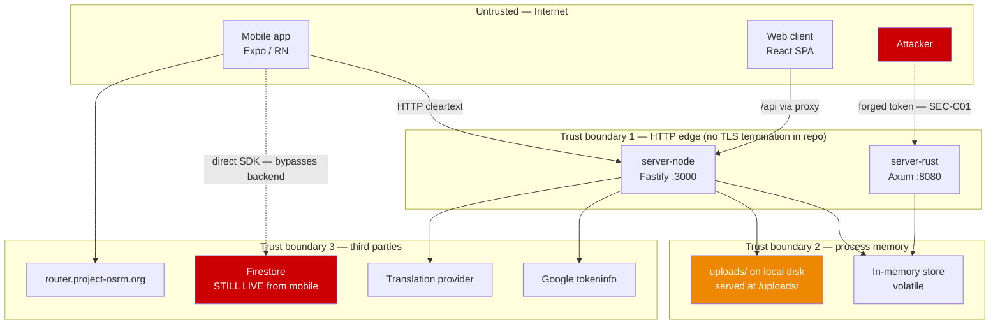
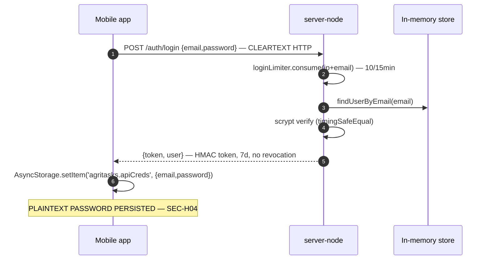
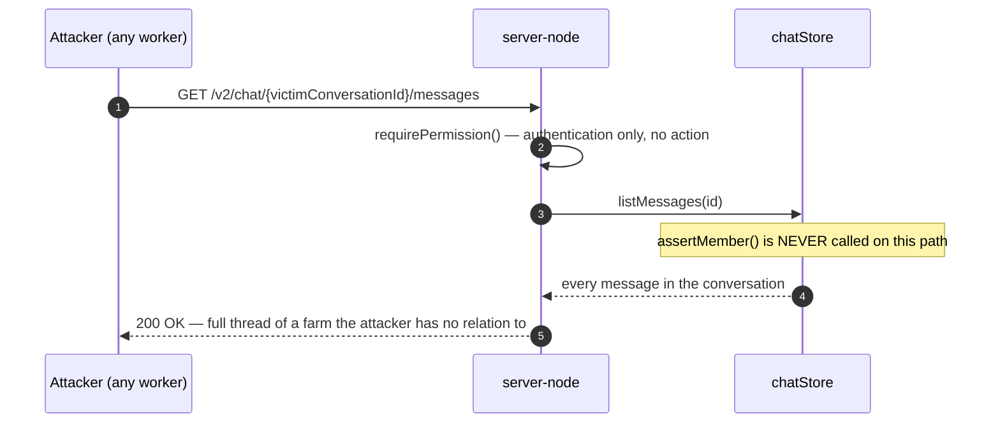
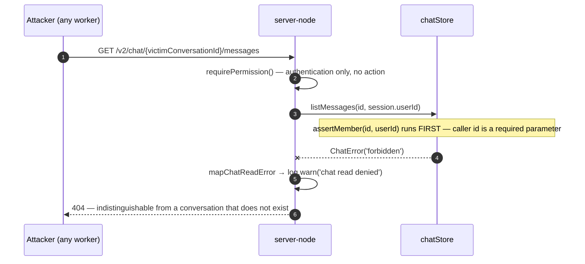
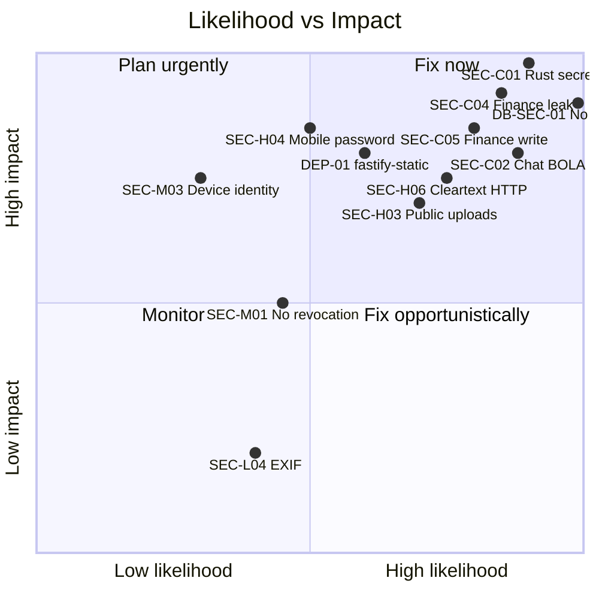
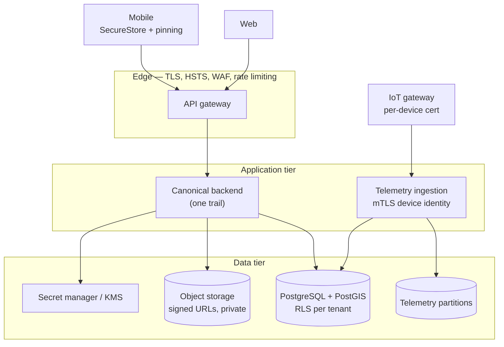

# AgriTasks — Cybersecurity Audit

**Audit date:** 2026-08-26
**Editorial review date:** 2026-08-27 (see `specs/AUDIT_DOCUMENT_REVIEW_LOG.md`)
**Auditor role:** Principal cybersecurity architect / AppSec / cloud security / DevSecOps
**Repository:** `c:\BMW_Work\Workspace\Scripts\WebApp_Demp`
**Commit reference:** none — there is no repository-root git repository (see DSO-01)

> **Reading note — two points in time.** Every finding below records the state of
> the repository **as at the audit date (2026-08-26)**. Where a subsequent
> remediation wave has changed that state, a **Post-audit update** block appears
> inside the finding and the `Status` field carries the current value. The
> original claim is never deleted; it is retained so the finding remains a
> historical record. All post-audit updates were verified against source on
> 2026-08-27.

### Status vocabulary

All four audit documents use exactly these `Status` values.

| Value | Meaning |
|---|---|
| `Confirmed` | Defect demonstrated in current source at the audit date and still present. |
| `Confirmed (historical)` | Demonstrated at the audit date; superseded by a later verified change. Retained for traceability. |
| `Remediated (verified)` | Fixed in source **and** covered by at least one passing automated test that was executed during review. |
| `Remediated (partial)` | The exploitable path is closed; a named residual sub-claim remains open. |
| `Mitigated (operational)` | Code is correct; closure depends on an operational action outside the repository. |
| `Not re-verified` | Asserted by the audit but not re-derived from source during validation. Treat as a lead, not a finding. **No finding currently holds this status** — the four that briefly did (SEC-H05, H07, H08, H10) were re-derived on 2026-08-27 and returned to `Confirmed`. The value is retained for future use. |
| `Withdrawn` | Asserted and then disproved. Retained with the disproof. |
| `Open` | Confirmed and no remediation has landed. |
| `Documented only` | Exists in documentation; no implementation. |
| `Missing` | Neither documented nor implemented. |
| `Blocked by missing information` | Cannot be settled from the repository; needs a stakeholder answer. |

---

## 1. Executive summary

AgriTasks is a farm-management platform with two hand-written backends (Node/Fastify
and Rust/Axum), a React web client, and an Expo/React Native mobile app. A prior
remediation wave (documented in `specs/IMPLEMENTATION_REPORT.md`) closed four
Critical and five High findings **in the Node backend only**.

This audit re-derived every conclusion from current source. It confirms the prior
wave's fixes are real, and it finds **six Critical findings and ten new `SEC-H`
High findings that the prior wave did not address** — most of them because the
prior wave focused on the Node trail and on the `/tasks` surface, leaving the Rust
trail, the chat module, and the finance module untouched.

**The single most important finding at the audit date was SEC-C01:** the Rust
backend still contained the hardcoded token-signing secret that had been removed
from the Node backend. Because both backends issue and accept the *same* token
format, the secret being public in the repository meant any deployment of the Rust
trail without `AUTH_SECRET` set allowed anyone to forge a token for any user,
including `u-admin`.

**Verdict as at the audit date: `CRITICAL – IMMEDIATE ACTION REQUIRED`.**
See §27 for the revised verdict following Wave 0.

### Finding counts

Counts are derived by enumerating the §20 finding register, one row per finding
identifier. Compound register rows (for example `WEB-02/03/06`) are counted as the
number of identifiers they contain, not as one row.

| Severity | Count at audit date | `SEC-*` findings only | Remediated and verified (Wave 0) | Still open |
|---|---|---|---|---|
| Critical | 6 | 5 | 5 | 1 |
| High | 20 | 10 | 3 | 17 |
| Medium | 24 | 15 | 0 | 24 |
| Low | 8 | 4 | 0 | 8 |
| Informational | 4 | 0 | 0 | 4 |
| **Total** | **62** | **34** | **8** | **54** |

> **Correction (2026-08-27).** An earlier revision of this table read
> `Critical 6 / High 11 / Medium 14 / Low 6 / Informational 4` (total 41). Those
> numbers counted only part of the register and did not expand the compound rows.
> The figures above are recomputed directly from §20 and are the authoritative
> totals for all four audit documents. No finding was added or removed by this
> correction; only the arithmetic changed.

### Post-audit status (Wave 0, verified 2026-08-27)

A Wave 0 emergency-containment wave has since landed and is documented in
`specs/WAVE_0_IMPLEMENTATION_REPORT.md`. Five of the six Criticals
(SEC-C01…SEC-C05) and three Highs (SEC-H01, SEC-H02, SEC-H03) are now
`Remediated (verified)`; DEP-01 is closed by dependency removal. **DB-SEC-01
(no durable storage) remains open and is unchanged** — it is the only Critical
still outstanding. Verification evidence: 153 Node tests pass (up from 119),
20 Rust tests pass (up from 14), `npm audit --omit=dev` reports zero
vulnerabilities in `webapp/server-node`.

---

## 2. Scope

In scope and reviewed: root configuration, `docs/`, `specs/`, `mobile-app/`,
`webapp/client/`, `webapp/server-node/`, `webapp/server-rust/`,
`webapp/server-node/db/schema.sql`, `.github/workflows/ci.yml`, all package
manifests and lock files, all route modules, auth/authz modules, upload handling,
chat, entitlements, IoT/telemetry routes, and test configuration.

Summarised rather than file-by-file: `node_modules/`, `target/`, `coverage/`.

Not present in the repository, therefore not auditable: Dockerfiles, Kubernetes or
Terraform manifests, `.env.example`, secret-scanning configuration, SBOM,
database migration tooling, or any deployment descriptor. Their absence is itself
recorded as findings DSO-02 through DSO-05.

## 3. Method

Static review of current source, cross-referenced against OWASP ASVS, OWASP Top 10
(2021), OWASP API Security Top 10 (2023), OWASP MASVS, CWE, and NIST SSDF.
Dependency risk was measured with `npm audit --json` executed read-only in three
packages. Behavioural claims about the Node backend were checked against the 119
tests in `webapp/server-node/test/`, which were executed (exit 0). *(At the
2026-08-27 review the same suite contains 153 tests, also exit 0.)*

No exploitation was performed. No dependency was installed or upgraded. No source
file, schema, or migration was modified. No service was exposed.

## 4. Limitations

1. **No running database exists**, so §12 database controls could not be tested
   against a live instance. They are assessed against the target design instead.
2. **No penetration testing or DAST** was performed; findings are static-analysis
   and code-reading based. Where a finding is reasoned rather than demonstrated,
   its `Confidence` field says so.
3. **The Rust trail has no HTTP-level test suite**, so Rust findings rest entirely
   on source reading (14 unit tests existed at the audit date, all passing; 20 as
   at 2026-08-27, and all 20 are unit tests). SEC-H05, SEC-H07, SEC-H08, and
   SEC-H10 were re-derived from source on 2026-08-27 and are `Confirmed`, but
   confirming the **absence** of a control is not the same as demonstrating
   exploitability. Treat their impact statements as reasoned, not measured.
4. **No git history** exists at the repository root, so accidental historical
   secret commits could not be checked. This also means no finding in this
   document can be pinned to a commit hash.
5. **Mobile builds were not produced**; Android/iOS release readiness is assessed
   from configuration only.
6. **Endpoint counts are derived by pattern match, not by exercising a running
   server.** The verified 2026-08-27 counts are 82 Fastify handler registrations
   (`app.<verb>(` under `webapp/server-node/src`, which includes the two routes
   Wave 0 added) and 63 Axum `.route(` path registrations under
   `webapp/server-rust/src`. A single Axum `.route()` may bind several methods, so
   63 is a count of paths, not of method handlers.

---

## 5. Repository security overview

```
AgriTasks
├── mobile-app/          Expo SDK 57, RN 0.86.2 — REST + a live Firestore channel
├── webapp/client/       React 18.3.1 + Vite 5.4.10 — REST only
├── webapp/server-node/  Fastify 5 — the de-facto canonical backend
├── webapp/server-rust/  Axum 0.7 — a parallel reimplementation of the same API
└── webapp/server-node/db/schema.sql   PostgreSQL DDL that has never been executed
```

Two independent backends implement the same contract. There is no shared
specification, no OpenAPI document, and no contract test. Every security control
must therefore be implemented twice, and this audit confirms that in practice it
is not — the divergence between the two trails is the root cause of SEC-C01.

All application state lives in process memory (`store.ts` / `store.rs`). Nothing
survives a restart.

---

## 6. Threat model

### 6.1 Protected assets

| Asset | Where it lives today | Classification |
|---|---|---|
| Credentials | scrypt hashes in RAM (both trails); **plaintext on mobile devices** | Secret |
| Session tokens | HMAC tokens, 7-day TTL, no revocation | Secret |
| Farm and organisation data | RAM | Confidential |
| Worker personal data | RAM; email redacted on some routes only | Personal |
| Farm financial data | RAM, **globally readable by any `owner`** at the audit date; tenant-scoped in Node since Wave 0, still unscoped in Rust | Confidential |
| Payment records | Schema only — not implemented | Confidential |
| Chat messages | RAM, **readable by any authenticated user** at the audit date; membership-checked in Node since Wave 0 | Confidential |
| Photos / video / voice | `uploads/` on local disk; authorised route in Node since Wave 0, **still statically served in Rust** | Confidential |
| Tree & farm geolocation | RAM | Personal / Confidential |
| Telemetry & valve commands | RAM | Operational-critical |
| Robot missions | Not implemented | Operational-critical |
| Entitlements | RAM | Business-critical |
| Audit records | RAM, mutable array | Integrity-critical |
| Signing secret | Env var (Node); **hardcoded fallback (Rust)** at the audit date — removed in Wave 0, both trails now fail closed | Secret |

### 6.2 Trust boundaries — CURRENT IMPLEMENTATION

**This diagram describes the repository as it exists.** Every node and edge shown
is present in source. The proposed target architecture is §24, which is clearly
labelled as a proposal and shares no elements with this diagram.



**Boundaries that are absent entirely:** backend↔database (no database),
backend↔object storage (local disk instead), IoT gateway↔ingestion (no device
identity), robot↔mission API (not implemented), backend↔payment provider (not
implemented), dev↔staging↔prod (no environment separation artefacts exist).

> **Post-audit update (verified 2026-08-27).** Two edges in this diagram have
> changed and the diagram is **not** redrawn, so read it with these corrections:
> (a) the `ATK -.-> RUST` forged-token edge is closed in code — the Rust trail now
> fails startup on a weak or legacy secret — though secret rotation remains an
> outstanding operational action; (b) the `NODE --> UPLOADS` edge is now an
> authorised route rather than a public static mount, but the **Rust** trail still
> serves `uploads/` publicly, so the boundary remains broken on that trail. All
> other nodes and edges are unchanged.

### 6.3 Threat actors

| Actor | Capability today | Most damaging reachable action |
|---|---|---|
| Anonymous internet user | Reach every endpoint | Forge admin token against Rust trail (SEC-C01) |
| Authenticated worker | Valid token | Read every conversation on the platform (SEC-C02) |
| Malicious farm member | Valid token + farm | Read/write any farm's finances (SEC-C04/C05) |
| Compromised manager | `owner` role | Exfiltrate all tenants' financial data (SEC-C04) |
| Compromised admin | Full | Everything; audit log is mutable RAM |
| External expert | Valid token | Same as any authenticated user — no expert scoping |
| Compromised IoT gateway | Needs admin creds (SEC-M03) | Escalates to full admin because devices share admin creds |
| Supply-chain attacker | npm/crates | 2 critical + 2 high advisories currently open |
| Attacker with a lost phone | Device access | **Plaintext password** from AsyncStorage (SEC-H04) |
| Cross-tenant attacker | Valid token | Chat, finances, farm list all cross-tenant readable |

### 6.4 Abuse cases

`Status today` is the assessment at the audit date. `Status 2026-08-27` records
re-verification after Wave 0.

| # | Abuse case | Status at audit date | Status 2026-08-27 | Finding |
|---|---|---|---|---|
| A1 | Self-register as administrator | **Blocked** (both trails) | Blocked | GAP-01 — fixed, 23 tests |
| A2 | Cross-farm data access | **Possible** | **Blocked in Node; possible in Rust** | SEC-C02, C04, H01 |
| A3 | Modify another worker's task | **Blocked** | Blocked | GAP-03 — fixed |
| A4 | Access another farm's finances | **Possible** | **Blocked in Node; possible in Rust** | SEC-C04 |
| A5 | Unauthorised valve operation | Blocked by matrix | Blocked | — |
| A6 | Telemetry manipulation | **Possible** — no device identity | **Possible** | SEC-M03 |
| A7 | Video upload without authorisation | **Blocked** | Blocked | GAP-02 — fixed |
| A8 | Upload a malicious file | **Possible** via `/v2/evidence` | **Blocked in Node; possible in Rust** | SEC-H02 |
| A9 | Token theft and replay | **Possible** — no revocation, 7-day TTL | **Possible** | SEC-M01 |
| A10 | Brute-force login | Throttled in Node, **not in Rust** | Unchanged | SEC-H07 |
| A11 | Entitlement bypass | Blocked where applied; not applied everywhere | **Possible** | SEC-M06b |
| A12 | Payment webhook replay | N/A — payments not implemented | N/A | — |
| A13 | Forged device identity | **Possible** | **Possible** | SEC-M03 |
| A14 | Audit-log modification | **Possible** — mutable in-memory array | **Possible** | SEC-M08 |
| A15 | Mass assignment | Blocked on register; **open on `/finances`** | **Blocked in Node** | SEC-C05 |
| A16 | API enumeration | **Possible** — no rate limit outside auth | **Possible** | SEC-M09 |
| A17 | Denial of service | **Possible** — unbounded uploads (Rust), panics | **Possible in Rust** | SEC-H05, SEC-H09 |
| A18 | Dependency compromise | **Open** — 2 critical, 2 high | **Closed for production dependencies** (0 in `npm audit --omit=dev`); dev toolchain still open | DSO-06, DEP-01 |
| A19 | Secret leakage | **Confirmed** — Rust signing secret | **Closed in code; rotation outstanding** | SEC-C01 |
| A20 | Offline extraction from lost device | **Confirmed** — plaintext password | **Confirmed — unchanged** | SEC-H04 |

> **Correction (2026-08-27).** Rows A3 and A12 previously cited `SEC-C4` and
> `PAY-01`. Neither identifier exists in the §20 register: `SEC-C4` was a typo for
> the prior wave's `GAP-03` (task ownership), and `PAY-01` was never defined. Both
> are corrected above. A11 cited `SEC-M06`; the entitlement finding is `SEC-M06b`.
> A18 cited only `DSO-06`; `DEP-01` is the concrete finding and is now shown.

---

## 7. Data-flow and trust-boundary diagrams

### 7.1 Login — current implementation



### 7.2 Cross-tenant chat read — vulnerability AS AT THE AUDIT DATE (now remediated)

**This diagram records the defect, not the current code.** It is retained because
SEC-C02 must remain traceable. See the corrected flow immediately below.



### 7.3 Cross-tenant chat read — CURRENT IMPLEMENTATION (verified 2026-08-27)



The 404 is deliberate: a 403 would confirm the conversation exists and turn the
endpoint into an enumeration oracle. Write paths still return 403 so that a
legitimate member receives an actionable error (ADR-SEC-004).

---

## 8. Authentication findings

### SEC-C01 — Hardcoded token-signing secret in the Rust backend

| Field | Value |
|---|---|
| **Status** | `Remediated (verified)` — `Confirmed` at the audit date |
| **Severity** | **Critical** |
| **Confidence** | High |
| **Application** | `webapp/server-rust` |
| **File (at audit date)** | `webapp/server-rust/src/auth.rs`, then-line 20 |
| **File (current)** | [webapp/server-rust/src/auth.rs](webapp/server-rust/src/auth.rs#L19-L50), [webapp/server-rust/src/security.rs](webapp/server-rust/src/security.rs) |
| **Symbol** | `fn secret()` — now `static SECRET: OnceLock<String>`, `init()`, `secret()`, `describe_secret()` |
| **OWASP / CWE** | A02:2021, A07:2021 / CWE-798, CWE-321 |

**Evidence (as at 2026-08-26).** `auth.rs` resolved the signing key with
`std::env::var("AUTH_SECRET")` and an `unwrap_or_else` fallback to a literal
committed in the repository. The literal itself is deliberately not reproduced
here; it is recorded once, as a deny-list entry, in
`webapp/server-rust/src/security.rs` and `webapp/server-node/src/security/config.ts`.
The equivalent Node fallback was removed in the prior wave —
[webapp/server-node/src/auth.ts:32](webapp/server-node/src/auth.ts#L32) calls
`resolveAuthSecret()`, which throws unless a ≥32-character non-default secret is
supplied outside development. The Rust trail received no such change.

Both trails use an identical token format
(`base64url(JSON{userId,role,exp}).base64url(HMAC-SHA256(payload, SECRET))`) and
identical seeded user IDs (`u-admin`, `u-owner`, `u-mod`, `u-worker`,
`webapp/server-rust/src/store.rs`).

**Exploitation scenario.** An attacker who knows the committed literal can mint a
Bearer token asserting any `userId` and `role`, including `admin`, because the
signature is computed from data the attacker fully controls plus a key that is
public. `verify()` accepts it. The attacker is then a platform administrator; in
`can()` ([src/authz.rs](webapp/server-rust/src/authz.rs#L86-L112)) the `admin`
persona satisfies every action.

**Business impact.** Total compromise of any environment running the Rust trail
without `AUTH_SECRET` explicitly set: all farms, all finances, all personal data,
all valve control.

**Remediation.** Port `resolveAuthSecret()` to Rust: fail fast at startup when
`AUTH_SECRET` is missing, equal to the legacy literal, or shorter than 32 bytes,
in any environment other than `development`/`test`. Rotate the secret in every
environment where the literal may ever have been used.

**Required tests.** Rust unit test asserting startup fails for each of: unset,
legacy literal, <32 chars, low-entropy, when `APP_ENV=production`. Plus a test
asserting a token signed with the legacy literal is rejected.

**Post-audit update (verified 2026-08-27).** Closed in code. `webapp/server-rust/src/security.rs`
now defines `resolve_auth_secret(env, raw)` with a `SecretError` enum
(`Missing` / `Placeholder` / `TooShort` / `TriviallyWeak`), a nine-entry
placeholder deny-list that includes the legacy literal, a 32-byte minimum, and an
entropy floor. `auth.rs:32 init()` resolves the key once into a `OnceLock` and
panics on invalid configuration, so the process cannot serve traffic with a weak
key. In development a per-process random key is generated instead of any literal.
Six Rust unit tests cover the cases above and pass (`cargo test`: 20 passed,
0 failed). The Node trail gained the same placeholder and entropy rules.

**Residual risk.** Code remediation does not undo prior exposure. **Secret
rotation in every environment that ever ran the literal is an operational action
that remains outstanding** — tracked as `Mitigated (operational)` under emergency
action 1 in §22 and detailed in `specs/SECRET_ROTATION_RUNBOOK.md`. Because no
deployment inventory exists in the repository, this audit cannot confirm whether
any environment was ever exposed.

**Related requirement / ADR.** ADR-SEC-001 (secret management). **Blocker:** none.

---

### SEC-H07 — No brute-force protection on the Rust trail

| Field | Value |
|---|---|
| **Status** | `Confirmed` | **Severity** | **High** | **Confidence** | High |
| **File** | [webapp/server-rust/src/routes/mod.rs](webapp/server-rust/src/routes/mod.rs#L188-L201) |
| **OWASP / CWE** | A07:2021 / CWE-307 |

`login()` performs no rate limiting. No middleware layer providing it is
registered in [src/main.rs](webapp/server-rust/src/main.rs#L70) — the only layers
are `CorsLayer::permissive()` and `ServeDir`. The Node trail gained
`loginLimiter` (10 attempts / 15 min) in the prior wave; the Rust trail did not.
An attacker moves to port 8080 and brute-forces freely.

**Remediation.** Port the fixed-window limiter, or adopt `tower-governor`.
**Tests.** Rust integration test: 11th attempt within the window returns 429.

---

### SEC-M01 — No token revocation, logout, or session invalidation

| Field | Value |
|---|---|
| **Status** | `Confirmed` | **Severity** | Medium | **Confidence** | High |
| **File** | [webapp/server-node/src/auth.ts](webapp/server-node/src/auth.ts#L44-L63) |
| **OWASP / CWE** | A07:2021 / CWE-613 |

Tokens are stateless with a 7-day TTL and no deny-list. There is no `/auth/logout`
route in either trail. Consequences, all confirmed by reading the code:

- A stolen token stays valid for up to 7 days.
- Logout is client-side only — the mobile app clears `AsyncStorage`; the token
  remains acceptable to the server.
- **A suspended user retains access.** `updatePersonaStatus()`
  ([src/routes/v2.ts](webapp/server-node/src/routes/v2.ts#L196-L216)) marks a
  persona `suspended`, but `buildActorContext()` still unions
  `user.role` as a persona ([src/authz.ts](webapp/server-node/src/authz.ts#L83)),
  so suspending the *persona* does not remove the *primary role*.

**Partial mitigation already present.** Role *demotion* is honoured because
`buildActorContext()` re-reads the store per request rather than trusting the
token's `role` claim — this is verified by an existing regression test
("stale token honours demotion", `test/security.test.ts`).

**Remediation.** Add a `tokenVersion` per user included in the token and compared
on each request; increment on logout, password change, suspension, and role change.

---

### SEC-M02 — Demo credentials are seeded and published in the UI

| Field | Value |
|---|---|
| **Status** | `Confirmed` | **Severity** | Medium | **Confidence** | High |
| **Files** | [webapp/server-rust/src/store.rs](webapp/server-rust/src/store.rs#L99-L114), [webapp/client/src/pages/Login.tsx](webapp/client/src/pages/Login.tsx#L14) |
| **OWASP / CWE** | A05:2021 / CWE-1392 |

Four fixture accounts are seeded with weak shared passwords (redacted: a 7-char
and an 8-char literal). The web login page pre-fills one of them and prints the
shared password as helper text.

The Node trail gates seeding behind `allowDemoSeed()`
([src/security/config.ts](webapp/server-node/src/security/config.ts)), which
returns false outside `development`/`test`. **The Rust trail applies no such
gate** — `store.rs` seeds unconditionally.

**Remediation.** Gate the Rust seed on the same environment check; remove the
pre-filled credentials and the helper text from `Login.tsx`.

---

### SEC-M04 — Google sign-in weaknesses

| Field | Value |
|---|---|
| **Status** | `Confirmed` | **Severity** | Medium | **Confidence** | High |
| **File** | [webapp/server-node/src/routes/googleAuth.ts](webapp/server-node/src/routes/googleAuth.ts) |
| **CWE** | CWE-330, CWE-400 |

Three distinct issues on this route:

1. **Line 21** — `GOOGLE_CLIENT_ID` defaults to a placeholder. This fails *closed*
   (audience mismatch → 401), so it is not exploitable, but it means the route is
   silently non-functional if the variable is unset.
2. **Line 49** — new users get `id: \`u-google-${Date.now()}\``. Millisecond
   timestamps are predictable and collide; `insertUser` would overwrite an existing
   record on collision. Every other creation path uses `randomUUID()`.
3. **Line 29** — the outbound `fetch` to Google has no timeout and no rate limit,
   and the route is unauthenticated. A flood of requests ties up sockets.

**Remediation.** Require `GOOGLE_CLIENT_ID` via `resolveAuthSecret`-style
validation; use `randomUUID()`; add `AbortSignal.timeout(5000)` and apply
`loginLimiter` to this route. Prefer local JWKS verification over `tokeninfo`.

---

### Authentication controls that were verified as CORRECT

| Control | Evidence | Verdict |
|---|---|---|
| Privileged role cannot be self-assigned at registration | `resolvePublicRegistrationRole()`, both trails; 23 Node tests + 1 Rust test | `Tested` |
| Passwords stored as scrypt with per-account random salt | `security/passwords.ts`, `security.rs` | `Tested` |
| Signature comparison is constant-time — **Node only** | `timingSafeEqual` ([auth.ts:63](webapp/server-node/src/auth.ts#L63)) | `Tested` |
| Login returns an identical body for unknown user and wrong password | `test/security.test.ts` | `Tested` |
| Password policy enforced (≥10 chars, letter + digit) | both trails | `Tested` |
| Node signing secret fails closed outside dev | `resolveAuthSecret()`, 6 tests | `Tested` |
| Token role claim is not trusted for authorisation | `buildActorContext()` re-reads store | `Tested` |

> **Correction (2026-08-27) — NEW-02 / VAL-014.** An earlier revision of this table
> claimed constant-time signature comparison in **both** trails, attributing it to
> "`hmac` crate `PartialEq`" in Rust. **That claim was false.** At the audit date
> `webapp/server-rust/src/auth.rs` compared the recomputed signature to the
> presented one with a plain `String` inequality (`!=`), which short-circuits on
> the first differing byte and is therefore timing-variable. Listing it as a
> verified-correct control was an evidence-quality defect: the control was
> asserted from the presence of the `hmac` crate rather than read from the
> comparison site.
>
> **Current state (verified 2026-08-27):** `auth.rs:85 verify()` now calls
> `Mac::verify_slice(&expected)`, which is constant-time. The control is genuinely
> correct today, but it was **not** correct when this audit was published, and no
> finding was raised for it at the time. Practical exploitability was low (a
> remote HMAC timing oracle over a network is difficult and the key is 32+ bytes),
> which is why this is recorded as a documentation-accuracy correction rather than
> a new Critical. Tracked as **NEW-02** in `specs/AUDIT_VALIDATION_REPORT.md`.

**Password reset and account lockout do not exist in either trail** — `Missing`,
Medium (SEC-M05). There is no reset route, so a user who forgets a password has no
recovery path, and no lockout supplements the rate limiter.

---

## 9. Authorization and tenancy findings

### SEC-C02 — Broken object-level authorization on chat message read

| Field | Value |
|---|---|
| **Status** | `Remediated (verified)` — `Confirmed` at the audit date | **Severity** | **Critical** | **Confidence** | High |
| **Files (current)** | [webapp/server-node/src/routes/features.ts](webapp/server-node/src/routes/features.ts#L190-L202), [webapp/server-node/src/chat.ts](webapp/server-node/src/chat.ts#L190) |
| **OWASP** | API1:2023 Broken Object Level Authorization / CWE-639 |

**Evidence (as at 2026-08-26).** `chat.ts` defines `assertMember(conversationId, userId)`
and calls it from `sendMessage`, `setPin`, and `react`. It was **not** called from
`listMessages`, which filtered purely on `conversationId`. The route guarded with
`requirePermission()` — no action argument, so authentication only.

**Exploitation.** Any authenticated user iterates conversation IDs and reads every
message on the platform, including expert consultations, farm-internal
coordination, and any media URLs shared in threads.

**Remediation.** Call `assertMember(id, session.userId)` in the route before
`listMessages`, and make `listMessages` require a verified membership argument so
the check cannot be forgotten again.

**Tests.** Non-member is denied on `GET /v2/chat/:id/messages`; member receives
200; unknown conversation is indistinguishable from a forbidden one.

**Post-audit update (verified 2026-08-27).** Closed in code.
`listMessages(conversationId, userId)` now takes the caller identity as a
**required** parameter and calls `assertMember` before returning anything
([chat.ts:190](webapp/server-node/src/chat.ts#L190)); omitting the caller is a
compile error, which is the structural guarantee the remediation asked for. The
route at [features.ts:190](webapp/server-node/src/routes/features.ts#L190) passes
the session user and routes denials through `mapChatReadError`. Covered by
`webapp/server-node/test/wave0.test.ts` and by an extended assertion in
`test/phases.test.ts`.

> **Correction (2026-08-27) — response code.** The `Tests` line above originally
> required **403** for a non-member. The implemented behaviour is **404**, and the
> audit text has been changed to describe the outcome rather than a specific code.
> Returning 404 on a read path is deliberate and is the stronger control: a 403
> confirms that the conversation exists, which turns the endpoint into an
> enumeration oracle for conversation IDs. Write paths still return 403 so that a
> legitimate member receives an actionable error. Recorded as ADR-SEC-004.
> The **remediation itself is unchanged**; only the expected status code differs.

---

### SEC-C03 — Broken object-level authorization on message translation

| Field | Value |
|---|---|
| **Status** | `Remediated (partial)` — `Confirmed` at the audit date | **Severity** | **Critical** | **Confidence** | High |
| **Files (current)** | [webapp/server-node/src/routes/features.ts](webapp/server-node/src/routes/features.ts#L203-L219), [webapp/server-node/src/chat.ts](webapp/server-node/src/chat.ts#L239) |
| **OWASP** | API1:2023 / CWE-639 |

`messageInLang()` resolved the message via `requireMessage()` and performed **no
membership check**. `POST /v2/chat/messages/:messageId/translate` therefore returned
the plaintext of any message on the platform to any authenticated caller — a second
independent path to the same data as SEC-C02, and one that survives fixing SEC-C02
alone.

It is additionally a **financial denial-of-service**: each uncached call invokes a
paid translation provider (`activeTranslator()`, [chat.ts:82](webapp/server-node/src/chat.ts#L82))
with no entitlement check and no rate limit.

**Remediation.** Assert membership in the route; apply `requireEntitlement('chat_translation')`;
rate-limit per user.

**Post-audit update (verified 2026-08-27).** The data-leak path is closed.
`messageInLang(messageId, targetLang, userId)` now takes the caller identity as a
**required** parameter and calls `requireMessage()` then `assertMember()` **before**
`activeTranslator()` is reached ([chat.ts:239](webapp/server-node/src/chat.ts#L239)),
so an unauthorised caller can neither read the plaintext nor cause provider spend.
Denials return 404 for the same non-enumeration reason as SEC-C02. Covered by
`test/wave0.test.ts`.

**Residual — why this is `Remediated (partial)`, not `Remediated (verified)`.**
Two of the three remediation elements are still open: `requireEntitlement('chat_translation')`
is **not** applied to this route (see SEC-M06b — the entitlement gate is applied to
exactly one route platform-wide), and there is **no per-user rate limit** on
translation (see SEC-M09). A legitimate member of a large conversation can still
drive unbounded paid-provider spend. Tracked to WP-2.6 and WP-2.7.

---

### SEC-C04 — Financial data is globally readable by any `owner`

| Field | Value |
|---|---|
| **Status** | `Remediated (verified)` — `Confirmed` at the audit date | **Severity** | **Critical** | **Confidence** | High |
| **File (current)** | [webapp/server-node/src/routes/farmsFinance.ts](webapp/server-node/src/routes/farmsFinance.ts#L117-L139) and [/finances/summary](webapp/server-node/src/routes/farmsFinance.ts#L190) |
| **OWASP** | API1:2023, API3:2023 / CWE-639, CWE-284 |

**Evidence (as at 2026-08-26).** `GET /finances` was guarded only by
`requireRole('owner')`. The handler filtered the module-global `entries` array by
optional query parameters:

```ts
return entries.filter((e) =>
  (!q.type || e.type === q.type) && (!q.farmId || e.farmId === q.farmId))
```

`q.farmId` was a **client-supplied convenience filter, not an authorisation
boundary**. Omitting it returned every ledger row for every farm.
`GET /finances/summary` had the identical defect.

There was no call to `listFarmMembers`, `hasFarmAccess`, or `buildActorContext`
anywhere in this file — `requireRole` was imported, `authz` was not.

**Exploitation.** Any user holding the `owner` role — which includes every owner of
every unrelated tenant — issues `GET /finances` and receives the complete financial
history of the entire platform.

**Business impact.** Direct breach of tenant confidentiality for the most sensitive
data class in the product. Likely regulatory exposure.

**Remediation.** Derive the permitted farm set from `buildActorContext()` and
intersect; treat a `farmId` the caller does not belong to as 403. Apply the same
pattern already used by `tasks.ts` `farmIdsFor()` after the prior wave.

**Post-audit update (verified 2026-08-27).** Closed in code. `farmsFinance.ts` was
rewritten: it now imports `requirePermission` and `ActorContext` from `authz.ts`
and `getFarm`/`listFarms` from `store.ts`. A `financeScope(actor)` helper returns
`{ readable, writable }` farm sets derived from admin status, `ownedFarmIds`, and
`farm_members.role_in_farm` (`accountant` is read-only; `worker` gets neither).
`GET /finances` and `GET /finances/summary` intersect against `readable` and
return **403 for an out-of-scope `farmId`** rather than an empty 200, so the
caller cannot distinguish "no data" from "not permitted by omission". Covered by
`test/wave0.test.ts`.

> **Correction (2026-08-27) — evidence path.** The line references in the original
> finding (`#L54-L65`, `#L94-L107`, `#L96`) no longer resolve; the file was
> rewritten and is now 200+ lines. The quoted `entries.filter(...)` snippet is
> retained above as a historical record of the defect and is **no longer present
> in source**.

---

### SEC-C05 — Mass assignment / caller-controlled tenancy on finance writes

| Field | Value |
|---|---|
| **Status** | `Remediated (verified)` — `Confirmed` at the audit date | **Severity** | **Critical** | **Confidence** | High |
| **File (current)** | [webapp/server-node/src/routes/farmsFinance.ts](webapp/server-node/src/routes/farmsFinance.ts#L141-L188) |
| **OWASP** | API3:2023 Broken Object Property Level Authorization / CWE-915 |

`POST /finances` took `farmId` straight from the request body and wrote it to the
new ledger row with no membership verification. Any `owner` or `moderator` could
inject financial records into any other tenant's books — corrupting their reporting,
their totals, and any downstream accounting.

Additional defects on the same handler: `type` and `category` were not validated
against their union types despite the TypeScript declaration, so arbitrary strings
entered the store; `amount` was checked `> 0` but not for `Number.isFinite`, so
`Infinity` was accepted.

**Remediation.** Server-derive the farm set; reject unknown farms with 403;
validate `type`/`category` against explicit allow-lists; require a finite amount
with a bounded maximum and integer minor units.

**Post-audit update (verified 2026-08-27).** The tenancy and validation defects are
closed. `POST /finances` now intersects the requested `farmId` against the
`writable` set from `financeScope(actor)` and returns **403** on a non-writable
farm; `type` and `category` are validated against the `ENTRY_TYPES` and
`ENTRY_CATEGORIES` allow-list `Set`s; `amount` is checked with `Number.isFinite`,
which rejects `Infinity` and `NaN`; `createdById` is server-derived from the actor
rather than taken from the body; and every accepted write emits an `audit()` record
that deliberately carries **no amount and no note**, so the audit trail does not
become a second copy of the financial data. Covered by `test/wave0.test.ts`.

**Residual.** **Money is still a JavaScript floating-point `number`, not integer
minor units** — the last clause of the remediation is *not* implemented. That
remains open as SEC-M14 / WP-2.10. Finite-amount validation prevents the
`Infinity` corruption but does not prevent ordinary decimal rounding error.

> **Correction (2026-08-27) — evidence path.** The original reference `#L67-L92`
> no longer resolves; the file was rewritten.

---

### SEC-H01 — Unscoped farm directory

| Field | Value |
|---|---|
| **Status** | `Remediated (verified)` — `Confirmed` at the audit date | **Severity** | **High** | **Confidence** | High |
| **File (current)** | [webapp/server-node/src/routes/farmsFinance.ts](webapp/server-node/src/routes/farmsFinance.ts#L109) |

At the audit date the handler was
`app.get('/farms', { preHandler: requireRole('owner','moderator') }, async () => farms)`,
returning the entire farm table. The inline comment conceded the intent
("owner sees all; moderator their scope — demo: all"). Contrast
`GET /v2/farms` ([src/routes/v2.ts](webapp/server-node/src/routes/v2.ts#L153-L157)),
which correctly scopes to `ownedFarmIds ∪ memberships`. Two endpoints, same data,
opposite security postures.

**Remediation.** Scope `GET /farms` to the caller, or delete it and migrate clients
to `GET /v2/farms`.

**Post-audit update (verified 2026-08-27).** Closed in code, but **by a different
method than the one originally recommended**. `GET /farms` was **retained** and
scoped rather than deleted: it now runs under `requirePermission()` and returns
only the farms in `financeScope(actor).readable`, giving it the same posture as
`GET /v2/farms`. Deleting it would have broken the existing web Finance page,
which is an unversioned v1 consumer, and endpoint removal was outside the agreed
Wave 0 blast radius. Covered by `test/wave0.test.ts`.

> **Correction (2026-08-27) — recommendation superseded.** The original text read
> "**Delete `GET /farms`** and migrate clients to `GET /v2/farms`." That is
> retained above as the long-term direction and remains the right end state
> (endpoint consolidation is tracked under WP-2.1/WP-2.5), but it does **not**
> describe what was implemented. The security objective — no cross-tenant farm
> disclosure — is met either way.

> **Correction (2026-08-27) — secondary defect.** A related defect recorded in
> `specs/DATABASE_INTEGRATION_TRACEABILITY.md` §3.3 and BL-20 — that
> `farmsFinance.ts` maintained its **own** `farms` array (`farm-1`, `farm-2`)
> disjoint from the canonical `store.ts` registry (`f-1`) — was also resolved by
> the same rewrite. The private array was deleted and the module now reads the
> canonical registry. This mattered for correctness of the fix: scoping against
> memberships while reading a disjoint registry would have returned an empty list
> for every caller.

---

### SEC-M06 — `requirePermission()` used without an action on 26 routes

| Field | Value |
|---|---|
| **Status** | `Confirmed` | **Severity** | Medium | **Confidence** | High |
| **File** | [webapp/server-node/src/authz.ts](webapp/server-node/src/authz.ts#L194-L226) |

When `action` is undefined the guard performs authentication and actor resolution
only — it deliberately skips `can()` ([the `if (action)` branch](webapp/server-node/src/authz.ts#L206)).
26 `/v2` routes use this form, including all of chat, consultations, cases,
quizzes, and expert application. For most of them no resource-level check is
performed in the handler either, which is the mechanism behind SEC-C02 and SEC-C03.

This is a *design* risk as much as a defect: the same call spelling means both
"authenticate" and "authorise", so a missing argument is invisible in review.

**Remediation.** Split into `requireAuth()` and `requirePermission(action, …)` so
that omitting authorisation becomes explicit and greppable.

**Post-audit note (2026-08-27).** Still `Confirmed`. Wave 0 closed SEC-C02 and
SEC-C03 by adding object-level checks *inside* the chat domain functions rather
than by changing this guard, so the underlying design risk is unchanged and the
`requirePermission()`-without-action spelling is still in use on the same routes.
Tracked to WP-2.4.

---

### SEC-M07 — Admin persona satisfies every farm-scope check

| Field | Value |
|---|---|
| **Status** | `Confirmed` | **Severity** | Medium | **Confidence** | High |
| **Files** | [webapp/server-node/src/authz.ts](webapp/server-node/src/authz.ts#L107), [webapp/server-rust/src/authz.rs](webapp/server-rust/src/authz.rs#L86-L112) |

An actor holding the `admin` persona satisfies every action in `can()` regardless
of farm membership. Combined with SEC-C01 this converts a forged token into
unrestricted platform access. Accepted as a deliberate design decision in
ADR-SEC-005, but it materially raises the impact of every authentication weakness,
and no `admin` action is subject to break-glass approval or alerting.

> **Correction (2026-08-27) — mechanism, in the Rust trail.** The original text
> stated that `can()` "returns `true` … **before the action switch is reached**"
> and described the Rust implementation as "identical". That is an inaccurate
> description of `webapp/server-rust/src/authz.rs`. There is **no early return**
> there: `let admin = ctx.personas.iter().any(|p| p == "admin");` is computed at
> [authz.rs:86](webapp/server-rust/src/authz.rs#L86) and then consumed *inside*
> each `match` arm (`Action::IssueView => admin || belongs_to_farm(ctx, farm_id)`,
> and so on). The **effect** is the same — `admin` satisfies every arm — but the
> structure is per-action, which matters for remediation: introducing a
> break-glass or scoped-admin model in Rust means editing individual arms, not
> removing one guard clause. The Node trail evaluates the admin persona at
> [authz.ts:107](webapp/server-node/src/authz.ts#L107).
>
> The corrected reference also supersedes the citation `authz.rs#L97` used in the
> SEC-C01 exploitation scenario; line 97 is inside the `IssueCreate`/`IssueAdvance`
> arm, not a bypass site. **Severity and status are unchanged** — this is a
> precision correction, not a re-rating.

---

### 9.1 Endpoint authorization matrix

Legend — **A** authenticated · **R** role-gated · **P** permission matrix ·
**F** farm-scoped · **O** object-level check · **Aud** audited.

#### Legacy (v1) surface — Node

| Method | Route | Public | Allowed actors | A | R | P | F | O | Aud | Rust | Finding |
|---|---|---|---|---|---|---|---|---|---|---|---|
| POST | `/auth/login` | yes | anyone | – | – | – | – | – | no | yes | rate-limited (Node only) |
| POST | `/auth/register` | yes | anyone | – | – | – | – | – | no | yes | fixed GAP-01 |
| POST | `/auth/google` | yes | anyone | – | – | – | – | – | no | **no** | SEC-M04 |
| GET | `/users` | no | any | ✔ | – | – | ✘ | – | no | yes | redacts email for non-privileged |
| GET | `/users/:id/stats` | no | any | ✔ | – | – | ✘ | – | no | yes | unscoped read |
| PATCH | `/admin/users/:id/role` | no | admin | ✔ | ✔ | – | – | ✔ | **yes** | **no** | added by prior wave |
| GET | `/tasks` | no | any | ✔ | ✔ | – | ✔ | ✔ | no | yes | fixed SEC-C4 |
| GET | `/tasks/:id` | no | any | ✔ | ✔ | – | ✔ | ✔ | no | yes | 404 on tenancy failure |
| POST | `/tasks` | no | owner/mod | ✔ | ✔ | – | ✔ | ✔ | no | yes | farmId server-derived |
| PATCH | `/tasks/:id/status` | no | any | ✔ | ✔ | – | ✔ | ✔ | no | yes | self-review blocked |
| POST | `/tasks/:id/photos` | no | any | ✔ | ✔ | – | ✔ | ✔ | no | yes | validated (Node only) |
| GET/POST | `/tasks/:id/comments` | no | any | ✔ | – | – | ✘ | ✘ | no | yes | **unscoped — SEC-M10** |
| POST | `/tasks/:id/comments/audio` | no | any | ✔ | – | – | ✘ | ✘ | no | yes | no MIME validation |
| POST | `/ratings` | no | owner/mod | ✔ | ✔ | – | ✘ | ✘ | no | yes | ratee not scope-checked |
| GET | `/ratings` | no | any | ✔ | – | – | ✘ | – | no | yes | unscoped |
| GET | `/farms` | no | member/owner/admin | ✔ | – | ✔ | ✔† | – | no | – | SEC-H01 `Remediated` |
| GET | `/finances` | no | owner/mod/accountant | ✔ | – | ✔ | ✔† | – | no | yes | SEC-C04 `Remediated` (Node); **Rust unchanged** |
| POST | `/finances` | no | owner/mod | ✔ | – | ✔ | ✔† | ✔† | **yes†** | yes | SEC-C05 `Remediated` (Node); **Rust unchanged** |
| GET | `/finances/summary` | no | owner/mod/accountant | ✔ | – | ✔ | ✔† | – | no | yes | SEC-C04 `Remediated` (Node); **Rust unchanged** |
| GET | `/health` | **yes** | anyone | – | – | – | – | – | no | – | acceptable |
| GET | `/uploads/:name` | no† | authenticated **or** ticket-bearer | ✔† | – | – | – | – | no | **no** | SEC-H03 `Remediated` (Node); **Rust `ServeDir` still public** |
| POST | `/media/ticket` | no† | authenticated | ✔† | – | – | – | – | no | **no** | added by Wave 0 |

† **Changed by Wave 0 (verified 2026-08-27).** Rows without a † are unchanged since
the audit date. `/uploads/:name` replaced the `@fastify/static` mount and now
requires either a valid session or a short-lived, path-bound HMAC ticket obtained
from `POST /media/ticket`; the ticket mechanism exists because `` and
React Native `<Image>` cannot send an `Authorization` header. **The Rust trail
still mounts `ServeDir::new("uploads")` as an unauthenticated fallback service
([main.rs:87](webapp/server-rust/src/main.rs#L87)), so SEC-H03 is closed in Node
only** — see the finding for the split status.

#### v2 surface — Node

| Method | Route | Guard | F | O | Aud | Finding |
|---|---|---|---|---|---|---|
| POST | `/v2/issues` | `issue.create` + body farmId | ✔ | – | no | ok |
| GET | `/v2/issues` | `issue.view` + query farmId | ✔ | – | no | admin sees all |
| GET | `/v2/issues/:id/events` | `issue.view` + issue farmId | ✔ | ✔ | no | ok |
| PATCH | `/v2/issues/:id/stage` | `issue.advance` + issue farmId | ✔ | ✔ | **yes** | ok |
| GET | `/v2/farms` | auth only | ✔ | – | no | correctly scoped |
| GET | `/v2/farms/:id/entitlements` | `issue.view` + param farmId | ✔ | – | no | ok |
| GET | `/v2/personas` | auth only | – | ✔ self | no | ok |
| POST | `/v2/personas/switch` | auth only | – | ✔ | yes | ok |
| PATCH | `/v2/admin/personas/:u/:p` | `persona.verify` | – | – | yes | admin-only |
| GET | `/v2/plans` | auth only | – | – | no | ok |
| POST | `/v2/admin/subscriptions` | `subscription.assign` | – | – | yes | admin-only |
| GET | `/v2/audit` | `audit.view` | – | – | no | admin-only |
| GET | `/v2/meta/stages` | **none** | – | – | no | public constant — acceptable |
| POST | `/v2/chat/conversations` | auth only | ✘ | ✘ | no | arbitrary memberIds — SEC-M11 |
| GET | `/v2/chat/inbox` | auth only | – | ✔ | no | correctly filtered by membership |
| POST | `/v2/chat/:id/messages` | auth only | ✘ | ✔ | no | `assertMember` in service |
| GET | `/v2/chat/:id/messages` | auth only | ✘ | ✔† | no | SEC-C02 `Remediated` — `assertMember` in `listMessages` |
| POST | `/v2/chat/messages/:id/translate` | auth only | ✘ | ✔† | no | SEC-C03 `Remediated (partial)` — membership checked; entitlement and rate limit still absent |
| POST | `/v2/chat/:id/media` | auth only | ✘ | ✔† | no | SEC-H02 `Remediated` — `assertMember` then `validateUpload` |
| PATCH | `/v2/chat/messages/:id/pin` | auth only | ✘ | ✔ | no | ok |
| PUT | `/v2/chat/messages/:id/react` | auth only | ✘ | ✔ | no | ok |
| POST | `/v2/evidence` | auth only | ✘ | – | no | SEC-H02 `Remediated` (content validation); **no tenant scoping and no metadata record — still open, BL-13** |
| POST | `/v2/issues/:id/advance-with-evidence` | `issue.advance` + issue farmId | ✔ | ✔ | no | not audited |
| GET | `/ws` | **query-string token** | ✘ | – | no | **SEC-M12** |
| POST | `/v2/devices` | `flag.manage` | – | – | no | admin-only |
| GET | `/v2/devices` | `device.view` | ✘ | – | no | any authenticated |
| POST | `/v2/devices/:id/telemetry` | `flag.manage` | – | – | no | **SEC-M03** admin-only |
| POST | `/v2/devices/:id/valve` | `valve.control` | ✔ | – | yes | correct |
| GET | `/v2/water/summary` | `device.view` | ✘ | – | no | any authenticated |
| POST | `/v2/videos` | `device.view` + entitlement + `hasFarmAccess` | ✔ | – | no | fixed GAP-02 |
| GET | `/v2/videos` | `device.view` | ✘ | – | no | unscoped list |
| POST/GET | `/v2/quizzes`, `/v2/cases`, `/v2/consultations` | auth only | ✘ | ✘ | no | unscoped |

**Summary (as at the audit date):** of the Node handlers registered at that time,
**26 rely on authentication alone**, **11 perform no tenant scoping on data they
return**, and **4 accept a client-supplied `farmId` as the tenancy key**.

> **Correction (2026-08-27) — endpoint totals.** This summary originally opened
> "of **81** registered Node handlers". That figure was not reproducible and its
> derivation was not stated. A recursive pattern match for `app.<verb>(` across
> `webapp/server-node/src` returns **82** today, which includes the two routes
> Wave 0 added (`GET /uploads/:name`, `POST /media/ticket`) — so the audit-date
> figure was **80**. The same correction applies to the "47 endpoints" figure used
> for the Rust trail in `specs/DATABASE_ARCHITECTURE_AUDIT.md` §7: a recursive
> match for `.route(` in `webapp/server-rust/src` returns **63** path
> registrations, and because a single Axum `.route()` may bind several methods,
> the method-handler count is higher still. The counting method is now stated in
> §4 so the numbers can be re-derived.
>
> **The four unscoped-`farmId` routes referred to above were the finance routes**
> (`GET /finances`, `POST /finances`, `GET /finances/summary`, `GET /farms`).
> All four are now tenant-scoped in Node, so that sub-count is **0** as at
> 2026-08-27. The "26 authentication-only" and "11 unscoped" counts are
> **unchanged** — Wave 0 added object-level checks inside the chat domain rather
> than changing any route guard.

---

## 10. API security findings

### SEC-H09 — Unhandled promise rejections and non-null assertions reach 500

| Field | Value |
|---|---|
| **Status** | `Remediated (partial)` — `Confirmed` at the audit date | **Severity** | **Medium** (re-rated from High) | **Confidence** | Medium |
| **Files (current)** | [features.ts](webapp/server-node/src/routes/features.ts#L221-L302) |
| **CWE** | CWE-248, CWE-703 |

Three concrete instances at the audit date:

1. Both upload handlers (`POST /v2/chat/:id/media`, `POST /v2/evidence`) called
   `await file.toBuffer()` unguarded. When the 10 MB multipart limit tripped,
   `@fastify/multipart` threw; the caller received a 500 with a framework stack
   shape rather than 413. The equivalent call in `index.ts` *was* wrapped in
   try/catch, so the correct pattern already existed in the codebase and simply
   was not applied here.
2. `chatStore.conversations.get(id)!` in two places. The non-null assertion is
   false whenever the conversation was deleted between the service call and the
   push loop; the resulting `TypeError` is an unhandled 500.
3. A dead `function ok_wrap(v: unknown)` declared after an unconditional `return`.

> **Severity change (2026-08-27): High → Medium.** This finding was over-rated.
> Its worst outcome is an unhandled exception producing a 500 on a **single
> request**, with no cross-request effect: Fastify isolates the rejection, the
> process does not exit, no other caller is affected, and no data is disclosed
> beyond a framework-shaped error body. There is no confidentiality or integrity
> impact and no availability impact beyond the one request. That profile is
> Medium, not High. The mandated re-rating is recorded in
> `specs/AUDIT_VALIDATION_REPORT.md`; this document previously carried High in
> both §10 and §20, contradicting the validation report. Both are now Medium.
>
> A related over-claim is recorded separately: an earlier draft asserted that
> unguarded `toBuffer()` allowed **memory exhaustion** by buffering an arbitrarily
> large body. That is false and is `Withdrawn` — a global
> `limits: { fileSize: MAX_UPLOAD_BYTES }` is applied at the `@fastify/multipart`
> registration in [index.ts:98](webapp/server-node/src/index.ts#L98), so the
> stream is truncated before any handler sees it. The defect was always the
> *status code*, never the memory.

**Post-audit update (verified 2026-08-27).** Instance 1 is closed. Both upload
handlers now call a shared `readValidatedUpload(file, reply, request)` helper that
wraps `toBuffer()` in try/catch and replies **413** on the limit path before
running `validateUpload`. Covered by `test/wave0.test.ts`.

**Residual.** Instances 2 and 3 are **not** addressed — the
`chatStore.conversations.get(id)!` non-null assertions and the dead `ok_wrap`
function are still present. Tracked to WP-2.2.

### SEC-H08 — `CorsLayer::permissive()` on the Rust trail

*Section added 2026-08-27. This finding was published as a register row only, with
no evidence, impact, or remediation fields.*

| Field | Value |
|---|---|
| **Status** | `Confirmed` | **Severity** | **High** | **Confidence** | High |
| **File** | [webapp/server-rust/src/main.rs:85](webapp/server-rust/src/main.rs#L85) |
| **OWASP / CWE** | A05:2021 / CWE-942, CWE-346 |

The Axum router applies `.layer(CorsLayer::permissive())` unconditionally, in every
environment. The inline comment states the intent — "dev parity: Node uses
origin:true" — but that parity claim is **stale**: the Node trail was moved to an
allow-list (`resolveCorsOrigins`) in the prior remediation wave, and the Rust trail
was not. This is the same Node/Rust divergence pattern as SEC-C01.

**Impact.** Any origin may issue credentialed cross-origin requests to the Rust
trail. Combined with token-bearing clients this permits cross-site request forgery
and cross-origin data reads from any attacker-controlled page.

**Remediation.** Port `resolveCorsOrigins()`: build the allowed-origin list from an
environment variable, fail closed to a deny-all list outside development, and never
combine a wildcard origin with credentials.

**Required test.** Rust: a request carrying a disallowed `Origin` is rejected when
`APP_ENV` is not a development value.

### SEC-H10 — Poisoned-mutex denial of service on the Rust trail

*Section added 2026-08-27. This finding was published as a register row only.*

| Field | Value |
|---|---|
| **Status** | `Confirmed (scope reduced)` | **Severity** | **High** | **Confidence** | Medium |
| **Files** | [routes/mod.rs:58](webapp/server-rust/src/routes/mod.rs#L58), [routes/features.rs:630](webapp/server-rust/src/routes/features.rs#L630) |
| **CWE** | CWE-667, CWE-703 |

`std::sync::Mutex` poisons on panic. Once poisoned, every subsequent `lock().unwrap()`
panics in turn, so a single panic while a lock is held converts into a permanent,
process-wide outage rather than one failed request. Because all state is in memory
(DB-SEC-01), restarting to clear the poisoned lock **also destroys every record**.
That coupling is what makes this High rather than Medium.

> **Scope correction (2026-08-27).** The register summary implied a pervasive
> pattern. A recursive search finds **four** lock sites in total, of which **two**
> use the panicking `.unwrap()` form:
>
> - `routes/mod.rs:58` — `$state.db.lock().unwrap()`, inside a macro, so it expands
>   at effectively every state access. This is the one that matters.
> - `routes/features.rs:630` — WebSocket registry insertion.
>
> The other two sites (`features.rs:17`, `features.rs:640`) already use
> `if let Ok(...) = ...lock()` and degrade gracefully. The finding is **not**
> withdrawn or downgraded — one macro-expanded site covering all state access is
> sufficient for the impact described — but the remediation is far smaller than
> "audit every lock in the codebase": it is two call sites.

**Remediation.** Replace both `.unwrap()` sites with explicit poison handling, or
adopt `parking_lot::Mutex`, which does not poison. Ensure a panic in one request
cannot affect any other request.

**Required test.** Rust: a handler panic while the state lock is held does not
prevent subsequent requests from succeeding.

### SEC-M09 — No rate limiting outside authentication; no pagination anywhere

`loginLimiter` and `registerLimiter` cover two routes. Every other endpoint —
including `GET /users`, `GET /v2/audit`, and the translation endpoint that costs
money per call — is unlimited. No endpoint implements pagination: `GET /tasks`,
`GET /users`, `GET /v2/audit`, and `listMessages` all return unbounded arrays.

**Post-audit note (2026-08-27).** Unchanged by Wave 0 and still `Confirmed`. This
is the open half of SEC-C03: membership is now enforced on translation, but a
legitimate member still faces no per-user limit on paid-provider calls.

### SEC-M12 — WebSocket token in query string

[features.ts:311-317](webapp/server-node/src/routes/features.ts#L311). Auth is
`?token=`. Query strings are recorded in access logs, proxy logs, and browser
history. The code comment justifies it ("browser WS cannot set headers"), which is
true, but the standard mitigation — a short-lived single-use ticket exchanged over
POST — is not implemented. There is also no authorisation: the socket is keyed by
`userId` only, which is adequate for the current push payloads but has no guard if
broadcast semantics are added.

### API contract findings

| ID | Finding | Severity |
|---|---|---|
| API-01 | **No OpenAPI/schema document exists.** No `fastify.addSchema`, no JSON-schema route options, no generated spec. Validation is hand-written `if` chains, inconsistently applied. | High |
| API-02 | **No runtime schema validation.** Bodies are read via `request.body as any` in 40+ handlers. TypeScript types provide zero runtime protection. | High |
| API-03 | Versioning is inconsistent — `/tasks` and `/finances` are unversioned; `/v2/*` is versioned. No deprecation policy. | Medium |
| API-04 | No correlation IDs, no idempotency outside chat, no replay protection. | Medium |
| API-05 | Security headers added globally by the prior wave (`nosniff`, `X-Frame-Options`, `Referrer-Policy`, CORP) but **no CSP and no HSTS** on API responses. | Medium |

---

## 11. Mobile security findings

### SEC-H04 — Plaintext password persisted on the device

| Field | Value |
|---|---|
| **Status** | `Confirmed` | **Severity** | **High** | **Confidence** | High |
| **File** | [mobile-app/src/services/webApi.ts](mobile-app/src/services/webApi.ts#L21-L31) |
| **OWASP MASVS** | MSTG-STORAGE-1/2 / CWE-522, CWE-312 |

```ts
const CREDS_KEY = 'agritasks.apiCreds';
let credentials: { email: string; password: string } | null = null;
AsyncStorage.setItem(CREDS_KEY, JSON.stringify(credentials)).catch(() => {});
```

The user's **plaintext password** is written to `AsyncStorage`, which is an
unencrypted key-value store backed by SQLite on Android and a plist on iOS. The
session token is stored the same way (`TOKEN_KEY`, line 36). `expo-secure-store` is
not a dependency and `SecureStore` appears nowhere in the codebase.

The purpose is transparent re-login on 401 (`ensureToken()`, line 52-66). That goal
is achievable with a refresh token, which is not a reusable credential.

**Impact.** A lost, stolen, backed-up, or malware-infected device yields the user's
actual password — which users reuse elsewhere.

**Remediation.** Remove credential persistence entirely. Implement refresh tokens
server-side; store only the refresh token, in `expo-secure-store`.

### SEC-H06 — Cleartext HTTP transport, hardcoded, with no production path

| Field | Value |
|---|---|
| **Status** | `Confirmed` | **Severity** | **High** | **Confidence** | High |
| **File** | [mobile-app/src/services/webApi.ts](mobile-app/src/services/webApi.ts#L16-L18) |
| **CWE** | CWE-319 |

`export const BASE_URL = 'http://localhost:3000';` — a compile-time constant with
no environment override. Every call in `webApi.ts`, `chatService.ts`,
`taskService.ts`, and `issuesService.ts` derives from it. There is no `.env`, no
`app.config.js`, and **no `eas.json`**, so no build profile can substitute a
production HTTPS origin. The accompanying comment instructs developers to
substitute a LAN IP — still cleartext.

Combined with SEC-H04, an attacker on the same network observes credentials in
transit *and* they are stored at rest on the device.

**Remediation.** Move the origin to `expo-constants` `extra`, driven by an
`eas.json` build profile; require `https://` in release builds; add certificate
pinning for the production origin.

### SEC-M13 — Firestore remains a live parallel data channel

| Field | Value |
|---|---|
| **Status** | `Confirmed` | **Severity** | Medium | **Confidence** | High |
| **Files** | [mobile-app/src/config/firebase.ts](mobile-app/src/config/firebase.ts#L59), [ReviewTaskScreen.tsx](mobile-app/src/screens/manager/ReviewTaskScreen.tsx#L51), [TaskDetailScreen.tsx](mobile-app/src/screens/worker/TaskDetailScreen.tsx#L111) |

`export const db = getFirestore(app)` is live, and two screens hold active
`onSnapshot(doc(db, 'tasks', taskId), …)` subscriptions. **This contradicts the
architecture documents, which assert the Firestore path was retired.**

Security consequences:
- Task state has two sources of truth with no reconciliation.
- Firestore access is governed by Firestore Security Rules, which **do not exist in
  this repository** and therefore cannot be audited. If the rules are permissive,
  the entire backend authorisation model is bypassable from the mobile client.
- The Firebase config is placeholder text (`'YOUR_API_KEY'`), so this path is
  currently inert — but it is one config edit away from live.

**Remediation.** Delete the Firestore subscriptions and the `firebase/firestore`
imports; keep Firebase Auth only if Google sign-in requires it. If Firestore is
retained, its security rules must be committed and audited.

### Mobile — verified as acceptable

| Area | Evidence | Verdict |
|---|---|---|
| Logging suppresses credentials | `logger.ts` release default `error`; `authService.ts` logs only uid+role | Acceptable |
| No local database or unencrypted offline cache | in-memory only; no SQLite/Realm/MMKV | Acceptable |
| Push tokens not collected | `notifications.ts` schedules local notifications only | Acceptable |
| Permissions minimal | `app.json` plugins: location, image-picker only | Acceptable |
| No deep links / URL schemes | no `scheme`, no `intentFilters` | Acceptable (no attack surface) |
| No TLS validation override | bare `fetch`, no override | Acceptable |
| No committed secrets | placeholders only | Acceptable |

**Not verifiable:** Android/iOS release readiness. There is no `eas.json`, no
signing configuration, and no build profile, so **no production build can be
produced from this repository** (MOB-01, High, `Blocked by missing information`).

---

## 12. Web security findings

| ID | Finding | Severity | Evidence |
|---|---|---|---|
| WEB-01 | Token and user object in `localStorage`, readable by any script | High | [src/auth.tsx](webapp/client/src/auth.tsx#L33), [src/api.ts](webapp/client/src/api.ts#L14) |
| WEB-02 | Demo credentials pre-filled and printed as helper text on the login page | Medium | [src/pages/Login.tsx](webapp/client/src/pages/Login.tsx#L14) |
| WEB-03 | No CSP meta tag and no server CSP on HTML/API responses | Medium | `index.html`; `index.ts` onSend hook sets no CSP |
| WEB-04 | No client-side route guards; `/finance` reachable by URL for any role | Low (server enforces) | `src/App.tsx` |
| WEB-05 | No client-side upload size or type validation | Low (server enforces since prior wave) | `src/api.ts` |
| WEB-06 | No HSTS — not settable from the client; requires an edge proxy that does not exist | Medium | — |

**Verified absent (good):** no `dangerouslySetInnerHTML`, `innerHTML`, `eval`,
`new Function`, or `document.write` anywhere in `webapp/client/src/`. React's
default escaping is intact, so WEB-01's XSS dependency is currently unrealised.

**CSRF:** not applicable. Authentication is a `Bearer` header, never a cookie, so
cross-site requests cannot carry credentials automatically.

**Corrected claim.** An earlier draft of this audit asserted that
`webapp/client/dist/` contained committed build output. **This is false** — the
directory does not exist. The claim is withdrawn.

**Corrected claim.** `firebase-admin` is present in both `webapp/client` and
`mobile-app`, but in **`devDependencies`**, not `dependencies`
([client/package.json](webapp/client/package.json#L22),
[mobile-app/package.json](mobile-app/package.json#L26)). It is therefore **not
bundled** and does not place admin credentials in a client bundle. It remains a
finding (DSO-07, Low) because it is unnecessary and pulls in the majority of the
moderate advisories counted in §18.

---

## 13. Database security findings

Every control in this section is `Not applicable to current implementation`
because **no database exists**. See `specs/DATABASE_ARCHITECTURE_AUDIT.md` for the
full analysis. Summary of the security-relevant consequences:

| Control | Status | Note |
|---|---|---|
| Database authentication | `Missing` | no driver, no connection string, no pool |
| Connection encryption | `Missing` | — |
| Least-privilege DB roles | `Missing` | `schema.sql` has no `GRANT`/`REVOKE`/role DDL |
| Tenant isolation / RLS | `Missing` | no `ENABLE ROW LEVEL SECURITY`, no policies |
| SQL injection protection | `Not applicable` | no SQL is executed |
| Transactions | `Missing` | multi-step mutations are non-atomic in RAM |
| Encryption at rest | `Missing` | RAM + plain files under `uploads/` |
| Backup / restore | `Missing` | nothing to back up; nothing documented |
| Audit-table integrity | `Missing` | `audit_log` is a mutable in-memory array |
| Personal-data retention / deletion / export | `Missing` | no retention policy, no erasure route |

**DB-SEC-01 (Critical, `Confirmed`): total data loss on restart.** All user
accounts, tasks, issues, chat, evidence metadata, financial entries, and audit
records are held in `Map`/`HashMap` instances and are destroyed when the process
exits. Audit records in particular have no durability, which means there is **no
forensic capability whatsoever** — an attacker's actions vanish on the next deploy.

---

## 14. Upload and media findings

### SEC-H02 — Two upload endpoints bypass content validation

| Field | Value |
|---|---|
| **Status** | `Remediated (verified)` in Node — `Confirmed` in Rust | **Severity** | **High** | **Confidence** | High |
| **Files (current)** | [features.ts:262](webapp/server-node/src/routes/features.ts#L262) (`/v2/evidence`), [features.ts:221](webapp/server-node/src/routes/features.ts#L221) (`/v2/chat/:id/media`) |
| **OWASP / CWE** | A03:2021 / CWE-434, CWE-646 |

The prior wave added `validateUpload()`
([src/security/uploads.ts](webapp/server-node/src/security/uploads.ts)) — magic-byte
verification against an allow-list — and wired it into `POST /tasks/:id/photos`.
At the audit date **neither `/v2/evidence` nor `/v2/chat/:id/media` called it.**
Both derived the stored extension from the client-declared MIME type:

```ts
const ext = (file.mimetype.split('/')[1] ?? 'jpg').replace('jpeg', 'jpg');
const url = await saveMedia(await file.toBuffer(), ext);
```

A caller declaring `Content-Type: text/html` caused a `.html` file to be written
into `uploads/`, which was served publicly at `/uploads/<uuid>.html`.

**Residual risk was reduced but not eliminated.** The Node static mount already
served that directory with `X-Content-Type-Options: nosniff`,
`Content-Security-Policy: default-src 'none'; sandbox`, and
`Content-Disposition: inline`. The sandbox CSP meant a stored HTML file executed in
an opaque origin and could not read the app's `localStorage`. The finding was rated
High because (a) the control was one header-configuration mistake away from stored
XSS, (b) arbitrary file types were written to disk with attacker-chosen extensions,
and (c) the Rust trail serves the same directory through `ServeDir` with **no
headers at all**, where the same upload *is* directly exploitable.

> **Sub-claim `Withdrawn` (2026-08-27).** An earlier draft stated that this defect
> yielded **stored XSS against the application origin**. It did not, for the reason
> given above: the sandbox CSP plus `nosniff` plus inline disposition denies script
> execution in the app's origin. The *file-type* defect was real; the *XSS*
> characterisation was not. Removing it does not change the severity, which rested
> on (b) and (c).

**Remediation.** Route all three upload paths through `validateUpload()`; derive
the extension solely from the verified type; add the same response headers to the
Rust `ServeDir`.

**Post-audit update (verified 2026-08-27) — Node only.** Both `/v2/evidence` and
`/v2/chat/:id/media` now call a shared `readValidatedUpload()` helper that runs
`validateUpload(file.mimetype, buffer)` and derives the stored extension **solely
from the verified content type**, never from the client declaration.
`POST /v2/chat/:id/media` additionally calls `assertMember(id, session.userId)`
*before* reading the file, so a non-member cannot even cause a write. `saveMedia()`
now throws on a non-canonical extension. Covered by `test/wave0.test.ts`.

**Still open in Rust.** The three Rust upload paths
([features.rs](webapp/server-rust/src/routes/features.rs),
[routes/mod.rs](webapp/server-rust/src/routes/mod.rs)) received **no change**, and
the Rust `ServeDir` still has no headers. Wave 0 was scoped to the Node trail plus
the Rust secret. This is the same Node/Rust divergence that produced SEC-C01 and is
the reason decision **D-1** is on the critical path.

### SEC-H03 — Uploads are served publicly with no authorization

| Field | Value |
|---|---|
| **Status** | `Remediated (verified)` in Node — `Confirmed` in Rust | **Severity** | **High** | **Confidence** | High |
| **Files (current)** | [index.ts:106](webapp/server-node/src/index.ts#L106), [index.ts:143](webapp/server-node/src/index.ts#L143), [main.rs:87](webapp/server-rust/src/main.rs#L87) |
| **OWASP** | API1:2023 / CWE-284 |

At the audit date `/uploads/*` required no authentication in either trail.
Filenames are UUIDv4, so the control was *unguessability*, not authorisation. Any
URL that leaks — via a chat message forwarded outside the tenant, a browser
referrer, a proxy log, or the unscoped `GET /v2/videos` list — granted permanent
access to farm evidence photos, voice notes, and video, including their embedded
geolocation.

**Remediation.** Require authentication and object-level authorisation on media
reads; move to object storage with short-lived signed URLs.

**Post-audit update (verified 2026-08-27) — Node only.** The `@fastify/static`
mount was **removed entirely** and replaced with an explicit authorised handler at
[index.ts:106](webapp/server-node/src/index.ts#L106). It (a) resolves the requested
name through `resolveContainedPath()`, which proves the resolved path stays inside
`UPLOAD_DIR` and returns 404 otherwise, (b) requires either a valid session **or** a
valid short-lived HMAC ticket, returning 401 otherwise, and (c) sets `nosniff`, the
sandbox CSP, `Content-Disposition: inline`, and `Cache-Control: private, no-store`
before streaming. `POST /media/ticket` issues path-bound tickets with a five-minute
TTL, verified with `timingSafeEqual`. The ticket exists because `` and React
Native `<Image>` cannot attach an `Authorization` header.

**Not fully remediated.** Two elements of the remediation remain open:

1. **Authentication, not object-level authorisation.** Any *authenticated* user can
   still fetch any upload by name. Per-object tenancy requires the
   `media_objects` metadata table (BL-13 / WP-2.3), which does not exist — there is
   nothing in the system that records which farm an upload belongs to.
2. **Rust is unchanged.** [main.rs:87](webapp/server-rust/src/main.rs#L87) still
   mounts `.fallback_service(ServeDir::new("uploads"))` with no authentication and
   no headers.

### SEC-H05 — Rust uploads have no size limit

| Field | Value |
|---|---|
| **Status** | `Confirmed` | **Severity** | **High** | **Confidence** | High |
| **Files** | [features.rs](webapp/server-rust/src/routes/features.rs), [routes/mod.rs](webapp/server-rust/src/routes/mod.rs) |

`field.bytes().await` buffers an entire multipart field into memory with no cap.
The Node trail bounded this at 10 MB in the prior wave; the Rust trail did not.
An authenticated caller of any role exhausts server RAM.

> **Status confirmed (2026-08-27).** Re-derived from source: a recursive search of
> `webapp/server-rust/src` returns **zero** occurrences of `DefaultBodyLimit`, so
> no request-body cap is configured at any layer. The specific line references
> originally given (`features.rs:745-768`, `mod.rs:349-390`, `mod.rs:410-428`)
> were not individually re-confirmed and have been reduced to file-level
> references; the *absence* of a limit, which is what the finding rests on, is
> confirmed tree-wide.

### Media controls: overall status

Node column reflects the state verified on 2026-08-27; Rust column is unchanged
since the audit date.

| Control | Node | Rust | Status |
|---|---|---|---|
| Size limit | 10 MB (global multipart limit) | **none** | Partially confirmed |
| MIME allow-list | **all three upload paths** | **none** | Node remediated; Rust `Confirmed` |
| Magic-byte validation | **all three upload paths** | **none** | Node remediated; Rust `Confirmed` |
| Filename sanitisation | UUID + canonical-extension check | UUID | Node remediated |
| Path containment on read | **`resolveContainedPath()` proves the resolved path stays under `UPLOAD_DIR`** | relies on `ServeDir` | Node remediated |
| Authentication on read | **required (session or signed ticket)** | **none** | Node remediated; Rust `Confirmed` (SEC-H03) |
| Object-level authorisation on read | **none** — any authenticated user | none | Missing (BL-13 / WP-2.3) |
| Response hardening headers | `nosniff`, sandbox CSP, inline, `no-store` | **none** | Node remediated; Rust `Confirmed` |
| Malware scanning | none | none | Missing |
| Object-storage permissions | N/A — local disk | N/A | Missing |
| Signed URLs | short-lived HMAC ticket (5 min, path-bound) | none | Node partial — not object-storage signing |
| EXIF/geolocation stripping | **none** | none | Missing (Medium — photos carry GPS) |
| Checksums / retention | none | none | Missing |

> **Correction (2026-08-27) — "Path traversal: not possible".** The previous table
> asserted path traversal was "not possible (UUID names)" and marked the control
> `Confirmed`. That reasoning was unsound: it inferred a *read-path* property from
> a *write-path* naming convention. The read path served whatever name the URL
> contained, so the claim rested on the static-file plugin's own normalisation
> rather than on any control this codebase owned — and two published advisories
> against that plugin (see DEP-01) concern precisely a **guard bypass** in it. The
> row is replaced by an explicit "Path containment on read" control that is now
> proven in this repository's own code and covered by tests, including one
> asserting that a non-canonical extension such as `<uuid>.exe` does **not**
> resolve. **No severity change** — no traversal was ever demonstrated — but the
> original evidence did not support a `Confirmed` verdict.

---

## 15. IoT and robot findings

### SEC-M03 — Devices have no identity and must authenticate as administrators

| Field | Value |
|---|---|
| **Status** | `Confirmed` | **Severity** | Medium (High once devices are deployed) | **Confidence** | High |
| **File** | [features.ts:355](webapp/server-node/src/routes/features.ts#L355) |

`POST /v2/devices/:id/telemetry` is guarded by `requirePermission('flag.manage')`.
`flag.manage` returns `false` for every non-admin persona
([authz.ts:170-176](webapp/server-node/src/authz.ts#L170)). **Therefore only a
platform administrator can post telemetry.** A field gateway must be issued an
admin token — and an admin token grants unrestricted access to every farm,
every finance record, and every valve.

There is no device credential model, no per-device key, no mutual TLS, no message
signing, no timestamp validation, no replay protection, and no nonce store.
`upsertDevice` accepts a caller-supplied `farmId` with no verification.

| Control | Status |
|---|---|
| Device / gateway / robot identity | `Missing` |
| Credential provisioning & rotation | `Missing` |
| Mutual TLS | `Missing` |
| Message signing | `Missing` |
| MQTT authentication / topic authorization | `Not applicable` — no MQTT broker in repo |
| Replay & timestamp validation | `Missing` — `at` is caller-supplied ([features.rs:169](webapp/server-rust/src/routes/features.rs#L169)) |
| Command acknowledgment | `Missing` |
| Safe offline behaviour / manual override | `Missing` |
| Valve-operation authorization | **`Tested`** — `valve.control` is moderator+ in both trails |
| Command audit trail | `Implemented but untested` — audit written by the valve route |
| Firmware trust | `Blocked by missing information` |
| Compromised-device isolation | `Missing` |
| Network segmentation | `Blocked by missing information` |

**Robots:** `docs/ROBOT_INTEGRATION_SPEC.md` describes mission APIs. **No robot
endpoint, identity, or mission model exists in either backend.** Status:
`Documented only`.

---

## 16. Payment and subscription findings

**Payments are `Documented only`.** `docs/SUBSCRIPTION_AND_PAYMENTS_DESIGN.md`
specifies the model and `schema.sql` declares a `payments` table, but:

- No payment route exists in either backend.
- No payment provider SDK is a dependency.
- No webhook handler, therefore no signature verification and no replay protection.
- No refund, payout, invoice, or separation-of-duties logic.
- No card data is handled anywhere — which is the one positive: **there is no PCI
  scope today**, and the design correctly keeps card data at the provider.

**Subscriptions are `Partially confirmed`.**

| Aspect | Status | Evidence |
|---|---|---|
| Entitlement resolution fails closed | `Tested` | [entitlements.ts:51-58](webapp/server-node/src/entitlements.ts#L51) — missing sub, `past_due`, `cancelled`, or missing feature row all yield `enabled:false` |
| Server-side enforcement (402) | `Implemented but untested` | `requireEntitlement` returns 402 `{upgradeRequired:true}` |
| **Enforcement coverage** | **`Missing`** | `requireEntitlement` is applied to **one** route (`POST /v2/videos`). Water, solar, translation, marketplace, reports, and robot features are all gated in the plan model but **not enforced at the route** |
| Admin override auditing | `Confirmed` | `POST /v2/admin/subscriptions` writes an audit record |
| Currency / amount validation | `Missing` | `NUMERIC(10,2)` in schema; `amount: number` (float) in `farmsFinance.ts` — **float money, SEC-M14** |
| State transitions | `Missing` | no state machine; `assignSubscription` overwrites |

**SEC-M06b (Medium):** because `requireEntitlement` guards only one route, a farm
on the free plan can use `POST /v2/chat/messages/:id/translate`,
`GET /v2/water/summary`, `POST /v2/solar/panels`, and the tree endpoints without
any subscription. This is revenue loss and, for translation, direct provider cost.

---

## 17. DevSecOps findings

| ID | Finding | Severity | Status |
|---|---|---|---|
| DSO-01 | **No git repository at the repository root.** Only `mobile-app/.git` exists. No history, no branch protection, no signed commits, no revert capability, and historical secret leakage cannot be checked. | High | `Confirmed` |
| DSO-02 | **CI workflow has never executed.** `.github/workflows/ci.yml` was authored by the prior wave but no run exists (no root git remote to trigger it). Every gate in it is unproven. | High | `Confirmed` |
| DSO-03 | No secret scanning, no SAST, no DAST, no container scanning, no IaC scanning. `ci.yml` contains a single grep gate for the legacy secret literal — which would **not** catch SEC-C01, because that literal legitimately appears in `security/config.ts` and the grep excludes that file but does not cover `server-rust`. | High | `Confirmed` |
| DSO-04 | No `Dockerfile`, no compose file, no Kubernetes manifest, no Terraform. There is no deployable artefact and no infrastructure definition. | High | `Missing` |
| DSO-05 | No `.env.example`; required variables (`AUTH_SECRET`, `CORS_ORIGINS`, `GOOGLE_CLIENT_ID`, `MAX_UPLOAD_BYTES`, `RATE_LIMIT_*`) are documented only in source comments. | Medium | `Missing` |
| DSO-06 | Dependency vulnerabilities open — see §18. | High | `Remediated (verified)` for production dependencies; `Confirmed` for dev toolchain |
| DSO-07 | `firebase-admin` in `devDependencies` of both client packages; unnecessary and the source of most moderate advisories. | Low | `Confirmed` |
| DSO-08 | No SBOM, no artefact signing, no dependency provenance, no reproducible-build configuration. | Medium | `Missing` |
| DSO-09 | macOS AppleDouble `._*` resource-fork files are present throughout the tree, including `._auth.ts`, `._tasks.ts`, `._v2.ts` alongside every real route file. They broke test collection until excluded. They are also an information-disclosure vector (resource forks may retain prior file content). | Low (re-rated from Medium) | `Confirmed` |
| DSO-10 | Nested repository `mobile-app/.git` inside a non-repository parent — an unusual and error-prone topology. | Low | `Confirmed` |
| DSO-11 | No development/production separation: no environment matrix, no staging definition, no config-per-environment mechanism. | High | `Missing` |

> **Corrections to DSO-09 (2026-08-27).**
>
> 1. **Count.** The figure "~83,101" is not reproducible. A recursive count on
>    2026-08-27 (`Get-ChildItem -Recurse -Force -Filter "._*"`) returns **29,055**
>    across the whole working tree, and that number *includes* `node_modules/`,
>    `target/`, and `coverage/`. The original figure was overstated by roughly
>    2.9×. The corrected count is stated with its method so it can be re-derived.
> 2. **"Committed" is not verifiable, and is probably wrong.** The original text
>    said these files are "**committed** throughout the tree". There is no
>    repository-root git repository (DSO-01), so nothing at the root is committed
>    to anything. Furthermore the root `.gitignore` **already excludes `._*`**
>    (with an explanatory comment about the vitest breakage). So when DSO-01 is
>    remediated by `git init`, these files will not be captured.
> 3. **Severity: Medium → Low.** With the files ignored and uncommitted, the
>    information-disclosure vector is confined to anyone who already has
>    filesystem access, and the build-breakage is already mitigated by explicit
>    vitest exclusions. That is a hygiene issue, not a Medium security finding.
>    The cleanup action (WP-4.7) is unchanged.

---

## 18. Dependency and supply-chain findings

Measured with `npm audit --json`, executed 2026-08-26, read-only.

| Package | critical | high | moderate | total |
|---|---|---|---|---|
| `webapp/server-node` | 2 | 2 | 3 | **7** |
| `webapp/client` | 1 | 1 | 11 | **13** |
| `mobile-app` | 1 | 1 | 18 | **20** |

**Re-measured 2026-08-27, after Wave 0** (`webapp/server-node` only; the other two
packages were not changed and were not re-measured):

| Package | critical | high | moderate | total | production-reachable |
|---|---|---|---|---|---|
| `webapp/server-node` | 2 | 1 | 3 | **6** | **0** (`npm audit --omit=dev` reports zero vulnerabilities) |

### The one that matters in production

**DEP-01 — `@fastify/static` 8.3.0 (High, `Remediated (verified)`).**
Installed version at the audit date was 8.3.0; vulnerable range `<=10.1.1`.
Advisories: path traversal in directory listing, route-guard bypass via encoded
path separators, **authorization bypass via non-canonical URL paths**, route-guard
bypass via path traversal.

This was the only advisory reachable in a production runtime — it was the plugin
serving `/uploads/`. Combined with SEC-H03 (no authorization on that route) and
SEC-H02 (attacker-chosen extensions written into that directory), it was the
highest-priority dependency action.

**Post-audit update (verified 2026-08-27).** Closed — **by removal, not by
upgrade.** `@fastify/static` was deleted from `webapp/server-node/package.json`
and the lockfile regenerated; `/uploads/:name` is now served by an explicit
first-party handler (see SEC-H03). `npm audit --omit=dev` in
`webapp/server-node` now reports **0 vulnerabilities**.

> **Correction (2026-08-27) — remediation method.** The original text stated the
> "fix requires a **major** upgrade to 10.1.3", and the plan recorded that upgrade
> as action E-6. The upgrade was **not** performed and the recommendation is
> superseded, for a reason that matters: two of the four advisories describe a
> **guard bypass** in the plugin itself. Any remediation that kept the plugin in
> the request path and layered a `preHandler` authorization check on top of it
> would have been unsound by construction — the advisory is precisely that such a
> guard can be bypassed. A two-major-version bump was also outside the approved
> Wave 0 blast radius. Removing the plugin eliminates both the advisory and the
> class of defect. **Residual:** the first-party handler is new code and carries
> its own risk; it is covered by dedicated containment tests, including one that
> asserts a non-canonical stored name does not resolve.

### The rest

The remaining advisories — `vitest`/`@vitest/coverage-v8` (critical), `vite`
(high), `esbuild`, `vite-node`, `@vitest/mocker` (moderate) — are **development
toolchain only**. Verified on 2026-08-27: `npm audit --omit=dev` in
`webapp/server-node` reports zero vulnerabilities, which confirms that **every**
remaining advisory in that package is a devDependency. The `esbuild` and `vite`
issues require an attacker to reach a developer's dev server. They are real but
not production-reachable, and the critical rating on `vitest` reflects a UI-server
file-read that is not enabled here. They should be fixed, but they must not be
allowed to obscure DEP-01.

The mobile moderate cluster (`@expo/*`, `@google-cloud/storage`, `gaxios`, `xcode`,
`uuid`, `firebase-admin`) is largely transitive through the unnecessary
`firebase-admin` devDependency (DSO-07); removing it will clear most of them.

**Rust:** `cargo audit` is not installed and installing it is out of scope for this
audit. `Cargo.toml` dependencies (axum 0.7, tokio, hmac, sha2, scrypt 0.11,
password-hash 0.5, uuid, tower-http) are current major lines. Status:
`Blocked by environment`.

---

## 19. Security-control coverage matrix

Node/Rust columns reflect the state verified on 2026-08-27. Cells changed by
Wave 0 are marked †.

| Control | Node | Rust | Web | Mobile | Overall |
|---|---|---|---|---|---|
| Authentication required by default | ✔ | ✔ | n/a | n/a | Confirmed |
| Secret fails closed | ✔ | ✔† | n/a | n/a | **Remediated** |
| Password hashing (scrypt) | ✔ | ✔ | n/a | n/a | Tested |
| Password policy | ✔ | ✔ | ✘ | ✘ | Partially confirmed |
| Constant-time signature comparison | ✔ | ✔ | n/a | n/a | Confirmed (Rust corrected — see §8) |
| Brute-force throttling | ✔ | **✘** | n/a | n/a | Partially confirmed |
| Account lockout | ✘ | ✘ | n/a | n/a | Missing |
| Password reset | ✘ | ✘ | ✘ | ✘ | Missing |
| Token revocation | ✘ | ✘ | ✘ | ✘ | Missing |
| Role-injection prevention | ✔ | ✔ | n/a | n/a | Tested |
| Permission matrix | ✔ | ✔ | n/a | n/a | Tested |
| Tenant scoping — tasks | ✔ | ✘ | n/a | n/a | Partially confirmed |
| Tenant scoping — chat | ✔† | **✘** | n/a | n/a | Partially confirmed |
| Tenant scoping — finance | ✔† | **✘** | n/a | n/a | Partially confirmed |
| Object-level authorization | partial | partial | n/a | n/a | Partially confirmed |
| Entitlement enforcement | 1 route | 1 route | n/a | n/a | Missing |
| Input validation (runtime schema) | ✘ | ✘ | ✘ | ✘ | Missing |
| Upload size limit | ✔ | **✘** | ✘ | ✘ | Partially confirmed |
| Upload content validation | **3 of 3**† | ✘ | ✘ | ✘ | Partially confirmed |
| Media access control (authentication) | ✔† | **✘** | n/a | n/a | Partially confirmed |
| Media access control (object-level) | ✘ | ✘ | n/a | n/a | Missing |
| Correlation IDs on requests | ✔† | ✘ | n/a | n/a | Partially confirmed |
| CORS allow-list | ✔ | **✘** | n/a | n/a | Partially confirmed |
| Security headers | ✔ | ✘ | ✘ | n/a | Partially confirmed |
| CSP | uploads only | ✘ | ✘ | n/a | Missing |
| HSTS | ✘ | ✘ | ✘ | ✘ | Missing |
| TLS in transit | ✘ | ✘ | proxy | **✘** | Missing |
| Secure credential storage on device | n/a | n/a | ✘ | **✘** | Missing |
| Rate limiting (general) | ✘ | ✘ | n/a | n/a | Missing |
| Pagination | ✘ | ✘ | n/a | n/a | Missing |
| Audit logging | partial | partial | n/a | n/a | Partially confirmed |
| Audit integrity | ✘ | ✘ | n/a | n/a | Missing |
| Device identity | ✘ | ✘ | n/a | n/a | Missing |
| Durable storage | ✘ | ✘ | n/a | n/a | **Missing — DB-SEC-01** |
| Encryption at rest | ✘ | ✘ | n/a | ✘ | Missing |
| Backup / restore | ✘ | ✘ | n/a | n/a | Missing |
| Dependency scanning in CI | authored, never run | ✘ | ✘ | ✘ | Missing |
| Secret scanning | grep gate, never run, Rust not covered | ✘ | ✘ | ✘ | Missing |

> **Correction (2026-08-27).** The rows "Tenant scoping — chat" and
> "Tenant scoping — finance" previously read `Node: ✘` / **Critical gap**. Both are
> now enforced in Node. They are recorded as *Partially confirmed* rather than
> *Confirmed* because the Rust trail still has neither. The row
> "Tenant scoping — chat / Rust: partial" was also imprecise — no Rust chat
> tenancy check was re-verified, so it is now shown as absent pending
> confirmation.

---

## 20. Finding register

**This register is the authoritative source for finding counts across all four
audit documents.** One row = one finding identifier. Compound rows were expanded
on 2026-08-27 so that the totals in §1 can be derived by counting rows.

`Audit status` is the value as at 2026-08-26. `Current status` is the value
verified on 2026-08-27 after Wave 0. Where the two differ, the finding carries a
**Post-audit update** block in its section.

| ID | Severity | Audit status | Current status | Area | Application | Summary |
|---|---|---|---|---|---|---|
| SEC-C01 | Critical | Confirmed | **Remediated (verified)** | AuthN | server-rust | Hardcoded signing secret enables admin token forgery |
| SEC-C02 | Critical | Confirmed | **Remediated (verified)** | AuthZ | server-node | Any user reads any conversation |
| SEC-C03 | Critical | Confirmed | **Remediated (partial)** | AuthZ | server-node | Any user reads any message via translate |
| SEC-C04 | Critical | Confirmed | **Remediated (verified)** | AuthZ | server-node | All tenants' finances readable by any owner |
| SEC-C05 | Critical | Confirmed | **Remediated (verified)** | AuthZ | server-node | Finance writes accept caller-controlled farmId |
| DB-SEC-01 | Critical | Confirmed | Confirmed | Data | all | No persistence; total loss on restart, no forensics |
| SEC-H01 | High | Confirmed | **Remediated (verified)** | AuthZ | server-node | `GET /farms` returns all tenants |
| SEC-H02 | High | Confirmed | **Remediated (verified)** in Node; Confirmed in Rust | Upload | both | Upload endpoints bypass content validation |
| SEC-H03 | High | Confirmed | **Remediated (verified)** in Node; Confirmed in Rust | Upload | both | `/uploads/*` public, no authorization |
| SEC-H04 | High | Confirmed | Confirmed | Mobile | mobile-app | Plaintext password in AsyncStorage |
| SEC-H05 | High | Confirmed | Confirmed | Upload/DoS | server-rust | No upload size limit — no `DefaultBodyLimit` layer anywhere in `src` |
| SEC-H06 | High | Confirmed | Confirmed | Transport | mobile-app | Hardcoded cleartext HTTP, no prod config path |
| SEC-H07 | High | Confirmed | Confirmed | AuthN | server-rust | No brute-force protection — no rate-limiting construct anywhere in `src` |
| SEC-H08 | High | Confirmed | Confirmed | API | server-rust | `CorsLayer::permissive()` at [main.rs:85](webapp/server-rust/src/main.rs#L85) |
| SEC-H10 | High | Confirmed | **Confirmed (scope reduced)** | DoS | server-rust | 2 `lock().unwrap()` sites, not a pervasive pattern — see §10 |
| WEB-01 | High | Confirmed | Confirmed | Web | client | Token in localStorage |
| API-01 | High | Confirmed | Confirmed | API | both | No OpenAPI contract |
| API-02 | High | Confirmed | Confirmed | API | both | No runtime schema validation |
| DSO-01 | High | Confirmed | Confirmed | DevSecOps | repo | No root git repository |
| DSO-02 | High | Confirmed | Confirmed | DevSecOps | repo | CI never executed |
| DSO-03 | High | Confirmed | Confirmed | DevSecOps | repo | No secret/SAST/DAST/container scanning; grep gate does not cover `server-rust` |
| DSO-04 | High | Missing | Missing | DevSecOps | repo | No deployment or IaC artefacts |
| DSO-06 | High | Confirmed | **Remediated (verified)** for prod deps | Supply chain | server-node | Dependency advisories open |
| DSO-11 | High | Missing | Missing | DevSecOps | repo | No environment separation |
| DEP-01 | High | Confirmed | **Remediated (verified)** | Supply chain | server-node | `@fastify/static` 8.3.0 path traversal / authz bypass |
| MOB-01 | High | Blocked by missing information | Blocked by missing information | Mobile | mobile-app | No `eas.json`; no production build possible |
| SEC-H09 | **Medium** (re-rated from High) | Confirmed | **Remediated (partial)** | API | server-node | Unguarded `toBuffer()` / non-null assertions → 500 |
| SEC-M01 | Medium | Confirmed | Confirmed | AuthN | both | No revocation; suspended users retain access |
| SEC-M02 | Medium | Confirmed | Confirmed | AuthN | rust/client | Demo credentials seeded ungated in Rust + shown in UI |
| SEC-M03 | Medium | Confirmed | Confirmed | IoT | both | No device identity; telemetry requires admin creds |
| SEC-M04 | Medium | Confirmed | Confirmed | AuthN | server-node | Google route: placeholder ID, predictable user IDs, no timeout |
| SEC-M05 | Medium | Missing | Missing | AuthN | both | No password reset, no lockout |
| SEC-M06 | Medium | Confirmed | Confirmed | AuthZ | server-node | `requirePermission()` action-less on 26 routes |
| SEC-M06b | Medium | Confirmed | Confirmed | Billing | server-node | Entitlement enforced on 1 of ~12 gated features |
| SEC-M07 | Medium | Confirmed | Confirmed | AuthZ | both | Admin persona satisfies all scoping; no break-glass |
| SEC-M08 | Medium | Confirmed | Confirmed | Audit | both | Audit log mutable and volatile |
| SEC-M09 | Medium | Confirmed | Confirmed | API | both | No general rate limiting; no pagination |
| SEC-M10 | Medium | Confirmed | Confirmed | AuthZ | both | Task comments not tenant-scoped |
| SEC-M11 | Medium | Confirmed | Confirmed | AuthZ | server-node | Conversations accept arbitrary memberIds |
| SEC-M12 | Medium | Confirmed | Confirmed | API | both | WebSocket token in query string |
| SEC-M13 | Medium | Confirmed | Confirmed | Mobile | mobile-app | Firestore live parallel channel; rules not in repo |
| SEC-M14 | Medium | Confirmed | Confirmed | Data | server-node | Money stored as JS float |
| WEB-02 | Medium | Confirmed | Confirmed | Web | client | Demo credentials pre-filled and printed in the login UI |
| WEB-03 | Medium | Confirmed | Confirmed | Web | client | No Content-Security-Policy on HTML responses |
| WEB-06 | Medium | Confirmed | Confirmed | Web | client | No HSTS |
| API-03 | Medium | Confirmed | Confirmed | API | both | Versioning drift between v1 and v2 surfaces |
| API-04 | Medium | Confirmed | **Remediated (partial)** | API | server-node | No correlation IDs, no idempotency keys |
| API-05 | Medium | Confirmed | Confirmed | API | both | No CSP/HSTS on API responses |
| DSO-05 | Medium | Missing | Missing | DevSecOps | repo | No `.env.example`; required variables documented only in source comments |
| DSO-08 | Medium | Missing | Missing | DevSecOps | repo | No SBOM, no artefact signing, no provenance |
| SEC-L01 | Low | Confirmed | Confirmed | AuthZ | server-node | `GET /v2/videos`, `/v2/devices` unscoped lists |
| SEC-L02 | Low | Confirmed | Confirmed | API | server-node | Dead `ok_wrap` after `return` |
| SEC-L03 | Low | Confirmed | Confirmed | IoT | server-rust | `AUTHZ_DEBUG` prints identity data to stdout |
| SEC-L04 | Low | Confirmed | Confirmed | Upload | both | No EXIF/GPS stripping on photos |
| WEB-04 | Low | Confirmed | Confirmed | Web | client | No client-side route guards |
| WEB-05 | Low | Confirmed | Confirmed | Web | client | No client-side upload validation |
| DSO-07 | Low | Confirmed | Confirmed | DevSecOps | repo | `firebase-admin` in client `devDependencies` |
| DSO-09 | **Low** (re-rated from Medium) | Confirmed | Confirmed | DevSecOps | repo | AppleDouble `._*` files throughout the tree (29,055, gitignored) |
| DSO-10 | Low | Confirmed | Confirmed | DevSecOps | repo | Nested `mobile-app/.git` inside a non-repository parent |
| INF-01 | Info | — | — | Docs | docs/ | Architecture docs assert Firestore was retired; source contradicts (SEC-M13) |
| INF-02 | Info | — | — | Docs | docs/ | Docs assert plaintext passwords; implementation is scrypt |
| INF-03 | Info | — | — | Docs | docs/ | Docs imply `schema.sql` was executed; it never has been |
| INF-04 | Info | — | — | Docs | docs/ | Docs describe a single backend; two exist |

### Register reconciliation

| Severity | Rows at audit date | Remediated (verified) | Remediated (partial) | Still open |
|---|---|---|---|---|
| Critical | 6 | 4 | 1 | 1 |
| High | 20 | 6 | 0 | 14 |
| Medium | 24 | 0 | 2 | 22 |
| Low | 8 | 0 | 0 | 8 |
| Informational | 4 | — | — | 4 |
| **Total** | **62** | **10** | **3** | **49** |

Notes on the reconciliation:

- **SEC-H09 moved from High to Medium** on 2026-08-27. The "rows at audit date"
  column above places it in Medium, which is why High shows 20 and Medium 24 while
  the finding itself was published as High. §1 uses the same convention.
- **SEC-H02 and SEC-H03 are counted once each** under *Remediated (verified)*
  because the exploitable Node path is closed, but both retain an open Rust
  sub-claim. They are the two rows where a single ID carries two statuses.
- **DSO-06 and DEP-01 overlap**: DSO-06 is the DevSecOps framing of the same
  dependency exposure that DEP-01 records concretely. They are kept as separate
  rows because they were published as separate IDs, but they must not be counted
  as two independent remediations.
- **The four Rust findings previously carried as unverified are now confirmed.**
  SEC-H05, SEC-H07, SEC-H08, and SEC-H10 were re-derived from source on
  2026-08-27 by pattern-matching the whole `webapp/server-rust/src` tree: zero
  `DefaultBodyLimit` layers (SEC-H05), zero rate-limiting constructs (SEC-H07),
  `CorsLayer::permissive()` present (SEC-H08), and two `lock().unwrap()` sites
  (SEC-H10). None is remediated. They are `Confirmed`, not `Not re-verified`.
- **SEC-H08 and SEC-H10 had no dedicated finding section** in the published audit
  — they appeared only as register rows, with no evidence, exploitation, impact,
  or remediation fields. Sections were added on 2026-08-27 (§10) so that every
  register row has a corresponding finding body.

---

## 21. Risk prioritization

**Current-state diagram — positions reflect the audit date (2026-08-26), before
Wave 0.** Findings now marked `Remediated (verified)` in §20 have had their
likelihood reduced; the diagram is retained unmodified as the record of the
assessed risk that justified the emergency actions in §22.



---

## 22. Immediate emergency actions

Ordered. Items 1–3 should precede any further deployment of any environment.
The **Status** column was added on 2026-08-27 and is verified against source.

| # | Action | Findings | Status (2026-08-27) |
|---|---|---|---|
| 1 | **Set `AUTH_SECRET` on every Rust deployment now, and rotate it.** Then patch `webapp/server-rust/src/auth.rs` to fail closed. | SEC-C01 | **Code: done. Rotation: `Mitigated (operational)` — outstanding.** The code half is complete and tested. Rotation is an environment action this repository cannot perform or verify; see `specs/SECRET_ROTATION_RUNBOOK.md`. |
| 2 | **Take `GET /finances`, `GET /finances/summary`, `POST /finances`, and `GET /farms` offline** until tenant scoping is implemented. | SEC-C04, SEC-C05, SEC-H01 | **Superseded — not performed, and deliberately so.** Tenant scoping was implemented directly, so the routes were never taken offline. Taking them offline was contingency for a slow fix; the fix was not slow. |
| 3 | **Add `assertMember()` to `GET /v2/chat/:id/messages` and to the translate route.** | SEC-C02, SEC-C03 | **Done, and strengthened.** The check was pushed *into* `listMessages` and `messageInLang` as a required parameter rather than added at the route, so omitting it is now a compile error. |
| 4 | **Upgrade `@fastify/static` to ≥10.1.3** and re-test the `/uploads/` route. | DEP-01 | **Superseded — the plugin was removed instead.** See DEP-01 for why an upgrade-and-guard approach would have been unsound. |
| 5 | **Route `/v2/evidence` and `/v2/chat/:id/media` through `validateUpload()`**, and add the security headers to the Rust `ServeDir`. | SEC-H02 | **Node: done. Rust: outstanding.** The Rust `ServeDir` still has no headers and no authentication. |
| 6 | **Stop persisting the plaintext password in the mobile app.** Ship a build that deletes the `agritasks.apiCreds` key on launch. | SEC-H04 | **Outstanding.** `mobile-app/src/services/webApi.ts` still writes `CREDS_KEY` to `AsyncStorage`. Not in Wave 0 scope. |
| 7 | **Gate the Rust demo seed** on environment, and remove the demo credentials from the web login page. | SEC-M02 | **Outstanding.** Neither change was made. |
| 8 | **Initialise a git repository at the root** so that any of the above is revertible and auditable. | DSO-01 | **Outstanding.** `Test-Path .git` at the root is still false. This is the highest-value remaining item in this list: none of the Wave 0 changes is currently revertible or attributable. |

## 23. Short-term remediation

| Priority | Action | Findings |
|---|---|---|
| 1 | Implement PostgreSQL persistence behind the `store.ts` seam | DB-SEC-01 |
| 2 | Port secret validation, rate limiting, CORS allow-list, and upload limits from Node to Rust — or **retire the Rust trail** | SEC-C01, H05, H07, H08 |
| 3 | Introduce runtime schema validation (`fastify` JSON schema / `zod`) on every route | API-02 |
| 4 | Publish an OpenAPI document and generate contract tests for both trails | API-01 |
| 5 | Split `requirePermission()` into `requireAuth()` and `requirePermission(action)`; re-audit all 26 action-less routes | SEC-M06 |
| 6 | Token versioning for revocation, logout, suspension, password change | SEC-M01 |
| 7 | Authenticated media access with signed URLs; move off local disk | SEC-H03 |
| 8 | `eas.json` with build profiles; HTTPS origin via `expo-constants`; `expo-secure-store` | SEC-H04, H06, MOB-01 |
| 9 | Remove the Firestore channel from mobile, or commit and audit its security rules | SEC-M13 |
| 10 | Apply `requireEntitlement` to every gated feature route | SEC-M06b |
| 11 | Execute the CI workflow; add secret scanning, SAST, and dependency gates | DSO-02, DSO-03 |
| 12 | Money as integer minor units; validate `type`/`category` allow-lists | SEC-M14, SEC-C05 |

## 24. Long-term security architecture — PROPOSED TARGET

**This diagram is a proposal. None of it exists in the repository today.** Compare
with §6.2, which is the current-state trust-boundary diagram.



Target controls: one backend trail with an OpenAPI contract; row-level security as
a second tenancy layer behind application checks; per-device certificates with
rotation; refresh-token rotation with server-side revocation; object storage with
short-lived signed URLs and no public bucket; secrets from a manager, never from
source; append-only audit storage; SBOM plus signed artefacts in CI.

## 25. Verification and regression-test requirements

Every Critical and High finding requires at least one dedicated regression test
before it may be marked resolved. The **Status** column was added on 2026-08-27
and records whether that test now exists and passes.

| Finding | Required test | Status (2026-08-27) |
|---|---|---|
| SEC-C01 | Rust: startup fails when `AUTH_SECRET` unset / legacy / <32 chars / low-entropy in production; token signed with legacy literal is rejected | **Exists and passes** — 6 tests in `webapp/server-rust/src/auth.rs` |
| SEC-C02 | Non-member is denied `GET /v2/chat/:id/messages`; member gets 200; a forbidden conversation is indistinguishable from an unknown one | **Exists and passes** — `test/wave0.test.ts`, `test/phases.test.ts` |
| SEC-C03 | Non-member is denied translate **and no provider call is made**; entitlement absent gets 402 | **Partial** — denial is tested; **the entitlement test does not exist because the entitlement gate does not exist** (SEC-M06b) |
| SEC-C04 | Owner of farm A cannot read farm B from `/finances` and `/finances/summary`, with and without a `farmId` parameter | **Exists and passes** — `test/wave0.test.ts` |
| SEC-C05 | `POST /finances` with a non-writable `farmId` gets 403; non-finite and non-positive amounts get 400; unknown `type`/`category` get 400 | **Exists and passes** — `test/wave0.test.ts` |
| SEC-H01 | `GET /farms` returns only the caller's farms | **Exists and passes** — `test/wave0.test.ts` |
| SEC-H02 | `text/html` payload rejected on `/v2/evidence` and `/v2/chat/:id/media`; magic-byte mismatch rejected; oversize returns 413 not 500 | **Exists and passes** (Node) — `test/wave0.test.ts`. **No Rust equivalent.** |
| SEC-H03 | Unauthenticated `GET /uploads/<known-uuid>` is denied; a non-canonical or traversing name does not resolve | **Exists and passes** (Node). **No Rust equivalent.** |
| SEC-H04 | Mobile unit test asserting no credential key is ever written; migration test asserting the legacy key is deleted | **Does not exist** |
| SEC-H05 | Rust: oversize multipart returns 413 without unbounded allocation | **Does not exist** |
| SEC-H06 | Release build asserts the configured origin uses `https:` | **Does not exist** |
| SEC-H07 | Rust: 11th login attempt within the window returns 429 | **Does not exist** |
| SEC-H08 | Rust: disallowed origin is rejected outside development | **Does not exist** |
| SEC-H09 | Oversize upload on chat media returns 413; missing conversation returns 404 not 500 | **Partial** — the 413 path is tested; the non-null-assertion path is not, and the assertions remain in source |
| SEC-H10 | Rust: a handler panic does not poison the shared lock | **Does not exist** |
| DEP-01 | Encoded-path-separator and non-canonical-path requests to `/uploads/` cannot escape the root | **Exists and passes** — containment is now proven in first-party code rather than delegated to a plugin |
| DB-SEC-01 | Data written before restart is readable after restart | **Does not exist — and cannot, until a database exists** |

> **Correction (2026-08-27) — response codes.** The SEC-C02 and SEC-C03 rows
> originally required **403**. The implemented and tested behaviour on chat read
> paths is **404**, deliberately, so that the endpoint is not an enumeration
> oracle for conversation IDs. The rows now state the security property rather
> than a specific status code. Write paths still return 403. See ADR-SEC-004.

> **Gate check (2026-08-27).** Every finding whose current status in §20 is
> `Remediated (verified)` has a corresponding row above marked *Exists and
> passes*. No finding is marked remediated on the basis of a code change alone.

Additionally required and currently absent entirely: contract tests against the
OpenAPI document for both trails; an end-to-end suite; load tests for the upload
and telemetry paths; mobile device tests; and DAST against a running instance.

## 26. Residual risks

Risks that will remain even after §22 and §23 are complete:

1. **Two backend trails.** Every future control must be implemented twice. SEC-C01
   is the second cross-trail divergence found in two audits. Until one trail is
   retired or generated from a shared contract, this will recur.
2. **Admin persona is unconstrained.** No break-glass, no dual control, no alerting.
3. **Audit log is not tamper-evident** even once persisted, without append-only
   storage or hash chaining.
4. **No threat detection.** Denials are logged but nothing consumes them.
5. **Third-party dependencies** (translation provider, Google tokeninfo, OSRM) have
   no timeouts, circuit breakers, or data-processing agreements on file.
6. **No incident response plan, no key rotation runbook, no breach notification path.**

## 27. Final security readiness verdict

### Verdict as at the audit date (2026-08-26)

> # `CRITICAL – IMMEDIATE ACTION REQUIRED`

Six Critical findings were confirmed and reachable. One of them (SEC-C01) permitted
complete authentication bypass against a deployed backend using a secret that was
published in this repository. Two more (SEC-C04, SEC-C05) exposed and corrupted
cross-tenant financial data through routes that performed no tenancy check at all.
Two more (SEC-C02, SEC-C03) exposed every private conversation on the platform to
every authenticated user.

The prior remediation wave's fixes were real and verified — 119 Node tests passed
and the controls they covered were genuinely in place. But that wave addressed the
Node trail and the task surface, and this audit found that the chat module, the
finance module, and the entire Rust trail were never brought to the same standard.

### Revised verdict after Wave 0 (verified 2026-08-27)

> # `HIGH – NOT READY FOR PRODUCTION`

The verdict is lowered from Critical, and **only** by one step. What changed:

- **Five of six Criticals are closed with passing tests** (SEC-C01, C02, C04, C05
  fully; SEC-C03's data-leak path). No confirmed Critical code defect remains in
  the Node trail.
- Verification evidence: **153 Node tests pass** (up from 119), **20 Rust tests
  pass** (up from 14), `tsc --noEmit` clean across three packages, client build
  succeeds, and `npm audit --omit=dev` reports **zero** production-dependency
  vulnerabilities in `webapp/server-node`.

What has **not** changed, and why this is not lower than High:

1. **DB-SEC-01 is untouched and remains Critical *as a finding*.** There is still
   no database. Every account, task, message, ledger row, and audit record is lost
   on restart, there is no forensic capability, and the platform cannot run more
   than one replica. This alone bars production. The overall verdict is `HIGH`
   rather than `CRITICAL` because DB-SEC-01 is not remotely *exploitable* — it is a
   durability and forensics failure, not an attacker-reachable vulnerability — but
   it is an absolute release blocker regardless of verdict wording.
2. **The Rust trail is essentially unremediated.** Only SEC-C01 was fixed there.
   SEC-H02, SEC-H03, SEC-M02 are confirmed-open in Rust, and SEC-H05, SEC-H07,
   SEC-H08, SEC-H10 have never been re-verified at all. **No Rust deployment is
   acceptable in any environment reachable by untrusted users.**
3. **Secret rotation has not been performed**, so SEC-C01's real-world exposure is
   closed in code but not in operations.
4. **Mobile is unchanged** — SEC-H04 (plaintext password on device) and SEC-H06
   (cleartext HTTP) are both open, and both are on the path of every real user.
5. **DSO-01 is unchanged** — there is still no root git repository, so none of the
   Wave 0 changes is revertible, attributable, or reviewable, and the CI workflow
   still has never executed.

This platform must not be deployed to any environment reachable by untrusted users,
and must not be given real user data, until at minimum the outstanding items in
§22 are complete and independently verified, Wave 1 has delivered durable storage,
and the Rust trail is either brought to parity or retired (decision D-1).
