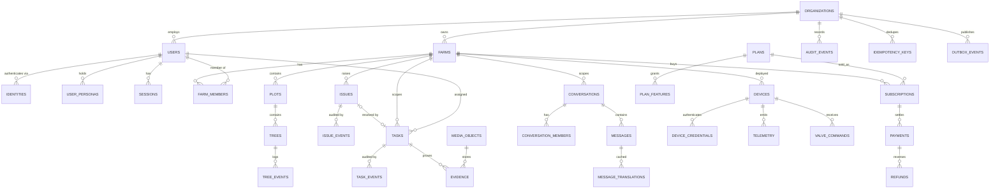

# AgriTasks — Database Architecture Audit

**Audit date:** 2026-08-26
**Editorial review date:** 2026-08-27 — see `specs/AUDIT_DOCUMENT_REVIEW_LOG.md`
**Scope:** Current database status, schema quality, architecture options, and target design.
**Companion documents:** `specs/CYBERSECURITY_AUDIT.md`, `specs/DATABASE_INTEGRATION_TRACEABILITY.md`, `specs/CYBERSECURITY_AND_DATABASE_REMEDIATION_PLAN.md`

> **Reading note.** Findings are stated as at the **audit date**. Where the
> 2026-08-27 editorial review re-derived a value from source and it differed, the
> correction is recorded inline in a blockquote and the original claim is
> preserved rather than deleted. **Nothing in this document about the database
> itself has changed**: the Wave 0 remediation between the two dates was
> exclusively application-layer security work. No database was introduced, no
> migration was run, and `schema.sql` is byte-identical.

**Status vocabulary used in §2 and §9:**

| Value | Meaning |
|---|---|
| `Implemented and wired` | Exists in source and is reachable in the running system |
| `Partially wired` | Exists but is incomplete, or exists on one trail only |
| `In-memory only` | Exists, but state does not survive process exit |
| `Documented only` | Described in a document or comment; no executing code |
| `Missing` | Does not exist in any form |
| `Contradictory` | Source contradicts the architecture documents |
| `Blocked by missing information` | Cannot be assessed without a product or operational decision |

---

## 1. Executive summary

**AgriTasks has no database.** Not an unconfigured one, not a misconfigured one —
none. There is no driver dependency in either backend, no connection string, no
pool, no migration tool, and no repository layer. The single SQL file in the
repository has never been executed and cannot be, because it depends on an
extension nobody has provisioned.

All application state lives in `Map` (Node) and `HashMap` (Rust) instances inside
the server process. Every user account, task, issue, chat message, financial
entry, and audit record is destroyed when the process exits.

The recommended PostgreSQL-centred design is **the right target**, and this audit
endorses it — but with three material corrections to the proposal as written:
TimescaleDB should not be a launch dependency, PostGIS should be deferred until a
real geospatial query exists, and the "possible specialized Rust service" premise
should be resolved by retiring the Rust trail rather than accommodating it.

> **Status as at 2026-08-27.** Re-verified: still no driver in either
> `package.json` or `Cargo.toml`, still no connection string, still no
> `db/migrations/` directory, still no pool. The Wave 0 security remediation
> completed between the audit date and this review **did not and could not
> address any finding in this document**. `DB-SEC-01` (the security audit's name
> for the same defect) is the one Critical finding that remains open there, and it
> is open precisely because it is this document's subject. Every conclusion below
> stands unmodified.

---

## 2. Determine the real database status

Answers derived from source, not documentation.

| # | Question | Answer | Classification | Evidence |
|---|---|---|---|---|
| 1 | Does a database currently exist? | **No** | `Missing` | No driver, no connection, no container, no service |
| 2 | Which database technology is selected? | PostgreSQL + TimescaleDB, on paper | `Documented only` | [db/schema.sql](webapp/server-node/db/schema.sql#L1-L8) |
| 3 | Is the schema executed or merely documented? | **Merely documented** | `Documented only` | `npm run schema:apply` exists but has never run; no DB to run it against |
| 4 | Database driver in the Node backend? | **No** | `Missing` | `package.json` has no `pg`, `postgres`, `knex`, `prisma`, `drizzle`, or `typeorm` |
| 5 | Database driver in the Rust backend? | **No** | `Missing` | `Cargo.toml` has no `sqlx`, `diesel`, `tokio-postgres`, or `sea-orm` |
| 6 | Active connection pool? | **No** | `Missing` | — |
| 7 | Repository or data-access layer? | **Partially** | `Partially wired` | `store.ts` / `store.rs` are module-level function seams over in-memory maps — a usable swap point, but not an interface and not injectable |
| 8 | Migration files present? | **No** | `Missing` | `schema.sql` header references `db/migrations/`; **that directory does not exist** |
| 9 | Migration tool configured? | **No** | `Missing` | — |
| 10 | Migrations executed at startup or deploy? | **No** | `Missing` | `index.ts` has no migration call |
| 11 | Seed data inserted into a real database? | **No** | `In-memory only` | `seedDemoCredentials()` writes to a `Map` |
| 12 | Is application data stored only in memory? | **Yes** | `In-memory only` | `store.ts`, `store.rs` |
| 13 | Any data in local files? | **Only uploaded media** | `Partially wired` | `uploads/` on local disk; no metadata durability |
| 14 | Is Firestore still active anywhere? | **Yes — in the mobile app** | `Contradictory` | `getFirestore` [firebase.ts:59](mobile-app/src/config/firebase.ts#L59); live `onSnapshot` in [ReviewTaskScreen.tsx:51](mobile-app/src/screens/manager/ReviewTaskScreen.tsx#L51) and [TaskDetailScreen.tsx:111](mobile-app/src/screens/worker/TaskDetailScreen.tsx#L111) |
| 15 | Does mobile access a database directly? | **Yes — Firestore** | `Contradictory` | as above; contradicts every architecture document |
| 16 | Does web access a database directly? | **No** | `Implemented and wired` | `webapp/client/src/api.ts` uses `/api` only |
| 17 | Do mobile and web use backend APIs only? | Web yes; **mobile no** | `Partially wired` | — |
| 18 | Which backend do they use? | Node (`:3000`) | `Implemented and wired` | mobile `BASE_URL`; client vite proxy |
| 19 | Can they switch backends? | **No** | `Missing` | Origin is a compile-time constant in mobile; a hardcoded proxy target in the client |
| 20 | Do Node and Rust share the same data store? | **No** | `Missing` | Two separate process memories. Running both = two divergent universes |
| 21 | Does data survive a restart? | **No** | `In-memory only` | — |
| 22 | Database tests present? | **No** | `Missing` | **153** Node tests as at 2026-08-27 (119 at the audit date), 0 touch a database |
| 23 | Migration tests present? | **No** | `Missing` | — |
| 24 | Production database configuration available? | **No** | `Missing` | No `.env.example`, no IaC, no secret reference |
| 25 | Backup and restore documented or implemented? | **No** | `Missing` | Neither |

### 2.1 The most consequential consequences

**GAP-04 — total volatility (Critical).** A deployment restart, a crash, a scale
event, or a routine deploy erases every account and every record. This alone
disqualifies the platform from holding real data.

**No horizontal scalability.** State in process memory means a second replica
serves a different dataset. The system is architecturally limited to exactly one
instance.

**No forensics.** The `audit_log` equivalent is a mutable in-memory array. An
attacker's actions do not survive to be investigated.

**Non-atomic multi-step writes.** `advanceIssue` mutates an issue and appends an
event with no transaction. A panic between the two leaves a permanently
inconsistent state — and in Rust, `lock().unwrap()` turns that panic into a
poisoned lock (SEC-H10). Because all state is in memory, the only recovery from a
poisoned lock is a restart, which destroys every record — the two defects
compound.

> **Precision correction (2026-08-27).** This paragraph implied `Mutex::lock().unwrap()`
> is a pervasive Rust pattern. A recursive search of `webapp/server-rust/src`
> finds **four** lock sites, of which **two** use the panicking `.unwrap()` form:
> `routes/mod.rs:58` (inside a macro, so it expands at effectively every state
> access — this is the one that matters) and `routes/features.rs:630`. The other
> two already use `if let Ok(...)`. SEC-H10 is **not** withdrawn; its remediation
> scope is simply two call sites rather than a codebase-wide audit.

---

## 3. Schema and data-model audit

Reviewed: [webapp/server-node/db/schema.sql](webapp/server-node/db/schema.sql)
(the only DDL in the repository), `webapp/server-node/src/types.ts`,
`webapp/server-rust/src/types.rs`, `mobile-app/src/types.ts`,
`webapp/client/src/types.ts`.

### 3.1 Entity coverage

`schema.sql` declares **13** tables: `users`, `user_personas`, `farms`,
`farm_members`, `tasks`, `issues`, `issue_events`, `plans`, `plan_features`,
`subscriptions`, `payments`, `audit_log`, `feature_flags`.

> **Correction (2026-08-27).** This sentence previously read "declares 12
> tables" while listing thirteen names. Re-derived by matching `CREATE TABLE` in
> `webapp/server-node/db/schema.sql`, which returns **13** definitions at lines
> 11, 20, 32, 43, 53, 72, 90, 102, 111, 120, 132, 145, and 155. The list of names
> was correct; the count was wrong. This also confirms the "39 of 52" figure
> below: the absent-entity list contains exactly 39 names, and 39 + 13 = 52.

Its closing comment lists 24 further tables as "future-phase placeholders created
NOW to lock naming conventions" — but they are **comments, not DDL**. Nothing is
locked.

Against the §24.1 required entity list, the following are entirely absent:

`organizations`, `identities`, `sessions`, `roles`, `permissions`,
`role_assignments`, `plots`, `areas`, `assets`, `trees`, `tree_events`,
`evidence`, `comments`, `conversations`, `messages`, `message_reactions`,
`translation_records`, `devices`, `device_credentials`, `telemetry`,
`valve_commands`, `solar_sites`, `inverters`, `strings`, `panels`,
`weather_samples`, `robot_identities`, `missions`, `videos`,
`video_annotations`, `experts`, `qualifications`, `consultations`,
`entitlements`, `refunds`, `payouts`, `invoices`, `notifications`, `reports`.

**39 of 52 required entities have no schema.** Several of them — comments,
conversations, messages, evidence, devices, telemetry, videos, trees,
consultations — have **working in-memory implementations and live API routes**.
The schema is not merely incomplete; it is behind the code.

### 3.2 Critical structural defects in the existing DDL

| ID | Defect | Severity | Evidence |
|---|---|---|---|
| SCH-01 | **No `organizations` table.** The product is multi-tenant per the requirements, but the tenancy root is `farms`. There is no entity above farm, so an organisation owning several farms cannot be represented, and no organisation-level authorisation is expressible. | Critical | absent |
| SCH-02 | **Every foreign key is nullable and has no referential action.** `farm_id UUID REFERENCES farms(id)` with no `NOT NULL`, no `ON DELETE`, no `ON UPDATE`. A task can exist with `farm_id IS NULL` — which in the application means "belongs to no tenant", and the tenancy checks added in the prior wave would silently fail open or crash. | Critical | representative sites: `farms.owner_id` line 34, `farm_members.farm_id` line 44, `tasks.farm_id` line 55, `issues.farm_id` line 74, `issue_events.issue_id` line 92 |
| SCH-03 | **No row-level security.** No `ENABLE ROW LEVEL SECURITY`, no policies, no tenant-scoped roles. The only tenancy enforcement would be application code — which §9 of the security audit shows is missing on four routes. | Critical | absent |
| SCH-04 | **`password_hash` comment is factually wrong.** Line **15** says "bcrypt/argon2 (plaintext only in dev seed)". The implementation is scrypt, and plaintext is never stored. Documentation drift on the single most security-sensitive column. | Medium | line **15** |
| SCH-05 | **Hard dependency on TimescaleDB at line 8** (`CREATE EXTENSION timescaledb`) for a schema that contains **no time-series table at all**. This makes the schema unexecutable on standard PostgreSQL, RDS without the extension, or any developer machine — for zero present benefit. | High | line 8 |
| SCH-06 | **No indexes on `tasks`** despite `tasks` being the highest-traffic entity, queried by `farm_id`, `worker_id`, and `status` on every list call. The only two indexes in the file are `idx_issues_open` (line 88) and `idx_subs_active` (line 130). | High | `tasks` block, lines **53–71** |
| SCH-07 | **No optimistic concurrency anywhere.** No `version` or `updated_at` column on any mutable table. Concurrent task-status transitions and issue-stage advances will silently last-write-win. | High | all tables |
| SCH-08 | **No soft delete, no archival, no retention.** Personal data (`users.email`, `users.name`, geolocation on `tasks`) has no deletion or export path — a GDPR-style erasure request cannot be satisfied. | High | all tables |
| SCH-09 | **`audit_log` is an ordinary mutable table.** No append-only constraint, no hash chain, no `REVOKE UPDATE/DELETE`. An attacker with DB access rewrites history. | High | lines 145–153 |
| SCH-10 | **No unique constraint on `tasks`, `issues`, or `payments` business keys**, and no idempotency table. `payments.gateway_ref` is described in a comment as the "idempotency anchor" but carries no `UNIQUE`. Webhook replay would double-charge. | High | line **138** |
| SCH-11 | **Timestamps are `TIMESTAMPTZ` (correct) but the application uses epoch milliseconds as `number` throughout.** Neither `types.ts` nor `types.rs` has a date type. Conversion is undefined. | Medium | `types.ts` vs schema |
| SCH-12 | **Money.** Schema uses `NUMERIC(10,2)` (correct); the application uses JS `number` floats throughout the finance module ([farmsFinance.ts](webapp/server-node/src/routes/farmsFinance.ts), security finding SEC-M14). `NUMERIC(10,2)` also caps a value at 99,999,999.99 EGP, which is plausible but undocumented, and there is no `currency` column on `payments` despite the client sending one. | High | line **136** |
| SCH-13 | **No geospatial types.** `center_lat`/`center_lng` are `DOUBLE PRECISION` (lines **36–37**) and `boundary` is `JSONB` (line **38**). PostGIS is not enabled. No spatial index is possible, so "which trees are in this plot" is a full scan with application-side maths. | Medium | lines **36–38** |
| SCH-14 | **`user_personas.persona` and `farm_members.role_in_farm` use `CHECK` constraints with overlapping but non-identical value sets** (`persona` has 9 values, `role_in_farm` has 4). The application treats them as one concept in `buildActorContext()`. Adding a persona requires a schema migration. | Medium | `persona` CHECK lines **23–24**; `role_in_farm` CHECK line **46** |
| SCH-15 | **No `NOT NULL` on `status`, `stage`, `severity`, `method`** — the `CHECK` constraints permit `NULL` because `NULL` passes a `CHECK`. Every state machine can hold a null state. | High | `tasks.status` line **60**, `issues.stage` line 76, `issues.severity` line **80**, `payments.method` line **137** |

> **Evidence-path correction (2026-08-27).** Every line reference in this table was
> re-derived from `webapp/server-node/db/schema.sql`. Seven were wrong: SCH-02
> (ranges did not correspond to foreign-key declarations and are now given as
> individual representative sites), SCH-04 (16 → **15**), SCH-06 (52–68 → **53–71**),
> SCH-10 (141 → **138**), SCH-12 (137 → **136**, and the `farmsFinance.ts#L31`
> reference was removed because that file was rewritten in Wave 0 and the line no
> longer exists), SCH-13 (33–39 → **36–38**), SCH-14 (22–48 → **23–24** and **46**),
> and SCH-15 (61, 76, 78, 138 → **60**, 76, **80**, **137**). SCH-05 (line 8) and
> SCH-09 (lines 145–153) were verified **correct** and are unchanged. **No defect
> was withdrawn** — every one of these findings is still present in the DDL; only
> the citations were wrong. This matters because a reviewer following a wrong line
> number would conclude the finding was fabricated.

### 3.3 Model drift across the six representations

| Concept | `schema.sql` | Node `types.ts` | Rust `types.rs` | Mobile | Web | Drift |
|---|---|---|---|---|---|---|
| Task tenancy | `farm_id` nullable | `farmId: string` **required** | present | absent | absent | **Schema permits what the type forbids** |
| Task id | `UUID` | `string` (`u-`/`t-` prefixed) | `String` | `string` | `string` | Application ids are **not UUIDs** — `u-${randomUUID()}`, `t-1` |
| User id | `UUID` | `u-<uuid>`, `u-google-<ms>` | `u-owner` etc. | — | — | **Would violate `UUID` column type** |
| Money | `NUMERIC(10,2)` | `number` float | — | — | `number` | Precision loss |
| Timestamps | `TIMESTAMPTZ` | `number` epoch ms | `u64` | `number` | `number` | Type mismatch |
| Persona | 9-value `CHECK` | `Persona` union | `Persona` | subset | subset | Divergent enums |
| Comments / chat / evidence / devices / telemetry / videos / trees | **absent** | implemented | implemented | consumed | consumed | **Schema behind implementation** |

**The seeded identifiers alone make the schema unusable as written.** `u-owner`
and `t-1` cannot be inserted into a `UUID PRIMARY KEY`. Adopting this schema
requires either changing every id strategy or changing every id column.

---

## 4. Evaluation of Option 1 — PostgreSQL-centred modular architecture

### 4.1 Why it fits this product

**Relational workflows dominate.** The core domain is issue→task→evidence→review
with stage transitions, farm memberships, and multi-persona role resolution.
`buildActorContext()` alone is a three-way join (users × personas × farm_members)
executed on **every single request**. In SQL that is one indexed query; in a
document store it is either denormalised duplication or an application-side join.

**Multi-tenancy.** A `farm_id`/`org_id` tenant key on every table, plus row-level
security policies keyed to a session variable, gives a second enforcement layer
*behind* the application checks. At the audit date four routes had **no**
application tenancy check at all; those four were fixed in Wave 0, but the fix is
application code in one of two backends, and the Rust trail still has none. A
database-level layer that no route can forget remains the stronger argument, and
Wave 0 does not weaken it — it demonstrates it, because the same class of defect
had to be found and fixed by hand four times.

**Transactions.** Issue advancement writes an issue row, an event row, and an
audit row. Task submission writes a task and an audit row. These must be atomic.
PostgreSQL gives that for free; the current implementation has no atomicity.

**Financial consistency.** `NUMERIC` money, foreign keys, and serialisable
transactions are the right tools for a ledger. SEC-M14 (float money) and SEC-C05
(unvalidated writes) were both symptoms of not having them.

> **Update (2026-08-27).** SEC-C05 is now `Remediated (verified)`: `POST /finances`
> validates with `Number.isFinite`, rejects non-positive amounts, and enforces
> allow-lists on `type` and `category`. **SEC-M14 is still open** — amounts remain
> JS floats, so the ledger can still accumulate rounding error. The argument above
> stands on SEC-M14 alone; the SEC-C05 half is now historical.

**Auditability.** Append-only audit with `REVOKE UPDATE, DELETE`, optionally hash
chained, satisfies SCH-09 and SEC-M08.

**Reporting.** `/finances/summary` is a `GROUP BY category` aggregate. Solar daily
reports are windowed aggregates. These are SQL's home ground.

**Node and Rust support.** Both are excellent — `pg`/`postgres.js` for Node,
`sqlx` (compile-time-checked queries) for Rust.

**Cost and operations.** A managed instance is inexpensive and operationally
boring. The team already writes SQL-shaped code.

### 4.2 Where the proposal should be modified

| Proposal element | Verdict | Reasoning |
|---|---|---|
| PostgreSQL as system of record | **Accept** | Justified above |
| Repository interfaces separating domain from persistence | **Accept** | `store.ts` already provides the seam; formalise it |
| Migration framework owned by the canonical backend | **Accept, with a prerequisite** | Requires first deciding *which* backend is canonical |
| Object storage for media | **Accept** | Directly resolves SEC-H03; local disk is not durable, not shared, not scalable. Wave 0 added authentication and path containment on the Node read path, which closes the *access-control* half of SEC-H03; the durability and multi-replica half is untouched and still requires this change |
| **PostGIS** | **Defer** | No geospatial *query* exists anywhere in the codebase. Present usage is storing lat/lng and computing distance client-side. Adopt when the first real spatial predicate appears (e.g. "trees within plot boundary"); adding PostGIS later is a routine migration |
| **TimescaleDB** | **Defer, and remove from `schema.sql` now** | SCH-05: it is a hard dependency for a schema with no hypertable. It blocks local development and constrains hosting for zero benefit. Native declarative partitioning covers the foreseeable telemetry volume; adopt Timescale when measured ingest justifies it |
| Redis "only if a proven requirement exists" | **Accept the condition — and note two requirements now exist** | Rate limiting is currently per-process (breaks on replica two) and the WebSocket registry is per-process. Both need shared state the moment a second instance runs |
| MQTT broker for IoT transport | **Blocked by missing information** | No IoT hardware, vendor, or protocol is decided. `docs/` names no broker. Do not build this until a device is chosen |
| Analytics/warehouse layer only when scale justifies | **Accept** | Correct and appropriately conditional |
| "Node and a possible specialized Rust service" | **Reject the premise** | See §7 |

### 4.3 Limitations of Option 1

Single-writer primary caps write throughput; vertical scaling has a ceiling.
Multi-region active-active is not native. Schema migrations on large tables need
care. Connection-count limits require PgBouncer at scale. None of these binds at
the platform's current or near-term scale.

### 4.4 Conditions for reconsideration

Revisit if any of: sustained telemetry above ~50k points/second; a hard
multi-region write-availability requirement; regulated data residency across
regions; or the relational core becoming a minority of the workload.

---

## 5. Alternatives

### Option 2 — Firebase / Google Cloud serverless

**Genuine strengths.** Offline-first client synchronisation is best-in-class and
directly serves field workers on poor rural connectivity — a real requirement
here. Real-time updates are free (the mobile app is already polling at 4–5 second
intervals to simulate them, and *still has live `onSnapshot` listeners*).
Firebase Auth removes an entire category of the authentication defects in §8 of
the security audit. Cloud Storage plus signed URLs resolves SEC-H03 directly. FCM
resolves the missing push infrastructure. For a small team, time-to-value is
unmatched.

**Why it does not fit as the system of record.**

*Authorization.* This platform's model is multi-persona × farm-membership ×
entitlement. Firestore rules cannot join across documents without duplicating
membership into every record. Every membership change would require a fan-out
rewrite — and a partial fan-out failure is a silent authorisation bug.

*Financial consistency.* Firestore transactions are limited in scope and cost.
A ledger with aggregates is a poor fit.

*Reporting.* No joins, no `GROUP BY`. `/finances/summary` and the solar daily
report become either client-side aggregation or a parallel warehouse.

*IoT cost.* Firestore bills per document read/write. Telemetry at any real
cadence is dramatically more expensive than a partitioned relational table.

*Dual-backend incompatibility.* There is no meaningful Firestore story for the
Rust trail.

*Lock-in and migration.* No SQL export path; migration away is a rewrite.

**A note on evidence.** This option must not be rejected because the current
Firestore code is stale — that would be reasoning from an implementation accident.
It is rejected on the authorization-join and financial-consistency arguments,
which are structural. Conversely, the stale code is *not* evidence against
Firebase; it is evidence of an abandoned migration (SEC-M13).

**Where Firebase should still be used:** Firebase Auth is a defensible choice, and
Cloud Storage or any S3-compatible object store is the recommended media target.

### Option 3 — MongoDB-centred document architecture

**Genuine strengths.** Flexible schema suits the `metadata JSONB` extensibility
rule the design already uses. Native time-series collections handle telemetry
well. 2dsphere geospatial indexes are strong. Change streams give real-time.
Horizontal scaling via sharding is mature. The JSON mapping to the existing
TypeScript types is nearly one-to-one.

**Correcting a common misstatement:** MongoDB **does** have multi-document ACID
transactions (4.0 replica sets, 4.2 sharded). The objection is not capability.

**Why it does not fit.** The objection is *cost of correctness*. Every
membership/permission/entitlement resolution is a join. In MongoDB the choice is
`$lookup` (which does not shard well and is slow) or embedding (which duplicates
membership into farms, tasks, issues, conversations, and videos — and every
duplicate is an authorisation decision that can go stale). Given that this audit
found tenancy checks *already* missing on four routes with a single source of
truth, multiplying the number of places tenancy is recorded is the wrong direction.

Transactions exist but carry a performance cost and require a replica set even in
development. Complex reporting requires aggregation pipelines that are harder to
review than SQL. Referential integrity is entirely the application's job.

**Verdict:** viable, but it trades away exactly the guarantees this domain most
needs and this codebase has most demonstrably failed to provide in application code.

### Option 4 — Distributed SQL (CockroachDB / YugabyteDB / Cloud Spanner)

**Genuine strengths.** Retains relational modelling, ACID, and (for Cockroach and
Yugabyte) PostgreSQL wire compatibility — so the target schema would largely port.
Survives node and zone loss automatically. Scales writes horizontally. Multi-region
with data-domiciling controls.

**Why not now.** Operational complexity and cost are multiples of a managed
PostgreSQL instance for a platform that currently cannot keep data across a
restart. Distributed transactions add latency that a single-region workload does
not need. Local development is heavier. Debugging is harder. The team has no
distributed-systems operational capacity in evidence.

**Do not reject permanently.** Concrete triggers that would justify it: a hard
multi-region write-availability SLA; regulated residency in more than one
jurisdiction; sustained write volume beyond a single primary; or an RTO that
single-primary failover cannot meet. Because Cockroach and Yugabyte speak the
PostgreSQL protocol, **choosing PostgreSQL now preserves this option** — which is
itself a strong argument for Option 1.

---

## 6. Database decision matrix

Weights are set before scoring, from the requirements in `docs/REQUIREMENTS.md`
and `docs/V2_REQUIREMENTS_ANALYSIS.md`. Scale 1–5, higher is better.

| # | Criterion | W | Why this weight | PG | FB | Mongo | DSQL |
|---|---|---|---|---|---|---|---|
| 1 | Transactional consistency | 10 | Ledger, issue→task→audit atomicity, payments | 5 | 2 | 3 | 5 |
| 2 | Multi-tenancy | 10 | Farm/org isolation is the core security boundary; 4 routes leaked at the audit date | 5 | 2 | 3 | 5 |
| 3 | Relational modelling | 9 | persona × membership × entitlement joins on every request | 5 | 1 | 2 | 5 |
| 4 | Auditability | 9 | Regulatory + forensic; currently non-existent | 5 | 2 | 3 | 5 |
| 5 | Payment suitability | 8 | Money, refunds, idempotency, reconciliation | 5 | 2 | 3 | 5 |
| 6 | Reporting | 8 | Finance summary, solar daily, worker stats | 5 | 1 | 3 | 5 |
| 7 | Security controls | 8 | RLS, least privilege, column encryption | 5 | 3 | 3 | 4 |
| 8 | Offline mobile support | 7 | Field workers, poor rural connectivity | 2 | **5** | 3 | 2 |
| 9 | Operational complexity | 7 | Small team, no dedicated DBA/SRE | 4 | **5** | 3 | 1 |
| 10 | Cost predictability | 7 | Egypt/EGP market, cost-sensitive | 4 | 2 | 3 | 2 |
| 11 | Local development & testing | 7 | **153** tests must run offline in CI | 5 | 2 | 4 | 2 |
| 12 | Migration complexity from today | 6 | In-memory maps → target | 4 | 3 | 4 | 3 |
| 13 | Time-series support | 6 | Telemetry, solar, weather | 4 | 1 | **5** | 3 |
| 14 | Geospatial support | 6 | Farm boundaries, tree locations | 5 | 2 | 5 | 3 |
| 15 | Node support | 6 | Canonical backend | 5 | 5 | 5 | 4 |
| 16 | Media integration | 5 | Photos, video, voice | 4 | **5** | 4 | 4 |
| 17 | Scalability | 5 | No current scale pressure | 3 | 4 | 4 | **5** |
| 18 | Backup & recovery | 5 | Currently absent | 5 | 3 | 4 | 4 |
| 19 | Long-term maintainability | 5 | Small team, high turnover risk | 5 | 3 | 3 | 3 |
| 20 | Vendor lock-in | 4 | Strategic optionality | 5 | 1 | 3 | 3 |
| 21 | Developer availability | 4 | Hiring in-region | 5 | 4 | 4 | 2 |
| 22 | Rust support | 3 | Only if the Rust trail survives | 5 | 1 | 3 | 4 |
| 23 | IoT suitability | 3 | Deferred; no hardware chosen | 4 | 2 | 4 | 3 |
| 24 | Data retention / erasure | 3 | Personal data obligations | 5 | 3 | 4 | 4 |

### Weighted totals

Each total is $\sum_{i=1}^{24} W_i \times S_i$ over the 24 criteria above.
Normalisation is relative to the leading option.

| Option | Score | Normalised | Maximum possible |
|---|---|---|---|
| **1. PostgreSQL-centred** | **690** | **100%** | 805 |
| 4. Distributed SQL | 562 | 81.4% | 805 |
| 3. MongoDB | 518 | 75.1% | 805 |
| 2. Firebase | 392 | 56.8% | 805 |

> **Arithmetic correction (2026-08-27).** All four totals were recomputed from the
> published weights and scores, which are themselves unchanged. Every total was
> wrong: PostgreSQL 697 → **690**, Distributed SQL 610 → **562**, MongoDB 511 →
> **518**, Firebase 435 → **392**. The `Maximum possible` column (sum of weights
> × 5 = 161 × 5 = 805) was added so the totals can be checked independently.
> **The ranking is unchanged and the recommendation is unaffected** — the errors
> were arithmetic, not directional, and the corrected figures *widen* PostgreSQL's
> margin over Distributed SQL from 12.5 to 18.6 percentage points. The sensitivity
> analysis below has been recomputed on the corrected base.

### Sensitivity analysis

The result is **robust**, but it is honest to state exactly what would change it:

- **Halving the top four weights** (consistency, multi-tenancy, relational,
  auditability) from 10/10/9/9 to 5 each: PostgreSQL **600**, Distributed SQL
  **472**, MongoDB **468**, Firebase **360**. **Order unchanged**, though this is
  the one scenario in which second and third place become a near-tie (472 vs 468,
  a 0.8% gap) — that ordering should not be relied on.
- **Raising offline-mobile support to 10 and operational complexity to 10** (i.e.
  "we are a small team shipping to disconnected farms and nothing else matters"):
  PostgreSQL **708**, Distributed SQL **571**, MongoDB **536**, Firebase **422**.
  **Order unchanged** — Firebase's offline advantage cannot overcome the six
  criteria where it scores 1–2.
- **The only scenario that flips the result:** if transactional consistency,
  multi-tenancy, relational modelling, reporting, and payments were *all* dropped
  to weight 2 — which would mean AgriTasks is not a multi-tenant farm-management
  platform with a ledger. At that point Firebase wins on speed to market.
- **Distributed SQL overtakes PostgreSQL** only if scalability and availability
  weights rise above ~9 *and* operational complexity falls below ~3, i.e. a funded
  platform team and a multi-region requirement.

**Assumptions that could change the outcome, stated plainly:** that the platform
remains single-region; that the team stays small; that telemetry stays below
Timescale-justifying volume; that payments become real; and that the relational
core remains the majority of the workload. The first four are unverified — they
are product decisions, not technical findings.

**No weight was chosen after seeing a score.** The weights are traceable to
`docs/REQUIREMENTS.md` and `docs/V2_REQUIREMENTS_ANALYSIS.md` as recorded in the
`Why this weight` column; that column is the audit trail for this claim. It is
not independently verifiable after the fact, and it is offered as a statement of
method rather than as evidence.

---

## 7. The two-backend question

The proposal to evaluate speaks of supporting "Node and a possible specialized
Rust service". This audit rejects that framing on evidence.

The Rust backend is not a specialised service. It is a **substantial
reimplementation of the same API** — **63** route registrations against Node's
**82** handlers — sharing the token format, the seeded user IDs, and the domain
model, while diverging on security controls.

> **Count correction (2026-08-27).** This sentence previously read "47 endpoints
> against Node's 81". Neither figure was reproducible and no counting method was
> stated. Re-derived by recursive pattern match across each source tree: `.route(`
> in `webapp/server-rust/src` returns **63** path registrations (a single Axum
> `.route()` may bind several methods, so the method-handler count is higher
> still, around 126), and `app.<verb>(` in `webapp/server-node/src` returns **82**
> handlers today — **80** at the audit date, before Wave 0 added `GET
> /uploads/:name` and `POST /media/ticket`. The corrected ratio (63:82) makes the
> duplication *more* extensive than the original figures suggested, so the
> argument in this section is strengthened, not weakened.

This audit found SEC-C01 (hardcoded secret), SEC-H05 (no upload limits), SEC-H07
(no rate limiting), and SEC-H08 (permissive CORS) **solely because a prior
remediation wave fixed the Node trail and nobody fixed Rust**. That is the second
consecutive audit in which a duplicated-control divergence produced a Critical
finding.

> **Update (2026-08-27) — and the pattern has now recurred a third time.** Wave 0
> fixed SEC-C01 in **both** trails. It fixed SEC-C02, SEC-C03, SEC-C04, SEC-C05,
> SEC-H01, SEC-H02, and SEC-H03 in **Node only**. SEC-H05, SEC-H07, SEC-H08, and
> SEC-H10 were re-confirmed as still present in Rust on 2026-08-27 by source
> inspection: zero `DefaultBodyLimit` layers, zero rate-limiting constructs,
> `CorsLayer::permissive()` at `main.rs:85`, and `.fallback_service(ServeDir::new("uploads"))`
> at `main.rs:87` still serving media with no authentication and no security
> headers. **The divergence is now wider than when this audit was written.** This
> is the strongest available evidence for the recommendation below, and decision
> D-1 (which backend is canonical) should be treated as urgent rather than
> strategic.

Adding a database multiplies the problem: two connection pools, two migration
runners, two repository layers, two transaction models — and two chances to get
tenant scoping wrong.

**Recommendation.** Before any database work begins, resolve this as a stakeholder
decision (see `specs/CYBERSECURITY_AND_DATABASE_REMEDIATION_PLAN.md` D-1):

- **Option A (recommended):** designate Node canonical; retire the Rust trail or
  freeze it as a non-deployed experiment. One database integration.
- **Option B:** keep both, but generate both from a shared OpenAPI contract with
  mandatory contract tests, and accept roughly double the persistence effort.

A genuinely specialised Rust service — telemetry ingestion, video processing —
would be a defensible future addition. That is a different thing from a second
implementation of the same CRUD surface, and it should share the same database
rather than its own memory.

---

## 8. Target database design

Presented as a **target**, not a production schema. Uncertain relationships are
marked as open decisions rather than guessed.

### 8.1 Core design characteristics

| Characteristic | Decision | Rationale |
|---|---|---|
| Primary keys | `UUID v7` (time-ordered) generated **by the application** | Fixes SCH-02/model drift; v7 keeps B-tree locality; app-generated enables idempotent retries |
| Tenant keys | `org_id` **and** `farm_id` `NOT NULL` on every tenant-scoped table | Two-level tenancy; enables RLS |
| Foreign keys | All `NOT NULL` where the relationship is mandatory; explicit `ON DELETE RESTRICT` for referenced business data, `ON DELETE CASCADE` only for owned child rows | Fixes SCH-02 |
| Row-level security | `ENABLE ROW LEVEL SECURITY` on every tenant table; policy on `current_setting('app.farm_ids')`; application connects as a non-superuser role | Fixes SCH-03; second layer behind app checks |
| Unique constraints | `users.email` (citext); `farm_members(farm_id,user_id)`; `payments.gateway_ref`; `idempotency_keys.key` | Fixes SCH-10 |
| Index strategy | Every FK; every tenant key; `(farm_id, status)` on tasks; `(farm_id, stage) WHERE stage <> 'closed'` on issues; `(conversation_id, created_at)` on messages | Fixes SCH-06 |
| State columns | `NOT NULL` **plus** `CHECK`, or native `ENUM` | Fixes SCH-15 |
| Optimistic locking | `version INTEGER NOT NULL DEFAULT 0`, incremented on update, checked on write | Fixes SCH-07 |
| Monetary data | `NUMERIC(14,2)` **plus** an explicit `currency CHAR(3)`; application uses integer minor units end to end | Fixes SCH-12, SEC-M14 |
| Time | `TIMESTAMPTZ` everywhere; UTC storage; farm-local rendering from a `farms.timezone` column | Fixes SCH-11 |
| Units | Explicit unit suffix on every measure column (`volume_litres`, `power_watts`, `area_m2`) | Prevents unit-confusion defects |
| Soft delete | `deleted_at TIMESTAMPTZ NULL` on user-facing entities; partial indexes exclude deleted rows | Fixes SCH-08 |
| Archival & retention | Per-table retention policy; telemetry partitions dropped by age; media lifecycle on the object store | Fixes SCH-08 |
| Immutable history | `issue_events`, `task_events`, `audit_events` are append-only; `REVOKE UPDATE, DELETE` from the application role | Fixes SCH-09 |
| Audit integrity | `prev_hash`/`hash` chain over `(at, actor_id, action, target, detail)`; periodic anchor | Fixes SEC-M08 |
| Encryption | TLS required in transit; storage-level encryption at rest; `pgcrypto` only for specifically classified columns | — |
| Personal-data classification | Column-level tags in a `data_classification` catalogue table driving export/erasure | — |
| Backup & restore | Managed PITR; **restore rehearsed on a schedule** and the rehearsal recorded | Fixes "backup exists but was never tested" |
| Read replicas | One replica for reporting once report latency is measured — not before | Avoids premature complexity |
| Object-storage references | `media_objects(id, bucket, key, sha256, bytes, mime, farm_id, uploaded_by, created_at)`; entities reference `media_object_id` | Fixes SEC-H03, enables signed URLs, dedupe, checksums |
| Idempotency | `idempotency_keys(key, endpoint, request_hash, response, created_at)` | Fixes API-04 |
| Outbox | `outbox_events(id, aggregate, payload, published_at NULL)` written in the same transaction | Reliable notification/webhook delivery |
| Telemetry | Native declarative partitioning by month on `telemetry`; **no Timescale dependency at launch** | Fixes SCH-05 |
| Geospatial | `DOUBLE PRECISION` lat/lng at launch; PostGIS `geography` migration when the first spatial predicate is required | Deferred per §4.2 |

### 8.2 Entity-relationship overview — proposed target



### 8.3 Open decisions — not guessed

| # | Open question | Why it cannot be settled from the repository |
|---|---|---|
| O-1 | Is `organizations` above `farms`, or are farms the tenancy root? | Requirements imply organisations; no code or schema models them |
| O-2 | Can a user belong to more than one organisation? | Not addressed anywhere |
| O-3 | Are `user_personas` global or per-farm? | `buildActorContext()` treats them as global; `farm_members.role_in_farm` is per-farm; the two overlap and conflict |
| O-4 | Are conversations always farm-scoped? | `createConversation` accepts an optional `farmId`; expert consultations may legitimately cross farms |
| O-5 | Retention period for telemetry, media, and audit? | No policy documented |
| O-6 | Which payment provider? | Determines webhook, idempotency, and refund modelling |
| O-7 | Are trees identified by QR/NFC tag or by coordinate? | `GET /v2/trees/resolve` implies a tag; no tag column is designed |
| O-8 | Is video stored by the platform or by a third-party provider? | Affects whether `videos` holds a URL or a provider asset id |

---

## 9. Wiring assessment — desired versus actual

**The `ACTUAL TODAY` column describes the repository as at the audit date
(2026-08-26).** Corrections for the post-Wave-0 state follow the block.

```text
DESIRED                                    ACTUAL TODAY
────────────────────────────────────────   ──────────────────────────────────────
Mobile app                                 Mobile app
  → versioned backend API                    → MIXED: /tasks unversioned, /v2/* versioned
  → authentication and authorization         → authn yes; authz partial (4 routes unscoped)
  → application service                      → route handler contains the logic
  → repository interface                     → module-level store functions
  → database transaction                     → NONE
  → PostgreSQL                               → in-memory Map
  ⚠ PLUS an undesired direct Firestore channel (SEC-M13)

Web application                            Web application
  → versioned backend API                    → same mixed versioning
  → ... → PostgreSQL                         → same in-memory Map

IoT gateway                                IoT gateway
  → authenticated MQTT or ingestion API      → HTTP route requiring an ADMIN token
  → telemetry ingestion service              → inline route handler
  → validation and deduplication             → NONE; `at` is caller-supplied
  → time-series storage                      → in-memory Vec
  → issue and alert processing               → synchronous leak-scan endpoint

Photos and videos                          Photos and videos
  → authenticated upload flow                → authenticated, but 2 of 3 paths unvalidated
  → object storage                           → local disk under uploads/
  → metadata and policy in PostgreSQL        → NONE; publicly served, no access policy
```

**Gap count: every layer of every flow.** The only element matching the desired
architecture is that the web client speaks exclusively to the backend API.

> **Post-Wave-0 correction (verified 2026-08-27).** Three lines in the `ACTUAL
> TODAY` column above are now out of date, and only three:
>
> - `authz partial (4 routes unscoped)` → the four finance/farm routes are now
>   tenant-scoped in the **Node** trail (SEC-C04, SEC-C05, SEC-H01), and chat
>   membership is enforced (SEC-C02, SEC-C03). The **Rust** trail is unchanged.
> - `2 of 3 paths unvalidated` → all three Node upload paths now run
>   `readValidatedUpload` (magic-byte checking, 413 on oversize).
> - `publicly served, no access policy` → the Node `/uploads/:name` route now
>   requires a session or a short-lived path-bound ticket and enforces path
>   containment. **The Rust trail still serves `uploads/` publicly** via
>   `.fallback_service(ServeDir::new("uploads"))`.
>
> **Every other line is unchanged**, including all six lines that concern
> persistence — no transaction, no repository interface, no PostgreSQL, no
> metadata, in-memory `Map` and `Vec` throughout. The summary sentence above
> therefore still holds for this document's subject matter.

---

## 10. Verdict

| Question | Answer |
|---|---|
| Is the current database architecture suitable for the product requirements? | **No — there is no database.** The current architecture cannot satisfy durability, multi-tenancy, transactionality, auditability, reporting, or scalability. |
| Is the recommended PostgreSQL design suitable? | **Yes**, with TimescaleDB and PostGIS deferred and the two-backend question resolved first. |
| Is the existing `schema.sql` usable as a starting point? | **Partially.** It has the right shape for **13** entities but is unexecutable as written (SCH-05), omits 39 required entities, has no tenancy enforcement (SCH-03), no referential actions (SCH-02), and a primary-key type incompatible with the application's own identifiers. **Treat it as a draft to be rewritten, not a migration to be run.** |
| What must happen first? | Stakeholder decision D-1 (one backend or two), then WP-1.1 (provision PostgreSQL and implement persistence behind the `store.ts` seam). |
| Did the Wave 0 security remediation change any of the above? | **No.** Re-verified 2026-08-27. Wave 0 was application-layer security work; `schema.sql` is unchanged, no driver was added, and no migration was run. |
