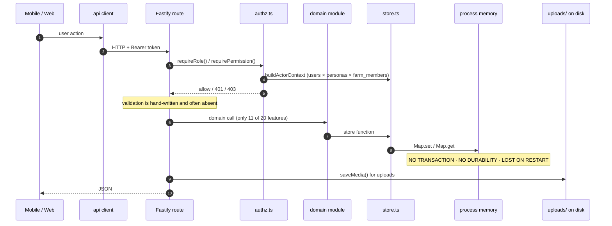
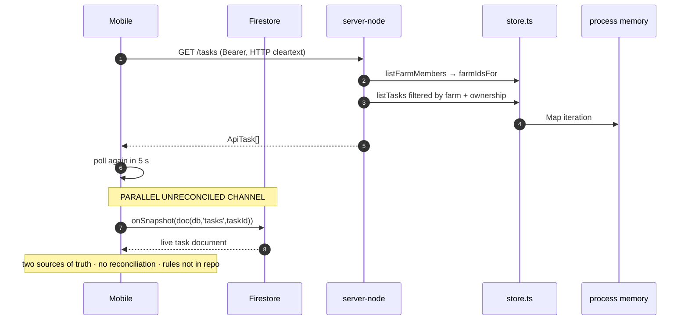
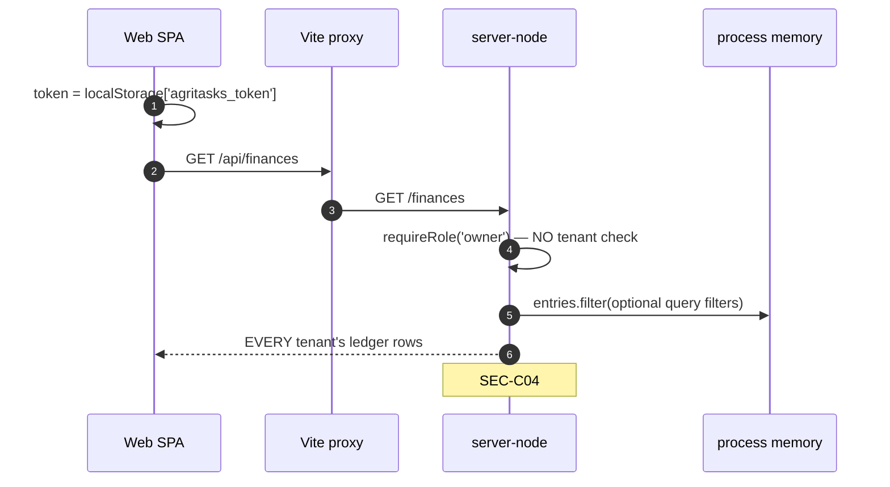
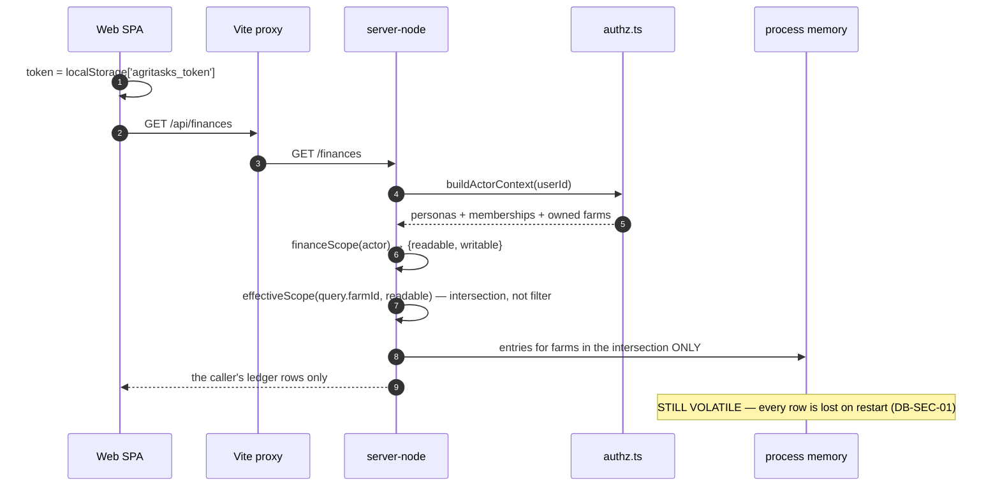
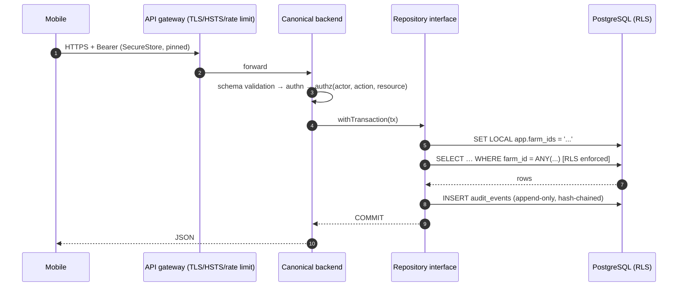
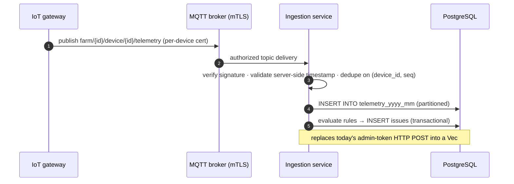
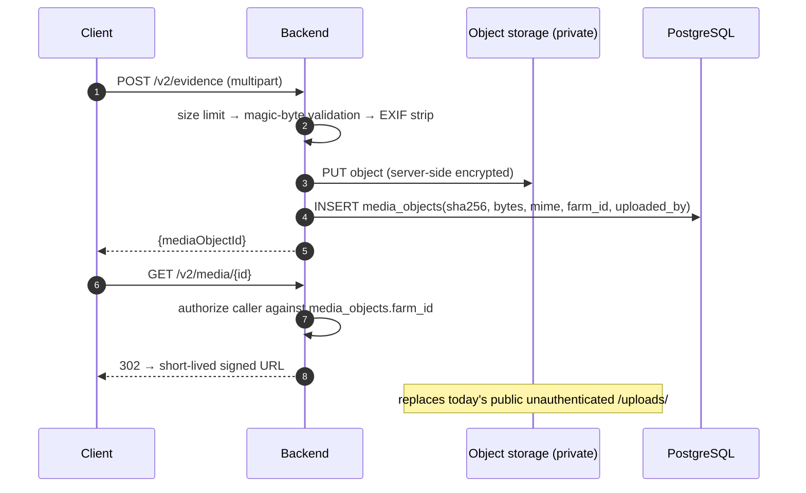
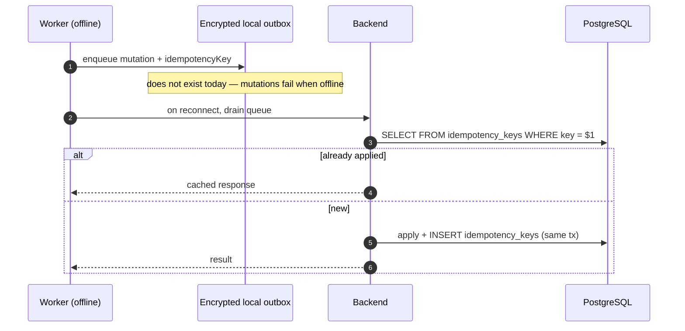
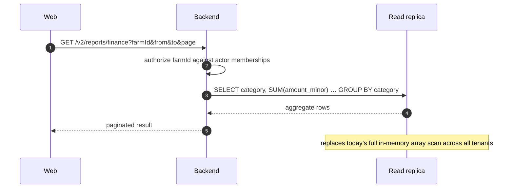

# AgriTasks — Database Integration Traceability

**Audit date:** 2026-08-26
**Editorial review date:** 2026-08-27 — see `specs/AUDIT_DOCUMENT_REVIEW_LOG.md`
**Purpose:** Trace the real, verified data path for every major feature — from UI
through API, validation, authorization, service, store, and persistence — and
record every broken or missing link.

**Reading note.** The "Persistence" column is identical for every feature:
in-process memory. It is repeated rather than omitted because the repetition *is*
the finding.

> **Reading note — two points in time.** Feature traces in §3 describe the
> **Node** trail as at the **audit date**. The Wave 0 remediation, completed
> 2026-08-27, changed the authorization and validation links for chat, evidence,
> farms, finances, and media. Where a trace is now out of date the correction is
> recorded inline in a blockquote and the original is preserved, because the
> broken link is the traceability record that justified the fix. **The
> `Persistence` column is unchanged for every one of the twenty features.**

**Legend.** ✔ present · ✘ absent · ◐ partial · **bold** = defect

---

## 1. Summary of link integrity

| Layer | Working — audit date | Broken — audit date | Working — 2026-08-27 | Broken — 2026-08-27 |
|---|---|---|---|---|
| Client → API client function | 20 / 20 | 0 | 20 / 20 | 0 |
| API client → backend route | 19 / 20 | 1 (Firestore bypass) | 19 / 20 | 1 (Firestore bypass) |
| Route → input validation | 6 / 20 | **14** | **9 / 20** | **11** |
| Route → authorization | 13 / 20 | **7** | **16 / 20** | **4** |
| Route → tenant scoping | 8 / 20 | **12** | **12 / 20** | **8** |
| Route → service/domain layer | 11 / 20 | 9 (logic inline in handler) | 11 / 20 | 9 |
| Service → store function | 20 / 20 | 0 | 20 / 20 | 0 |
| Store → durable persistence | **0 / 20** | **20** | **0 / 20** | **20** |
| Feature → test coverage | 7 / 20 | 13 | **10 / 20** | **10** |

> **Recount (2026-08-27).** The `2026-08-27` columns were added by the editorial
> review; the `audit date` columns are unchanged. Four features moved:
> **Farms** (§3.3), **Evidence** (§3.7), **Chat** (§3.9), and **Finances**
> (§3.16). Specifically — validation gained Evidence, Chat media, and Finances
> (+3); authorization gained Chat, Finances, and Farms (+3); tenant scoping gained
> Farms, Finances, Chat, and Evidence (+4); test coverage gained Chat, Finances,
> and Farms (+3). Every count is derived from the per-feature traces in §3, so the
> two are reconcilable by inspection.
>
> **These figures describe the Node trail only.** The Rust trail was not
> re-traced; its finance and media routes remain unscoped. Applying these numbers
> to a Rust deployment would be wrong.
>
> **The row that matters has not moved.** `Store → durable persistence` is still
> **0 / 20**. Every improvement above is application-layer logic guarding data
> that is still destroyed on restart.

---

## 2. Current implementation — end-to-end flow

**Current-state diagram.** Every participant and message shown exists in
`webapp/server-node/src`. Proposed target flows are in §4.3–§4.7 and are labelled
as such.

---

## 3. Feature-by-feature traceability

### 3.1 Login and users

| Step | Detail |
|---|---|
| 1. Client | [LoginScreen.tsx](mobile-app/src/screens/LoginScreen.tsx), [Login.tsx](webapp/client/src/pages/Login.tsx) |
| 2. API client | `login()` [webApi.ts:58](mobile-app/src/services/webApi.ts#L58); `api.ts` (web) |
| 3. Endpoint | `POST /auth/login`, `POST /auth/register`, `POST /auth/google` |
| 4. Route | [routes/auth.ts:61,88](webapp/server-node/src/routes/auth.ts#L61), [googleAuth.ts:24](webapp/server-node/src/routes/googleAuth.ts#L24) |
| 5. Validation | ✔ email format, lengths, password policy, type guards |
| 6. Authorization | n/a (public); ✔ `resolvePublicRegistrationRole` blocks privileged self-assignment |
| 7. Service | `security/passwords.ts`, `security/roles.ts`, `security/rateLimit.ts` |
| 8. Store | `findUserByEmail`, `insertUser`, `setPasswordHash`, `verifyPassword` |
| 9. Persistence | **in-memory `Map`** |
| 10. Returned | `{token, user}` |
| 11. Tests | ✔ 40+ in `test/security.test.ts` |
| 12. **Broken links** | **Passwords + token persisted in plaintext AsyncStorage (SEC-H04).** Cleartext HTTP (SEC-H06). Google route: predictable user ids, no timeout, no rate limit (SEC-M04). No reset, no lockout, no revocation (SEC-M01/M05). Rust trail: hardcoded secret, no rate limit (SEC-C01/H07). |

### 3.2 Organizations

| Step | Detail |
|---|---|
| Everything | **The entity does not exist.** No screen, no route, no type, no table. |
| **Broken link** | **SCH-01.** Requirements describe organisation-level tenancy; the implementation's tenancy root is `farms`. Organisation-scoped authorisation is inexpressible. |

### 3.3 Farms

| Step | Detail |
|---|---|
| 1–3. Client → endpoint | `GET /farms` (Finance page); `GET /v2/farms` (v2 clients) |
| 4. Route | [farmsFinance.ts:109](webapp/server-node/src/routes/farmsFinance.ts#L109); [v2.ts:153](webapp/server-node/src/routes/v2.ts#L153) |
| 6. Authorization | `GET /farms`: role only. `GET /v2/farms`: ✔ scoped to `ownedFarmIds ∪ memberships` |
| 8. Store | module-level `farms` array (v1, **a different array from the v2 store**); `getFarm` (v2) |
| 9. Persistence | **in-memory** |
| 12. **Broken links** | **SEC-H01 — `GET /farms` returns every tenant's farms.** **Two independent farm datasets exist**: `farmsFinance.ts` declares its own `farms` array (`farm-1`,`farm-2`) that is unrelated to `store.ts` (`f-1`). The finance module and the rest of the platform disagree about what a farm is. |

> **Post-Wave-0 correction (verified 2026-08-27).** Both defects in row 12 are
> **remediated in the Node trail**, and the line reference in row 4 was wrong even
> at the audit date.
>
> - **Route line.** `farmsFinance.ts:51` → the handler is at
>   [line 109](webapp/server-node/src/routes/farmsFinance.ts#L109). The file was
>   rewritten in Wave 0, so line 51 no longer refers to anything; it is corrected
>   rather than annotated because a reader following it would be misled.
> - **SEC-H01.** `GET /farms` now filters through `financeScope(actor)`, which
>   returns a `{readable, writable}` pair derived from ownership and membership.
>   Covered by `test/wave0.test.ts`. Authorization and tenant scoping are now
>   ✔ for this feature.
> - **The disjoint dataset (BL-20).** The private `farm-1`/`farm-2` array was
>   **deleted**. The module now reads the canonical registry (`f-1`) that the rest
>   of the platform uses. This was the more serious of the two defects — it meant
>   any tenancy check written against `store.ts` could not have constrained the
>   finance module at all, because the two disagreed about which farms exist.
>
> **Persistence is unchanged — still an in-memory array.**

### 3.4 Memberships

| Step | Detail |
|---|---|
| Route | none — no membership CRUD endpoint exists in either backend |
| Store | `listFarmMembers` [store.ts] — read-only, seeded |
| Persistence | **in-memory, seeded, immutable at runtime** |
| **Broken link** | **Memberships cannot be created, changed, or revoked through any API.** Yet `buildActorContext()` derives every authorization decision from them. Onboarding a worker to a farm is impossible without editing source. |

### 3.5 Tasks

| Step | Detail |
|---|---|
| 1. Client | [TaskListScreen.tsx](mobile-app/src/screens/worker/TaskListScreen.tsx), [TaskDetailScreen.tsx](mobile-app/src/screens/worker/TaskDetailScreen.tsx), [ManagerTasksScreen.tsx](mobile-app/src/screens/manager/ManagerTasksScreen.tsx), web `TaskList.tsx`/`TaskDetail.tsx` |
| 2. API client | `taskService.ts`; web `api.ts` |
| 3. Endpoints | `GET /tasks`, `GET /tasks/:id`, `POST /tasks`, `PATCH /tasks/:id/status` |
| 4. Route | [routes/tasks.ts](webapp/server-node/src/routes/tasks.ts) |
| 5. Validation | ✔ title, workerId, lat/lng ranges |
| 6. Authorization | ✔ `requireRole()` + tenancy + ownership + self-review block |
| 7. Tenant scoping | ✔ `farmIdsFor(userId)`; 404 on tenancy failure; `farmId` server-derived |
| 8. Store | `listTasks`, `getTask`, `insertTask`, `updateTask` |
| 9. Persistence | **in-memory `Map`** |
| 11. Tests | ✔ 12 dedicated tests |
| 12. **Broken links** | **Firestore parallel channel (SEC-M13):** two screens subscribe to `onSnapshot(doc(db,'tasks',taskId))`, so task state has two sources of truth with no reconciliation. **No transaction** — status change and audit are separate writes. **No optimistic locking** (SCH-07) — two moderators reviewing simultaneously silently last-write-win. |

### 3.6 Issues

| Step | Detail |
|---|---|
| 1–3 | [IssueReportScreen.tsx](mobile-app/src/screens/issues/IssueReportScreen.tsx) → `issuesService.ts` → `POST/GET /v2/issues`, `PATCH /v2/issues/:id/stage` |
| 4. Route | [routes/v2.ts:55,78,105](webapp/server-node/src/routes/v2.ts#L55) |
| 5. Validation | ◐ presence only (`farmId`, `kind`, `title`); `kind` not validated against its union |
| 6/7. Authorization | ✔ `issue.create`/`issue.view`/`issue.advance` with **farmId resolved from the issue itself** — a correct IDOR guard |
| 8. Store/service | `issues.ts` `advanceIssue`, `timeline` |
| 9. Persistence | **in-memory** |
| 11. Tests | ✔ stage-machine tests in `phases.test.ts` |
| 12. **Broken links** | Issue + event + audit written non-atomically. `GET /v2/issues` with no `farmId` returns everything **for admins**. `advance-with-evidence` writes no audit record while `/stage` does — inconsistent audit coverage. |

### 3.7 Evidence

| Step | Detail |
|---|---|
| 1–3 | `issuesService.ts` → `POST /v2/evidence` |
| 4. Route | [features.ts:262](webapp/server-node/src/routes/features.ts#L262) |
| 5. Validation | **✘ none** — extension derived from client-declared MIME |
| 6. Authorization | ◐ authentication only |
| 8. Store | `saveMedia()` → local disk |
| 9. Persistence | file on disk; **no metadata row anywhere** |
| 12. **Broken links** | **SEC-H02** — bypasses `validateUpload()`. **SEC-H09** — unguarded `toBuffer()` returns 500 on oversize. **SEC-H03** — served publicly. **No metadata record at all**: the returned URL is the only reference, so an evidence file has no owner, no farm, no checksum, no retention, and no way to be enumerated or deleted. GAP-05 (wrong path `/evidence`) was fixed in `issuesService.ts`; the mock in `issuesService.test.ts` had hidden the 404 for the entire life of the defect. |

> **Post-Wave-0 correction (verified 2026-08-27).** Route line `features.ts:244`
> → **262**. Three of the four defects are remediated in the Node trail; **the
> fourth is not, and it is the one this document exists to record.**
>
> - **SEC-H02 / validation.** The handler now calls `readValidatedUpload(file,
>   reply, request)`, which magic-byte-checks the content rather than trusting the
>   client-declared MIME type. Validation is now ✔.
> - **SEC-H09 / oversize.** `toBuffer()` is wrapped and replies **413**, not 500.
> - **SEC-H03 / public serving.** `/uploads/:name` now requires a session or a
>   short-lived path-bound ticket, and enforces path containment. **This closes
>   the access-control half only.** Object-level authorization is still absent —
>   any authenticated user who learns a filename can fetch it, regardless of farm.
> - **No metadata record — UNCHANGED, and this is still BL-13.** There is still
>   no owner, no farm, no checksum, no retention, and no enumeration or deletion
>   path for any evidence file. This cannot be fixed without the database that
>   this document's companion recommends; it is a direct consequence of
>   `Store → durable persistence: 0 / 20`.

### 3.8 Comments

| Step | Detail |
|---|---|
| 3. Endpoints | `GET/POST /tasks/:id/comments`, `POST /tasks/:id/comments/audio` |
| 4. Route | [routes/comments.ts:22,29,54](webapp/server-node/src/routes/comments.ts#L22) |
| 6. Authorization | ◐ `requireRole()` — authentication only |
| 7. Tenant scoping | **✘ none** |
| 12. **Broken links** | **SEC-M10** — any authenticated user reads and writes comments on any task in any farm. Audio upload has no MIME or size validation. No schema table (SCH: `comments` absent). |

### 3.9 Chat — conversations, messages, reactions, pins

| Step | Detail |
|---|---|
| 1–3 | [ChatScreen.tsx](mobile-app/src/screens/chat/ChatScreen.tsx) → `chatService.ts` (4 s polling) → `/v2/chat/*` |
| 4. Route | [features.ts:124–313](webapp/server-node/src/routes/features.ts#L124) |
| 5. Validation | **✘** — `request.body as any` throughout |
| 6. Authorization | **authentication only on every chat route** |
| 7. Object-level | ◐ `assertMember` in `sendMessage`, `setPin`, `react` — **absent from `listMessages` and `messageInLang`** |
| 8. Service | [chat.ts](webapp/server-node/src/chat.ts) |
| 9. Persistence | **in-memory `chatStore`** |
| 11. Tests | ✘ none |
| 12. **Broken links** | **SEC-C02 — `GET /v2/chat/:id/messages` returns any conversation to any authenticated user.** **SEC-C03 — the translate route leaks any message and burns paid provider quota.** **SEC-M11** — `createConversation` accepts arbitrary `memberIds`. **SEC-H09** — `chatStore.conversations.get(id)!` non-null assertion → 500. **SEC-M12** — WebSocket token in the query string. No `conversations`/`messages` table in the schema. |

> **Post-Wave-0 correction (verified 2026-08-27).** Route range `122–305` →
> **124–313**. The two Critical links are repaired; three defects remain.
>
> - **Row 7, object-level authorization — now ✔.** `assertMember` is present on
>   **both** previously-missing paths. Critically, it was not added *at the
>   route*: `listMessages(conversationId, userId)`
>   ([chat.ts:190](webapp/server-node/src/chat.ts#L190)) and
>   `messageInLang(messageId, targetLang, userId)`
>   ([chat.ts:239](webapp/server-node/src/chat.ts#L239)) now take the caller id as
>   a **required** parameter and assert membership as their first action. A future
>   route that forgets the check will not compile. That is a structural repair of
>   the link, not a patch on one call site.
> - **SEC-C03 — partially repaired.** `messageInLang` asserts membership *before*
>   invoking the translation provider, so the data leak and the quota burn are
>   both closed. **The entitlement gate is still absent** (SEC-M06b), so a
>   legitimate member on any plan can still call a paid provider without limit.
> - **Row 11, tests — now ✔.** Covered by `test/wave0.test.ts` and
>   `test/phases.test.ts`.
> - **Still open:** SEC-M11 (arbitrary `memberIds` on `createConversation`),
>   SEC-M12 (WebSocket token in query string), row 5 validation (`as any` is still
>   used on chat bodies), and the absence of `conversations`/`messages` tables.
> - **Persistence unchanged — still `chatStore` in process memory.** Every message
>   the new membership checks now protect is still lost on restart.

### 3.10 Water telemetry

| Step | Detail |
|---|---|
| 3. Endpoints | `POST /v2/devices`, `POST /v2/devices/:id/telemetry`, `GET /v2/water/summary`, `POST /v2/water/leak-scan` |
| 4. Route | [features.ts:335–412](webapp/server-node/src/routes/features.ts#L335) |
| 5. Validation | ◐ presence of `farmId`,`type`,`label`; **telemetry `at` timestamp is caller-supplied and unvalidated** |
| 6. Authorization | `flag.manage` on ingest → **admin only (SEC-M03)** |
| 9. Persistence | **in-memory array** |
| 12. **Broken links** | **A field device must hold an admin token to report telemetry** — the highest-privilege credential on the platform issued to the least-trusted hardware. No device identity, no signing, no replay protection, no deduplication. `upsertDevice` accepts an unverified `farmId`. No `telemetry` table; no partitioning; no retention. `GET /v2/water/summary` is `device.view` — any authenticated user, unscoped. |

### 3.11 Valve commands

| Step | Detail |
|---|---|
| 3. Endpoint | `POST /v2/devices/:id/valve` |
| 6. Authorization | ✔ **`valve.control` — moderator+ only, never workers, in both trails** |
| 10. Audit | ✔ audit record written |
| 12. **Broken links** | The authorization model is correct — the *delivery* model does not exist. No command acknowledgement, no timeout, no safe-state-on-offline, no manual override, no confirmation that the physical valve acted. A command is recorded and then nothing happens. Persistence in-memory, so the command history is lost on restart. |

### 3.12 Solar

| Step | Detail |
|---|---|
| 3. Endpoints | `POST /v2/solar/panels`, `GET /v2/solar/reports`, `POST /v2/solar/daily-job` |
| 6. Authorization | `flag.manage` (admin) for writes; `device.view` for reads |
| 9. Persistence | **in-memory** |
| 12. **Broken links** | `POST /v2/solar/daily-job` is an **unauthenticated-by-schedule batch job exposed as an admin HTTP endpoint** — no idempotency, so repeated invocation duplicates reports. No `panels`/`daily_panel_reports` table. Reads unscoped by farm. |

### 3.13 Trees

| Step | Detail |
|---|---|
| 3. Endpoints | `POST /v2/trees`, `GET /v2/trees/resolve`, `GET /v2/trees/:id/lifecycle-recommendation`, `POST /v2/trees/:id/events` |
| 6. Authorization | `issue.create` / `device.view` / `issue.advance` — **reused issue permissions, semantically wrong for trees** |
| 9. Persistence | **in-memory** |
| 12. **Broken links** | Permission names do not match the resource; a change to issue permissions silently changes tree permissions. `GET /v2/trees/resolve` implies a tag identifier (open decision O-7) with no designed schema. No `trees`/`tree_events` table. No geospatial index — locating a tree is a linear scan. |

### 3.14 Videos and annotations

| Step | Detail |
|---|---|
| 3. Endpoints | `POST /v2/videos`, `POST /v2/videos/:id/complete`, `GET /v2/videos`, `POST/GET /v2/videos/:id/annotations` |
| 4. Route | [features.ts](webapp/server-node/src/routes/features.ts) — video handler block |
| 6. Authorization | ✔ `POST /v2/videos` now has `requirePermission('device.view')` + `requireEntitlement('video_platform')` + `hasFarmAccess` + server-derived `uploadedBy` (GAP-02 fix, 3 tests) |
| 12. **Broken links** | `GET /v2/videos` is **unscoped** — any authenticated user lists every farm's videos, and each entry carries a `/uploads/` URL. The write path was fixed; the read path was not. `POST /v2/videos/:id/complete` is authentication-only. No `videos`/`video_annotations` table. |

> **Correction (2026-08-27).** The route reference `features.ts:484–551` was not
> re-verified after Wave 0 edited that file, and is reduced to a file-level
> reference rather than cited at a line that may now be wrong. **No defect is
> withdrawn** — `GET /v2/videos` is still unscoped. One sub-claim is narrowed: the
> `/uploads/` URLs now require a session or a signed ticket in the **Node** trail
> (SEC-H03, partially remediated), so the URLs are no longer anonymously
> fetchable there. They remain anonymously fetchable on the **Rust** trail, and
> object-level authorization is absent on both.

### 3.15 Experts, consultations, cases, quizzes

| Step | Detail |
|---|---|
| 3. Endpoints | `/v2/experts/apply`, `/v2/experts/me/documents`, `/v2/admin/verifications*`, `/v2/consultations*`, `/v2/cases*`, `/v2/quizzes*` |
| 6. Authorization | **authentication only**, except the two `persona.verify` admin routes and `POST /v2/cases/publish` |
| 12. **Broken links** | 13 endpoints with no resource-level authorization. `POST /v2/consultations/:id/responses` and `PATCH /v2/consultations/:id/choose` do not verify the caller is a party to the consultation. `POST /v2/experts/me/documents` uploads qualification documents with no validation and stores them publicly (SEC-H02/H03) — these are identity documents. No tables for any of it. |

### 3.16 Finances

| Step | Detail |
|---|---|
| 1. Client | [Finance.tsx](webapp/client/src/pages/Finance.tsx) |
| 3. Endpoints | `GET /finances`, `POST /finances`, `GET /finances/summary` |
| 4. Route | [farmsFinance.ts:117,141,190](webapp/server-node/src/routes/farmsFinance.ts#L117) |
| 5. Validation | ◐ presence + `amount > 0`; **`type`/`category` unvalidated; `Infinity` accepted** |
| 6. Authorization | role only — `authz.ts` is **not imported by this file** |
| 7. Tenant scoping | **✘ none — `farmId` is a query filter, not a boundary** |
| 8. Store | module-local `entries` array |
| 9. Persistence | **in-memory** |
| 11. Tests | ✘ none |
| 12. **Broken links** | **SEC-C04 — every tenant's financial history readable by any `owner`.** **SEC-C05 — ledger rows writable into any farm.** **SEC-M14 — money as a JS float.** No `currency` validation. No double-entry, no reversal, no immutability: `entries.push()` with no audit record, so a fabricated entry is indistinguishable from a real one. |

> **Post-Wave-0 correction (verified 2026-08-27).** Route lines `54,67,94` →
> **117, 141, 190** — the file was rewritten, so the original references point at
> nothing. Four of the seven defects are repaired; three remain, and one of the
> three is the most serious.
>
> - **Row 6, authorization — now ✔.** The claim "`authz.ts` is **not imported by
>   this file**" is now **false**: the module imports it and derives a
>   `financeScope(actor) → {readable, writable}` from ownership and membership.
>   That import was the single clearest expression of the defect, and its absence
>   was why both Criticals existed.
> - **Row 7, tenant scoping — now ✔.** `farmId` is intersected against the
>   caller's scope rather than used as a filter. Out-of-scope reads return no
>   rows; out-of-scope writes return **403** (writes return 403, not 404, so a
>   legitimate member gets an actionable error — ADR-SEC-004).
> - **Row 5, validation — now ✔.** `Number.isFinite` rejects `Infinity` and `NaN`;
>   `type` and `category` are checked against `ENTRY_TYPES` and
>   `ENTRY_CATEGORIES` allow-lists.
> - **Row 11, tests — now ✔.** Covered by `test/wave0.test.ts`.
> - **Audit — partially repaired.** Writes now emit an `audit()` record. It
>   deliberately excludes amounts and free-text notes so the audit trail is not
>   itself a disclosure channel. The trail is still an in-memory mutable array
>   (SEC-M08), so it does not survive a restart and can be rewritten.
> - **STILL OPEN — SEC-M14.** Amounts remain JS `number` floats against a
>   `NUMERIC(10,2)` schema column (SCH-12). Every ledger figure the platform
>   reports can accumulate rounding error. Wave 0 did not address this; it is
>   tracked to WP-2.10.
> - **STILL OPEN — no double-entry, no reversal, no immutability, no `currency`
>   validation, and no durable persistence.** The ledger is still an in-memory
>   array. Tenant scoping now controls *who* can write a row; nothing controls
>   whether the row survives, and nothing makes a written row immutable.

### 3.17 Payments

| Step | Detail |
|---|---|
| Everything | **No route, no provider SDK, no webhook, no client screen.** Only `schema.sql` lines **132–143** and `docs/SUBSCRIPTION_AND_PAYMENTS_DESIGN.md`. |
| Status | `Documented only` |
| **Broken link** | The entire feature. The one positive: **no card data is handled anywhere, so there is no PCI scope today.** |

### 3.18 Subscriptions and entitlements

| Step | Detail |
|---|---|
| 3. Endpoints | `GET /v2/plans`, `POST /v2/admin/subscriptions`, `GET /v2/farms/:id/entitlements` |
| 6. Authorization | ✔ `subscription.assign` admin-only + audited |
| 7. Enforcement | `requireEntitlement()` [entitlements.ts:69](webapp/server-node/src/entitlements.ts#L69) — ✔ fails closed |
| 9. Persistence | **in-memory** |
| 12. **Broken links** | **`requireEntitlement` is applied to exactly one route** (`POST /v2/videos`) out of ~12 gated features. Translation, water, solar, trees, marketplace, and reports are all billable per the plan model and all reachable without a subscription (SEC-M06b). `assignSubscription` overwrites with no state machine and no history. |

### 3.19 Reports

| Step | Detail |
|---|---|
| 3. Endpoints | `GET /finances/summary`, `GET /v2/solar/reports`, `GET /users/:id/stats` |
| 12. **Broken links** | No reporting subsystem — three ad-hoc aggregates computed by iterating in-memory arrays. No date-range parameters, no pagination, no caching, no read replica. `GET /users/:id/stats` is unscoped by farm. `/finances/summary` aggregates across all tenants (SEC-C04). |

### 3.20 Audit logs

| Step | Detail |
|---|---|
| 3. Endpoint | `GET /v2/audit` |
| 6. Authorization | ✔ `audit.view` — admin only |
| 8. Store | `audit()` → `listAudit()` |
| 9. Persistence | **in-memory mutable array** |
| 12. **Broken links** | **Coverage is sparse:** audit records are written for issue stage advance, persona switch/verify, subscription assign, valve control, and role change — but **not** for login, logout, failed login, registration, task creation or status change, finance writes, uploads, or data reads. **Integrity:** ordinary mutable array; no append-only guarantee, no hash chain (SEC-M08, SCH-09). **Durability: none** — every audit record is destroyed on restart, so there is no forensic capability at all. `GET /v2/audit` returns the entire log unpaginated. |

---

## 4. Sequence diagrams

### 4.1 Mobile → backend → store — CURRENT IMPLEMENTATION

### 4.2 Web → backend → store — AS AT THE AUDIT DATE (now remediated)

**This diagram records the SEC-C04 defect, not the current code.** It is retained
for traceability. The current implementation follows in §4.2a.

### 4.2a Web → backend → store — CURRENT IMPLEMENTATION (verified 2026-08-27)

The tenancy boundary is now enforced, but the note on the last participant is the
point of this document: **scoping who may read a row does not make the row
durable.** `Store → durable persistence` remains 0 / 20.

### 4.3 Mobile → backend → PostgreSQL — PROPOSED TARGET

### 4.4 Telemetry → ingestion → time-series — PROPOSED TARGET

### 4.5 Media → object storage — PROPOSED TARGET

### 4.6 Offline mobile synchronisation — FUTURE OPTION

### 4.7 Reporting queries — PROPOSED TARGET

---

## 5. Consolidated broken-link register

The `Status` column was added by the 2026-08-27 editorial review and is verified
against source. It describes the **Node** trail; the Rust trail was not re-traced
and none of these links is repaired there except BL-01, which is repaired nowhere.

| # | Broken link | Feature | Severity | Finding | Status (2026-08-27) |
|---|---|---|---|---|---|
| BL-01 | Store → durable persistence | **all 20** | Critical | GAP-04 / DB-SEC-01 | **Open — unchanged.** The one Critical that Wave 0 could not touch |
| BL-02 | Route → tenant scoping | finances | Critical | SEC-C04 | **Repaired** — `financeScope`/`effectiveScope`; tested |
| BL-03 | Route → tenancy on write | finances | Critical | SEC-C05 | **Repaired** — 403 on out-of-scope write; tested |
| BL-04 | Service → membership check | chat read | Critical | SEC-C02 | **Repaired** — `userId` is a required parameter of `listMessages`; tested |
| BL-05 | Service → membership check | chat translate | Critical | SEC-C03 | **Repaired** — `assertMember` runs before the provider call; tested |
| BL-06 | Client → backend (bypass) | tasks | Medium | SEC-M13 Firestore | Open — unchanged |
| BL-07 | Route → tenant scoping | farms v1 | High | SEC-H01 | **Repaired** — `GET /farms` scoped; tested |
| BL-08 | Upload → content validation | evidence, chat media | High | SEC-H02 | **Repaired (Node)** — `readValidatedUpload`; **open in Rust** |
| BL-09 | Media → access control | all media | High | SEC-H03 | **Partially repaired (Node)** — authentication and path containment present; **object-level authorization still absent**; **open in Rust** |
| BL-10 | Device → identity | telemetry | High | SEC-M03 | Open — unchanged |
| BL-11 | Route → entitlement | 11 of 12 gated features | Medium | SEC-M06b | Open — unchanged; this is the open half of SEC-C03 |
| BL-12 | Route → tenant scoping | comments, ratings, videos list, water, consultations | Medium | SEC-M10 and §3.14/3.15 | Open — unchanged |
| BL-13 | Evidence → metadata record | evidence | High | §3.7 | **Open — unchanged, and cannot be repaired without BL-01** |
| BL-14 | Audit → durability + integrity + coverage | audit | High | SEC-M08 | **Partially repaired** — finance writes now emit audit records; durability and immutability unchanged |
| BL-15 | Mutation → transaction | tasks, issues, finances | High | §2 | Open — unchanged; blocked on BL-01 |
| BL-16 | Mutation → optimistic locking | tasks, issues | High | SCH-07 | Open — unchanged; blocked on BL-01 |
| BL-17 | Membership → management API | memberships | High | §3.4 | **Open — unchanged, and its importance has risen.** Wave 0 made authorization depend on memberships in four more places, and memberships still cannot be created or revoked through any API |
| BL-18 | Entity → schema | 39 of 52 entities | High | §3 of DB audit | Open — unchanged |
| BL-19 | Schema → executable | `schema.sql` | High | SCH-05 | Open — unchanged |
| BL-20 | Farm → single definition | farms | Medium | §3.3 — two disjoint farm datasets | **Repaired** — the private `farm-1`/`farm-2` array was deleted; the module now reads the canonical `f-1` registry |

**Reconciliation: 20 links — 7 repaired, 2 partially repaired, 11 open.** Eight of
the nine repairs are application-layer authorization or validation in one of two
backends. **BL-01, the link that every other one ultimately depends on, is
untouched**, which is why this document's verdict is unchanged.

---

## 6. Test-coverage traceability

| Feature | Tests — audit date | Tests — 2026-08-27 | Coverage verdict |
|---|---|---|---|
| Login / registration / roles | ~40 | ~40 | Good |
| Password hashing & policy | 11 | 11 | Good |
| Tasks (tenancy, ownership, transitions) | 12 | 12 | Good |
| Uploads (`/tasks/:id/photos`) | 8 | 8 | Good |
| Config (secret, CORS) | 6 | rewritten + extended | Good |
| Rate limiting | 2 | 2 | Adequate |
| Videos (write path) | 3 | 3 | Adequate |
| Issues / stage machine | in `phases.test.ts` | unchanged | Adequate |
| **Chat** | **0** | **covered** — `wave0.test.ts`, `phases.test.ts` | Adequate for the two Criticals; `createConversation` and the WebSocket path are still untested |
| **Finances** | **0** | **covered** — `wave0.test.ts` | Adequate for scoping and validation; no ledger-arithmetic tests |
| **Media access control** | **0** | **covered** — `wave0.test.ts` (containment, auth, ticket expiry) | Adequate |
| **Comments, ratings** | **0** | **0** | None |
| **Devices, telemetry, valve, solar, trees** | **0** | **0** | None |
| **Experts, consultations, cases, quizzes** | **0** | **0** | None |
| **Audit** | **0** | **0** | None |
| **Any database interaction** | **0** | **0** | None — no database exists |
| **Any contract test** | **0** | **0** | None — no OpenAPI document exists |
| **Any Rust HTTP-level test** | **0** | **0** | None — the 20 Rust tests are unit tests only |

Measured coverage for `webapp/server-node`:

| Date | Statements | Branches | Functions | Tests |
|---|---|---|---|---|
| 2026-08-26 (audit) | 72.01% | 70.87% | — | 119, exit 0 |
| **2026-08-27 (review)** | **74.34%** | **72.81%** | **70.33%** | **153, exit 0** |

Both measured with `npx vitest run --coverage` in `webapp/server-node`.

**The correlation stated at the audit date was exact: every Critical finding sat
in a module with zero tests.** Chat and finance were the only two substantial
modules with no test file, and between them they accounted for four of the six
Criticals.

> **That correlation has now been broken deliberately (verified 2026-08-27).**
> Chat, finance, and media access control all have dedicated tests, and the four
> Criticals that lived in them are closed. This is the intended outcome, and it is
> recorded here because the original correlation was the argument for doing it.
>
> **Two cautions against reading the improvement as broader than it is:**
>
> 1. **The remaining zero-test rows are unchanged.** Comments, ratings, devices,
>    telemetry, valve, solar, trees, experts, consultations, cases, quizzes, and
>    audit still have no dedicated tests. BL-12 spans several of them.
> 2. **The coverage gain is modest — +2.33 points of statements for +34 tests —**
>    because the new tests concentrate on a small number of high-risk paths rather
>    than spreading across untested modules. That was the right priority for an
>    emergency wave, but it means the headline percentage understates how much of
>    the platform is still unexercised. A percentage is not a substitute for the
>    per-feature rows above.
>
> **And the row this document exists to record is untested and currently
> untestable:** `Any database interaction — 0`. No test in either trail can
> demonstrate that data survives a restart, because no data does.
