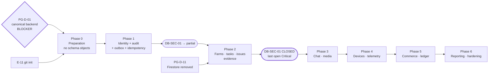

# PostgreSQL Migration Strategy — AgriTasks

**Document type:** Design and planning. **No migration was created or executed. No database was contacted. No tooling was installed.**
**Date:** 2026-08-27
**Status:** `DRAFT — Phase 0 authorised for planning only; no migration may be authored until PG-D-01 is decided`
**Companion documents:** [POSTGRESQL_TARGET_ARCHITECTURE.md](POSTGRESQL_TARGET_ARCHITECTURE.md) · [POSTGRESQL_SCHEMA_BLUEPRINT.md](POSTGRESQL_SCHEMA_BLUEPRINT.md) · [POSTGRESQL_SECURITY_MODEL.md](POSTGRESQL_SECURITY_MODEL.md) · [POSTGRESQL_OPEN_DECISIONS.md](POSTGRESQL_OPEN_DECISIONS.md)

---

## 1. The premise that shapes this entire strategy

**There is no data to migrate.**

| Fact | Evidence |
|---|---|
| No PostgreSQL driver in either backend | [webapp/server-node/package.json](../webapp/server-node/package.json) — 4 runtime deps, none of them a driver; [webapp/server-rust/Cargo.toml](../webapp/server-rust/Cargo.toml) — no `sqlx`/`diesel`/`tokio-postgres` |
| `db/schema.sql` has never been executed | No code path opens a connection; `schema:apply` shells to external `psql` |
| All state is process-memory | 38 collections in `store.ts` + `credentials` + `entries[]` in `farmsFinance.ts` |
| All state is demo seed data | `seed()` reconstructs it at every import |
| Restart destroys everything | Finding `DB-SEC-01`, `Critical`, open |

**Therefore this is not a database migration. It is a greenfield persistence
build.** The strategy that follows is deliberately shaped around that:

- The "data transition" problem (§5) is small, and mostly consists of *deciding
  not to preserve demo fixtures*.
- The hard problems are **schema correctness, tenant isolation, and test
  conversion** — 153 Node tests currently pass against Maps and will need to pass
  against a real database.
- **`db/schema.sql` is superseded, not evolved.** Attempting to `ALTER` a file
  that was never run, to preserve compatibility with data that does not exist,
  would be ceremony.

> **This is the one genuinely fortunate aspect of `DB-SEC-01`.** The platform has
> no persistence, which is a `Critical` defect — but it also means no legacy
> schema, no production data, and no backward-compatibility debt. The window to
> get the schema right is open **now** and closes permanently on the first
> production write.

---

## 2. Tooling

### 2.1 Selection

Assessed against: runs in the canonical runtime (`PG-D-01`); plain SQL supported;
transactional; no schema-diff inference; small dependency surface; CI-friendly;
no extra toolchain.

| Tool | Verdict |
|---|---|
| **`node-pg-migrate`** | **Recommended (if D-1 = Node).** Plain SQL or JS migrations; each runs in a transaction; explicit up/down; no introspection magic; installs as a dev dependency; no extra runtime |
| Flyway | Strong and battle-tested, but requires a **JVM or a separate binary** in every CI image and on every developer machine. Rejected on toolchain cost, not quality |
| Atlas | Excellent declarative diffing — and that is the objection. A tool that *computes* the migration hides the destructive step. For a first schema written by a team new to PostgreSQL, the migration must be reviewable as SQL |
| Sqitch | Dependency-graph model is powerful and unfamiliar; Perl toolchain |
| Prisma Migrate | Couples schema authorship to Prisma's DSL and pulls in a large client. The repo has no ORM and gains nothing by acquiring one here |
| Drizzle Kit | Lighter than Prisma, still schema-in-TypeScript. Viable second choice if the team prefers typed schema authorship |
| `sqlx migrate` / `refinery` | The right answer **only if D-1 = Rust is canonical** |
| Hand-rolled runner | Rejected. Version tracking, advisory locking, and checksum verification are exactly the things one gets wrong |

**Recommendation: `node-pg-migrate` with SQL-first migrations**, plus the `pg`
driver as the first runtime dependency. Rationale in one line: it adds the least
to a repository that currently has four runtime dependencies, and it keeps every
schema change reviewable as literal SQL in a pull request.

**Contingent on `PG-D-01`.** If the Rust trail is retained *and* made canonical,
substitute `sqlx migrate` and this section is rewritten.

### 2.2 Rules of use

1. **One owner.** Only the canonical backend runs migrations. Never both.
2. **Migrations run as `agritasks_owner`; the application connects as
   `agritasks_app`.** Separate credentials. This is what makes
   `FORCE ROW LEVEL SECURITY` meaningful — see the security model §4.2.
3. **Forward-only in production.** See §2.4.
4. **Each migration is transactional.** Exceptions — `CREATE INDEX CONCURRENTLY`
   cannot run in a transaction — are isolated into their own migration and
   labelled.
5. **Advisory lock** during migration so two deploying instances cannot race.
6. **Checksums verified.** An applied migration that changed on disk fails the
   deploy rather than being silently re-applied.
7. **Migrations run before the new application version starts**, never lazily on
   first request.

### 2.3 Naming and identifier standards

| Object | Convention | Example |
|---|---|---|
| Migration file | `NNNN_snake_case_verb.sql`, zero-padded, monotonic | `0004_add_task_events.sql` |
| Table | `snake_case`, **plural** | `farm_members` |
| Column | `snake_case`, singular | `organization_id` |
| Primary key | `id uuid` | — |
| Foreign key column | `<referenced_singular>_id` | `farm_id` |
| Timestamp | `<verb>_at`, always `timestamptz` | `created_at`, `revoked_at` |
| Boolean | `is_` / `has_` prefix; **`NOT NULL` with a default** | `is_active` |
| Money | `amount_minor` + `currency` — never a currency-named column | — |
| Quantity | unit suffix | `volume_m3`, `energy_wh` |
| Index | `ix_<table>_<cols>[_partial]` | `ix_tasks_farm_created` |
| Unique index | `ux_<table>_<cols>` | `ux_users_email` |
| Check constraint | `ck_<table>_<rule>` | `ck_tasks_status_valid` |
| Foreign key | `fk_<table>_<referenced>` | `fk_tasks_farm` |
| RLS policy | `<table>_<audience>_<verb>` | `tasks_tenant_read` |
| Enum values | `lower_snake`, matching the TypeScript union **exactly** | `in_progress` |

**The last row is a real hazard.** `types.ts` uses `in_progress`,
`end_of_life_recommended`, `pending_verification`. Any drift between the union
and the `CHECK` constraint produces a runtime failure that no typecheck catches.
A generated test that asserts every TypeScript union member is accepted by its
column's constraint — and that no other value is — is mandatory in Phase 1.

### 2.4 Down migrations — policy

**Production: forward-fix only. No `down` is ever executed against production.**

Reasoning: a `down` that drops a column destroys data. That is not a rollback; it
is a second, less-tested destructive migration executed under incident pressure.
The safe reversal of a bad schema change is a **new forward migration**.

**Development and CI: `down` is required** and tested, because it makes local
branch-switching workable and proves the author understood what the migration
did.

**All schema change follows expand/contract:**

| Step | Release |
|---|---|
| Expand — add nullable column / new table; deploy code that writes both | N |
| Backfill — batched, resumable, idempotent | N |
| Switch — code reads the new shape | N+1 |
| Contract — `NOT NULL`, drop the old column | **N+2, never earlier** |

Contracting in the same release as expanding removes the ability to roll back the
application, which is the rollback that actually gets used.

### 2.5 Local and CI PostgreSQL

| Environment | Mechanism |
|---|---|
| Local | Docker Compose service, version pinned to production's exact minor version |
| CI | Service container, same pinned version |
| Integration tests | Testcontainers, or a per-job database with a per-worker schema |
| Isolation | **Every test gets a transaction rolled back at teardown**, or a fresh template-database clone. Never a shared mutable database |
| Seeding | Explicit fixture builders per test. **Never `store.ts`'s `seed()`** |
| Version pinning | Exact. "PostgreSQL 16-ish" in CI and 17 in production is how a migration passes CI and fails deploy |

**Phase 0 blocker.** `seed()` in `store.ts` is **not** behind `allowDemoSeed()` —
only credential seeding is. A database-backed build that imports `store.ts`
unchanged writes demo farms, tasks, issues, devices, a subscription, and 48 hours
of telemetry into whatever database it is pointed at. Gating all seeding behind
an explicit environment check is a **precondition for connecting any real
database**, and a test must assert that a production-like environment seeds
nothing.

---

## 3. Phase plan

Each phase is independently deployable and independently valuable. No phase
begins before its predecessor's exit criteria are met and evidenced.

### Phase 0 — Preparation

**No schema objects created.**

| # | Work | Exit criterion |
|---|---|---|
| 0.1 | Resolve `PG-D-01` (canonical backend) | Written decision |
| 0.2 | Resolve `PG-D-02` (hosting/version) and `PG-D-04` (pooling mode) | Written decisions |
| 0.3 | Inventory entities and contracts | Done — architecture §1.2, §1.4 |
| 0.4 | **Freeze schema divergence:** mark `db/schema.sql` superseded; forbid edits | File marked; reviewers briefed |
| 0.5 | Adopt tooling; add `pg` + migration tool | `npm run migrate` exists and is a no-op |
| 0.6 | Adopt naming standards (§2.3) | Documented; lint rule if practical |
| 0.7 | Local + CI PostgreSQL, version-pinned | CI job connects and reports version |
| 0.8 | **Gate all seeding** behind an explicit env check | Test: production-like env seeds nothing |
| 0.9 | Author the OpenAPI document **if** D-1 = retain both | Contract tests green on both trails |
| 0.10 | `git init` at the repository root (**E-11**) | `git log` returns a commit |

**0.10 is not optional.** There is no root git repository. A migration series with
no version control has no review, no attribution, and no revert. Authoring
migrations before this is the reverse of the correct order.

### Phase 1 — Security and identity foundation

Tables: `organizations`, `users`, `user_credentials`, `identities`, `sessions`,
`roles`, `permissions`, `role_permissions`, `user_personas`, `audit_events`,
`idempotency_records`, `outbox`, `feature_flags`.

| # | Work | Exit criterion |
|---|---|---|
| 1.1 | `0001_foundation` — roles, `REVOKE ALL ON SCHEMA public FROM PUBLIC`, shared functions. **No business tables** | Applies to an empty database and is idempotent |
| 1.2 | `0002_identity` — identity tables + constraints + indexes | Constraint tests pass |
| 1.3 | RLS on all Phase 1 tables, `FORCE` enabled | Missing-filter test (security model §9, test 5) passes |
| 1.4 | Repository port + PostgreSQL adapter for identity | Both adapters pass the same suite |
| 1.5 | **Session-based revocation** replaces the 7-day unrevocable token | Revoked token rejected; suspension invalidates |
| 1.6 | Audit hash chain + expanded coverage | Verifier detects a tampered row |
| 1.7 | Port identity tests to the real database | Green in CI |
| 1.8 | Pooled-connection leak test | Passes (security model §4.1) |

**Exit gate: `DB-SEC-01` moves from `Critical/open` to `Remediated (partial)`** —
identity survives restart. It is not fully closed until Phase 2.

### Phase 2 — Core farm workflow

Tables: `farms`, `farm_members`, `farm_member_invitations`, `plots`, `areas`,
`assets`, `tasks`, `task_events`, `task_assignments`, `issues`, `issue_events`,
`comments`, `evidence`, `trees`, `tree_events`, `species_profiles`.

| # | Work | Exit criterion |
|---|---|---|
| 2.1 | Tenancy tables with composite FK `(organization_id, farm_id)` | Cross-org insert rejected **by the database** |
| 2.2 | Workflow tables, `NOT NULL` state + `CHECK` matching the TS unions | Union/constraint parity test passes |
| 2.3 | Append-only `task_events`, `issue_events` | `UPDATE`/`DELETE` fails as `agritasks_app` |
| 2.4 | `version` columns + optimistic concurrency | Concurrent transition test yields one `409` |
| 2.5 | RLS across all farm-scoped tables | All 13 isolation tests pass per table |
| 2.6 | Membership management API (`BL-17`) | Create/change/revoke, each audited |
| 2.7 | Migrate the remaining 153 tests | Green against PostgreSQL |

**Exit gate: `DB-SEC-01` closed.** This is the phase that removes the last open
`Critical`.

### Phase 3 — Communication and media

Tables: `conversations`, `conversation_members`, `messages`,
`message_translations`, `message_reactions`, `media_objects`,
`media_access_grants`, `videos`, `video_annotations`, `notifications`,
`notification_channels`.

| # | Work | Exit criterion |
|---|---|---|
| 3.1 | `memberIds[]` → `conversation_members` table | `assertMember` reads the table; non-member denied |
| 3.2 | `translations` JSONB → `message_translations` with provenance | Cache hit avoids a provider call |
| 3.3 | `media_objects` + object storage; `/uploads/*` retired | No local-disk read path in production config |
| 3.4 | Signed-URL reads after authorization | Unauthenticated signed-URL request fails |
| 3.5 | Evidence metadata rows (`BL-13`) | Every upload produces a tenanted row |
| 3.6 | EXIF/GPS stripping at ingest | Test asserts stripped output |

### Phase 4 — Devices and telemetry

Tables: `devices`, `device_credentials`, `telemetry` (partitioned),
`telemetry_hourly`, `telemetry_daily`, `valve_commands`, `water_tariffs`,
`solar_panels`, `panel_daily_reports`, `weather_samples`, `schedules`,
`robots`\*, `robot_missions`\*  (\* pending `PG-D-09`).

| # | Work | Exit criterion |
|---|---|---|
| 4.1 | Partitioned `telemetry`; automated partition creation | Future partitions exist; a missing one alerts |
| 4.2 | Per-device credentials, rotatable | Revoked device rejected at ingest |
| 4.3 | Ingest worker with `agritasks_ingest` role | Worker cannot read `messages` — asserted |
| 4.4 | Idempotent ingest | Replayed batch inserts no duplicates |
| 4.5 | Retention by partition drop | Retention test passes |
| 4.6 | `valve_commands` idempotency + audit | Replayed command actuates once |
| 4.7 | Daily aggregates in **farm-local** time | Timezone test (blueprint §2.8) passes |

### Phase 5 — Commercial domain

Tables: `plans`, `plan_features`, `subscriptions`, `entitlements`, `payments`,
`refunds`, `payouts`, `invoices`, `invoice_lines`, `ledger_entries`,
`expert_profiles`, `expert_qualifications`, `consultations`,
`consultation_responses`, `consultation_escrows`, learning tables.

| # | Work | Exit criterion |
|---|---|---|
| 5.1 | **`entries[]` deleted** from `farmsFinance.ts`; `ledger_entries` table | No state remains in any route file |
| 5.2 | Integer minor units + `currency` everywhere (`SEC-M14`) | No float money column exists |
| 5.3 | Financial immutability: `REVOKE DELETE`; corrections are compensating rows | Delete attempt fails |
| 5.4 | Payment/refund invariants | Refund total ≤ payment enforced by `CHECK` |
| 5.5 | Idempotency on all payment writes | Replay returns the original response |
| 5.6 | Expert aggregates → materialised view | Stored counters removed |
| 5.7 | Invoice numbering per `PG-D-10` | Gapless test, or the requirement formally waived |

### Phase 6 — Reporting and hardening

| # | Work | Exit criterion |
|---|---|---|
| 6.1 | Materialised views with tenancy keys and their own RLS | Cross-tenant view read returns nothing |
| 6.2 | Reporting indexes from measured plans | No sequential scan on a tenanted list query |
| 6.3 | Partition maintenance automation | Runbook + alert |
| 6.4 | Retention jobs | Evidenced execution |
| 6.5 | **Rehearsed restore** (`Q25`) | Timed rehearsal recorded; RTO/RPO stated |
| 6.6 | RLS verification sweep — every tenanted table has `FORCE` and ≥1 policy | Automated CI assertion |
| 6.7 | Performance tests at projected volume | Documented baselines |
| 6.8 | External append-only audit shipping | Chain verified off-host |
| 6.9 | **Drop `legacy_id` columns** | Absent from `information_schema` |

### Diagram — migration phases (PROPOSED)



---

## 4. Data transition

### 4.1 Inventory and export format

Scope is small because the source is demo data. For each of the 40 stores:
collection name, target table, row count, and a decision — **preserve**,
**regenerate**, or **discard**.

Export format: **newline-delimited JSON, one file per collection**, plus a
manifest with counts and a SHA-256 per file. NDJSON because it streams, diffs,
and is trivially validated line by line.

**Default decision: regenerate.** Demo fixtures should be rewritten as
UUIDv7-keyed test fixtures, not transformed. Preservation is justified only for a
running demo instance whose state someone specifically wants — and that claim
should be challenged before it is accommodated.

### 4.2 Validation

Before any import: schema-validate every record against the target contract;
range-check numerics and coordinates; verify enum values against the `CHECK`
lists; verify every timestamp converts to a valid `timestamptz`; verify every
foreign reference resolves. **Fail the whole import on the first violation** —
partial imports create referential debris that is harder to diagnose than a
clean failure.

### 4.3 Deduplication

Known duplicate risks in current data: `credentials` is keyed by lower-cased
email but `users.email` is not normalised, so two users could differ only by case;
`farm_members` has no uniqueness on `(farm_id, user_id)`; `plan_features` is
keyed by a composite string. Each is resolved **before** import, and the
resolution is recorded — never resolved silently by the importer.

### 4.4 Identifier mapping

```
u-owner  → 0192f1a0-…   (users)
f-1      → 0192f1a1-…   (farms)
t-1      → 0192f1a2-…   (tasks)
id-101   → 0192f1a3-…   (varies — sequence is not namespaced by type)
```

Mapping is generated once, persisted as a file, applied to **all** references in
one pass, and written to `legacy_id` (blueprint §2.2). `id-101` is the awkward
case: the counter is shared across collections, so the mapping must be built from
the store dump rather than inferred from the prefix.

`legacy_id` is dropped in Phase 6.9. It is a transition aid with an expiry date.

### 4.5 Referential-integrity checks

Run **before** import against the export, and **after** import against the
database:

- Every `farm_id` resolves to a farm in the same organization
- Every `user_id` in `farm_members` resolves
- Every `conversation_members` entry resolves to both a conversation and a user
- Every `task_id` on an issue resolves or is null
- Every ledger entry's farm resolves
- No orphaned event rows
- Row counts match the manifest exactly

### 4.6 Dry runs

Minimum three, into a disposable database, each recording: duration, row counts
per table, constraint violations, and the reconciliation report. **A dry run that
was not reconciled did not happen.** The final dry run must use the same tooling
and the same commands as the cutover — not an approximation.

### 4.7 Dual-write — **NOT RECOMMENDED**

The task requires the risks to be addressed rather than the option waved away.

| Risk | Detail |
|---|---|
| Consistency | Two stores, two failure modes. A write succeeding in memory and failing in PostgreSQL leaves divergence with **no reconciliation point**, because the in-memory store has no log |
| Ordering | Concurrent writes can land in a different order in each store, so the two disagree even with no failure |
| Rollback | Rolling back to memory-of-record after PostgreSQL has served writes discards those writes. Rolling forward requires a reconciliation the memory store cannot support |
| Cost | The application must handle both stores everywhere, for the whole transition |
| **Benefit** | **Zero here.** Dual-write exists to protect *live production data* during a cutover. **There is no production data** |

**Recommendation: single cutover, no dual-write.** The justification is
specifically that §1's premise holds. If a production deployment with real data
occurs before Phase 2 completes, this decision must be revisited — and the
correct answer then is still not dual-write, but a maintenance window.

### 4.8 Cutover

1. Announce a maintenance window (demo scale: minutes).
2. Stop the application. **No writes accepted.**
3. Export, validate, reconcile (§4.1–§4.5).
4. Run migrations as `agritasks_owner`.
5. Import as a dedicated loader role. Verify counts and the audit chain seed.
6. Start the application configured for PostgreSQL, connecting as
   `agritasks_app`.
7. Smoke-test the authorised path, the cross-tenant denial, and one write.
8. **Verify RLS is active** — a `SELECT` with no context must fail.
9. Keep the export artefact for the retention period.

### 4.9 Rollback

| Trigger | Action |
|---|---|
| Migration fails mid-way | Transaction rolls back; fix forward; re-run |
| Import validation fails | Abort; nothing imported; investigate |
| Post-cutover defect, **no writes taken** | Revert the application; PostgreSQL is discarded; no data lost |
| Post-cutover defect, **writes taken** | **Do not revert to in-memory** — those writes would be lost. Fix forward, or PITR to a point after cutover |

The rollback window closes at the first production write. That must be stated in
the cutover plan so the decision point is explicit rather than discovered.

### 4.10 Retention and evidence preservation

| Item | Retention |
|---|---|
| Export artefacts + manifest | 90 days, encrypted, access-logged |
| Identifier mapping | Until `legacy_id` is dropped (Phase 6.9) |
| Dry-run reports | Permanently — they are the evidence the cutover was rehearsed |
| Cutover log | Permanently |
| `audit_events` | Per legal policy — `PG-D-12`. **Never truncated for space** |
| Media objects | `retention_until` per object; deletion writes an audit row |

Demo fixtures containing anything resembling personal data are **not** carried
into a production database. The four seeded accounts are demo credentials and
must not exist in production — which `allowDemoSeed()` already handles for
credentials and does not handle for domain data (§2.5).

---

## 5. Testing strategy

Every category is mandatory. A phase does not exit until its rows are green.

| # | Category | Requirement | Phase |
|---|---|---|---|
| 1 | Migration-up | Every migration applies cleanly to an **empty** database, in order | 0+ |
| 2 | Migration-down | `down` tested in CI; **never run in production** (§2.4) | 0+ |
| 3 | Empty-database | Full suite passes with zero seed rows | 1 |
| 4 | Upgrade-from-previous | Applying only new migrations to the prior release's schema succeeds | 1+ |
| 5 | Constraint | Every `CHECK`, `UNIQUE`, `NOT NULL`, FK rejects its violation. **Includes TS-union ↔ `CHECK` parity** (§2.3) | 1+ |
| 6 | Transaction rollback | A failed multi-step operation leaves **no** partial state — task event without task, ledger entry without audit | 2+ |
| 7 | Tenant isolation | All 13 tests in the security model §9, per tenanted table | 1+ |
| 8 | RLS | Missing-filter test; `FORCE` present; pooled-connection leak test; no-context query raises | 1+ |
| 9 | Backup and restore | Rehearsed restore; post-restore RLS and audit-chain verification | 6 |
| 10 | Seed-data safety | Production-like environment seeds **nothing** | **0 — blocking** |
| 11 | Performance | Projected-volume baselines; no sequential scan on tenanted list queries | 6 |
| 12 | Telemetry retention | Partition drop removes the window and only that window | 4 |
| 13 | Payment consistency | Refund ≤ payment; idempotent replay; subscription state matches ledger | 5 |
| 14 | Audit immutability | `UPDATE`/`DELETE` fails; hash chain detects tampering | 1+ |
| 15 | Node/Rust contract | Only if D-1 = retain. Both trails satisfy the same OpenAPI document | 0 |
| 16 | Mobile/web regression | Existing client flows unchanged across cutover | 2+ |
| 17 | Logging redaction | No class C, P, F, or S value in any log or error body | 1+ |
| 18 | Concurrency | Optimistic-concurrency conflict yields exactly one `409` | 2+ |

**Test-conversion reality.** 153 Node tests pass against Maps today. Converting
them is the largest single labour item in Phases 1–2, and it is where the
schedule will slip if it is not planned as work. Two rules keep it tractable: the
in-memory adapter must raise the **same typed errors** as the PostgreSQL adapter
for constraint violations, and every test must own its fixtures rather than
depending on `seed()`.

---

## 6. First safe migration

**`0001_foundation`** — and deliberately not more.

Contents: create the `agritasks_*` roles; `REVOKE ALL ON SCHEMA public FROM
PUBLIC`; create the shared `set_updated_at()` trigger function and the audit-hash
helper; create the migration-history table (tool-owned). **No business table, no
tenant data, nothing product-specific.**

Why this is the right first step:

- It is **reversible with zero data impact** — nothing stores anything yet
- It establishes the owner/application role split that every later RLS policy
  depends on. Retrofitting that split after tables exist means re-granting
  everything
- It proves the whole pipeline end to end — connection, credentials, tooling,
  CI, deploy ordering — while the blast radius is nil
- It does not require `PG-D-03`, `PG-D-07`, or any uncertain product decision

**`0002_identity`** follows and is the first migration with real consequences. It
must not be authored until `PG-D-01`, `PG-D-02`, `PG-D-03`, and `PG-D-04` are all
answered.

---

## 7. Conditions required before any migration is authored

| # | Condition | Status |
|---|---|---|
| 1 | `PG-D-01` canonical backend decided | **NOT MET — blocker** |
| 2 | `PG-D-02` hosting and PostgreSQL version decided | Not met |
| 3 | `PG-D-03` organization ↔ farm cardinality decided | Not met |
| 4 | `PG-D-04` pooling mode decided and verified | Not met |
| 5 | `E-11` git initialised at the root | **Not met** |
| 6 | Seeding gated behind an explicit environment check | Not met |
| 7 | `db/schema.sql` formally marked superseded | Not met |
| 8 | Migration tooling adopted; `pg` added | Not met |
| 9 | Version-pinned PostgreSQL in CI | Not met |
| 10 | Implementation explicitly authorised by the caller | **Not granted — this is a design task** |

**Ten conditions, none currently met.** That is the accurate status, and it is
why this document set stops at design.
