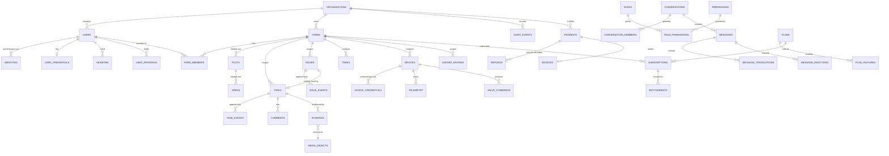

# PostgreSQL Schema Blueprint — FarmMarshal

**Document type:** Design and planning. **No executable DDL.**
**Date:** 2026-08-27
**Status:** `DRAFT — NOT A FINAL SCHEMA`
**Companion documents:** [POSTGRESQL_TARGET_ARCHITECTURE.md](POSTGRESQL_TARGET_ARCHITECTURE.md) · [POSTGRESQL_SECURITY_MODEL.md](POSTGRESQL_SECURITY_MODEL.md) · [POSTGRESQL_MIGRATION_STRATEGY.md](POSTGRESQL_MIGRATION_STRATEGY.md) · [POSTGRESQL_OPEN_DECISIONS.md](POSTGRESQL_OPEN_DECISIONS.md)

> **This is a blueprint, not a schema.** SQL fragments below are **illustrative
> patterns**, shown to make a rule concrete. They are not migration files, they
> have not been executed, and they must not be copied into a migration without
> the open decisions in
> [POSTGRESQL_OPEN_DECISIONS.md](POSTGRESQL_OPEN_DECISIONS.md) being resolved
> first. Every table carrying an **Uncertain** marker is explicitly out of scope
> for a first migration.
>
> **This blueprint supersedes** [webapp/server-node/db/schema.sql](../webapp/server-node/db/schema.sql).
> That file has never been executed and no data depends on it — see the target
> architecture §1.1. It should be deleted, not amended.

---

## 1. Source of truth for this model

| Input | Weight | Why |
|---|---|---|
| [webapp/server-node/src/types.ts](../webapp/server-node/src/types.ts) — 52 models | **Normative** | Largest model; corrected during Wave 0; 153 passing tests behind it |
| [webapp/server-node/src/store.ts](../webapp/server-node/src/store.ts) — 38 collections | **Normative** for cardinality and access patterns | The actual live shape |
| [webapp/server-rust/src/types.rs](../webapp/server-rust/src/types.rs) — 33 models | Advisory | Diverged; missing `payments`, `reactions`, `weather`, `verifications` |
| Web (6 models) and mobile (4 models) | Advisory | Far too small to be a contract |
| `db/schema.sql` — 13 tables | **Rejected as a base** | Never executed; covers 12 of 40 stores; carries defects `SCH-01`…`SCH-15` |
| `docs/V2_REQUIREMENTS_ANALYSIS.md`, `docs/SUBSCRIPTION_AND_PAYMENTS_DESIGN.md`, `docs/ROBOT_INTEGRATION_SPEC.md` | Requirement source | Cited per domain below |

**Coverage target.** 40 in-memory stores + entities required by the task but
absent from code entirely (organizations, identities, sessions, permissions,
plots, areas, assets, task events, refunds, payouts, invoices, notifications,
reports, idempotency, outbox, device credentials, robot missions). The blueprint
below defines **75 tables across 10 domains** (§3.1–§3.10), of which **40 fall in
the first three phases** and the remainder are staged or marked uncertain.

---

## 2. Global design rules

### 2.1 Identifier strategy

**Decision: application-generated UUIDv7, stored as `uuid`.**

| Candidate | Verdict |
|---|---|
| `uuid_generate_v4()` via `uuid-ossp` (what `schema.sql` line 7 requests) | **Rejected.** Random v4 scatters B-tree inserts across the index, causing avoidable page splits and WAL amplification on every high-insert table. Also forces a round-trip to learn the id, which breaks client-side idempotency keys |
| `bigserial` | **Rejected.** Sequential integers are enumerable across tenants, and expose row counts — a real disclosure risk in a multi-tenant product |
| ULID as `text` | **Rejected.** 26-byte text vs 16-byte binary; loses `uuid` type checking |
| **UUIDv7, generated in the application** | **Selected.** Time-ordered — near-append-only index behaviour; 16 bytes; not enumerable; **known before insert**, which is what makes idempotency, outbox correlation, and client-generated ids possible |
| `uuidv7()` built into PostgreSQL 18 | **Deferred option.** Adopt only if the hosting decision (`PG-D-02`) guarantees ≥18. Application generation stays version-independent |

Rules:

- Column: `id uuid PRIMARY KEY` — **no default**. The application always supplies it.
- **No extension required.** Removing `uuid-ossp` and `timescaledb` removes both
  extension dependencies from the schema, widening the set of viable managed
  hosts.

### 2.2 Treatment of existing identifiers (`u-owner`, `t-1`, `f-1`, `id-101`)

Six incompatible formats exist today (target architecture §1.3). **None is a
UUID.** Three options were considered:

| Option | Assessment |
|---|---|
| Store ids as `text` to preserve them | **Rejected.** Permanently forfeits type safety and index efficiency to accommodate demo fixtures |
| Rewrite seeds to use UUIDs; drop the old ids | **Preferred where possible** |
| Keep a `legacy_id` mapping column | **Selected as the safety net** |

**Rule.** Every table migrated from an in-memory collection carries:

```sql
legacy_id text UNIQUE   -- nullable; populated only for pre-migration fixtures
```

Rationale: the mapping is needed *during* transition to rewrite foreign
references (`t-1` → its UUID) and to make reconciliation checkable. It is
nullable, so new rows never use it.

**Deletion is planned, not perpetual.** `legacy_id` is dropped at the end of
Phase 6, after reconciliation passes. If it survives to production it becomes a
second identity namespace — precisely the problem it was introduced to end. This
deletion is a tracked exit criterion, not a hope.

> **The honest framing.** Because no schema has ever run, the "legacy data" is
> demo seed data. The most defensible action is to **rewrite the seed fixtures
> with UUIDv7 constants** and skip identifier mapping altogether. `legacy_id`
> exists for the case where a running demo instance holds state someone wants to
> keep. That case should be challenged before it is accommodated.

### 2.3 Tenant keys

Two tenancy roots, not one. **`organizations` does not exist in the code today**
and is introduced here.

| Level | Key | Applies to |
|---|---|---|
| Organization | `organization_id uuid NOT NULL` | Billing, subscriptions, users' home org, admin scope |
| Farm | `farm_id uuid NOT NULL` | Operational data — tasks, issues, devices, trees, finance |

**Rule: farm-scoped tables carry BOTH keys**, and the pair is enforced:

```sql
-- on farms: a key the children can point at
UNIQUE (organization_id, id)

-- on every farm-scoped child
organization_id uuid NOT NULL,
farm_id         uuid NOT NULL,
FOREIGN KEY (organization_id, farm_id)
    REFERENCES farms (organization_id, id) ON DELETE RESTRICT
```

Carrying `organization_id` on children is denormalisation, and it is deliberate.
It buys two things: RLS policies that filter on one indexed column without a
join, and a **database-enforced guarantee that a row cannot be attached to a farm
in another organization**. The composite foreign key is what makes the
denormalisation safe — without it, the duplicated column could drift and would be
worse than useless.

Tables that are global reference data (`plans`, `species_profiles`,
`permissions`) carry neither key and are read-only to tenants.

### 2.4 Foreign keys and referential actions

**Every referential action is explicit.** `schema.sql` omits them in most places,
which silently means `NO ACTION` (finding `SCH-06`).

| Relationship type | Action | Example |
|---|---|---|
| Child cannot outlive parent, and loss is acceptable | `ON DELETE CASCADE` | `message_reactions` → `messages` |
| Parent must not be deletable while children exist | `ON DELETE RESTRICT` | `farms` → `organizations`; anything → `farms` |
| Reference is informational | `ON DELETE SET NULL` | `issues.task_id` → `tasks` |
| **Never deletable** | No delete path at all; `REVOKE DELETE` | `audit_events`, all `*_events` tables |

Actors referenced by audit and event rows use `ON DELETE RESTRICT`, not `SET
NULL` — an audit trail that forgets who acted is not an audit trail.

### 2.5 Constraints

**Check constraints.** Every enumerated column gets one, named. Enumerations are
`text` + `CHECK`, not native `ENUM` — adding a value to a native enum is a schema
change requiring a lock, and these lists change with product requirements.

```sql
status text NOT NULL
    CONSTRAINT tasks_status_valid
    CHECK (status IN ('assigned','in_progress','submitted','approved','rejected'))
```

**Every state column is `NOT NULL`** (fixes `SCH-08`). A nullable state column
means "the state machine has a secret extra state", which no code handles.

**Unique constraints** must be partial where soft deletion applies:

```sql
CREATE UNIQUE INDEX users_email_unique
    ON users (lower(email)) WHERE deleted_at IS NULL;
```

`lower(email)` because email comparison is case-insensitive in practice — today's
`credentials` map already lower-cases keys (`store.ts` line 84 region), but the
schema does not encode it.

Other required uniqueness: `farm_members (farm_id, user_id)` where not deleted;
`message_reactions (message_id, user_id)`; `plan_features (plan_id, feature_key)`;
`trees (qr_code)`; `idempotency_records (scope, key)`;
`telemetry (device_id, time, metric_key)`.

### 2.6 Indexes and partial indexes

Rules, in priority order:

1. **Every foreign key gets an index.** PostgreSQL does not create one, and its
   absence makes parent deletes and joins scan.
2. **Every tenancy key leads a composite index**, because every authorised query
   filters on it: `(farm_id, created_at DESC)` is the default list-page shape.
3. **Partial indexes for the hot subset.** Open issues, active subscriptions,
   pending outbox, non-deleted rows — these are small slices of large tables:
   ```sql
   CREATE INDEX outbox_pending ON outbox (created_at)
       WHERE dispatched_at IS NULL;
   ```
4. **No speculative indexes.** Each one is justified by a named query. Today's
   schema has 2 indexes for 13 tables, which is far too few; the answer is not to
   over-correct to 60.

### 2.7 Soft deletion and archival

| Mechanism | Applies to | Rule |
|---|---|---|
| `deleted_at timestamptz` | User-facing mutable entities — tasks, farms, users, conversations, trees, devices | Row remains; all reads filter `deleted_at IS NULL`; enforced by RLS, not by convention |
| **Hard delete** | Join rows with no independent meaning — `message_reactions` | Cheaper than tombstoning |
| **Never deleted** | `audit_events`, all `*_events`, `payments`, `invoices` | `REVOKE DELETE` |
| Archival | `telemetry`, resolved `outbox`, expired `sessions` | Partition `DETACH` then drop, or a dated move to cold storage |

Soft deletion is not a privacy control. A subject-erasure request is satisfied by
**redaction of personal fields plus retention of the audit skeleton**, not by
`DELETE`. That policy needs a legal owner — `PG-D-12`.

### 2.8 Timestamps, UTC, and local time

**Rule: `timestamptz` everywhere. No exceptions. Always stored UTC.**

Today every timestamp in the model is `createdAt: number` — epoch milliseconds
(e.g. `types.ts` `User.createdAt`, `Task.createdAt`). At the boundary these are
converted; inside the database they are `timestamptz`.

**The local-time trap, which the current code already falls into.**
`DailyPanelReport.date` is `string // YYYY-MM-DD` (`types.ts`, P3 block) and
`WeatherSample` is bucketed by hour. A "daily" report is only meaningful in a
**farm-local** timezone, and the code has no timezone anywhere. Two consequences:

1. `farms` gains `time_zone text NOT NULL DEFAULT 'Africa/Cairo'` — an IANA name,
   validated against `pg_timezone_names`.
2. Any daily aggregate is computed as
   `(time AT TIME ZONE f.time_zone)::date`, and the local date is stored
   alongside the UTC instant when it is a business key.

Storing a bare `YYYY-MM-DD` produced from server-local time is a correctness bug
waiting for the first deployment outside Egypt.

### 2.9 Optimistic concurrency

Every mutable row carries:

```sql
version integer NOT NULL DEFAULT 1
```

Updates are `... WHERE id = $1 AND version = $2`, and a zero-row result is a
`409 Conflict`. This matters most for the state machines — a task moving
`submitted → approved` from two moderator devices must not silently double-apply,
and today's in-memory store has no protection at all.

Pessimistic `SELECT … FOR UPDATE` is reserved for finance aggregation and
consultation settlement, where a read-modify-write of monetary totals occurs.

### 2.10 Immutable history

The platform already models history correctly in shape — `issue_events`,
`tree_events` — but nothing enforces immutability. Rule:

- `*_events` and `audit_events` tables: **append-only**, enforced by
  `REVOKE UPDATE, DELETE` from every application role, not by application
  discipline.
- Corrections are **compensating rows**, never edits.
- `audit_events` additionally carries a hash chain — see
  [POSTGRESQL_SECURITY_MODEL.md](POSTGRESQL_SECURITY_MODEL.md) §6.

### 2.11 Currency and money

**Decision: integer minor units.**

```sql
amount_minor bigint  NOT NULL CHECK (amount_minor >= 0),
currency     char(3) NOT NULL CHECK (currency ~ '^[A-Z]{3}$'),
direction    text    NOT NULL CHECK (direction IN ('debit','credit'))
```

This corrects three defects at once:

| Current | Problem | Fixed by |
|---|---|---|
| `amount_egp NUMERIC(10,2)` — `schema.sql` line 136 | Currency **encoded in the column name**. Adding USD requires a schema change | Separate `currency` column |
| `NUMERIC(10,2)` | Caps at 99,999,999.99 — a real ceiling for a farm's annual ledger in EGP | `bigint` minor units |
| `amount: number` in `FinanceEntry` (`farmsFinance.ts` line 38) and `monthlyEgp: number` in `Plan` | IEEE-754 double. Money in floating point is a defect regardless of how carefully it is used | Integer |

Signed amounts are **forbidden**; direction is explicit. A `-500` expense and a
`500` credit are different facts and must not be representable two ways.
Multi-currency arithmetic across rows is forbidden without an explicit conversion
record. This is finding `SEC-M14`, open.

### 2.12 Units of measure

Every physical quantity column names its unit, and the unit is fixed:

| Quantity | Column | Unit |
|---|---|---|
| Water volume | `volume_m3` | cubic metres |
| Flow | `flow_lpm` | litres/minute |
| Energy | `energy_wh` | watt-hours (**integer**, not kWh float) |
| Power rating | `nameplate_wp` | watts-peak (integer) |
| Distance/accuracy | `accuracy_m` | metres |
| Duration | `duration_ms` | milliseconds |
| Temperature | `temp_c` | Celsius |

Current code mixes `nameplateKwp: 0.55` (float kW) with `energyKwh` — small
floats that accumulate error across aggregation. Integer base units remove the
question.

Telemetry metrics are stored as `metric_key text` + `value double precision` +
`unit text`, with an allow-list of `(metric_key, unit)` pairs in a reference
table — because sensor payloads are genuinely open-ended and a fixed column set
would be wrong within a release.

### 2.13 Geospatial representation

Per target architecture §2.8, **no PostGIS initially**:

```sql
latitude   double precision CHECK (latitude  BETWEEN  -90 AND  90),
longitude  double precision CHECK (longitude BETWEEN -180 AND 180),
CONSTRAINT coords_paired CHECK ((latitude IS NULL) = (longitude IS NULL))
```

That last constraint is not pedantry — `Task` today permits
`beforePhotoLat` without `beforePhotoLng`, producing a coordinate that cannot be
plotted. Farm `boundary` stays `jsonb` in GeoJSON form with a validity check.

### 2.14 Telemetry partitioning and retention

```sql
CREATE TABLE telemetry (
    farm_id    uuid        NOT NULL,
    device_id  uuid        NOT NULL,
    time       timestamptz NOT NULL,
    metric_key text        NOT NULL,
    value      double precision NOT NULL,
    unit       text        NOT NULL,
    PRIMARY KEY (device_id, time, metric_key)
) PARTITION BY RANGE (time);
```

- **Monthly partitions**, created ahead by a maintenance job. A missing future
  partition is an outage; creation must be scheduled and monitored.
- `farm_id` is denormalised onto every row so RLS filters without joining
  `devices` on the hottest table in the system.
- Retention: raw at full resolution for **90 days** (`PG-D-08` — needs a product
  owner), then `DETACH PARTITION` and drop, with hourly and daily aggregates
  retained long-term in separate tables.
- Deletion is by partition drop, never `DELETE FROM` — a bulk delete on the
  largest table is an availability incident.

### 2.15 Idempotency and replay control

```sql
CREATE TABLE idempotency_records (
    id              uuid PRIMARY KEY,
    scope           text NOT NULL,        -- 'POST /finances'
    key             text NOT NULL,        -- client-supplied
    organization_id uuid NOT NULL,
    request_hash    bytea NOT NULL,       -- canonicalised body digest
    response_status smallint,
    response_body   jsonb,
    created_at      timestamptz NOT NULL DEFAULT now(),
    expires_at      timestamptz NOT NULL,
    UNIQUE (scope, key, organization_id)
);
```

Semantics: same key + same `request_hash` returns the stored response; same key +
**different** hash is `409` — a client bug, not a retry. Keys are scoped by
organization so one tenant cannot probe another's key space.

The model already anticipates this: `Message.idempotencyKey` exists in
`types.ts` for the offline outbox (ADR-011), but nothing enforces it. It is
mandatory for `POST /finances`, payments, valve commands, and message send.

### 2.16 Transactional outbox

```sql
CREATE TABLE outbox (
    id              uuid PRIMARY KEY,
    organization_id uuid NOT NULL,
    aggregate_type  text NOT NULL,
    aggregate_id    uuid NOT NULL,
    event_type      text NOT NULL,
    payload         jsonb NOT NULL,
    created_at      timestamptz NOT NULL DEFAULT now(),
    dispatched_at   timestamptz,
    attempts        smallint NOT NULL DEFAULT 0,
    last_error      text
);
CREATE INDEX outbox_pending ON outbox (created_at) WHERE dispatched_at IS NULL;
```

Written **in the same transaction** as the business change. A dispatcher polls
with `FOR UPDATE SKIP LOCKED`. This is what removes provider calls — payment,
translation, push — from the request transaction (§2.4).

`payload` must contain **no personal data and no message content** — identifiers
only. The dispatcher re-reads what it needs under its own authorization. This
keeps the outbox out of scope for content redaction.

### 2.17 Sensitive-field classification, encryption, RLS, roles, backup

Defined normatively in
[POSTGRESQL_SECURITY_MODEL.md](POSTGRESQL_SECURITY_MODEL.md) §3–§8 and not
duplicated here. The blueprint's obligation is that every table below declares
its classification, which it does in the domain tables' **Sensitivity** column.

### 2.18 Reporting workloads

Materialised views only, refreshed on schedule, never in a request:
`mv_farm_finance_monthly`, `mv_water_daily`, `mv_panel_daily`,
`mv_task_throughput`. Each carries tenancy keys and is subject to the same RLS as
its sources — a materialised view that bypasses RLS is a cross-tenant leak with
extra steps.

---

## 3. Entity model by domain

**Legend.** **Phase** = migration phase (see
[POSTGRESQL_MIGRATION_STRATEGY.md](POSTGRESQL_MIGRATION_STRATEGY.md)).
**Sensitivity**: `P` personal · `F` financial · `C` content · `S` secret ·
`O` operational. **Source**: `code` = exists in the in-memory store ·
`schema` = exists in `schema.sql` · `new` = introduced here ·
**`?`** = requirements uncertain, excluded from early phases.

### 3.1 Identity and access — Phase 1

| Table | Tenancy | Purpose | Sens. | Source |
|---|---|---|---|---|
| `organizations` | root | Billing and administrative root above farms | O | **new** |
| `users` | `organization_id` | Person. `email` citext-like via `lower()` unique | **P** | code+schema |
| `user_credentials` | via user | scrypt PHC hash, `algorithm`, `updated_at`, `must_change` | **S** | code (`credentials` map) |
| `identities` | via user | External identity — `provider` (`google`), `subject`, `email_verified`. Unique `(provider, subject)` | **P** | **new** (Google login exists, unmodelled) |
| `sessions` | via user | **Enables revocation.** `token_version`, `issued_at`, `expires_at`, `revoked_at`, `revoked_reason`, `user_agent_hash`, `ip_hash` | **P** | **new** — fixes `SEC-M01` |
| `roles` | global | `owner`, `moderator`, `worker`, `admin` + expert personas | O | code (as strings) |
| `permissions` | global | `action` catalogue matching `authz.ts` | O | **new** |
| `role_permissions` | global | Role → permission grants | O | **new** |
| `user_personas` | `organization_id` | Held personas + lifecycle (`active`/`pending_verification`/`suspended`) | P | code+schema |
| `audit_events` | `organization_id` | Append-only, hash-chained. Supersedes `audit_log` | **P** | code+schema |

**Why `sessions` is Phase 1 and not later.** Authentication is stateless HMAC
with a 7-day TTL and **no revocation** — a stolen token is valid for a week and
suspension does not invalidate it. That control cannot exist without a table.
It is the highest-value single row of this blueprint.

**Why `identities` is separate from `users`.** Today a Google login and a
password login for the same address are indistinguishable in the model. Splitting
them makes account-linking explicit and prevents a provider-email change from
silently becoming an account takeover.

### 3.2 Tenancy and land — Phase 2

| Table | Tenancy | Purpose | Sens. | Source |
|---|---|---|---|---|
| `farms` | `organization_id` | Operational tenancy root. `time_zone NOT NULL` (§2.8), `boundary jsonb`, `UNIQUE (organization_id, id)` | O | code+schema |
| `farm_members` | both | Membership + `role_in_farm`. **The authorization substrate** | P | code+schema |
| `farm_member_invitations` | both | Pending invite lifecycle — fixes `BL-17` (no membership API today) | P | **new** |
| `plots` | both | Named subdivision of a farm | O | **new** |
| `areas` | both | Sub-plot zone; replaces free-text `sector`/`areaTag` | O | **new** |
| `assets` | both | Generic non-device equipment | O | **new** |
| `trees` | both | `qr_code` is the **primary business identity**; GPS is advisory | O | code |
| `tree_events` | both | Append-only tree history | O | code |
| `species_profiles` | global | Lifespan reference table | O | code |

`plots`, `areas`, and `assets` are required by the task but have **no code
counterpart**. Today's `Tree.sector`, `Video.areaTag`, and `Schedule.payload.areas`
are unvalidated free text (`'A'`, `'row-12'`). Introducing real tables is correct,
but the hierarchy depth is a product question — `PG-D-07`.

### 3.3 Work — Phase 2

| Table | Tenancy | Purpose | Sens. | Source |
|---|---|---|---|---|
| `tasks` | both | `status NOT NULL` + check; geo pair-checked; `version`; `deleted_at` | O | code+schema |
| `task_events` | both | **Append-only lifecycle trail.** Absent today — task transitions leave no record | O | **new** |
| `task_assignments` | both | Assignee/worker history rather than two mutable columns | P | **new** |
| `issues` | both | 7-stage workflow; `stage NOT NULL`; optional `task_id` `SET NULL` | O | code+schema |
| `issue_events` | both | Append-only stage transitions | O | code+schema |
| `comments` | both | Task/issue commentary. **No table exists in `schema.sql`** | **C** | code |
| `evidence` | both | Links a `media_object` to a task/issue/tree with capture geo and time | **C** | **new** — fixes `BL-13` |

`task_events` and `evidence` are the two most consequential additions here.
`/v2/evidence` accepts uploads today and **writes no metadata row at all** — the
uploaded file is unattributed and untenanted the moment it lands.

### 3.4 Communication — Phase 3

| Table | Tenancy | Purpose | Sens. | Source |
|---|---|---|---|---|
| `conversations` | `organization_id`, optional `farm_id` | `kind` ∈ direct/group/consultation | C | code |
| `conversation_members` | via conversation | **Replaces `Conversation.memberIds: string[]`** | P | code (as array) |
| `messages` | via conversation | `original_text`, `original_lang`, `idempotency_key`, `reply_to_id`, `pinned` | **C** | code |
| `message_reactions` | via message | `UNIQUE (message_id, user_id)`; hard delete | C | code |
| `message_translations` | via message | **Replaces `translations: Record<string,string>`.** `(message_id, target_lang)` unique, plus `provider`, `translated_at`, `corrected_by` | **C** | code (as JSON blob) |
| `message_deliveries` | via message | Per-recipient read/delivery state | P | **new** `?` |

**`memberIds: string[]` becoming a table is the single most security-relevant
normalisation in this document.** Membership is the check that Wave 0 added
(`assertMember`) to close `SEC-C02`. An array column cannot be indexed for that
check efficiently, cannot carry join/leave history, and cannot be referenced by
an RLS policy. Making it a table is what lets the database enforce what the
application currently enforces alone.

Splitting `translations` out of a JSONB blob likewise turns an unbounded,
un-auditable column into rows with provenance — necessary for cost control and
for the entitlement gate that `SEC-M06b` says is still missing.

### 3.5 Media — Phase 3

| Table | Tenancy | Purpose | Sens. | Source |
|---|---|---|---|---|
| `media_objects` | both | `storage_key`, `bucket`, `content_type`, `size_bytes`, `checksum_sha256`, `status` ∈ pending/ready/quarantined/deleted, `retention_until` | **C** | **new** |
| `media_access_grants` | via object | Short-lived signed-URL issuance record — who was granted what, when | P | **new** |
| `videos` | both | `status`, `hls_url`, `recorded_at`, `source_device_id` | C | code |
| `video_annotations` | via video | Time-anchored expert notes; optional `tree_id` | C | code |

Local-disk `uploads/` is a development adapter only. Every production read is
authorised then signed — see target architecture §2.5.

### 3.6 Devices and telemetry — Phase 4

| Table | Tenancy | Purpose | Sens. | Source |
|---|---|---|---|---|
| `devices` | both | `type`, `vendor`, `status`, `last_seen_at` | O | code |
| `device_credentials` | via device | **Per-device secret**, hashed, rotatable, revocable. `never_return` | **S** | **new** |
| `telemetry` | `farm_id` | Partitioned; see §2.14 | O | code (unbounded array) |
| `telemetry_hourly` / `telemetry_daily` | `farm_id` | Retained aggregates | O | **new** |
| `valve_commands` | both | `action`, **mandatory `reason`**, `requested_by`, `issued_at`, `acked_at`, `result`, `idempotency_key` | O | code |
| `water_tariffs` | both | Tiered pricing; `effective_from`; **money in minor units** | F | code |
| `solar_panels` | both | `string_id`, `nameplate_wp` (integer W) | O | code |
| `panel_daily_reports` | both | `local_date` computed in farm timezone (§2.8) | O | code |
| `weather_samples` | `farm_id` | Hourly cache | O | code |
| `robots` | both | Robot identity, separate from generic `devices` | O | **new** `?` |
| `robot_missions` | both | Mission plan, status, area refs, outputs | O | **new** `?` |
| `schedules` | both | Cron or one-off; `payload jsonb` | O | code |

`valve_commands` is safety-relevant: it moves physical infrastructure. It needs
idempotency (§2.15), an append-only ack trail, and an audit event per issuance.
Robot tables are marked uncertain — `docs/ROBOT_INTEGRATION_SPEC.md` exists but
the code has only a `robot` device type and `Schedule.kind='robot_mission'`.
`PG-D-09`.

### 3.7 Marketplace and expertise — Phase 5

| Table | Tenancy | Purpose | Sens. | Source |
|---|---|---|---|---|
| `expert_profiles` | `organization_id` | Reputation card. **Derived counters are not stored authoritatively** — see below | P | code |
| `expert_qualifications` | via expert | Credential documents, review lifecycle, expiry | **P** | code (`verifications`) |
| `consultations` | `organization_id` | Bounty, escrow state machine, scope | **F** | code |
| `consultation_responses` | via consultation | Answer, rating, commission, payout status | F | code |
| `consultation_escrows` | via consultation | **Explicit escrow ledger** | **F** | **new** |

`ExpertProfile` today stores `avgStars`, `answersCount`, `acceptanceRate`, and
`totalEarnedEgp` as mutable columns. Those are **aggregates of other tables**;
storing them authoritatively guarantees eventual disagreement with the rows they
summarise. They become a materialised view, with the table keeping only
non-derivable attributes. `totalEarnedEgp` in particular must never be a
free-floating number — it is a financial figure and belongs to the ledger.

### 3.8 Commerce — Phase 5

| Table | Tenancy | Purpose | Sens. | Source |
|---|---|---|---|---|
| `plans` | global | Catalogue; price in minor units + currency | F | code+schema |
| `plan_features` | global | `(plan_id, feature_key)` unique; `limits jsonb` | O | code+schema |
| `subscriptions` | both | `status`, period, `auto_renew`; **no overlapping active period per farm** | F | code+schema |
| `entitlements` | both | **Materialised effective entitlement** per farm — resolves plan + overrides + grace | O | **new** |
| `payments` | `organization_id` | Immutable. `amount_minor`, `currency`, `method`, `provider_ref`, `status`, `idempotency_key` | **F** | code+schema |
| `refunds` | via payment | Immutable; `CHECK` total refunds ≤ payment | **F** | **new** |
| `payouts` | `organization_id` | Expert earnings disbursement | **F** | **new** |
| `invoices` | `organization_id` | Immutable once issued; `invoice_number` gapless per org | **F** | **new** |
| `invoice_lines` | via invoice | Line items | F | **new** |
| `ledger_entries` | both | **Double-entry farm ledger.** Replaces `FinanceEntry` | **F** | code (outside the seam) |

**On `entitlements` as a table.** Entitlement is currently recomputed per request
from plan features. That is correct but makes "was this farm entitled on the day
this happened?" unanswerable — which matters for billing disputes. A
materialised entitlement row with validity bounds makes the question answerable.

**`invoice_number` gapless per organization** cannot be a `bigserial` — sequences
gap on rollback, and gapless numbering is a legal requirement in many
jurisdictions. It needs a counter row updated inside the issuing transaction.
Whether gapless numbering is actually required here is `PG-D-10`.

### 3.9 Learning — Phase 5 `?`

| Table | Purpose | Source |
|---|---|---|
| `learning_cases` | Published case with **frozen `snapshot jsonb`** | code |
| `quizzes`, `quiz_questions`, `quiz_attempts` | Assessment | code |

`QuizQuestion.answerKey` is marked *"SERVER-ONLY: never serialized to any client
payload"* in `types.ts`. A comment is not a control. It moves to a separate
`quiz_answer_keys` table that the API role **cannot** `SELECT` — only a scoring
function can. Column-level privilege, not developer memory.

Anonymisation of `learning_cases` is currently *"applied AT READ TIME"*. For
published content that is fragile — one missed read path leaks a real name.
Anonymise at publish time into the frozen snapshot. `PG-D-13`.

### 3.10 Platform services — Phase 1 and 6

| Table | Phase | Purpose | Source |
|---|---|---|---|
| `idempotency_records` | 1 | §2.15 | **new** |
| `outbox` | 1 | §2.16 | **new** |
| `notifications` | 3 | Per-user notification with read state and dedupe key | **new** |
| `notification_channels` | 3 | Push tokens — **secret-classified**, hashed at rest | **new** |
| `reports` | 6 | Generated report runs; parameters; `media_object_id` output | **new** |
| `feature_flags` | 1 | Already in `schema.sql` line 155 and in `src/flags.ts` | schema+code |
| `schema_migrations` | 0 | Owned by the migration tool | tool |

### 3.11 Diagram — TARGET (PROPOSED) high-level entity relationships

Core tenanted spine only; peripheral domains omitted for readability.



---

## 4. Correction of the existing `schema.sql`

Every `SCH` finding, and where this blueprint addresses it.

| Finding | Defect | Addressed by |
|---|---|---|
| `SCH-01` | Random v4 UUIDs, DB-generated | §2.1 — app UUIDv7 |
| `SCH-02` | Nullable tenancy keys | §2.3 — `NOT NULL` + composite FK |
| `SCH-03` | No row-level security | Security model §4 |
| `SCH-04` | No `updated_at`/`version` | §2.9 |
| `SCH-05` | `timescaledb` at line 8, unjustified | Architecture §2.9 — removed |
| `SCH-06` | Referential actions implicit | §2.4 |
| `SCH-07` | Only 2 indexes | §2.6 |
| `SCH-08` | Nullable state columns | §2.5 |
| `SCH-09` | Audit log mutable | §2.10 + security model §6 |
| `SCH-10` | No soft delete | §2.7 |
| `SCH-11` | `NUMERIC(10,2)`, currency in the column name | §2.11 |
| `SCH-12` | 12 of 40 stores covered | §3 — 68 tables |
| `SCH-13` | Timestamps unspecified/epoch | §2.8 |
| `SCH-14` | No partitioning strategy | §2.14 |
| `SCH-15` | `uuid-ossp` dependency | §2.1 — removed |

---

## 5. Explicitly unresolved

Carried to [POSTGRESQL_OPEN_DECISIONS.md](POSTGRESQL_OPEN_DECISIONS.md). **No
table marked `?` may appear in a Phase 0–3 migration.**

| Area | Decision |
|---|---|
| Organization ↔ farm cardinality | `PG-D-03` |
| Plot/area hierarchy depth | `PG-D-07` |
| Telemetry retention window | `PG-D-08` |
| Robot and mission model | `PG-D-09` |
| Gapless invoice numbering | `PG-D-10` |
| Erasure and redaction policy | `PG-D-12` |
| Anonymisation timing for learning cases | `PG-D-13` |
| Message delivery receipts | `PG-D-14` |
