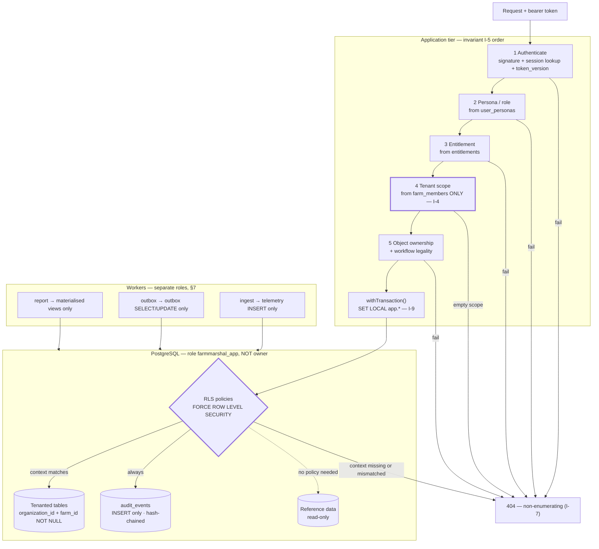

# PostgreSQL Security Model — FarmMarshal

**Document type:** Design and planning. **No executable DDL, no policy applied.**
**Date:** 2026-08-27
**Status:** `DRAFT — normative for invariants, provisional for mechanism`
**Companion documents:** [POSTGRESQL_TARGET_ARCHITECTURE.md](POSTGRESQL_TARGET_ARCHITECTURE.md) · [POSTGRESQL_SCHEMA_BLUEPRINT.md](POSTGRESQL_SCHEMA_BLUEPRINT.md) · [POSTGRESQL_MIGRATION_STRATEGY.md](POSTGRESQL_MIGRATION_STRATEGY.md) · [POSTGRESQL_OPEN_DECISIONS.md](POSTGRESQL_OPEN_DECISIONS.md)

> **§2 of this document closes precondition 2** of the design task. Until now the
> platform's authorization and tenancy invariants were *described* across three
> audit documents but stated normatively nowhere. §2 states them. Everything
> after §2 is a mechanism for enforcing them.

---

## 1. Threat model this design must survive

Derived from confirmed findings, not from imagination. Each row names a real
finding that occurred.

| # | Abuse case | Real precedent | Database-layer answer |
|---|---|---|---|
| T1 | Authenticated user reads another tenant's rows | `SEC-C02`, `SEC-C04`, `SEC-H01` — all confirmed, all shipped | RLS on every tenanted table (§4) |
| T2 | Caller supplies a tenant id and the server trusts it | `SEC-C05` — confirmed | Tenancy from verified membership only (§2, I-4); RLS re-checks |
| T3 | A single missed `WHERE` clause leaks everything | `SEC-C04` was exactly this | RLS makes the omission fail closed |
| T4 | Stolen token used for its full 7-day life | `SEC-M01`, open | `sessions` table + `token_version` (§5) |
| T5 | Insider or compromised app process reads all tenants | Not yet observed | Non-owner role, `FORCE ROW LEVEL SECURITY`, no `BYPASSRLS` (§4.4) |
| T6 | Audit trail altered to hide an action | `SCH-09`, open | Append-only + hash chain (§6) |
| T7 | Background worker over-privileged | Would be created by Phase 4 | Per-worker roles (§7) |
| T8 | Second unaudited datastore bypasses all of this | `SEC-M13` — Firestore, **live today** | Must be removed before PostgreSQL is *the* system of record |
| T9 | Backup or replica read without tenant control | Not yet applicable | Encrypted backups, restricted restore (§8) |
| T10 | Secret readable in a database dump | `SEC-C01` was a source-code instance of this class | Credentials hashed; device secrets hashed; no plaintext secret column (§3) |

**T8 deserves emphasis.** Every control in this document is void while
[mobile-app/src/config/firebase.ts](../mobile-app/src/config/firebase.ts)
initialises a parallel Firestore channel with no committed rules. A perfect RLS
implementation guarding the front door does nothing about a second door.

---

## 2. Authorization and tenancy invariants — NORMATIVE

These are the invariants the schema, the RLS policies, and the application must
all uphold. They are numbered so that tests and code comments can cite them.

### 2.1 Boundary rules

**I-1 — Two tenancy roots.** `organizations` is the billing and administrative
root. `farms` is the operational root. Every farm belongs to exactly one
organization. **No entity may reference a farm in a different organization**, and
this is enforced by the composite foreign key in schema blueprint §2.3, not by
application code.

**I-2 — Every tenanted row carries its keys.** A farm-scoped row carries both
`organization_id` and `farm_id`, both `NOT NULL`. An organization-scoped row
carries `organization_id NOT NULL`. Reference data carries neither and is
read-only to tenants. There is no third option and no nullable tenancy key.

**I-3 — Tenancy is never inferred at read time by joining upward.** The keys are
on the row. A policy that must join three tables to decide visibility will
eventually be written wrong, and will be slow while it is wrong.

### 2.2 Derivation rules

**I-4 — Tenant scope derives only from verified membership.** The set of farms a
caller may read or write is computed from `farm_members` rows plus persona, and
from nothing else. **A request body, query parameter, path segment, or header
never contributes to the scope.** It may only *narrow* an already-computed scope.

This is the invariant `SEC-C05` violated, and the Wave 0 fix —
`financeScope(actor)` in
[webapp/server-node/src/routes/farmsFinance.ts](../webapp/server-node/src/routes/farmsFinance.ts)
— is the reference implementation. Its comment states the rule exactly: *"A
caller-supplied identifier never contributes to either set."*

**I-5 — Check order is fixed.** Authentication → persona/role → entitlement →
tenant scope → object-level ownership. An earlier check never assumes a later
one. A later check never substitutes for an earlier one.

**I-6 — Deny is the default.** Absence of a policy, absence of a grant, or
absence of a membership row means denied. New tables are inaccessible until
explicitly granted.

**I-7 — Denial must not enumerate.** A forbidden resource and a nonexistent
resource are indistinguishable to the caller — `404`, not `403`, for object reads.
This was applied in Wave 0 to chat reads and is now a platform rule.

### 2.3 Administrative access

**I-8 — Cross-farm administrative access is explicit, scoped, and recorded.**
There is no ambient superuser at the application layer. Administrative reach is
represented as data:

| Mechanism | Scope |
|---|---|
| `admin` persona on `user_personas` | **Within one organization only** |
| `platform_operator` — separate table, separate approval | Cross-organization; time-bounded; reason required |

Every access exercised through either mechanism writes an `audit_events` row
**before** the data is returned. An administrative read that leaves no trace is
indistinguishable from a breach after the fact.

Today's `authz.ts` grants blanket admin at line 107 and the Rust `can()` grants it
per match arm. Neither is time-bounded, scoped, or recorded. That is acceptable
for a demo and unacceptable for a system with a real ledger.

### 2.4 The relationship between RLS and application authorization

**I-9 — RLS complements application authorization. It never replaces it.**

| RLS can | RLS cannot |
|---|---|
| Guarantee no row outside the caller's tenancy is returned, even if the query forgets a `WHERE` | Distinguish "moderator may record spend" from "accountant may only read" — that is a *verb* decision |
| Fail closed on a missed filter | Enforce workflow legality (`submitted → approved` requires a moderator) |
| Contain the blast radius of an application bug | Apply entitlement gates |
| Provide evidence of containment to an auditor | Produce a non-enumerating error |

RLS is the seat belt. Application authorization is the driving. **A design that
deletes the application checks because "the database has RLS" has misunderstood
both**, and would regress every Wave 0 fix.

**I-10 — Both layers must be independently tested.** A test that passes because
RLS caught what the application missed is a *failing* test of the application
layer, and must be written so that it can tell the difference.

---

## 3. Sensitive-field classification and encryption boundaries

### 3.1 Classification

| Class | Definition | Examples | Handling |
|---|---|---|---|
| **S — Secret** | Compromise grants access | `user_credentials.password_hash`, `device_credentials.secret_hash`, `notification_channels.push_token`, `quiz_answer_keys.answer` | Never returned by any API. Hashed where verification suffices. **Column-level `REVOKE` from roles that do not need it** |
| **P — Personal** | Identifies a person | `users.email`, `users.name`, `sessions.ip_hash`, `expert_qualifications.*` | Never logged. Subject to erasure policy (`PG-D-12`) |
| **F — Financial** | Monetary fact | `ledger_entries`, `payments`, `refunds`, `payouts`, `invoices`, `consultation_escrows` | Never logged beyond identifiers. Immutable. Reads always tenant-scoped |
| **C — Content** | User-authored | `messages.original_text`, `comments.text`, `media_objects`, `video_annotations.text` | **Never logged, ever, at any level.** Not in errors, not in outbox payloads |
| **O — Operational** | Neither | `tasks.status`, `devices.status`, `telemetry.value` | Loggable by identifier |

### 3.2 Encryption boundaries

| Boundary | Control | Note |
|---|---|---|
| In transit, client → API | TLS 1.2+ | Currently **absent** — `SEC-H06`, mobile uses cleartext HTTP |
| In transit, API → database | TLS required, certificate verified | `sslmode=verify-full`. `require` alone does not authenticate the server |
| At rest, whole database | Managed provider volume encryption | Protects lost media, not a live compromise |
| At rest, backups | Separate key from the database volume | §8 |
| At rest, object storage | Server-side encryption | |
| **Application-level column encryption** | **Not adopted initially** | See below |

**Why not column encryption now.** Encrypting `messages.original_text` or
`users.email` in the application defeats indexing, search, and case-insensitive
uniqueness — and the key must then live somewhere the application can read it,
which recreates the key-management problem the platform has already failed once
(`SEC-C01`). It is the wrong control at this maturity level.

**What is used instead.** Hashing where verification suffices (`password_hash`
already uses scrypt PHC in both trails), and privilege separation for the rest.
Revisit column encryption when a specific regulatory requirement names a specific
field — `PG-D-12`.

**Non-negotiable.** No plaintext secret column exists anywhere in the schema. The
platform has already shipped one hardcoded signing secret; a database column is
a worse place for the next one.

---

## 4. Row-level security strategy

### 4.1 Session context

The application sets the tenant context **inside the transaction**:

```sql
SET LOCAL app.user_id         = '…uuid…';
SET LOCAL app.organization_id = '…uuid…';
SET LOCAL app.farm_ids        = '…uuid,uuid…';
SET LOCAL app.is_admin        = 'false';
```

**`SET LOCAL`, not `SET`. This is the single most dangerous detail in the
document.** With connection pooling — PgBouncer, or any application pool — a
plain `SET` persists on the physical connection after the request completes. The
next request, potentially a **different tenant**, inherits it. That is a
cross-tenant data leak created by the very mechanism intended to prevent one.

Rules:
1. `SET LOCAL` only, inside an explicit transaction.
2. The `withTransaction` wrapper sets the context; **no repository sets it**.
3. A read outside a transaction is a bug, and must fail rather than default to a
   permissive context.
4. If PgBouncer is used, **transaction pooling mode**, and this must be verified
   rather than assumed — `PG-D-04`.
5. A test asserts that connection reuse across two different tenants does not
   leak context. This test is mandatory, not optional.

### 4.2 Policy shape

```sql
ALTER TABLE tasks ENABLE ROW LEVEL SECURITY;
ALTER TABLE tasks FORCE ROW LEVEL SECURITY;

CREATE POLICY tasks_tenant_read ON tasks FOR SELECT
  USING (
    deleted_at IS NULL
    AND organization_id = current_setting('app.organization_id')::uuid
    AND (
      current_setting('app.is_admin')::boolean
      OR farm_id = ANY (string_to_array(current_setting('app.farm_ids'), ',')::uuid[])
    )
  );

CREATE POLICY tasks_tenant_write ON tasks FOR INSERT
  WITH CHECK (
    organization_id = current_setting('app.organization_id')::uuid
    AND farm_id = ANY (string_to_array(current_setting('app.farm_ids'), ',')::uuid[])
  );
```

Notes that matter:

- **`FORCE ROW LEVEL SECURITY` is mandatory.** Without it, the table *owner*
  bypasses every policy. If migrations run as the owner and the application
  connects as the same role — the obvious, tempting shortcut — RLS is
  decorative. This is finding `SCH-03` and the most common way RLS
  implementations fail silently.
- **Separate `SELECT` and `INSERT`/`UPDATE` policies.** A single `FOR ALL` policy
  that permits reading also permits writing wherever the `USING` clause is true,
  which is rarely intended.
- `WITH CHECK` on writes prevents a row being *inserted* into another tenant —
  `USING` alone would not.
- `current_setting(..., true)` (missing-ok) is **forbidden**: a missing setting
  must raise, not silently evaluate to NULL and deny-or-permit ambiguously.

### 4.3 Coverage

RLS is enabled on **every table carrying `organization_id`**. Child tables
without their own tenancy key (`message_reactions`, `invoice_lines`) use an
`EXISTS` policy against the parent — acceptable because those tables are small
and always accessed by parent id.

`telemetry` carries a denormalised `farm_id` precisely so its policy needs no
join (schema blueprint §2.14).

**Materialised views do not inherit RLS from their sources.** Each reporting view
either carries tenancy keys and its own policy, or is exposed only through a
security-definer function that applies the filter. Forgetting this turns a
reporting feature into a cross-tenant disclosure.

### 4.4 What RLS explicitly does not cover

Verb-level permission, workflow legality, entitlement gating, rate limiting,
non-enumerating errors, and object-level rules that depend on request context.
All remain application concerns — invariant I-9.

---

## 5. Sessions, revocation, and token lifecycle

Current state: stateless HMAC token, 7-day TTL, **no revocation**, byte-identical
across both trails. Suspension changes a persona but does not invalidate an
issued token.

Target:

| Element | Design |
|---|---|
| `sessions` row per issued session | `token_version`, `issued_at`, `expires_at`, `revoked_at`, `revoked_reason` |
| Token payload | Carries `session_id` and `token_version` |
| Verification | Signature check **and** a session lookup; revoked or version-mismatched fails |
| Forced invalidation | Password change, suspension, role change, explicit logout — each increments `token_version` |
| Access token TTL | **Minutes**, not 7 days |
| Refresh token | Longer-lived, stored **only** in `expo-secure-store` on mobile, rotated on use, reuse-detection revokes the family |
| Cost | One indexed lookup per request. Cache with a short TTL only if measurement demands it — and a cache must fail closed on lookup error |

This addresses T4 and finding `SEC-M01`. It also removes the current situation
where the *only* remedy for a leaked token is rotating the signing secret for
every user at once.

---

## 6. Audit integrity

```sql
CREATE TABLE audit_events (
    id              uuid PRIMARY KEY,
    organization_id uuid NOT NULL,
    occurred_at     timestamptz NOT NULL DEFAULT now(),
    actor_user_id   uuid REFERENCES users(id) ON DELETE RESTRICT,
    actor_persona   text NOT NULL,
    correlation_id  uuid,
    action          text NOT NULL,
    target_type     text,
    target_id       uuid,
    outcome         text NOT NULL CHECK (outcome IN ('allowed','denied','error')),
    detail          jsonb NOT NULL DEFAULT '{}'::jsonb,
    prev_hash       bytea,
    entry_hash      bytea NOT NULL
);
```

Controls:

1. **Append-only.** `REVOKE UPDATE, DELETE ON audit_events FROM PUBLIC` and from
   every application role. Corrections are compensating rows.
2. **Hash chain.** `entry_hash = sha256(prev_hash || canonical(row))`, chained per
   organization. Tampering breaks the chain; a scheduled verifier checks it and
   alerts. This detects rather than prevents — which is the honest claim. True
   prevention requires shipping to append-only external storage, a Phase 6 item.
3. **`detail` is identifiers and outcomes only.** No message content, no finance
   amounts beyond a reference, no personal data, no tokens. Class C and S never
   appear.
4. **Denied attempts are audited**, not only successful ones. A trail of only
   successes cannot show an attack.
5. **Coverage must expand.** Today's `audit()` covers a subset. Required:
   login, failed login, logout, registration, password change, role and persona
   change, membership change, every task and issue transition, every ledger and
   payment mutation, every media upload and access grant, every valve command,
   and every administrative cross-tenant access (I-8). This is `SEC-M08`.
6. **Correlation id** links the audit row to the structured log line and to the
   HTTP request, without duplicating content between them.

---

## 7. Database roles and least privilege

**No application ever connects as the table owner or as a superuser.**

| Role | Grants | Notes |
|---|---|---|
| `farmmarshal_owner` | Owns schema objects. **DDL only** | Used **only** by migrations. `NOLOGIN` in normal operation; credential held by the deploy pipeline |
| `farmmarshal_app` | `SELECT, INSERT, UPDATE` on tenanted tables; `INSERT` only on `*_events`, `audit_events`, `outbox` | The API role. **Subject to RLS** — not the owner, no `BYPASSRLS` |
| `farmmarshal_ingest` | `INSERT` on `telemetry`; `SELECT` on `devices`, `device_credentials` | Telemetry worker. No access to users, messages, or finance |
| `farmmarshal_outbox` | `SELECT, UPDATE` on `outbox` only | Dispatcher. Cannot read business tables |
| `farmmarshal_media` | `SELECT, UPDATE` on `media_objects` | Media worker |
| `farmmarshal_report` | `SELECT` on materialised views only | Read-only, no base tables |
| `farmmarshal_backup` | Replication/backup | Not usable for queries |

Additional rules:

- **`REVOKE ALL ON SCHEMA public FROM PUBLIC`** as migration 0001. PostgreSQL's
  default `PUBLIC` grants are permissive and must be removed before any table
  exists.
- **No role has `DELETE`** on immutable tables.
- **Column-level revokes** for class S: `farmmarshal_app` cannot `SELECT`
  `quiz_answer_keys.answer`; scoring happens in a `SECURITY DEFINER` function.
- Every `SECURITY DEFINER` function sets `search_path` explicitly — omitting it is
  a privilege-escalation vector.
- **Background workers receive scoped access by role, not by convention.** The
  ingest worker cannot read a message even if its code is compromised, because
  the grant does not exist.

---

## 8. Backup, restore, and recovery

| Control | Requirement |
|---|---|
| Backup | Automated daily full + continuous WAL archiving |
| PITR window | Minimum 7 days; target 30 (`PG-D-08`) |
| Encryption | At rest, with a key **distinct** from the database volume key |
| Access | `farmmarshal_backup` only; restore requires named approval |
| **Rehearsal** | **A restore that has never been performed is not a backup.** Quarterly rehearsal into an isolated environment, timed, with the RTO/RPO achieved recorded |
| Restore target isolation | Never restored into an environment sharing credentials with production |
| Post-restore verification | Audit hash chain verified; row counts reconciled; **RLS policies confirmed present** — a restore that drops policies is a silent regression |
| Personal data in non-production | Restores into development are **masked**, never raw |

The rehearsal requirement is `Q25` and is a release gate, not an aspiration.

---

## 9. Tests that prove tenant isolation

Isolation that is not tested is isolation that is assumed. Mandatory, per
tenanted table:

| # | Test | Asserts |
|---|---|---|
| 1 | Authorized read | Member of farm A reads farm A — **positive path still works** |
| 2 | Cross-tenant read | Member of farm A reads farm B → empty/404, never partial |
| 3 | Cross-tenant write | Insert with farm B's id while scoped to A → rejected by `WITH CHECK` |
| 4 | Cross-organization | Farms in different organizations are invisible to each other |
| 5 | **Missing-filter test** | A deliberately unfiltered `SELECT * FROM tasks` under a tenant context returns **only** that tenant's rows. This is the test that proves RLS works |
| 6 | **Layer-separation test** | The application check is asserted independently, so a pass cannot be attributed to RLS alone (invariant I-10) |
| 7 | **Pooled-connection leak test** | Two sequential requests as different tenants on the same physical connection do not leak context (§4.1) |
| 8 | Anonymous | No context set → query raises, never returns rows |
| 9 | Admin scoping | Organization admin sees own org only; cross-org requires `platform_operator` and writes an audit row |
| 10 | Immutability | `UPDATE`/`DELETE` on `audit_events` and `*_events` fails as `farmmarshal_app` |
| 11 | Role separation | `farmmarshal_ingest` cannot read `messages` or `ledger_entries` |
| 12 | Enumeration | Forbidden and nonexistent ids produce byte-identical responses (I-7) |
| 13 | Redaction | No class C, P, F, or S value appears in any log line or error body |

Tests 5, 6, and 7 are the ones most often omitted, and are the ones that would
have caught the three confirmed cross-tenant findings.

---

## 10. Diagram — TARGET (PROPOSED) tenant and authorization boundaries



---

## 11. Sequencing

| Control | Earliest phase | Blocked by |
|---|---|---|
| Roles, `REVOKE PUBLIC`, `search_path` discipline | 0 | — |
| `NOT NULL` tenancy keys, composite FKs | 1 | `PG-D-03` |
| RLS on identity tables | 1 | `PG-D-04` (pooling mode) |
| `sessions` + revocation | 1 | — |
| Audit hash chain | 1 | — |
| RLS on operational tables | 2 | — |
| Column-level revokes | 2 | — |
| Media authorization + signed URLs | 3 | Object-storage provider |
| Per-device credentials | 4 | — |
| Financial immutability + `REVOKE DELETE` | 5 | `PG-D-10` |
| Backup rehearsal, external audit shipping | 6 | — |
| **Firestore channel removed (T8)** | **Before Phase 1 completes** | `PG-D-11` |
