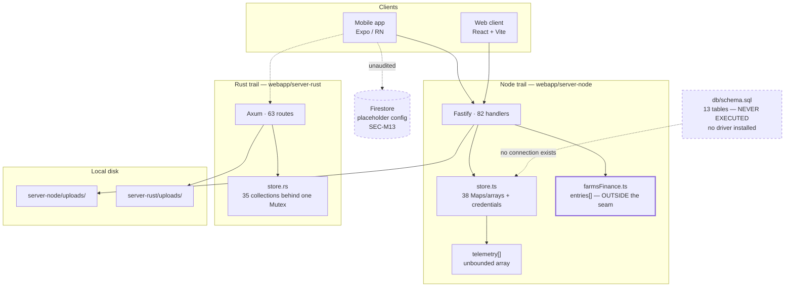
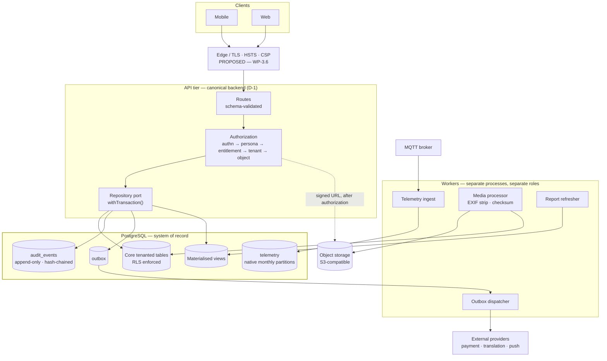
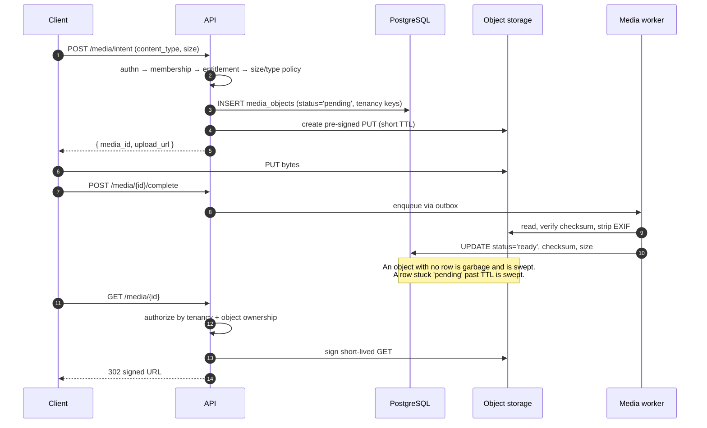
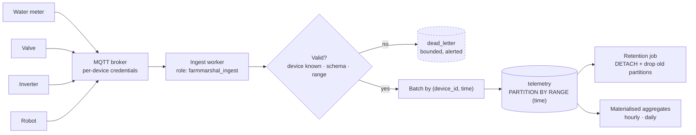

# PostgreSQL Target Architecture — FarmMarshal

**Document type:** Design and planning. **No executable artefact.**
**Date:** 2026-08-27
**Status:** `DRAFT — BLOCKED ON D-1`
**Scope:** Persistence architecture for the FarmMarshal platform.
**Companion documents:** [POSTGRESQL_SCHEMA_BLUEPRINT.md](POSTGRESQL_SCHEMA_BLUEPRINT.md) · [POSTGRESQL_SECURITY_MODEL.md](POSTGRESQL_SECURITY_MODEL.md) · [POSTGRESQL_MIGRATION_STRATEGY.md](POSTGRESQL_MIGRATION_STRATEGY.md) · [POSTGRESQL_OPEN_DECISIONS.md](POSTGRESQL_OPEN_DECISIONS.md)

> **What was done to produce this document:** every current-state claim in §1 was
> re-derived from source on 2026-08-27 by direct file reading and pattern
> counting. No database was contacted. No migration was created or executed. No
> production source, schema, dependency, or configuration file was modified.

---

## 0. Precondition assessment

The task defines four preconditions. **Two are met, one is partially met, and one
is not met.** They are recorded here rather than assumed, because one of them
blocks the entire design.

| # | Precondition | Status | Evidence |
|---|---|---|---|
| 1 | Wave 0 emergency fixes are verified | **Partially met** | 6 of 12 emergency items are done and verified (E-2, E-4, E-5, E-6, E-7). **E-1, E-8, E-9, E-10, E-11, E-12 remain outstanding** — see [CYBERSECURITY_AND_DATABASE_REMEDIATION_PLAN.md](CYBERSECURITY_AND_DATABASE_REMEDIATION_PLAN.md) §3. Node-trail authorization and tenancy fixes are verified by 153 passing tests; the Rust trail received only the secret fix. |
| 2 | Authorization and tenancy invariants are documented | **Partially met** | Invariants are *described* across three audit documents but exist in no single normative place. **This document set closes that gap** — see [POSTGRESQL_SECURITY_MODEL.md](POSTGRESQL_SECURITY_MODEL.md) §2, which states them normatively for the first time. |
| 3 | A canonical backend ownership decision exists, or is explicitly raised as a blocker | **NOT MET — raised as a blocker** | Decision **D-1** (keep one backend trail or both) is recorded as open in the remediation plan and remains undecided. See §2.1 below and `PG-D-01`. |
| 4 | Current in-memory entities and API contracts are inventoried | **Met, for entities. Partial, for contracts.** | Entity inventory completed in §1.2 of this document. Contract inventory is incomplete because **no OpenAPI document exists** (finding API-01, open). Contracts are currently defined only by TypeScript interfaces and Rust structs that have already diverged — see §1.4. |

**Consequence.** Precondition 3 is a hard blocker for *executable* migrations, not
for design. This document set therefore proposes a target and a phased plan, and
stops short of a final schema. Per the task's own restriction — *"do not generate
a final production schema where requirements are uncertain"* — every uncertain
area is deferred to [POSTGRESQL_OPEN_DECISIONS.md](POSTGRESQL_OPEN_DECISIONS.md)
rather than resolved by assumption.

---

## 1. Current state — verified 2026-08-27

### 1.1 Existing schema files, and whether any has been executed

| Question | Answer | Evidence |
|---|---|---|
| Schema files present | **One:** [webapp/server-node/db/schema.sql](../webapp/server-node/db/schema.sql) | Only file matching `db/*.sql` |
| Tables declared | **13** | `CREATE TABLE` at lines 11, 20, 32, 43, 53, 72, 90, 102, 111, 120, 132, 145, 155 |
| Table names | `users`, `user_personas`, `farms`, `farm_members`, `tasks`, `issues`, `issue_events`, `plans`, `plan_features`, `subscriptions`, `payments`, `audit_log`, `feature_flags` | — |
| Extensions requested | `uuid-ossp` (line 7), `timescaledb` (line 8) | — |
| Indexes declared | **2** — `idx_issues_open` (line 88), `idx_subs_active` (line 130) | — |
| **Has it ever been executed?** | **No, and it cannot be.** | See below |
| Migration directory | **Does not exist** | No `db/migrations/` anywhere |

**Why it cannot have been executed by this codebase.** There is no PostgreSQL
driver in either backend:

- [webapp/server-node/package.json](../webapp/server-node/package.json) declares
  exactly four runtime dependencies — `@fastify/cors`, `@fastify/multipart`,
  `@fastify/websocket`, `fastify`. **No `pg`, no `postgres`, no ORM, no
  migration tool.**
- [webapp/server-rust/Cargo.toml](../webapp/server-rust/Cargo.toml) declares no
  `sqlx`, `diesel`, `tokio-postgres`, or `refinery`.

The `schema:apply` script (`package.json` line 13) shells out to `psql` — an
external binary, not a project dependency. It is a manual escape hatch, not an
integration. **The application has no code path that opens a database
connection.**

> **Design consequence, and it is the most important one in this document.**
> Because no schema has ever run, there is **no production data to migrate, no
> legacy schema to evolve, and no backward-compatibility obligation to a
> deployed database.** This is a greenfield persistence build wearing the costume
> of a migration. The correct strategy is therefore *not* an incremental
> alteration of `schema.sql`; it is to **supersede `schema.sql` entirely** with a
> migration series authored against current requirements. §1.10 explains why this
> is a fortunate accident rather than a good position.

### 1.2 In-memory stores — the actual system of record today

**Node trail** — [webapp/server-node/src/store.ts](../webapp/server-node/src/store.ts):

| Container | Collections | Line |
|---|---|---|
| `db` | 14 — `users`, `tasks`, `comments`, `ratings`, `farms`, `farmMembers`, `userPersonas`, `issues`, `issueEvents`, `plans`, `planFeatures`, `subscriptions`, `payments`, `auditLog` | 57–73 |
| `db2` | 24 — `conversations`, `messages`, `reactions`, `devices`, `telemetry`, `valveCommands`, `tariffs`, `panels`, `panelReports`, `weather`, `videos`, `annotations`, `schedules`, `trees`, `treeEvents`, `species`, `experts`, `verifications`, `consultations`, `consultationResponses`, `cases`, `quizzes`, `quizQuestions`, `attempts` | 475–499 |
| `credentials` | 1 — email → scrypt PHC hash | 84 |

**Two stores live outside the `store.ts` seam:**

| Store | Location | Why it matters |
|---|---|---|
| `entries: FinanceEntry[]` | [webapp/server-node/src/routes/farmsFinance.ts](../webapp/server-node/src/routes/farmsFinance.ts) line 56 | The financial ledger — the most integrity-sensitive data in the platform — is a module-level array in a route file. It is not reachable through the repository seam that `store.ts` claims owns "ALL data access". |
| `telemetry: Telemetry[]` | `store.ts` line 480 | An **unbounded array**, not a Map. It grows without limit for the process lifetime. |

**Total: 40 distinct stores.** Of these, **12 have a corresponding table** in
`schema.sql`. **28 have none** — including `comments` and `ratings`, which are
core original entities, and the entire finance ledger.

The header comment of `store.ts` states *"ALL data access flows through THIS
file."* **That statement is false as written**, and the exception is the ledger.
Any repository-interface work (WP-1.4) must treat this as its first correction.

**Rust trail** — [webapp/server-rust/src/store.rs](../webapp/server-rust/src/store.rs)
declares **35** collections (lines 24–61) behind a single `Mutex`.

### 1.3 Existing identifiers and identifier formats

Six mutually incompatible formats are in live use:

| Format | Example | Where generated | Evidence |
|---|---|---|---|
| Semantic role slug | `u-owner`, `u-mod`, `u-worker`, `u-admin` | Hand-written seed | `store.ts` 112–115 |
| Semantic singleton | `f-1` | Hand-written seed | `store.ts` 119–120 |
| Compound natural key | `fm-owner`, `p-{userId}-{persona}` | Seed helper | `store.ts` 134–136, 139 |
| Short type-prefixed ordinal | `t-1`, `t-2`, `is-1`, `c-1`, `sub-1`, `fe-1`…`fe-3`, `tr-1`, `tr-2`, `pl-basic` | Hand-written seed | `store.ts` 150–207; `farmsFinance.ts` 57–60 |
| Process-global counter | `id-101`, `id-102`, … | `nextId()` — `let seq = 100` | `store.ts` 54–55 |
| UUID v4 | random | Rust upload filenames only | `Cargo.toml` `uuid` v4 feature |

**Two properties of `nextId()` matter for the target design.** It is *not*
namespaced per collection, so a task and a comment draw from the same sequence;
and it is *process-local*, so two instances of the server would issue colliding
identifiers on their first write. The comment on line 54 concedes this — *"dev
only; use UUIDs in production"* — but no production path exists.

**None of the seeded identifiers is a UUID.** Every one of them would be rejected
by a `uuid` column. This is the single largest mechanical obstacle to adopting
`schema.sql` as written, and it is addressed in
[POSTGRESQL_MIGRATION_STRATEGY.md](POSTGRESQL_MIGRATION_STRATEGY.md) §4.4.

### 1.4 Models across trails — divergence is measured, not asserted

| Trail | Model file | Lines | Declared models |
|---|---|---|---|
| Node (canonical claim) | [webapp/server-node/src/types.ts](../webapp/server-node/src/types.ts) | 596 | **52** |
| Rust | [webapp/server-rust/src/types.rs](../webapp/server-rust/src/types.rs) | 510 | **33** |
| Web client | [webapp/client/src/types.ts](../webapp/client/src/types.ts) | 56 | **6** |
| Mobile | [mobile-app/src/types.ts](../mobile-app/src/types.ts) | 91 | **4** |

Collections present in the Node store but **absent from the Rust store**:
`payments`, `reactions`, `weather`, `verifications`.

The header of `types.ts` claims the model is *"Field-for-field compatible with the
mobile app's model … so the mobile migration is a transport swap, not a data
remodel."* **The mobile app declares 4 models against Node's 52.** The claim is
not sustainable, and the schema design must not inherit it as an assumption.

> **Design consequence.** There is no single agreed domain model to translate
> into DDL. The schema blueprint therefore takes the **Node model as the
> normative source** — it is the largest, the most recently corrected, and the
> only one with 153 passing tests behind it — and records every point where the
> other three trails disagree as a contract-reconciliation task rather than
> silently picking a winner.

### 1.5 API payloads, tests, seed data

| Item | State | Evidence |
|---|---|---|
| API contract document | **None.** No OpenAPI, no JSON Schema | Finding API-01, open |
| Route count | Node **82** handlers; Rust **63** route registrations | Counted 2026-08-27 |
| Runtime payload validation | Absent on most routes; `request.body as any` in use | Finding API-02, open |
| Node tests | **153 passing** — all against in-memory state | `npx vitest run` |
| Rust tests | **20 passing** — all unit; **zero HTTP-level** | `cargo test` |
| Client tests | 2 passing | — |
| Seed data | Runs **at module import**, unconditionally for domain data; credentials gated by `allowDemoSeed()` | `store.ts` 91–99, `seed()` |
| Demo credentials | 4 accounts, gated | `store.ts` 86–90 |

**Seed behaviour is a migration hazard.** Domain seeding (`seed()`) is *not*
behind `allowDemoSeed()` — only credential seeding is. A database-backed build
that imports `store.ts` unchanged would write demo farms, tasks, issues, devices,
48 hours of telemetry, and a subscription into whatever database it is pointed
at, including production. This is captured as a mandatory Phase 0 control.

### 1.6 Firestore remnants

[mobile-app/src/config/firebase.ts](../mobile-app/src/config/firebase.ts)
initialises a **second, independent persistence channel**:

- `initializeApp(firebaseConfig)` (line 46) and `getFirestore(app)` (line 59)
- Config values are placeholders — `'YOUR_API_KEY'` (line 37),
  `'YOUR_PROJECT_ID'` (line 39)
- Comment (line 11) states it backs the `users` and `tasks` collections

This is finding **SEC-M13**, open. It is material to this design because a second
system of record with **no committed security rules** would silently defeat every
row-level-security control proposed in
[POSTGRESQL_SECURITY_MODEL.md](POSTGRESQL_SECURITY_MODEL.md). It must be removed
or brought under audit before PostgreSQL can be called *the* system of record.
See `PG-D-11`.

### 1.7 Data-survival behaviour

| Event | Result |
|---|---|
| Process restart | **Total data loss.** Every Map and array is re-initialised; `seed()` re-runs |
| Process crash | Total data loss |
| Deploy | Total data loss |
| Second instance started | **Divergent state** — no shared storage; `nextId()` collides |
| Horizontal scaling | **Impossible** |
| Forensic investigation after an incident | **Impossible** — the audit log dies with the process |
| Backup | **Nothing to back up** |

This is finding **DB-SEC-01**, `Critical`, and it is the **only Critical finding
still open** across the whole register.

### 1.8 Diagram — CURRENT persistence state



---

## 2. Canonical architecture — PROPOSED TARGET

### 2.1 Canonical backend owner of migrations — **BLOCKER**

**Exactly one service must own the schema and run migrations.** This is not
negotiable in a two-trail repository: two owners means two migration histories,
two notions of "current version", and a race at deploy time.

Decision **D-1** — whether the Rust trail is retired or retained — **is not
made**. The design cannot proceed to executable migrations without it. The
downstream effects are concrete, not abstract:

| If D-1 = **retire Rust** (recommended) | If D-1 = **retain both** |
|---|---|
| Node owns migrations; tool chosen from the Node ecosystem | Node owns migrations; Rust becomes a **read-mostly consumer** with no DDL rights |
| One connection pool, one role set | Two role sets; Rust gets a strictly narrower role |
| 63 Rust routes deleted; 6 open High findings close by deletion | Those 6 findings must be *fixed*, and Rust needs `sqlx` + a compile-time-checked query layer |
| Contract tests unnecessary | OpenAPI + contract tests become **mandatory before** Phase 1 |
| Phase 1 can start immediately after Phase 0 | Phase 1 slips behind WP-1.9 |

**Recommendation: retire the Rust trail.** The evidence base for this has only
strengthened. Wave 0 fixed seven findings in Node and none of the equivalents in
Rust, so the trails are further apart now than at the audit date; the Rust trail
has zero HTTP-level tests; and six of the eight open High findings live there.
Retaining it converts a deletion into an indefinite two-implementation tax on
every subsequent phase.

**This is `PG-D-01`. Until it is answered, no migration file may be authored.**

### 2.2 Is PostgreSQL as system of record still justified?

Yes — and the justification was re-checked rather than inherited.

The weighted decision matrix in
[DATABASE_ARCHITECTURE_AUDIT.md](DATABASE_ARCHITECTURE_AUDIT.md) §6 was
**recomputed on 2026-08-27** after arithmetic errors were found in all four
totals. Corrected result:

| Option | Corrected total (max 805) |
|---|---|
| **PostgreSQL** | **690** |
| Distributed SQL | 562 |
| MongoDB | 518 |
| Firestore | 392 |

Correcting the arithmetic **widened** PostgreSQL's margin over the runner-up from
12.5 to 18.6 points, and the ranking survived both sensitivity runs. The
requirement drivers are unchanged and decisive: multi-tenant relational
integrity, financial correctness, workflow state machines, and auditability.

**PostgreSQL is confirmed.** No distributed or specialised store is justified at
the platform's current scale — see §2.8–§2.11 for the conditions that would
change that.

### 2.3 Repository interfaces

Formalise `store.ts` into an explicit port, with two adapters:

| Adapter | Purpose |
|---|---|
| `PostgresRepository` | Production and CI |
| `InMemoryRepository` | Fast unit tests only — never a deployment target |

Rules:

1. **The interface is the only import surface.** No route file may hold state.
   The finance `entries[]` array is deleted, not wrapped.
2. **One repository per aggregate**, not one per table — `TaskRepository`,
   `FinanceRepository`, `ChatRepository`.
3. **Every method takes an explicit tenant scope** derived from verified
   membership, never from a request field. This mirrors the `financeScope(actor)`
   pattern already proven in Wave 0.
4. **No raw SQL escapes a repository.** Parameterised queries only.
5. The in-memory adapter must be **behaviour-compatible for constraint
   violations** — a unique-violation must surface as the same typed error from
   both adapters, or tests will pass in memory and fail in production.

### 2.4 Transaction boundaries

| Boundary | Rule |
|---|---|
| Unit of work | **One HTTP request = at most one transaction.** Opened by a `withTransaction` wrapper, never inside a repository method |
| Isolation | `READ COMMITTED` default; **`REPEATABLE READ`** for finance aggregation and subscription state changes |
| Mandatory transactions | Task/issue stage transition + its event row; finance entry + audit row; payment + subscription state; consultation settlement + payout; outbox append + business write |
| Forbidden inside a transaction | HTTP calls to payment or translation providers, object-storage writes, notification sends. These go through the **outbox** |
| Concurrency control | `version` column, optimistic. See the blueprint §3.9 |
| Lock discipline | No `SELECT … FOR UPDATE` held across an `await` of any external I/O |

### 2.5 Object-storage boundary

**The database stores metadata. It never stores bytes.**

- `media_objects` holds `storage_key`, `bucket`, `content_type`, `size_bytes`,
  `checksum_sha256`, `status`, tenancy keys, and retention fields.
- Bytes live in S3-compatible object storage. Local disk (`uploads/`) is a
  development-only adapter.
- **Reads are authorised by the application**, then served via short-lived signed
  URLs. This replaces today's `/uploads/:name` ticket scheme with a mechanism
  that does not require the API to proxy bytes.
- A row is written **before** the upload completes, in `status='pending'`, and
  promoted to `ready` on checksum verification. Orphaned `pending` rows are
  swept. This ordering is what makes the store auditable — an object with no row
  is by definition garbage.
- EXIF/GPS stripping happens at ingest, before the object is promoted.

### 2.6 Ingestion boundary (MQTT / telemetry)

```
Device → MQTT broker → ingest worker → validate → normalise → batch INSERT → telemetry (partitioned)
```

- The **ingest worker is a separate process** with its own database role that can
  `INSERT` into telemetry and `SELECT` device credentials — and nothing else.
- Devices never hold a user token. Device credentials are separate
  (`device_credentials`), rotatable, and revocable.
- Ingest is **idempotent** on `(device_id, time, metric_key)`.
- Back-pressure is the broker's job, not the database's. If the worker cannot
  keep up, it lags; it must not buffer unboundedly in memory — which is precisely
  the failure mode of today's `telemetry: []` array.

### 2.7 Reporting boundary

Reporting reads from the **same PostgreSQL instance, via a read-only role**,
initially. Materialised views cover the known aggregates — daily panel reports,
water summaries, finance summaries. They are refreshed on a schedule, not
synchronously in the request path.

This is deliberately unambitious. See §2.11 for when it should change.

### 2.8 Conditions for PostGIS

**Not adopted initially.** Today's geospatial usage is: point storage
(`center_lat`/`center_lng`, task `lat`/`lng`, tree GPS) and a `boundary` JSONB
column. All of it is *storage*, not *query* — nothing in the codebase performs a
spatial predicate.

Adopt PostGIS when **any one** of these becomes a real requirement:

1. "Which plot contains this point?" — polygon containment
2. "Which trees are within N metres?" — radius or nearest-neighbour search
3. Farm boundary area or perimeter computed in the database
4. Robot mission paths stored as geometry and queried for intersection
5. Map tiles or geometry simplification served from the database

Until then: `latitude`/`longitude` as `double precision` with `CHECK` bounds, and
boundary as `jsonb` in GeoJSON form. Migrating to `geography(Point,4326)` later is
an additive column plus a backfill — cheap. Adopting it now is a permanent
extension dependency for zero present benefit.

### 2.9 Conditions for TimescaleDB vs native partitioning

**Start with native declarative partitioning.** `schema.sql` line 8 requests the
`timescaledb` extension today, before any telemetry table exists to justify it —
that is the tail wagging the dog, and it constrains hosting choices immediately
(several managed PostgreSQL offerings do not provide it).

Native monthly `RANGE` partitioning on `telemetry.time` handles the projected
volume comfortably: a few hundred devices at 1-minute resolution is single-digit
millions of rows per month, which is unremarkable for stock PostgreSQL with a
correct `(device_id, time DESC)` index.

Adopt TimescaleDB only when **measured** evidence shows at least one of:

1. Sustained ingest above ~50k rows/second
2. Continuous aggregates needed at a refresh cadence materialised views cannot meet
3. Native compression required to control storage cost (measured, not assumed)
4. Retention/drop-chunk management proving unmanageable with partition maintenance

**Evidence is required, not intuition.** Until then the extension is removed from
the schema. This is `PG-D-05`.

### 2.10 Conditions for Redis

**Not adopted initially.** Every current use case has a sufficient PostgreSQL
answer at this scale: rate limiting can be a table with a partial index, sessions
are a table, idempotency is a table with a unique constraint.

Adopt Redis when:

1. Rate limiting must be enforced across ≥3 API instances at a rate where a
   database round-trip per request is measurably harmful
2. A pub/sub fan-out is needed for WebSocket delivery across instances — this is
   the **most likely first trigger**, given the chat feature
3. Cache hit-rate analysis shows a specific hot read path dominating database CPU

Introducing Redis brings a second stateful system with its own security,
persistence, and failure semantics. It should be earned. `PG-D-06`.

### 2.11 Conditions for an analytics warehouse

**Not adopted initially, and unlikely for some time.** Adopt when:

1. Reporting queries measurably degrade transactional latency **after** a read
   replica has already been tried
2. Cross-tenant analytics are required — which raises a privacy question that
   must be answered *before* the engineering one
3. Retention beyond the operational window is needed for analysis
4. Non-engineering users need direct query access — which must never be against
   the transactional database

Order of escalation: materialised views → read replica → warehouse. Skipping to
step three is a common and expensive error.

### 2.12 Role of a retained Rust service

**Only relevant if D-1 = retain.** In that case the Rust service must be
constrained rather than merely tolerated:

| Constraint | Rule |
|---|---|
| Schema authority | **None.** Rust never runs DDL and never owns a migration |
| Database role | Separate, read-mostly, `NOLOGIN`-inherited, with `SELECT` plus the minimum `INSERT` its endpoints require |
| Contract | Must be generated from the same OpenAPI document as Node, with contract tests in CI |
| Scope | Best justified as a **narrow, high-throughput component** — telemetry ingest, media processing — not a duplicate CRUD API |
| Precondition | Its six open High findings are fixed **before** it is given any database credential |

If none of that is affordable, the honest answer is D-1 = retire.

### 2.13 Diagram — TARGET (PROPOSED) application-to-database flow



### 2.14 Diagram — TARGET (PROPOSED) object-storage integration



### 2.15 Diagram — TARGET (PROPOSED) telemetry ingestion



---

## 3. What this architecture deliberately excludes

Recorded so that their absence is a decision rather than an oversight.

| Excluded | Reason | Revisit when |
|---|---|---|
| Distributed SQL | 562 vs 690 on the corrected matrix; operational cost unjustified at current scale | Multi-region write latency becomes a product requirement |
| Sharding | No volume evidence anywhere | A single tenant exceeds a single instance |
| Event sourcing as primary model | Team unfamiliarity plus workflow complexity; append-only event *tables* give most of the benefit | Never, probably |
| Separate database per tenant | Operational cost; RLS gives sufficient isolation for the stated threat model | A tenant contractually requires physical isolation |
| ORM with schema generation | The repository has no ORM today; adding one couples schema authorship to a framework's mental model | Not recommended |
| GraphQL | No requirement; would multiply the authorization surface at exactly the wrong moment | Not recommended |
| TimescaleDB, PostGIS, Redis, warehouse | See §2.8–§2.11 — each has explicit, measurable trigger conditions | Per stated conditions |

---

## 4. Traceability

| Finding / decision | Addressed by |
|---|---|
| `DB-SEC-01` (Critical, open) | The whole of this document; Phase 1 of the strategy |
| `SCH-01`…`SCH-15` | [POSTGRESQL_SCHEMA_BLUEPRINT.md](POSTGRESQL_SCHEMA_BLUEPRINT.md) |
| `SEC-M01` token revocation | Blueprint §2.2 `sessions`; Phase 1 |
| `SEC-M08` audit coverage | [POSTGRESQL_SECURITY_MODEL.md](POSTGRESQL_SECURITY_MODEL.md) §6 |
| `SEC-M14` money representation | Blueprint §3.11 |
| `SEC-H03`, `SEC-L04`, `BL-13` media | §2.5 and Phase 3 |
| `SEC-M13` Firestore | §1.6, `PG-D-11` |
| `API-01`, `API-02` contracts | Precondition 4; blocks D-1 option B |
| `BL-15` store seam | §2.3 |
| `D-1` canonical backend | §2.1, `PG-D-01` — **BLOCKER** |
