# Security Remediation Dependencies

**Date:** 2026-08-27
**Companion to:** `specs/SECURITY_REMEDIATION_BACKLOG.md`

---

## 1. Dependency graph

```mermaid
graph TD
    R00["R0-0 Root git<br/>(rollback path)"]
    R01["R0-1 Rotate Rust secret"]
    R02["R0-2 Disable finance routes"]
    R03["R0-3 Chat membership assert"]
    R04["R0-4 Investigate path containment"]
    R05["R0-5 Investigate Rust findings"]

    D1{{"D-1 One trail or two?"}}
    D2{{"D-2 Tenancy root"}}
    D4{{"D-4 Media storage"}}
    D6{{"D-6 Retention"}}
    D7{{"D-7 Major bump OK?"}}

    R11["R1-1 Finance tenant scoping"]
    R12["R1-2 Resolve dual trail"]
    R13["R1-3 Split auth guard"]
    R14["R1-4 Token revocation"]
    R15["R1-5 Mobile secure storage"]
    R16["R1-6 Conversation membership"]
    R17["R1-7 Lockout / reset"]
    R18["R1-8 Membership API"]

    R21["R2-1 Upload content validation"]
    R22["R2-2 Path containment"]
    R23["R2-3 Media authorization"]
    R24["R2-4 Finance input validation"]
    R25["R2-5 Error handling"]
    R26["R2-6 WS ticket"]
    R27["R2-7 OpenAPI + validation"]
    R28["R2-8 Headers / HSTS"]
    R29["R2-9 Mobile transport"]

    R31["R3-1 fastify/static upgrade"]
    R32["R3-2 CI + scanning"]
    R33["R3-3 Security logging"]
    R34["R3-4 Deployment artefacts"]
    R35["R3-5 Backup + restore"]

    R41["R4-1 PostgreSQL"]
    R42["R4-2 RLS"]
    R43["R4-3 Retention / erasure"]
    R44["R4-4 Key rotation"]
    R45["R4-5 Regression framework"]

    R00 --> R01 & R02 & R03 & R04 & R05 & R31 & R32
    R05 --> D1
    R02 --> R11
    R03 --> R13 & R16
    R04 --> R22
    D1 --> R12 & R27 & R34
    D2 --> R11 & R18 & R41
    D7 --> R31
    D4 --> R23
    D6 --> R43

    R11 --> R14 & R24 & R41
    R13 --> R27 & R41
    R14 --> R15 & R17 & R26
    R05 --> R17
    R21 --> R23
    R22 --> R23
    R32 --> R34 & R45
    R34 --> R28 & R29 & R41
    R41 --> R42 & R43 & R35 & R33
    R23 --> R43
    R34 --> R44
    R41 --> R44
```



---

## 2. Must be completed first

**R0-0 (root git) gates everything.** Without version control there is no
rollback for the two Wave 0 items that change running behaviour, no attribution,
and no way for CI (R3-2) to exist at all. It is the cheapest item in the plan and
the one with the widest blast radius if skipped.

The critical path in order:

```
R0-0 → R0-5 → D-1 → R1-2 → R3-4 → R4-1 → R4-2
```

**Deferring D-1 does not save time — it doubles the cost of every downstream
item**, because each fix must otherwise be written twice and kept in sync.

| Gate | Everything downstream of it |
|---|---|
| **R0-0** | All 27 remaining items |
| **R0-5** | D-1, and therefore R1-2, R1-7, R2-7, R3-4 |
| **D-1** | R1-2, R2-7, R3-4, and the scope of all Wave 1–2 work |
| **D-2** | R1-1 boundary definition, R1-8, R4-1, R4-2 |
| **R3-4** | R2-8 (HSTS needs a TLS edge), R2-9 (needs a real origin), R4-1 |
| **R4-1** | R3-3 durability, R3-5, R4-2, R4-3, R4-4 |

---

## 3. Safe to run in parallel

These have no shared files and no ordering constraints:

| Group | Items | Why safe |
|---|---|---|
| Wave 0 investigations | R0-4, R0-5 | Read-only; no production code change |
| Wave 0 containment | R0-1, R0-2, R0-3 | Three separate files: `auth.rs`, `farmsFinance.ts`, `chat.ts` |
| Upload chain start | R2-1, R2-5 | `features.ts` handlers, distinct concerns |
| Independent hardening | R2-4, R2-5, R3-1, R3-2 | No shared surface |
| Wave 4 late items | R4-3, R4-4 | Both depend on R4-1 but not on each other |

**Parallelism note:** R0-1, R0-2, and R0-3 touch three different files and may be
worked simultaneously — but they should **ship as one reviewed release** so that a
single rollback decision covers the whole containment set.

---

## 4. Must NOT run in parallel

| Conflict | Items | Reason |
|---|---|---|
| **Same file, incompatible intent** | R0-2 and R1-1 | Both rewrite `farmsFinance.ts`. R0-2 disables; R1-1 rewires authorization. Merging them would put a design change into an emergency release, violating rule 10 |
| **Same guard semantics** | R0-3 and R1-3 | R1-3 changes the signature of the very guard R0-3 relies on. Sequence them, or the emergency fix is rebased mid-review |
| **Same sink** | R2-1 and R2-2 | Both change how `ext` is derived and consumed. R2-2 depends on R2-1's verified type |
| **Same static route** | R3-1 and R2-3 | A major dependency bump plus removal of the public route in one release makes failure attribution impossible |
| **Schema plus behaviour** | R4-1 and R4-2 | Never migrate schema and enable RLS in the same deployment. Prove persistence works before adding a second enforcement layer that can silently return empty result sets |
| **Two irreversibles** | R2-8 (HSTS) and R2-9 (pinning) | Both are hard to reverse — HSTS persists for its max-age, pinning can sever connectivity. Shipping together means a failure cannot be isolated |
| **Emergency plus refactor** | Any Wave 0 item and any Wave 2+ item | Rule 10. Wave 0 must be reviewable in minutes |

---

## 5. Database changes that must wait

**No database work occurs before Wave 4**, per rule 9. No confirmed database
security defect requires schema change to contain — VAL-004 and VAL-005 are
application authorization defects and are contained by R0-2 and corrected by R1-1.

| Item | Waits for | Reason |
|---|---|---|
| R4-1 | D-1, D-2, R1-1, R1-3, R3-4 | Building persistence before the tenancy model and authorization surface are settled means building it twice |
| R4-2 | R4-1 | RLS requires tables |
| R4-3 | R4-1, R2-3, D-6 | Erasure must cover object storage as well as rows |
| R3-5 | R4-1 | Nothing to back up until then |
| R3-3 durability | R4-1 | Coverage expansion can begin earlier; durability cannot |

**`db/schema.sql` must not be executed.** It requires an extension for which no
corresponding table exists and declares a primary-key type incompatible with the
application's own identifiers. `npm run schema:apply` should be treated as
non-functional until R4-1 rewrites the file. `db/migrations/` does not exist.

---

## 6. Changes that can break clients

| Item | Breakage | Mitigation |
|---|---|---|
| **R0-2** | **Finance page stops working immediately** | Intentional. Notify the client team before deploy; ship a clear maintenance message, not a stack trace |
| R0-1 | All existing Rust sessions invalidate | Expected on rotation; communicate a re-login requirement |
| R1-1 | `GET /farms` retired | Migrate the client to `GET /v2/farms` first |
| R1-3 | Over-restriction could deny legitimate access | Ship in small batches; watch 403 rates per batch |
| R1-4 | Shortened TTL and revocation change session behaviour | Grace period for tokens lacking a version claim |
| R1-5 | Users must re-authenticate once | One-time; communicate in release notes |
| R2-3 | Existing media URLs stop resolving publicly | Dual-serve during migration; coordinated client release |
| R2-6 | Query-string WebSocket auth removed | Server accepts both until telemetry confirms client migration |
| R2-7 | Over-strict schemas reject previously accepted requests | Per-group rollout; monitor 400 rate by field |
| R2-9 | **Certificate pinning misconfiguration can sever all connectivity** | Staged store rollout; verify against the real production certificate chain first |
| R4-1 | Cutover window | Announce maintenance |

---

## 7. Coordinated deployment required

Server and client must ship together, in this order:

| Item | Order |
|---|---|
| R1-1 | Backend behind flag → verify in staging → enable → client migrates off `GET /farms` |
| R1-4 + R1-5 | **Server first.** The mobile refresh flow fails without server support |
| R2-3 | Metadata backfill → dual-serve → client release → disable public route |
| R2-6 | Server dual-accept → client release → confirm via metrics → remove query-string support |
| R2-7 | Schema per route group → regenerate client types → release together |
| R4-1 | Migration → dual-read → cutover → disable in-memory adapter |

**R0-1 has a strict internal order:** set `AUTH_SECRET` in every environment
**before** deploying the startup guard. Reversing this causes an immediate boot
failure.

---

## 8. Changes requiring secret rotation

| Item | Rotation |
|---|---|
| **R0-1** | **Mandatory and immediate.** The Rust signing secret is committed to source and must be treated as compromised. Rotate in every environment. **Never log, echo, or commit the value.** Rotation is not rollback-able and must not be reverted even if the code change is |
| R3-4 | Any credential that has ever existed in a file or image is rotated when secret management is introduced |
| R4-4 | Establishes routine rotation with overlapping key validity, so future rotations avoid mass session invalidation |

**Sequencing note:** R0-1 rotates once under incident conditions and invalidates
sessions. R4-4 makes subsequent rotations non-disruptive. Do not defer R0-1 to
wait for R4-4.

---

## 9. Changes requiring data migration

| Item | Migration | Reversible? |
|---|---|---|
| **R2-3** | Existing files under `uploads/` need metadata records reconstructed — owning farm, uploader, checksum. **Files whose owner cannot be determined must be quarantined, not left publicly served** | Partially — objects remain, metadata can be rebuilt |
| **R4-1** | The entire in-memory dataset must be exported and loaded, or explicitly discarded. **This requires a business decision (R-5 in the open questions) — the current data may be entirely demo content, in which case discarding is correct and much cheaper** | Backward migrations must be written and tested, not assumed |
| R4-3 | Backfill retention and classification columns | Yes |
| R1-4 | Existing tokens lack a version claim; the handling choice must be explicit and documented | Yes |
| R4-2 | Backfill `NOT NULL` tenancy keys before enabling policies | Yes, by disabling policies |

---

## 10. Changes requiring user or customer communication

| Item | Audience | Message |
|---|---|---|
| **R0-2** | Internal + finance users | Finance features temporarily unavailable pending a security fix. **Do not disclose the specific vulnerability before R1-1 ships** |
| R0-1 | Operators of any Rust instance | Re-login required; secret rotated |
| R1-4, R1-5 | All mobile users | One-time re-authentication after upgrade |
| R2-3 | All users | Media links may briefly change behaviour; previously shared public links will stop working |
| R2-9 | All mobile users | Mandatory app update; older builds will not reach production |
| R4-1 | All users | Scheduled maintenance window |
| R4-3 | All users + legal | Privacy policy update covering retention, export, and erasure |

**Disclosure guidance:** VAL-004 and VAL-005 involve cross-tenant access to
financial records. Whether this requires customer or regulatory notification is a
**legal determination**, not an engineering one, and depends on open questions
D-1 (is anything deployed) and DB-4 (applicable jurisdictions). Escalate before
R0-2 ships, not after.

---

## 11. Acyclicity verification

Dependencies were checked by topological ordering. Every edge points from a lower
tier to a higher one; no back-edges exist.

| Tier | Items |
|---|---|
| 0 | R0-0 |
| 1 | R0-1, R0-2, R0-3, R0-4, R0-5, R3-1, R3-2 |
| 2 | D-1, D-2, D-4, D-6, D-7 (decisions) |
| 3 | R1-1, R1-2, R1-3, R2-1, R2-4, R2-5 |
| 4 | R1-4, R1-6, R1-7, R1-8, R2-2, R2-7, R3-4 |
| 5 | R1-5, R2-3, R2-6, R2-8, R2-9, R4-5 |
| 6 | R4-1 |
| 7 | R3-3, R3-5, R4-2, R4-3, R4-4 |

**No circular relationships exist.**

One near-cycle was identified and deliberately broken: R3-3 (security logging)
would ideally precede Wave 0 so that exploitation attempts against the contained
findings are recorded — but it depends on R4-1 for durable storage. **Resolution:**
R3-3's *alerting* component is decoupled and may be implemented at any time using
the existing `log.warn('permission denied', …)` output at
[authz.ts:198](webapp/server-node/src/authz.ts#L198), which already emits
warn-level denial signals. Only the durable-audit component waits for R4-1.

---

## 12. Recommended execution order

| Step | Work | Parallelism |
|---|---|---|
| 1 | R0-0 | Alone — gates everything |
| 2 | R0-1, R0-2, R0-3, R0-4, R0-5 | Parallel work, **single coordinated release** for the three code changes |
| 3 | D-1, D-2, D-7 | Decisions; no engineering |
| 4 | R1-1, R1-3, R2-1, R2-4, R2-5, R3-1, R3-2 | Parallel, separate releases |
| 5 | R1-2, R1-4, R2-2, R2-7, R3-4 | Parallel |
| 6 | R1-5, R1-6, R1-7, R1-8, R2-3, R2-6 | Coordinated client releases |
| 7 | R2-8, R2-9, R4-5 | **R2-8 and R2-9 must ship separately** |
| 8 | R4-1 | Alone — highest risk item in the plan |
| 9 | R3-3, R3-5, R4-2, R4-3, R4-4 | Parallel after R4-1 |

**Release gates:** internal testing after step 2; pilot after step 6; production
after step 7 plus an independent penetration test; field IoT and valve control
only after step 9 and an independent safety review.
