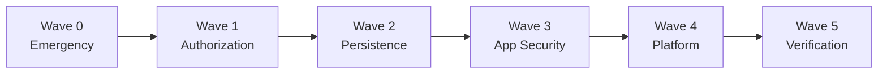

# Remediation Wave Prompts — Index

> Implementation prompts for the FarmMarshal security remediation programme.
> Each prompt is a self-contained handoff derived from validated findings only.

---

## 1. Wave order

| Wave | Prompt | Theme |
|---|---|---|
| 0 | [WAVE_0_EMERGENCY.md](specs/remediation-prompts/WAVE_0_EMERGENCY.md) | Containment — secrets, exposed routes, incident checks |
| 1 | [WAVE_1_AUTHORIZATION.md](specs/remediation-prompts/WAVE_1_AUTHORIZATION.md) | Authorization and tenancy |
| 2 | [WAVE_2_PERSISTENCE.md](specs/remediation-prompts/WAVE_2_PERSISTENCE.md) | Durable, transactional, tenant-aware storage |
| 3 | [WAVE_3_APPLICATION_SECURITY.md](specs/remediation-prompts/WAVE_3_APPLICATION_SECURITY.md) | Input, files, sessions, browser, mobile |
| 4 | [WAVE_4_PLATFORM_SECURITY.md](specs/remediation-prompts/WAVE_4_PLATFORM_SECURITY.md) | CI/CD, supply chain, devices, storage, recovery |
| 5 | [WAVE_5_VERIFICATION.md](specs/remediation-prompts/WAVE_5_VERIFICATION.md) | Independent verification and readiness verdict |

**The sequence is not arbitrary.** Wave 1 rewrites files Wave 0 touched. Wave 2
needs a stable authorization surface or the repository layer gets built twice.
Wave 3's session work needs Wave 2's durable store. Wave 4's gates protect
everything before them.

---

## 2. Entry and exit criteria

| Wave | Entry | Exit |
|---|---|---|
| **0** | Deployment access; ability to rotate secrets | Secrets rotated; sessions invalidated; vulnerable routes contained; version control established |
| **1** | Wave 0 verified; **D-1 and D-2 decided** | Tenant boundary enforced; guard API unambiguous; denied-access matrix passing; finance re-enabled |
| **2** | Wave 1 verified; **D-1 executed**; storage target provisioned | Data survives restart; RLS proven; audit durable and append-only; restore rehearsed |
| **3** | Wave 2 verified; durable store live | No client value reaches a path; all uploads validated; sessions revocable; mobile secured |
| **4** | Wave 3 verified; **root remote exists**; D-4 decided | CI executing with gates; per-device identity; commands safe offline; backups rehearsed |
| **5** | Waves 0–4 complete with evidence packs; staging ready | Signed residual-risk register; readiness verdict issued |

---

## 3. Blocking relationships

| Blocker | Blocks | Why |
|---|---|---|
| **D-1** — canonical backend | Wave 1 task 1.7, **all of Wave 2** | Cannot choose a schema owner without it |
| **D-2** — tenancy root | Wave 1 task 1.2, Wave 2 schema | Determines the key on every scoped table |
| **D-4** — media storage | Wave 3 task 3.3, Wave 4 task 4.5 | Determines the delivery mechanism |
| **D-6** — retention | Wave 2 columns, Wave 4 lifecycle rules | Legal input required |
| **SEV-1** — busboy backslash behaviour | VAL-008 **severity** only | Containment ships regardless |
| Root git remote | Wave 4 task 4.1 | CI has never executed |
| Wave 0 secret rotation | Wave 0 task 0.3 | Fail-closed guard would break a live system otherwise |

> Decisions marked **D-** are open items in
> [AUDIT_OPEN_QUESTIONS.md](specs/AUDIT_OPEN_QUESTIONS.md). They are business or
> architecture decisions — **they cannot be resolved by reading code.**

---

## 4. Tasks that can run in parallel

| Wave | Parallel | Must be serial |
|---|---|---|
| **0** | 0.6a and 0.6b investigations; 0.7 dependency review | 0.2 → 0.3 (rotation before fail-closed) |
| **1** | 1.4 chat, 1.5 entitlements, 1.6 membership | 1.1 → 1.2; 1.3 in reviewable batches |
| **2** | 2.1 defect confirmation alongside 2.3 provisioning | 2.4 → 2.5 → 2.6 → 2.7; 2.10 last |
| **3** | 3.4/3.5 validation; 3.8 browser; 3.9 mobile | 3.1 → 3.2 → 3.3 |
| **4** | 4.2/4.3 devices; 4.6 supply chain; 4.8 backup | 4.1 first; **4.7 alone** |
| **5** | 5.4, 5.5, 5.7 | 5.1 first; 5.8 → 5.9 last |

**Never parallelise:** Wave 0 emergency fixes with any refactoring; the
`@fastify/static` major upgrade with anything else; Wave 2 cutover with other
changes.

---

## 5. Required reviewers

| Wave | Reviewers |
|---|---|
| 0 | Security lead **and** an engineer with production deployment authority |
| 1 | Security lead, backend lead; **product owner for D-2** |
| 2 | Database architect, backend lead, security lead |
| 3 | Security lead, frontend lead, mobile lead |
| 4 | Platform/DevOps lead, security lead; finance representative for payment requirements |
| 5 | **Independent verifier who did not implement the fixes**, security lead, accountable release approver |

**Every wave** additionally requires a second engineer's code review. Wave 0
changes may be reviewed post-merge given urgency, but must be reviewed.

---

## 6. Evidence retention rules

| Rule | Requirement |
|---|---|
| Location | `specs/evidence/wave-N/` |
| Format | Raw command output redirected to files — **never a transcribed summary** |
| Immutability | Once a wave closes, its evidence is read-only |
| Redaction | Secrets, tokens, and personal data removed **before** committing |
| Completeness | Missing evidence for a claimed fix means the fix is unproven |
| Retention | For the full audit retention period per D-6 |
| Sensitive artefacts | Penetration test reports and secrets inventories stored outside the repository, referenced by pointer |

> Redirect command output to a file and search the whole file. A truncated
> terminal tail can hide failures earlier in the output — "no errors in the last
> 20 lines" is not evidence of success.

---

## 7. Release gates

| Gate | Requirement | Blocks |
|---|---|---|
| **G0** | Secrets rotated; no hardcoded secret in any language | Any deployment |
| **G1** | Denied-access matrix 100%; no cross-tenant path | Any release exposing multi-tenant data |
| **G2** | Data survives restart; RLS proven; restore rehearsed | Any release handling real customer data |
| **G3** | No client input reaches a path; uploads validated; sessions revocable | Any release accepting uploads or external users |
| **G4** | CI executing; zero High/Critical dependencies; backups rehearsed | General availability |
| **G5** | Independent verification passed; residual risk signed | Production launch |

**Gate rules:**

1. Gates are cumulative — G3 does not pass while G1 is failing.
2. A gate may be waived only by the accountable approver, in writing, with a
   compensating control and an expiry date.
3. **Lowering a coverage threshold or downgrading a gate to advisory is itself a
   security change** and requires security review.
4. No gate may be waived to meet a date without the risk being recorded in
   [RESIDUAL_RISK_REGISTER.md](specs/RESIDUAL_RISK_REGISTER.md).

---

## 8. Scope discipline

These prompts derive **only** from findings validated against source in
[AUDIT_VALIDATION_REPORT.md](specs/AUDIT_VALIDATION_REPORT.md).

**Never implement as remediation:**

| Item | Reason |
|---|---|
| Memory exhaustion via `toBuffer()` | **False positive** — global `fileSize` limit exists |
| Stored XSS via `/uploads/` | **False positive** — CSP `sandbox` + `nosniff` + inline disposition |
| `client/dist/` exposure | Withdrawn by the audit's own correction |
| `firebase-admin` shipped to clients | Withdrawn — devDependency in both manifests |
| SEC-H05, SEC-H07, SEC-H08, SEC-H10 | **Never re-verified.** Verify before implementing |
| Payment security fixes | **No payment code exists.** Requirements only |

If a wave's implementer believes an excluded item is real, the correct action is
to **re-verify it and update the validation report** — not to quietly add it to a
change set.

---

## 9. Related documents

| Document | Role |
|---|---|
| [AUDIT_VALIDATION_REPORT.md](specs/AUDIT_VALIDATION_REPORT.md) | What is actually true |
| [AUDIT_FINDINGS_NORMALIZED.md](specs/AUDIT_FINDINGS_NORMALIZED.md) | VAL-001 … VAL-019 |
| [AUDIT_EVIDENCE_MATRIX.md](specs/AUDIT_EVIDENCE_MATRIX.md) | Claim-to-code mapping |
| [AUDIT_OPEN_QUESTIONS.md](specs/AUDIT_OPEN_QUESTIONS.md) | Unresolved decisions |
| [SECURITY_REMEDIATION_BACKLOG.md](specs/SECURITY_REMEDIATION_BACKLOG.md) | Item-level detail |
| [SECURITY_REMEDIATION_DEPENDENCIES.md](specs/SECURITY_REMEDIATION_DEPENDENCIES.md) | Dependency graph |
